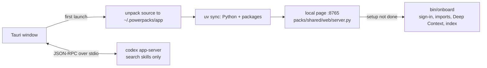

# desktop

The Powerpacks desktop app (Tauri 2). One installer: open it, sign in. The app carries everything
it runs: uv, Codex, and a snapshot of this repo. macOS is the product; the Windows build is for
trying the UI, Chat and sign-in there, since setup's imports run on macOS only.



| Path | Role | Reads / writes |
| --- | --- | --- |
| `scripts/bundle-runtime.sh` | Fetches the uv and Codex binaries and archives the repo for the bundle | `src-tauri/binaries/`, `src-tauri/resources/` |
| `splash/index.html` | First page while launch steps run | `boot_state`, `boot://state` |
| `src-tauri/src/boot.rs` | Launch: source, `uv sync`, page server, setup, then the page | — |
| `src-tauri/src/source.rs` | Installs or refreshes the bundled code in the app's folder, `~/.powerpacks/app`; a command-line checkout at `~/powerpacks` is never touched, but its data folder (`.powerpacks/`) and `.env` are shared on first launch so nothing is re-imported | `.powerpacks/desktop/source-version` |
| `src-tauri/src/onboard.rs` | Runs `bin/onboard` and resumes it with what the user answered on the install page | `.powerpacks/install/manifest.json` |
| `src-tauri/src/signin.rs` | The sign-in view: open at the modal's bounds, move, close | `signin://finished` |
| `src-tauri/src/linkedin.rs` | Reads the LinkedIn connections list in the sign-in view | `app-read-request.json`, `app-read.json` |
| `src-tauri/src/codex.rs` | One `codex app-server`: ChatGPT sign-in, chats, approvals; only the search skills | `codex://notification`, `codex://request` |
| `src-tauri/src/paths.rs` | The app's folder (or `$POWERPACKS_REPO_ROOT` for development), the bundled binaries, and the PATH children get | — |
| `src-tauri/src/lib.rs` | Window, commands, and the link policy | — |

Setup is clicked through on the install page (`web/src/pages/install/DesktopSetup.tsx`); no agent
runs it. Chat (`web/src/pages/agent/`) searches people, companies and dossiers.

Sign-ins stay in the window: the sign-in modal (`web/src/components/shared/SignInModal.tsx`)
dims the app and places a second web view (`src-tauri/src/signin.rs`) in its card, showing the
provider's own page, and closes when the sign-in reaches its callback. Powerset, ChatGPT and
LinkedIn use it; for LinkedIn, `src-tauri/src/linkedin.rs` then scrolls the connections list in
that view and hands the rows to the importer. Google refuses sign-in inside embedded web views,
so Gmail consent opens in the browser through msgvault's own flow, using Powerpacks' Google
OAuth client (`POWERPACKS_GOOGLE_CLIENT_ID` / `POWERPACKS_GOOGLE_CLIENT_SECRET` in `.env`), and
the app comes forward again when it lands.

## Build

Needs Rust, Node 22 and pnpm. CI (`.github/workflows/desktop.yml`) builds the Apple Silicon
`.dmg` and the Windows installer on every change and keeps them as run artifacts. Gmail needs
Powerpacks' Google OAuth client baked in: CI reads `POWERPACKS_GOOGLE_CLIENT_ID` and
`POWERPACKS_GOOGLE_CLIENT_SECRET` from its secrets.

```bash
cd desktop
pnpm install
scripts/bundle-runtime.sh          # uv, Codex, and this repo at HEAD
pnpm tauri build --bundles app,dmg
```

The app is ad-hoc signed, not notarized. On first open, macOS asks to confirm an app from an
unidentified developer: right-click the app, choose Open, then Open again. Notarizing needs an
Apple Developer ID.
