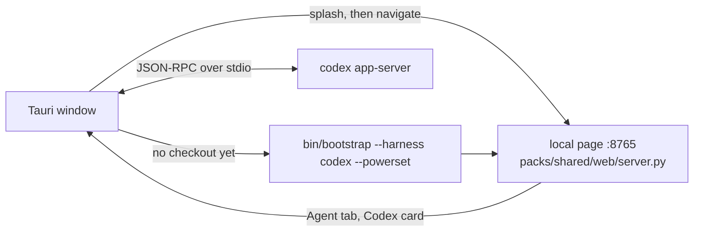

# desktop

The Powerpacks desktop app (Tauri 2): a native window around the local Powerpacks page, with
Codex as the in-app agent. macOS is the supported target; Windows and Linux builds compile, but
the Python pipeline and `bin/bootstrap` are macOS-only today.



| Path | Role | Reads / writes |
| --- | --- | --- |
| `splash/index.html` | First page while the server starts or installs | `boot_state`, `boot://state` |
| `src-tauri/src/boot.rs` | Finds the checkout, starts the page server or runs bootstrap, navigates the window | `~/powerpacks`, `$POWERPACKS_REPO_ROOT` |
| `src-tauri/src/codex.rs` | One `codex app-server` child; ChatGPT sign-in, threads, turns, approvals | `codex://notification`, `codex://request` |
| `src-tauri/src/paths.rs` | Login-shell PATH for a Finder-launched app; checkout and Codex lookup | `$SHELL`, `PATH` |
| `src-tauri/src/lib.rs` | Window, commands, and the link policy | — |
| `src-tauri/capabilities/default.json` | Lets the splash and `http://127.0.0.1:8765` call the commands | — |

Sign-ins (ChatGPT for Codex, Google for Gmail, Powerset) open in the system browser. Google
refuses OAuth inside embedded webviews, and any link that leaves the local page opens outside
the app for the same reason.

The web side lives in `web/`: `lib/desktop.ts` (bridge), `lib/api/codex.ts`, `lib/agent/`, the
Agent page (`pages/agent/`) and the Codex card on Accounts. They appear only inside the app.

## Build

Needs Rust, Node 22 and pnpm. Linux also needs the WebKitGTK 4.1 dev packages.

```bash
cd desktop
pnpm install
pnpm tauri dev     # debug window against ~/powerpacks (or $POWERPACKS_REPO_ROOT)
pnpm tauri build   # .app + .dmg on macOS, NSIS installer on Windows
```

The agent needs the Codex CLI on PATH (`npm install -g @openai/codex`) or the Codex desktop app.
Release builds are unsigned; notarization needs an Apple Developer ID.
