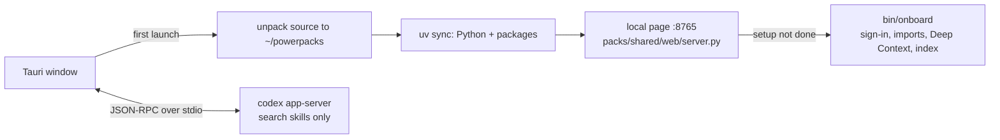

# desktop

The Powerpacks Mac app (Tauri 2). One `.dmg`: drag it to Applications, open it, sign in. The app
carries everything it runs: uv, Codex, and a snapshot of this repo.



| Path | Role | Reads / writes |
| --- | --- | --- |
| `scripts/bundle-runtime.sh` | Fetches the uv and Codex binaries and archives the repo for the bundle | `src-tauri/binaries/`, `src-tauri/resources/` |
| `splash/index.html` | First page while launch steps run | `boot_state`, `boot://state` |
| `src-tauri/src/boot.rs` | Launch: source, `uv sync`, page server, setup, then the page | — |
| `src-tauri/src/source.rs` | Installs or refreshes the bundled code in `~/powerpacks`; leaves a git checkout alone | `.powerpacks/desktop/source-version` |
| `src-tauri/src/onboard.rs` | Runs `bin/onboard` and resumes it with what the user answered on the install page | `.powerpacks/install/manifest.json` |
| `src-tauri/src/signin.rs` | The in-window sign-in pane: open, close, follow the window | `signin://finished` |
| `src-tauri/src/codex.rs` | One `codex app-server`: ChatGPT sign-in, chats, approvals; only the search skills | `codex://notification`, `codex://request` |
| `src-tauri/src/paths.rs` | The Powerpacks folder, and a PATH that puts the bundled binaries first | `$POWERPACKS_REPO_ROOT` |
| `src-tauri/src/lib.rs` | Window, commands, and the link policy | — |

Setup is clicked through on the install page (`web/src/pages/install/DesktopSetup.tsx`); no agent
runs it. Chat (`web/src/pages/agent/`) searches people, companies and dossiers.

Sign-ins stay in the window: `src-tauri/src/signin.rs` docks a second web view under the page's
"Signing in to …" strip (`web/src/components/shared/SignInBar.tsx`) showing the provider's own
page, and closes it when the sign-in reaches its callback. Powerset and ChatGPT use it today;
Google refuses OAuth inside embedded web views, so Gmail still needs its own route.

## Build

Needs Rust, Node 22 and pnpm. CI (`.github/workflows/desktop.yml`) builds the Apple Silicon
`.dmg` on every change and keeps it as a run artifact.

```bash
cd desktop
pnpm install
scripts/bundle-runtime.sh          # uv, Codex, and this repo at HEAD
pnpm tauri build --bundles app,dmg
```

The app is ad-hoc signed, not notarized. On first open, macOS asks to confirm an app from an
unidentified developer: right-click the app, choose Open, then Open again. Notarizing needs an
Apple Developer ID.
