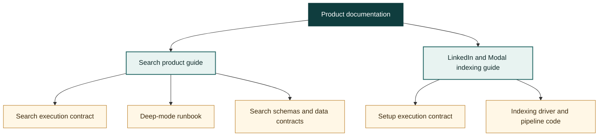

# Powerpacks product documentation

This is the GitHub-rendered entry point for understanding Powerpacks. Start
with the product guide, then follow the operational or implementation links
only when you need that level of detail.

## Start here

| Topic | Document | Use it for |
| --- | --- | --- |
| People search | [`$search` architecture](../packs/search/docs/search-architecture.md) | Product walkthrough of routing, fast search, deep recruiter search, review points, data boundaries, outputs, and roadmap. |
| LinkedIn setup and indexing | [LinkedIn and Modal indexing pipeline](../packs/indexing/docs/linkedin-modal-pipeline.md) | How a LinkedIn `Connections.csv` becomes the local DuckDB queried by `$search local`. |
| Running deep search | [Deep-mode runbook](../packs/search/skills/search/deep-mode.md) | Exact operator commands, artifacts, approval boundary, and resume rules. |
| Running setup | [`$setup` skill](../packs/ingestion/skills/setup/SKILL.md) | Exact LinkedIn-only setup checklist. |
| All skills | [Root skill index](../README.md#skills) | GitHub-native list of supported skill entry points. |
| Generated skills map | [`skills-map.html`](skills-map.html) | Interactive inventory to open locally. On GitHub this link shows the tracked HTML source until Pages is enabled. |

## How the documents fit together

The product guides explain what the system does and why. `SKILL.md` files are
the executable agent instructions. Schemas, contracts, and CLI behavior are
the final authority when implementation details matter. The search and
indexing plan files listed as historical by their pack documentation indexes
are design history, not current contracts.

## GitHub, Wiki, and Pages

The Markdown in this repository is canonical by design:

- GitHub renders these pages and their Mermaid diagrams directly.
- Every documentation change is versioned with the code and reviewed in the
  same pull request.
- Relative links work on branches, in pull requests, and at a historical
  commit.

The repository Wiki feature is enabled but currently uninitialized and empty.
A Wiki is a separate Git repository with a separate publishing path. It cannot
participate naturally in the same pull-request review as the code, so a
manually maintained Wiki would create a second source of truth. If the Wiki tab
is desired later, initialize it once and generate a mirror from selected files
after merges rather than editing it by hand.

GitHub Pages is currently disabled for this repository. It is possible as a
future presentation layer, but this repo would need the Pages setting plus a
build that collects canonical files from `packs/` and renders Mermaid. Pages
should be a generated view, not the source of truth.
