# LinkedIn and Modal indexing pipeline

> **Canonical current-state guide.** This page explains the production path
> from LinkedIn `Connections.csv` to the local DuckDB used by `$search local`.
> The executable instructions are
> [`$setup`](../../ingestion/skills/setup/SKILL.md), and the implementation is
> [`linkedin_modal_pipeline.py`](../modal/linkedin_modal_pipeline.py). If prose
> and code disagree, the code is current behavior and this page should be
> corrected.

## Product summary

Today, `$setup` has one initial data source: a user's LinkedIn
`Connections.csv` export. Powerpacks sends that file to a Modal sandbox,
enriches the LinkedIn profiles, builds search records and vectors, materializes
a DuckDB database, downloads that database to the user's machine, and validates
that it is searchable.

This is the user's exported first-degree connection list, not LinkedIn-wide
discovery or Sales Navigator. Rows need a usable LinkedIn identity to enter the
normal import path.

The output is a **local search index**. This flow does not upload the finished
index into a Powerset set, Postgres, or TurboPuffer. `$search local` reads the
downloaded DuckDB; `$search powerset` uses a separately managed Powerset set.

Gmail and iMessage/WhatsApp are separate import skills. Their artifacts can be
included by a later fan-in and rebuild, but they are not part of the `$setup`
intake flow described here.

## End-to-end flow

```mermaid
flowchart TD
    START[1. User runs setup] --> CREDS[2. Resolve Powerset or Modal credentials]
    CREDS --> CSV[3. Copy LinkedIn Connections.csv to the canonical local input]

    subgraph IMPORT[Modal import sandbox]
        direction TD
        UPLOAD[4. Upload the CSV to the operator volume] --> PARSE[5. Parse and normalize connection rows]
        PARSE --> ENRICH[6. Enrich LinkedIn profiles through RapidAPI]
        ENRICH --> PCACHE[7. Reuse and extend the shared profile cache]
    end

    CSV --> UPLOAD
    PCACHE --> SOURCE[8. Download enriched LinkedIn people.csv]

    subgraph LOCALMERGE[Local source merge]
        direction TD
        SOURCE --> FANIN[9. Fan in every imported source]
        FANIN --> MERGED[10. Write canonical merged people.csv]
    end

    subgraph INDEX[Modal indexing sandbox]
        direction TD
        SEND[11. Upload merged people.csv] --> NORMALIZE[12. Normalize people, roles, companies, education, and locations]
        NORMALIZE --> CLASSIFY[13. Classify roles and companies; infer searchable attributes]
        CLASSIFY --> EMBED[14. Build embeddings and summary records]
        EMBED --> CONTRACT[15. Validate records against checked-in search contracts]
        CONTRACT --> ICACHE[16. Union new cache entries without deleting other operators' entries]
        ICACHE --> DUCK[17. Materialize local-search.duckdb]
    end

    MERGED --> SEND
    DUCK --> DOWNLOAD[18. Download DuckDB and manifest]
    DOWNLOAD --> VERIFY[19. Open DuckDB read-only and verify required tables]
    VERIFY --> READY[20. Search with $search local]

    classDef user fill:#0f3d3e,color:#ffffff,stroke:#0f3d3e,stroke-width:2px;
    classDef local fill:#fff7e6,color:#3d2b0f,stroke:#b7791f,stroke-width:1.5px;
    classDef cloud fill:#e8f3f1,color:#102a2a,stroke:#2f6f6d,stroke-width:1.5px;
    classDef output fill:#eaf2ff,color:#14213d,stroke:#315a9b,stroke-width:2px;
    class START,READY user;
    class CREDS,CSV,SOURCE,FANIN,MERGED,DOWNLOAD,VERIFY local;
    class UPLOAD,PARSE,ENRICH,PCACHE,SEND,NORMALIZE,CLASSIFY,EMBED,CONTRACT,DUCK,ICACHE cloud;
```



## What each stage means

| Stage | Plain-language purpose | Where it runs | Main artifact |
| --- | --- | --- | --- |
| Credentials | Authorize the local driver to dispatch work into the selected Modal workspace. | Local machine plus Powerset login when used. | `.env` and local auth state. |
| LinkedIn import | Convert LinkedIn's export into normalized people and fill in profile details not present in the CSV. | Modal import sandbox. | `.powerpacks/network-import/import/linkedin/people.csv`. |
| Source fan-in | Combine all imported source rows referring to the same network into one canonical input. During `$setup`, LinkedIn is the source guaranteed to be present. | Local machine. | `.powerpacks/network-import/merged/people.csv` plus contact/source provenance CSVs. |
| Processing | Turn people and work history into role, company, school, location, profile, and summary records. | Modal indexing sandbox. | Validated JSONL records and `ledger.json`. |
| Classification | Normalize ambiguous titles and company information into fields search can filter and rank. | Modal indexing sandbox, using cached or provider-backed results. | Role/company enrichment caches and records. |
| Embedding | Convert relevant text into numeric representations used for semantic similarity search. | Modal indexing sandbox, using cached or OpenAI-backed results. | Role, company, and summary embedding artifacts. |
| DuckDB materialization | Package the validated records into one local database that validation and search open read-only. | Modal indexing sandbox. | `local-search.duckdb`. |
| Download and validation | Copy the database home, open it read-only, and verify that required tables contain rows. | Local machine. | `.powerpacks/search-index/local-search.duckdb` and `manifest.json`. |

### Current coverage rule

The ordinary merge path currently keeps searchable people only when it can
establish a stable LinkedIn identity and a successful enriched profile payload.
Connections with an unusable LinkedIn URL or failed/unresolved provider profile
do not become normal searchable rows. This protects record quality, but it also
means the searchable count can be lower than the raw CSV row count.

## The 15 processing steps

The processor records every step in `ledger.json`. Local processing can resume
from that ledger. The current Modal runner works in ephemeral `/tmp` storage
and copies the ledger to the operator run directory only after successful
processing and DuckDB packaging. A failed Modal sandbox therefore starts a new
processing run, while still reusing enrichment work already saved in the
shared caches.

| Group | Pipeline steps | Product meaning |
| --- | --- | --- |
| Normalize | `flatten_people`, `build_education_corpus`, `build_location_corpus` | Convert provider-shaped profile data into stable people, education, and location records. |
| Understand work | `build_roles`, `build_company_corpus`, `detect_ceo_founders`, `infer_ages` | Normalize titles and companies and derive attributes needed by recruiting filters. |
| Build semantic signals | `embed_role_positions`, `embed_companies`, `embed_summaries` | Create the numeric similarity features used by hybrid retrieval. |
| Assemble search records | `build_people_records`, `build_unified_profiles`, `build_summary_records`, `build_vectors` | Join the normalized and enriched data into the records consumed by search. |
| Verify | `validate_contracts` | Reject records that do not match the checked-in search schemas. |

After those steps, `run_indexing.py` builds DuckDB and persists the run status,
manifest, ledger, statistics, and optional records on the Modal Volume.

## Storage and isolation

The default Modal Volume is `powerset-indexing` and has two kinds of paths:

```text
/data/
├── cache/                         shared, content-keyed enrichment caches
└── operators/<operator-id>/
    ├── input/                     this operator's uploaded CSVs
    └── runs/<label>/              status, ledger, manifest, DuckDB, stats
```

Shared caches make overlapping profiles, titles, and companies reusable across
runs. Indexing refreshes them with a key union, so a run adds or updates its
keys without replacing unrelated cached rows. Inputs and run outputs are
intended to be isolated under an operator ID.

### Current isolation limitation

`linkedin_modal_pipeline.py` currently falls back to the all-zero operator ID
when `POWERPACKS_OPERATOR_ID` is absent. `$setup` does not yet provision or
validate a user-specific value. Until that is fixed, treat the default Modal
workspace path as a single-operator/development configuration and set a stable,
unique `POWERPACKS_OPERATOR_ID` before multi-user use.

## Credentials and provider calls

The local process needs Modal credentials. The sandboxes use provider secrets
inside the Modal workspace:

- `powerset-rapidapi` for LinkedIn profile enrichment, unless
  `RAPIDAPI_LINKEDIN_KEY_BACKUP` is explicitly mounted by the driver.
- `powerset-openai` for role/company classification and embeddings during
  indexing.

Cache hits avoid repeated provider calls. A capped indexing run performs a
dry-run estimate before allowing paid cache misses. The LinkedIn import path
currently treats RapidAPI enrichment as pre-approved product behavior.

The current `$setup` command does not pass a positive `--max-usd`; the driver's
default `0` means uncapped internal mode and skips the estimate pass. Supplying
a positive cap enables the estimate-and-refuse behavior. This default should be
treated as an internal operational choice, not a general consumer spend guard.

### Current custom-workspace limitation

Supplying local `MODAL_TOKEN_ID`, `MODAL_TOKEN_SECRET`, and `OPENAI_API_KEY`
does not by itself create or mount the named Modal secrets above. The custom
credentials route only works when the selected Modal workspace already has the
required `powerset-openai` secret plus either `powerset-rapidapi` or a non-empty
local `RAPIDAPI_LINKEDIN_KEY_BACKUP` override. The provisioned Powerset
workspace is the supported setup path today.

## Reruns, cache behavior, and failure recovery

- `pipeline --csv ...` hashes the LinkedIn export. An unchanged completed input
  is a no-op, except that a missing local DuckDB is downloaded again.
- `import-linkedin` runs only import/enrichment and downloads the enriched
  source CSV so local fan-in can include other sources.
- `index-people` accepts an already merged `people.csv`, runs the generic Modal
  indexer, and downloads the finished DuckDB and manifest.
- Modal run status and durable cache state survive a local disconnect. The
  local driver can reattach and download a completed run.
- A failed Modal sandbox does not resume its processing ledger because the
  working directory is ephemeral and failure exits before ledger persistence.
  A retry starts processing again but reuses shared cache entries that were
  successfully refreshed before the failure.
- Shared caches are refreshed before the heavy DuckDB build, so successful
  enrichment is not repurchased if packaging fails later.
- A local file's existence is not proof of a successful current run. The
  command must exit successfully and `validate_search_index.py` must report
  `status: ok`.

## Data boundaries

| Data | Boundary |
| --- | --- |
| LinkedIn `Connections.csv` | Starts locally, then is uploaded to the selected Modal workspace under the operator input path. |
| Enriched people and intermediate records | Processed in Modal; durable run state and caches live on the Modal Volume. |
| Provider credentials | Mounted in the Modal sandbox; they are not embedded in downloaded artifacts. |
| Local search database | Downloaded to `.powerpacks/search-index/local-search.duckdb` and queried read-only by local search. |
| Powerset cloud search corpus | Separate from this pipeline. Building local DuckDB does not update a Powerset set. |

## Current versus planned

| Capability | Status |
| --- | --- |
| LinkedIn `Connections.csv` intake in `$setup` | Shipped. |
| Modal profile enrichment and indexing | Shipped. |
| Shared content-keyed enrichment caches | Shipped. |
| Local fan-in followed by one merged-network index | Shipped. |
| Local DuckDB download and read-only validation | Shipped. |
| Gmail or messages as `$setup` intake sources | Not part of `$setup`; separate import skills exist. |
| Automatic unique Modal operator identity | Not shipped; explicit configuration is required. |
| Turnkey bring-your-own Modal workspace provisioning | Not shipped; named provider secrets must already exist. |
| Default indexing spend cap in `$setup` | Not shipped; `--max-usd 0` is currently uncapped internal mode. |
| Publishing the local index into a Powerset set | Not part of this pipeline. |

## Implementation map

| Concern | Source |
| --- | --- |
| Exact setup checklist | [`packs/ingestion/skills/setup/SKILL.md`](../../ingestion/skills/setup/SKILL.md) |
| Local Modal driver | [`packs/indexing/modal/linkedin_modal_pipeline.py`](../modal/linkedin_modal_pipeline.py) |
| LinkedIn import sandbox | [`packs/indexing/modal/run_linkedin.py`](../modal/run_linkedin.py) |
| Indexing sandbox | [`packs/indexing/modal/run_indexing.py`](../modal/run_indexing.py) |
| Resumable 15-step processor | [`build_processing_pipeline.py`](../primitives/build_processing_pipeline/build_processing_pipeline.py) |
| Local source fan-in | [`index_contacts_pipeline.py`](../primitives/index_contacts_pipeline/index_contacts_pipeline.py) |
| DuckDB readiness check | [`validate_search_index.py`](../primitives/validate_search_index/validate_search_index.py) |
| Historical Modal benchmark | [Modal migration plan](modal-migration-plan.md) |
