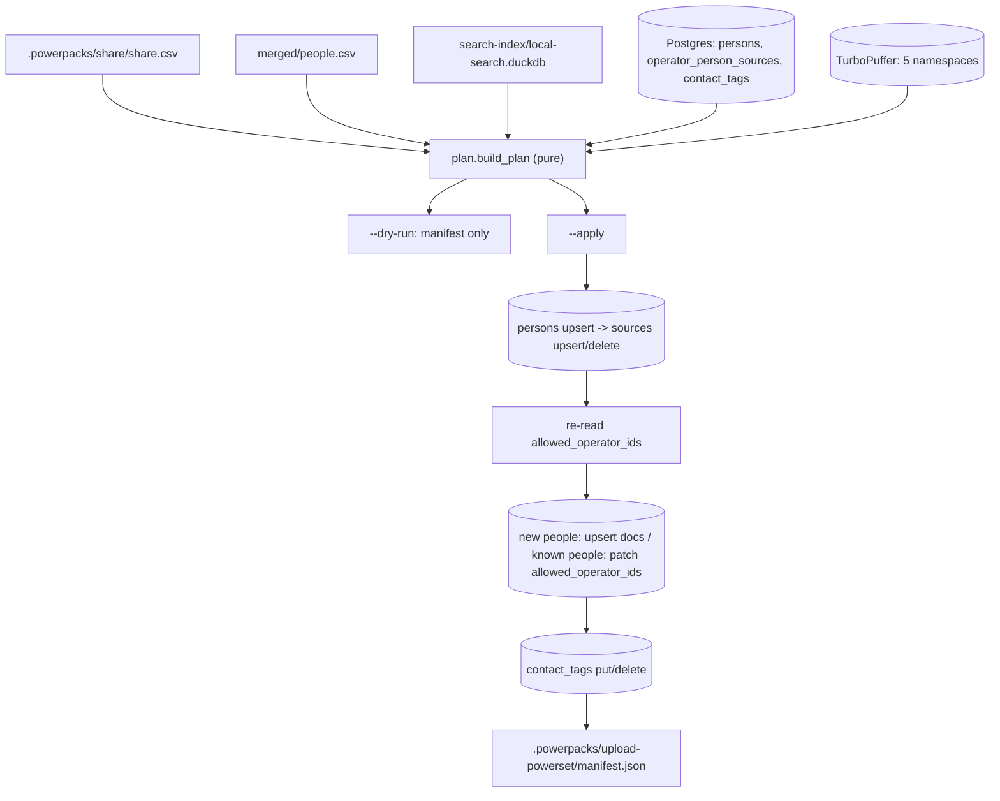

# upload_powerset

Created: 2026-09-24

Change log:
- 2026-09-24: `share.csv.share` is three-way; only `yes` uploads and only a
  human's `private` becomes a cloud tag.
- 2026-09-24: first version.

Makes the Powerset cloud state for ONE operator equal the local share list.
Reconcile, not append: a person dropped from `share.csv` loses this operator's
source rows and is patched out of `allowed_operator_ids`. Documents are never
deleted, and no cloud-enriched value is ever overwritten with a local one.

`share.csv.share` is `yes | no | confirm`. Only `yes` is shared: a `confirm` row
is a question waiting for a human, so it uploads nothing and tags nothing, and
un-shares like any other non-`yes` row.

`--dry-run` is the default and only reads. `--apply` writes.



| file | role | reads | writes |
| --- | --- | --- | --- |
| `upload_powerset.py` | CLI + `UploadPowerset` orchestrator; owns CSV reads and the stage manifest | share.csv, people.csv, Postgres, TurboPuffer | `.powerpacks/upload-powerset/manifest.json`, Postgres + TurboPuffer on `--apply` |
| `local_index.py` | local DuckDB readers for profiles and namespace documents | local-search.duckdb | — |
| `models.py` | frozen value types + the channel/identifier table | — | — |
| `plan.py` | pure reconcile: local + cloud -> `UploadPlan` | — | — |
| `postgres.py` | every SQL statement, each taking a cursor | `persons`, `operator_person_sources`, `contact_tags`, `users` | the same three tables |
| `turbopuffer_writer.py` | namespace definitions and reads, 500-row upserts, `allowed_operator_ids` patches | the 5 namespaces | the 5 namespaces |

## What the plan decides

- `persons_upsert` — `share=yes` people that have a LinkedIn `public_identifier`.
  The SQL is the cloud pipeline's own COALESCE upsert
  (`sync_persons_to_supabase.py`), so a laptop value never replaces a cloud one.
- `skipped_no_linkedin` — `share=yes` people without a slug. `persons.public_identifier`
  is UNIQUE and the cloud has no non-LinkedIn person key, so they stay local.
- `sources_insert` — every DESIRED `operator_person_sources` row, one per
  (person, channel). The statement is an upsert, so re-sending an unchanged row
  is how interaction counts stay current; the count is a desired-state count,
  not a "rows that were missing" count.
- `sources_delete` — this operator's `discovery_method='powerpacks'` rows that
  the share list no longer wants.
- namespace `upsert` — for `people`/`summaries`/`education` these are PERSON ids
  (people the cloud's `persons` table has never seen); the document count is
  whatever the local index holds for them, which is 0 for a person with no
  positions. For `companies`/`schools` they are entity ids the namespace lacks.
- namespace `patch_people` — people the cloud already has, plus the un-shared
  ones. Only `allowed_operator_ids` is written, on every document the CLOUD
  holds for that person, so an un-share also reaches documents this laptop
  never had.
- `tags_put` / `tags_delete` — `contact_tags(tag='private')` keyed by
  `group_key = public_identifier`, mirroring `PUT/DELETE /v2/contacts/tags`. Only
  a `human_private` reason puts one, and only a `human_share` reason deletes one:
  the cloud tag is a human decision on both sides.

## Facts the code depends on (read 2026-09-24)

- Local `people.csv` `id` uses the cloud's own `uuid5(6ba7b810…, "linkedin:<slug>")`
  recipe, so person ids match across the boundary. Company and school ids do
  NOT: local ids are `uuid5(POWERPACKS_INDEXING_NAMESPACE, …)` while
  `aleph_companies_v1` is keyed `urn:harmonic:company:<n>`.
- The live namespaces carry FEWER attributes than the checked-in contracts, so
  every upsert column set is `contract ∩ local table ∩ live namespace schema`.
- Person documents are addressed differently per namespace: `aleph_people_v1`
  by `base_id`, `aleph_summaries_v1` by document id, `aleph_people_education_v1`
  by `person_id`.
- `operator_person_sources.operator_id` is VARCHAR, and its UNIQUE key includes
  `source_identifier`, so a channel with no identifier contributes no row.

## Run

```bash
uv run --env-file .env --project . python \
  packs/indexing/primitives/upload_powerset/upload_powerset.py --dry-run \
  --db .powerpacks/search-index/local-search.duckdb \
  --people-csv .powerpacks/network-import/merged/people.csv \
  --share-csv .powerpacks/share/share.csv
```

`ALEPH_ENV=staging` moves every namespace to its `_dev` twin; Postgres stays the
same database, scoped to this operator's rows.

The upload runs from the laptop only: the build may run on Modal, but
`download` already brings `local-search.duckdb` home, and the upload is a few MB
of I/O with no compute in it.
