# Deep-context pipeline

`$deep-context` is the single processing workflow after `$setup`,
`$import-gmail`, or `$import-messages`. It turns local conversation history into
per-person dossiers, resolves duplicate identities, decides which imported
contacts belong in the network, researches the approved people, verifies their
LinkedIns, and rebuilds the canonical network and search index.

The durable product flow is:

```text
messages -> dossiers -> review uncertain people -> enrich Yes -> verify LinkedIn -> people.csv -> index
```

This guide explains the product, review experience, file-state contract, and
privacy boundaries. The executable agent contract is the
[`deep-context` skill](../skills/deep-context/SKILL.md); primitives remain the
authority for schemas and CLI behavior.

The former `$deep-setup` surface is retired. Its candidate resolution,
enrichment, review, realization, and indexing behavior now lives in
`$deep-context`.

## At a glance

- **Inputs:** the canonical merged network, unresolved Gmail/iMessage/WhatsApp
  candidate pools, local msgvault Gmail, macOS Messages, and an optional local
  wacli store.
- **Core context output:** one synthesized Markdown dossier per person, with
  lookup indexes for name, email, and phone.
- **People decision:** the model assigns Yes/Maybe/No. Only genuine uncertainty
  appears in the main review queue; Yes and No remain visible and editable.
- **Enrichment:** one Parallel.ai pass covers the current effective-Yes people
  plus eligible wrong-link recoveries. Completed research is reused and only
  net-new submissions are priced.
- **LinkedIn decision:** a found LinkedIn can be verified, replaced with a known
  URL, or skipped. A no-LinkedIn research result can only be given a real
  LinkedIn URL or skipped; synthetic records are not directly indexed.
- **State:** every stage overwrites fixed outputs plus one `manifest.json`.
  There are no run IDs, job ledgers, or browser-owned background jobs.
- **Privacy exception:** this skill intentionally reads message bodies. Direct
  messages are the default; small iMessage group bodies require explicit
  current-run opt-in. WhatsApp group bodies are never read.

## End-to-end architecture

```mermaid
flowchart TD
    A["Check sources, people, and unresolved candidates"] --> B["Confirm owner LinkedIn"]
    B --> C{"Include small iMessage groups?"}
    C --> D["Collect people + candidate messages"]
    D --> E{"Preview + approve OpenAI synthesis"}
    E --> F["Synthesize facts + worth from messages, compose dossiers, validate"]
    F --> G["Judge duplicate pairs and build canonical parents"]
    G --> H{"Preview + approve reconcile"}
    H --> I["Judge attached LinkedIn identity only"]
    I --> J["People UI: review only Maybe; edit Yes / No"]
    J --> K{"People review complete"}
    K --> K1["Local bridge resumes the originating Codex thread"]
    K1 --> L["Preview one enrichment pass"]
    L --> M{"Approve exact net-new Parallel estimate in UI, unless zero"}
    M --> M1["Local bridge resumes the same thread"]
    M1 --> N["Agent runs approved lookup; completed work is reused"]
    N --> O["Assemble no-LinkedIn research cards"]
    O --> P{"User clicks Continue"}
    P --> Q["LinkedIn UI: verify, replace, or Skip"]
    Q --> R{"LinkedIn review complete"}
    R --> R1["Local bridge resumes the same thread, then stops"]
    R1 --> S{"Approve RapidAPI cache misses for retargets"}
    S --> T["Apply retargets + rebuild merged people.csv"]
    T --> U{"Approve Modal upload/build"}
    U --> V["Build and validate search index"]

    classDef gate fill:#fff4d6,stroke:#a66b00,color:#3d2a00,stroke-width:2px;
    classDef local fill:#eaf5ff,stroke:#2878a8,color:#14364a;
    classDef cloud fill:#fff0ee,stroke:#b54c3d,color:#4a1f19;
    classDef output fill:#eef8ed,stroke:#4f8a49,color:#233f20;
    class C,E,H,K,M,P,R,S,U gate;
    class A,B,D,F,G,I,J,K1,L,M1,O,Q,R1,T local;
    class N cloud;
    class V output;
```



Approval nodes are wait points, not failure states. The all-in-one
`bin/deep-context run` command is intentionally disabled because one chained
process cannot safely pause for independent privacy, model-spend, provider, and
upload approvals.

## Who controls what

The review experience is deliberately file-driven. The browser is a control
surface, not an orchestration service.

| Component | Responsibilities | Must not do |
| --- | --- | --- |
| Browser UI | Read current CSVs/manifests, save human decisions, mark review handoffs, write the exact revision-bound enrichment approval, and let the local server emit an inert state-changed notification. | Send prompts or commands to Codex, call identity/research providers, start paid work, or rebuild the index. |
| Same-thread bridge | Listen on one fixed local Unix socket, reread `review-status`, and resume the Codex thread that launched review only for actionable state changes. | Accept browser text as instructions, create another workflow state store, cross approval gates, or run overlapping turns. |
| Agent session | Start/replace the bridge before review, run `bin/deep-context review-status` first on every wake, show required estimates/disclosures, and run only its exact next primitive after approval. | Infer completion from chat text, reuse an old approval, or invent a parallel state machine. |
| Primitives | Write stage outputs and one manifest into fixed directories, overwrite current queues, reuse completed per-person work, and enforce budgets/fingerprints. | Create run-scoped directories, ledgers, or hidden browser jobs. |

The review server may fetch and cache an existing signed LinkedIn CDN avatar
image for presentation. That fetch does not perform identity resolution or
advance the workflow.

The deterministic agent wake/poll command is:

```bash
bin/deep-context review-status
```

It is read-only and returns one `next_action`, such as `review_people`,
`preview_enrichment`, `await_enrichment_approval`,
`run_approved_enrichment`, `assemble_synthetic`, `review_linkedin`, or
`realize`. In Codex, `bin/deep-context review --fresh` starts a same-thread
bridge when `CODEX_THREAD_ID` is available. Successful UI mutations notify that
bridge, which filters on `review-status` and resumes the same thread only when
agent work is ready. Other harnesses, or a failed bridge startup, retain the
one-minute polling fallback.

The bridge is runtime plumbing, not workflow state. It uses the fixed socket
`.powerpacks/deep-context/review/agent-bridge.sock`, records no ledger or run id,
and stops after the `retry_enrichment` or `realize` wake. Before every wake it
waits for the foreground Codex rollout's persisted `task_complete`, then starts
a short-lived App Server client that reloads the latest version of the same
thread. This keeps the visible plan and approval context in one conversation
without letting browser-controlled text enter the prompt.

The browser has a separate, faster observer:

- Enrich and Done call `/api/status` immediately on load and then once per
  second because an external agent/provider can change their manifests. A
  LinkedIn preview opened before enrichment completes does the same until those
  external results arrive.
- People and a current, fully enriched LinkedIn stage do not poll. Their local
  saves return the authoritative state token directly.
- LinkedIn starts with ten cards buffered from the server's in-memory review
  snapshot, advances synchronously on click, and refills to ten when five remain.
- A changed `next_action` navigates the current tab to the corresponding stage.
- A changed state token reloads the current stage with fresh counts/content.
- A stage opened from the clickable progress steps stays in preview mode while
  still reloading from changed file state; it does not get bounced immediately
  back to the workflow's current stage.
- Returning to a previously hidden tab triggers an immediate check.
- An actual unsaved replacement-LinkedIn URL on a polled preview suppresses
  reload/navigation so the browser does not destroy typed text.

After LinkedIn Finish, the browser shows Done and keeps polling, but there is no
later browser decision stage. The agent owns retarget hydration, realization,
Modal indexing, and validation. Those steps do not wait for another browser
button and cannot be blocked by the Done page.

## Stage walkthrough

| Stage | What it does | Main result |
| --- | --- | --- |
| Readiness and owner | Checks source availability, Full Disk Access, merged people, unresolved candidates, and required keys. Owner context supplies the operator's school, work, and location history for identity disambiguation. | Readiness JSON and `owner.json` |
| Collection | Reads Gmail and message bodies into bounded per-person bundles. Candidates are included in full processing. The default depth is `--deep-cap 1600`; small iMessage groups are optional. | `raw/<person_id>.json` and `raw/manifest.json` |
| Synthesis | Sends bounded message samples plus owner context to OpenAI and extracts relationship, work, school, location, identifiers, topics, and worth. Worth uses message context/identifiers only, never LinkedIn, and is mirrored into `review.csv`. Normal reruns rejudge missing/Maybe verdicts. | `facts/<person_id>.jsonl`, `overrides/review.csv` |
| Composition | Deterministically renders facts into Markdown dossiers and name/email/phone lookup indexes. | `dossiers/*.md`, `index.json`, `index.md` |
| Duplicate resolution | Generates plausible same-person pairs, judges them with OpenAI, and builds transitive canonical parents. A candidate merged into an existing person contributes its contact metadata and skips standalone review/research. | Merge audit CSVs and `parents/*.md` |
| Reconcile | Before the browser opens, compares message-derived dossiers with attached LinkedIn profiles for identity only. It may verify, detach, or request human review; it never reads or writes worth. | `reconcile/verdicts.jsonl`, identity fields in `overrides/review.csv` |
| People review | Shows only model Maybe contacts in the main binary queue. The paginated Yes and No tables remain editable. Finishing the last Maybe completes the People gate and moves directly to an animated agent-handoff state on Enrich Contacts. | Updated `review.csv` and `review/manifest.json` |
| Enrichment preview and approval | Builds one queue from the current effective-Yes selection plus eligible wrong-link recovery. It reports gross eligible people, completed-result reuse, duplicate handles, net-new submissions, and the exact estimate. A positive estimate requires the UI's inert approval record; zero net-new work automatically continues from cache without an approval button. | `research_queue.csv` and enrichment `manifest.json` |
| Identity research | The agent runs the exact approved Parallel command. Research may find a LinkedIn, reuse a prior result, or produce a researched no-LinkedIn profile for review context. | Deep-research artifacts and proposed retargets |
| Profile prefetch | Before LinkedIn review, the agent runs `bin/deep-context profile-prefetch`, reports uncached profiles and missing summaries, then auto-runs `--fetch` when the summary-cost ceiling is under $25 (the common case; RapidAPI is credits-based and each person costs at most one call ever) and only pauses for approval at $25+. The UI stays cache-only. | Shared profile cache and `profile-prefetch/manifest.json` |
| LinkedIn review | For a found LinkedIn, Yes verifies it. No reveals correction controls but does not save a decision. The user can paste a replacement LinkedIn or Skip. For a no-LinkedIn result, the only outcomes are adding a real LinkedIn URL or Skip. | Verify/detach/retarget decisions |
| Realization | Approved replacement URLs are hydrated cache-first, then fan-in reapplies worth, identity, retarget, and consolidation decisions to the fixed merged people CSV. | `.powerpacks/network-import/merged/people.csv` |
| Indexing | Uploads the merged CSV to the configured Modal workspace, rebuilds the index, and validates it. | Search index and validation report |

## Commands and approval boundaries

The normal full workflow uses staged commands:

```bash
bin/deep-context check
bin/deep-context owner --linkedin-url <url> --email <email>
bin/deep-context collect --include-candidates --deep-cap 1600 [--include-groups]
bin/deep-context dry
bin/deep-context synthesize
bin/deep-context compose
bin/deep-context validate
bin/deep-context cluster --dry-run
bin/deep-context cluster
bin/deep-context parents
bin/deep-context reconcile --dry-run
bin/deep-context reconcile
bin/deep-context review --fresh
```

When Codex supplies `CODEX_THREAD_ID`, the final command also starts/replaces
the same-thread bridge. `bin/deep-context review-agent stop` is the manual
cleanup command; normal completion stops it automatically at the transition
from LinkedIn review to realization.

After the browser opens, the agent follows `review-status`. The enrichment path
uses:

```bash
bin/deep-context reconcile-deep-research --dry-run \
  --include-candidates --include-plausibly-absent

bin/deep-context reconcile-deep-research \
  --include-candidates --include-plausibly-absent \
  --approve --budget <approved-estimate>

bin/deep-context assemble-synthetic
```

After LinkedIn review:

```bash
bin/deep-context apply-retargets
bin/deep-context realize

uv run --project . python packs/indexing/modal/linkedin_modal_pipeline.py index-people \
  --people-csv .powerpacks/network-import/merged/people.csv

uv run --project . python \
  packs/indexing/primitives/validate_search_index/validate_search_index.py
```

Approval rules:

| Boundary | Approval |
| --- | --- |
| iMessage group bodies | Explicit current-run opt-in. |
| Owner profile cache miss | Disclose the RapidAPI call and get approval. |
| OpenAI synthesis | Show `bin/deep-context dry` estimate and get approval. |
| Duplicate judging | Always preview. Run automatically when the estimate is at most $100; ask if it exceeds $100. |
| Reconcile | Show `reconcile --dry-run` estimate and get fresh approval. |
| Parallel enrichment | The Enrich Contacts page approves the exact current positive net-new estimate. The agent must use the approved `--budget`. Zero net-new work needs no spend approval and advances from cache. |
| Retarget hydration cache misses | Disclose the RapidAPI calls and get approval. |
| Modal indexing | Disclose the merged-CSV upload and expected quiet runtime, then get approval. |

Approvals are never reused from memory, an earlier transcript, or an earlier
review revision.

## People decisions

Worth is intentionally decisive:

- **Gmail or Gmail+phone:** bias toward Yes for clearly human, person-directed
  correspondence, including sparse, old, academic, personal, or plausibly
  important professional contacts. No is for clear automated/broadcast/
  transactional noise or unengaged cold spam; Maybe should be rare.
- **Phone-only:** real two-way or repeated conversation is Yes. Sparse or
  ambiguous exchanges may be Maybe; automated noise is No.
- **Mixed sources:** a genuine relationship in one channel wins over noise in
  another. A recognizable name or plausible area code is weak context only.

The durable worth table is
`.powerpacks/network-import/overrides/review.csv`.

- Model Yes starts in the Yes table.
- Model No, human No, and legacy Exclude share the No table.
- Model Maybe is the only main review queue.
- Human Yes/No is sticky and authoritative.
- On a normal repeated full run, only missing/Maybe dossier worth is rescored.
  Machine Yes/No and human Yes/No are reused.
- `$deep-context rejudge` deliberately rescores every collected Gmail,
  iMessage, WhatsApp, or mixed-source dossier regardless of candidate status,
  attached LinkedIn, cached machine verdict, or human verdict. LinkedIn is
  never evidence; refreshed machine columns may sit beside but never overwrite
  the human-owned `network_worth`.
- The enrichment selection is the current effective Yes table: model Yes unless
  a human removed it, plus anyone a human added.

## LinkedIn decisions

The LinkedIn stage never asks whether the person belongs in the network; that
was already decided in People review.

For a proposed or existing LinkedIn:

- **Yes** verifies the shown profile.
- **No** only reveals the correction controls and focuses the URL input. It is
  not a saved decision.
- **Use this** saves the replacement LinkedIn as an approved retarget.
- **Skip** detaches/rejects the shown identity and leaves the person out of the
  index for now.

For a researched result with no LinkedIn:

- The card shows the researched identity evidence and original message dossier.
- **Add their LinkedIn** accepts a known LinkedIn URL and creates an approved
  retarget.
- **Skip** marks the no-LinkedIn result as unresolved and keeps it out of the
  index.
- The intermediate synthetic row is review context only in the current guided
  workflow; it is never directly approved for indexing.

## State, revisions, and repeatability

Deep Context uses fixed files and manifests rather than run IDs:

```text
.powerpacks/deep-context/review/manifest.json
.powerpacks/deep-context/reconcile/deep-research/manifest.json
```

Starting a fresh People review creates a new `people_revision`. The effective
Yes/Maybe/No decisions are sorted and hashed into a selection fingerprint.
Enrichment is current only when its manifest matches both:

1. the current `people_revision`; and
2. the complete current decision fingerprint.

The UI's spend approval is additionally bound to the estimate, net-new count,
approved budget, selection hash, and review revision. If decisions change or a
new review begins, the old preview/approval becomes stale and cannot start paid
work.

The browser state token includes:

- live People and LinkedIn progress counts;
- the current worth-selection fingerprint and review revision;
- enrichment status, freshness, approval freshness, counts, and update time;
- review stage, status, completed stages, and update time.

External handoff changes are visible on the next one-second Enrich/Done poll,
or from an early LinkedIn preview while enrichment is still changing its queue.
Local People/LinkedIn changes are visible immediately from their mutation
response without a follow-up poll.

This gives repeatability without a ledger:

- Per-person collection, synthesis, and completed research can be reused.
- Current queues and manifests are overwritten in place.
- A repeated review cannot silently skip enrichment because an older lookup
  completed.
- Previously completed research can still reduce the new run's net-new cost.
- Direct progress-step navigation is preview-only; the preview remains visible
  and current with file changes, while file state still determines the actual
  workflow stage.
- `$deep-context review` reopens the current stage. The full workflow uses
  `review --fresh` to begin a new review revision without erasing sticky human
  decisions.

## What leaves the machine

| Boundary | Data sent | Not sent |
| --- | --- | --- |
| OpenAI synthesis | Sampled message text, necessary message metadata, and owner context. With explicit `--include-groups`, this may include small iMessage group bodies. | Unselected messages and raw source databases. |
| OpenAI duplicate judge | Structured facts, identity evidence, and short message samples for each plausible pair. | Unrelated people and full source databases. |
| OpenAI reconcile | Parent facts, owner context, short message samples, and cached LinkedIn profile evidence. | Unrelated people and full source databases. |
| Parallel.ai | Display name, email, phone, source channel, dossier-derived relationship/work/school/location/topics, and rejected LinkedIn evidence for the approved lookup scope. | Raw message bodies. |
| RapidAPI | A LinkedIn URL requiring profile hydration. | Gmail or chat content. |
| Modal | The canonical merged people CSV, including contact and interaction fields. | Raw msgvault, Messages, wacli, and Deep Context raw bundles. |

Raw bundles are gitignored but do not self-delete. Duplicate judging, parent
construction, and reconcile may still need them. Run
`bin/deep-context purge-raw` only after those stages and any debugging are
finished. Dossiers persist synthesized facts, not verbatim messages.

## Durable artifacts

```text
.powerpacks/deep-context/
|-- owner.json
|-- raw/
|   |-- <person_id>.json
|   `-- manifest.json
|-- facts/
|   |-- <person_id>.jsonl
|   `-- manifest.json
|-- dossiers/
|   |-- <slug>.md
|   `-- manifest.json
|-- index.json
|-- index.md
|-- merge-candidates.csv
|-- merge-verdicts.csv
|-- parents/
|   |-- <slug>.md
|   `-- manifest.json
|-- review/
|   |-- manifest.json
|   `-- avatars/
`-- reconcile/
    |-- verdicts.jsonl
    |-- verdicts.csv
    |-- summary.md
    |-- manifest.json
    `-- deep-research/
        |-- research_queue.csv
        |-- manifest.json
        `-- ...

.powerpacks/network-import/overrides/
|-- review.csv
|-- consolidate-people.csv
|-- retarget-people.csv
`-- synthetic-people.csv

.powerpacks/network-import/merged/
`-- people.csv
```

## Narrow command surfaces

Not every request needs the full workflow:

| Request | Command | Behavior |
| --- | --- | --- |
| Look up one person by name/email/phone | `bin/deep-context lookup ...` | Free, read-only dossier lookup. |
| Check readiness | `bin/deep-context check` | Free, read-only source/config check. |
| Validate dossiers | `bin/deep-context validate` | Free validation only. |
| Reopen review | `bin/deep-context review` | Opens the current file-derived stage; does not restart processing. |
| Rejudge all message-backed worth decisions | `bin/deep-context rejudge --dry-run`, then approved `rejudge` | Rescores every collected dossier without LinkedIn evidence; preserves the human column. |

## Implementation map

| Concern | Authority |
| --- | --- |
| Agent workflow and approvals | [`deep-context/SKILL.md`](../skills/deep-context/SKILL.md) |
| Command dispatcher | [`bin/deep-context`](../../../bin/deep-context) |
| Collection and provenance | [`collect_person_context.py`](../primitives/deep_context/collect_person_context.py) |
| Per-source body readers | [`sources.py`](../primitives/deep_context/sources.py) |
| Message-context synthesis and worth judge | [`synthesize_person_context.py`](../primitives/deep_context/synthesize_person_context.py) |
| Dossier composition | [`compose_dossier.py`](../primitives/deep_context/compose_dossier.py) |
| Duplicate judge | [`cluster_merge_candidates.py`](../primitives/deep_context/cluster_merge_candidates.py) |
| Canonical parents | [`build_parents.py`](../primitives/deep_context/build_parents.py) |
| Attached-LinkedIn identity judge | [`reconcile_linkedin.py`](../primitives/deep_context/reconcile_linkedin.py) |
| Review UI and deterministic status | [`reconcile_review_web.py`](../primitives/deep_context/reconcile_review_web.py) |
| Same-thread Codex wake bridge | [`review_agent_bridge.py`](../primitives/deep_context/review_agent_bridge.py) |
| Parallel enrichment | [`reconcile_deep_research.py`](../primitives/deep_context/reconcile_deep_research.py) |
| No-LinkedIn research cards | [`assemble_synthetic_profile.py`](../primitives/deep_context/assemble_synthetic_profile.py) |
| LinkedIn review profile prefetch | [`prefetch_profiles.py`](../primitives/deep_context/prefetch_profiles.py) |
| Retarget hydration | [`apply_retargets.py`](../primitives/deep_context/apply_retargets.py) |
| Fan-in realization | [`index_contacts_pipeline.py`](../../indexing/primitives/index_contacts_pipeline/index_contacts_pipeline.py) |
