# Deep-context pipeline

`$deep-context` turns a person's local conversation history into a searchable
Markdown dossier, finds likely duplicate identities, and checks whether the
LinkedIn profile attached during ingestion is actually the same person.

This guide explains the product and trust boundaries. The executable contract is
the [`deep-context` skill](../skills/deep-context/SKILL.md); the primitives remain
the authority for schemas and CLI behavior.

The same skill owns both the orchestrated post-import flow (including unresolved
research candidates, worth triage, identity resolution, and index rebuild) and
the narrow ad-hoc dossier lookup/re-review commands.

## At a glance

- **Input:** `.powerpacks/network-import/merged/people.csv`, local msgvault Gmail,
  macOS Messages, and an optional local wacli store.
- **Core output:** one synthesized Markdown dossier per person, plus lookup indexes
  for name, phone, and email.
- **Reasoning:** OpenAI extracts facts, judges duplicate pairs, and checks attached
  LinkedIn profiles. Optional Parallel research looks for a replacement identity.
- **Human control:** core OpenAI and Parallel stages have measured previews and
  current-run approval. RapidAPI cache misses and Modal require explicit disclosure
  and approval but do not yet have equivalent measured child gates. Binary people
  and LinkedIn browser stages are separate hard stops before decisions are realized.
- **Privacy exception:** this skill intentionally reads message bodies. Direct
  messages are the default; small iMessage group bodies require explicit opt-in.

## Architecture

```mermaid
flowchart TD
    A["$deep-context full processing"] --> B["Check sources, people, candidates"]
    B --> C{"Approve message scope"}
    C --> D["Collect people + candidate messages"]
    D --> E{"Preview + approve OpenAI synthesis"}
    E --> F["Compose dossiers and worth advice"]
    F --> G{"Preview + approve duplicate judging"}
    G --> H["Build canonical people"]
    H --> I["People UI: Add to network? Yes / No"]
    I --> J{"Worth manifest completed"}
    J --> K{"Preview + approve LinkedIn checks"}
    K --> L["Judge attached LinkedIns"]
    L --> M{"Preview + approve Parallel lookup"}
    M --> N["Lookup explicit user-Yes candidates only"]
    N --> O["Assemble no-LinkedIn researched profiles"]
    O --> P["LinkedIn UI: right person? Yes / No"]
    P --> Q{"LinkedIn manifest completed"}
    Q --> R{"Approve RapidAPI cache misses"}
    R --> S["Apply retargets + fan-in people.csv"]
    S --> T{"Approve Modal upload/build"}
    T --> U["Build and validate index"]

    classDef gate fill:#fff4d6,stroke:#a66b00,color:#3d2a00,stroke-width:2px;
    classDef local fill:#eaf5ff,stroke:#2878a8,color:#14364a;
    classDef cloud fill:#fff0ee,stroke:#b54c3d,color:#4a1f19;
    classDef output fill:#eef8ed,stroke:#4f8a49,color:#233f20;
    class C,E,G,J,K,M,Q,R,T gate;
    class B,D,F,H,I,L,O,P,S local;
    class N cloud;
    class U output;
```



Approval nodes are wait points on the normal path, not separate failure states.
If a provider call is not approved, execution simply does not continue past that
node; the repeated stop branches are omitted to keep the product flow readable.

The all-in-one `bin/deep-context run` shortcut is intentionally disabled. A
single process cannot pause, show each core model stage's measured estimate, and
obtain independent current-run approvals safely. Operators use the staged
commands from `SKILL.md` instead.

## Stage walkthrough

| Stage | What it does | Where it runs | Main result |
| --- | --- | --- | --- |
| Owner context | Loads the operator's school, work, and location history so shared context can disambiguate contacts. A cache miss sends the LinkedIn URL to RapidAPI after approval. | Local cache or RapidAPI. | `owner.json` |
| Readiness | Confirms the merged network, available message sources, Full Disk Access, and OpenAI key. Partial-source runs are allowed. | Local. | Readiness JSON |
| Collection | Streams one person at a time from msgvault, Messages, and wacli. `--deep-cap` applies independently to Gmail, iMessage DM, WhatsApp DM, and optional group pools; a character safety cap bounds the combined bundle. | Local, read-only source access. | `raw/<person_id>.json` |
| Synthesis | Sends bounded message samples plus owner context to OpenAI. It deepens until confidence, saturation, exhaustion, or the batch limit. | OpenAI. | `facts/<person_id>.jsonl` |
| Composition | Deterministically renders facts into dossiers and indexes names, phones, and emails. | Local. | `dossiers/*.md`, `index.json`, `index.md` |
| Duplicate merge | Generates plausible pairs locally, then asks OpenAI using structured facts and short verbatim message samples. Accepted edges at `--confidence` (default `0.70`) form transitive clusters; inspect the edge audit before parent construction because the later UI cannot split them. A candidate merged with an existing person skips standalone review/research and contributes its contact metadata to that person. | Local plus OpenAI. | `merge-candidates.csv`, `merge-verdicts.csv`, `parents/*.md` |
| People decision | Shows only unresolved imports the model is unsure about, one at a time with Yes/No. Model Yes starts in Added; model No/spam starts in Rejected; both piles stay visible and editable. | Local browser. | `overrides/review.csv`, `review/manifest.json` |
| LinkedIn self-heal | Compares facts and short verbatim message samples with attached profiles after the people gate. It does not edit `people.csv`. | Local plus OpenAI. | `reconcile/*`, `overrides/review.csv` |
| Identity recovery | After a separate spend preview, Enrich Contacts shows the exact approval amount. The UI records that approval; the agent polls `review-status` and runs the bound command. Research covers unresolved candidates currently in Added plus eligible wrong-link recoveries. Model Yes starts Added but a user No always removes it; a user Yes can rescue model Maybe/No. The preview separates gross eligibility from completed-result reuse and duplicate handles, and prices only net-new Parallel submissions. | Parallel.ai, then local cache/RapidAPI for approved retargets. | `reconcile/deep-research/*`, override CSVs |
| LinkedIn decision | Asks only whether the proposed LinkedIn is right (Yes/No), or whether to add a researched no-LinkedIn profile. A secondary field accepts a known correct URL. | Local browser. | Updated override CSVs, `review/manifest.json` |
| Realization | Fan-in reapplies approved overrides and consolidates contact fields. A separate Modal build creates the downloadable local search index in a workspace-shared volume with operator-prefixed paths and shared caches. | Local, then Modal. | Merged `people.csv`, local DuckDB |

## What leaves the machine

| Boundary | Data sent | Not sent |
| --- | --- | --- |
| OpenAI synthesis | Sampled message text, message metadata needed for context, and owner context. With explicit `--include-groups`, this may include small iMessage group bodies. | Unselected messages and raw source databases. |
| OpenAI duplicate judge | Structured facts, identity evidence, and short verbatim message samples for each plausible pair. | Unrelated people and full source databases. |
| OpenAI LinkedIn judge | Parent facts, owner context, short verbatim message samples, and cached LinkedIn profile evidence. | Unrelated people and full source databases. |
| Parallel.ai | Display name, primary email, phone, source channel, dossier-derived relationship/work/school/location/topics, and the rejected LinkedIn URL plus reason for approved unresolved people. | Raw message bodies. |
| RapidAPI | A LinkedIn URL needing profile hydration. | Gmail or chat content. |
| Modal | The canonical merged people CSV, including contact and interaction fields. The volume is workspace-shared; inputs/runs are operator-prefixed, caches are shared, and a missing operator ID uses the all-zero path. | Raw msgvault, Messages, wacli, and deep-context raw bundles. |

Raw bundles are gitignored but not self-deleting. Duplicate judging, parent
construction, and LinkedIn reconciliation still read them. Run
`bin/deep-context purge-raw` only after those stages and any debugging are finished;
purging earlier removes the later judges' verbatim samples.
Dossiers contain synthesized facts rather than verbatim messages.

## Decisions and review

`reconcile` writes suggestions rather than mutating the network. The durable
table is `.powerpacks/network-import/overrides/review.csv`.

- `approved=auto` is a high-confidence machine decision applied by fan-in.
- `approved=yes` or `approved=no` is a sticky human decision.
- Blank approval is pending.
- `network_worth` keeps legacy yes|maybe|no compatibility, but the human UI writes
  only sticky Yes/No. `llm_worth`/`llm_worth_reason` seed the piles: model Yes is
  Added, model Maybe is the only main review queue, and model No/spam is Rejected.
  User No and legacy Exclude join Rejected; user Yes joins Added. The current
  Added pile is the candidate set shown at the separate paid-lookup approval gate.
- A retarget is not materialized until it is approved and `apply-retargets` has
  hydrated the replacement profile.
- Synthetic profiles at completeness `>= 0.6` may carry the legacy
  `approved=auto` machine recommendation, but the staged workflow still treats
  every candidate-origin synthetic row as pending until the user answers Yes/No.
- Review page loading is free of provider calls and does not mutate decision CSVs.
  Explicit button clicks save locally; fresh signed profile images are cached as
  bytes while live, with initials shown for expired legacy URLs.
- Enrich Contacts is also the approval surface for the measured Parallel budget.
  Its approval is stored in the fixed deep-research manifest and bound to the
  current review revision and decision fingerprint. The agent owns execution:
  it polls `review-status` and runs only the exact approved next command.

The user must explicitly finish review before retarget application, fan-in, or
index rebuild continues, including review of auto-approved synthetic rows.

## Artifacts and resume

```text
.powerpacks/deep-context/
|-- owner.json
|-- raw/<person_id>.json
|-- facts/<person_id>.jsonl
|-- dossiers/<slug>.md
|-- index.json
|-- index.md
|-- merge-candidates.csv
|-- merge-verdicts.csv
|-- parents/<slug>.md
|-- review/manifest.json
|-- review/avatars/
`-- reconcile/
    |-- verdicts.jsonl
    |-- verdicts.csv
    |-- summary.md
    |-- applied.csv
    `-- deep-research/

.powerpacks/network-import/overrides/
|-- review.csv
|-- consolidate-people.csv
|-- retarget-people.csv
`-- synthetic-people.csv
```

Collection and synthesis resume at person granularity. Collection reuses a raw
bundle only when its stored group/cap policy matches the request. When a default
collection follows a group-enabled or legacy manifest, it deletes the old raw
bundle files by filename without deserializing their text, then rebuilds DM-only
bundles. A narrowed `--person`/`--limit` run refuses that transition because it
cannot safely rebuild the whole prior scope.
Use `--force` on both stages to include newly arrived messages for existing
people. `bin/deep-context dry` only estimates synthesis from existing bundles; it
never re-collects or changes their privacy scope. Duplicate judging and LinkedIn
reconciliation do not checkpoint individual model calls, so an interrupted stage
may repeat work. Lookup, check,
validate, and opening an existing review are independent free paths.

## Current product gaps

- Group-body access and retained group-message counts are reported in the
  collection manifest, but raw bundles still require a manual purge.
- Parent construction intentionally includes every member connected by a
  duplicate edge at the configured threshold. There is no separate cluster-level
  human gate before LinkedIn review.
- A user-detached LinkedIn cannot currently receive an automatic pending retarget;
  the one-row override schema cannot represent both decisions safely.
- A synthesis failure can leave an empty fact checkpoint that requires
  `--force` to retry.
- `messages_available` is exact for Gmail and iMessage DMs but post-cap for
  WhatsApp and opted-in group bodies, so `people_capped` can under-report them.
- Owner and retarget RapidAPI misses and Modal indexing lack measured child-level
  previews; the skill therefore adds explicit disclosure/approval boundaries.
- The final `index-people` path uploads contact metadata to Modal and currently
  uses uncapped internal provider mode when `--max-usd 0` is left unchanged. See
  the [LinkedIn and Modal indexing guide](../../indexing/docs/linkedin-modal-pipeline.md).
- Modal storage is workspace-shared and falls back to an all-zero operator path
  unless `POWERPACKS_OPERATOR_ID` is set; automatic per-user isolation is not shipped.

## Implementation map

| Concern | Authority |
| --- | --- |
| Agent workflow and approvals | [`deep-context/SKILL.md`](../skills/deep-context/SKILL.md) |
| Command dispatcher | [`bin/deep-context`](../../../bin/deep-context) |
| Collection and provenance | [`collect_person_context.py`](../primitives/deep_context/collect_person_context.py) |
| Per-source body readers | [`sources.py`](../primitives/deep_context/sources.py) |
| Synthesis | [`synthesize_person_context.py`](../primitives/deep_context/synthesize_person_context.py) |
| Duplicate judge | [`cluster_merge_candidates.py`](../primitives/deep_context/cluster_merge_candidates.py) |
| LinkedIn self-heal | [`reconcile_linkedin.py`](../primitives/deep_context/reconcile_linkedin.py) |
| Review UI | [`reconcile_review_web.py`](../primitives/deep_context/reconcile_review_web.py) |
| Optional recovery | [`reconcile_deep_research.py`](../primitives/deep_context/reconcile_deep_research.py) |
| Fan-in realization | [`index_contacts_pipeline.py`](../../indexing/primitives/index_contacts_pipeline/index_contacts_pipeline.py) |
