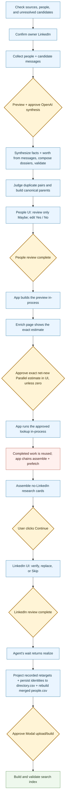

# Deep-context pipeline

Created: 2026-07-13

Changelog:
- 2026-09-25: the seed upgrade path, the deletion of the old migration and the
  store scale fixes ship together as 3.1.0; 3.0.0 was the breaking cut.
- 2026-09-25: a notable imported LinkedIn headline is worth Yes (code rule after
  the JEV answers); label badges show titles without percentages.
- 2026-09-25: `ensure-parents` creates the store; `seed` carries a legacy install's
  merges, raw bundles, facts, human decisions and Parallel results onto the cold
  parents by identifier; migrate-sqlite is no longer routed.
- 2026-09-25: the merge pair judge is JEV, not OpenAI; the merge cutoff is p(yes) ≥ 0.5.
- 2026-09-25: the page listens to the event stream, it does not poll; the
  unwritten review/manifest.json is no longer advertised.
- 2026-09-25: the post-review block is stop → apply-retargets → realize,
  as the skill runs it; realize already persists review identities.
- 2026-09-25: SQLite is the state record (the review manifest is gone); small
  iMessage groups run under standing authorization; the app runs enrichment.

`$deep-context` is the single processing workflow after `$setup`,
`$import-gmail`, or `$import-messages`. It turns local conversation history into
per-person dossiers, resolves duplicate identities, decides which imported
contacts belong in the network, researches the approved people, verifies their
LinkedIns, and rebuilds the canonical network and search index.

The durable product flow is:

```text
messages -> dossiers -> review uncertain people -> enrich Yes -> verify LinkedIn -> people.csv -> index
```

This guide explains the product, review experience, file-state contract, and
privacy boundaries. The executable agent contract is the
[`deep-context` skill](../skills/deep-context/SKILL.md); primitives remain the
authority for schemas and CLI behavior.

The former `$deep-setup` surface is retired. Its candidate resolution,
enrichment, review, realization, and indexing behavior now lives in
`$deep-context`.

## At a glance

- **Inputs:** the canonical merged network, unresolved Gmail/iMessage/WhatsApp
  candidate pools, local msgvault Gmail, macOS Messages, and an optional local
  wacli store.
- **Core context output:** one synthesized Markdown dossier per person, with
  lookup indexes for name, email, and phone.
- **People decision:** the model assigns Yes/Maybe/No. Only genuine uncertainty
  appears in the main review queue; Yes and No remain visible and editable.
- **Enrichment:** Parallel research runs only for effective-Yes parents,
  gated in SQL before paid work; attached links are not machine-judged.
  Completed research is reused and only net-new submissions are priced.
- **LinkedIn decision:** a found LinkedIn can be verified, replaced with a known
  URL, or skipped. A no-LinkedIn research result can only be given a real
  LinkedIn URL or skipped; synthetic records are not directly indexed.
- **State:** every stage overwrites fixed outputs plus one `manifest.json`.
  There are no run IDs, job ledgers, or browser-owned background jobs.
- **Privacy exception:** this skill intentionally reads message bodies: direct
  messages plus small iMessage group bodies under standing owner authorization.
  WhatsApp group bodies are never read.

## End-to-end architecture


```mermaid
flowchart TD
    A["Check sources, people, and unresolved candidates"] --> B["Confirm owner LinkedIn"]
    B --> D["Collect people + candidate messages"]
    D --> E{"Preview + approve OpenAI synthesis"}
    E --> F["Synthesize facts + worth from messages, compose dossiers, validate"]
    F --> G["Judge duplicate pairs and build canonical parents"]
    G --> J["People UI: review only Maybe; edit Yes / No"]
    J --> K{"People review complete"}
    K --> K1["App builds the preview in-process"]
    K1 --> L["Enrich page shows the exact estimate"]
    L --> M{"Approve exact net-new Parallel estimate in UI, unless zero"}
    M --> M1["App runs the approved lookup in-process"]
    M1 --> N["Completed work is reused; app chains assemble + prefetch"]
    N --> O["Assemble no-LinkedIn research cards"]
    O --> P{"User clicks Continue"}
    P --> Q["LinkedIn UI: verify, replace, or Skip"]
    Q --> R{"LinkedIn review complete"}
    R --> R1["Agent's wait returns realize"]
    R1 --> T["Project recorded retargets + persist identities to directory.csv + rebuild merged people.csv"]
    T --> U{"Approve Modal upload/build"}
    U --> V["Build and validate search index"]

    classDef gate fill:#fff4d6,stroke:#a66b00,color:#3d2a00,stroke-width:2px;
    classDef local fill:#eaf5ff,stroke:#2878a8,color:#14364a;
    classDef cloud fill:#fff0ee,stroke:#b54c3d,color:#4a1f19;
    classDef output fill:#eef8ed,stroke:#4f8a49,color:#233f20;
    class E,K,M,P,R,U gate;
    class A,B,D,F,G,J,K1,L,M1,O,Q,R1,T local;
    class N cloud;
    class V output;
```

Approval nodes are wait points, not failure states. The all-in-one
`bin/deep-context run` command is intentionally disabled because one chained
process cannot safely pause for independent privacy, model-spend, provider, and
upload approvals.

## Who controls what

The review experience is deliberately SQLite-driven. The browser is a control
surface, not a second data model.

| Component | Responsibilities | Must not do |
| --- | --- | --- |
| Review app (server) | Query named SQLite views, commit human decisions, launch enrichment with the approved budget flag, and expose its one fixed progress manifest. | Read CSV/JSON artifacts to derive queues, use manifests for control, start unapproved paid work, or rebuild the index. |
| Agent session | Block on `bin/deep-context review-status --wait`, show required estimates/disclosures, and run only the exact next primitive it returns after approval. | Infer completion from chat text, reuse an old approval, or invent a parallel state machine. |
| Primitives | Write fixed outputs plus one receipt, project downstream payloads into SQLite, reuse fingerprinted work, and enforce explicit budgets. | Read receipts to decide pending work, create run-scoped directories, or create ledgers. |

The review server may fetch and cache an existing signed LinkedIn CDN avatar
image for presentation. That fetch does not perform identity resolution or
advance the workflow.

The deterministic agent wait command is:

```bash
bin/deep-context review-status --wait --timeout 900
```

It is read-only and blocks on SQLite-derived workflow status until
`next_action` is an agent action, then prints the contract and exits.
Agent actions are only `synthesize` and `realize` — the review app
runs the mid-flow work itself (preview, approved enrichment, from-cache
continuation, synthetic assembly, profile prefetch) as in-process jobs
the moment the user's clicks authorize them. Every other action is the
human's move, and a timeout returns
`status: waiting` so the caller simply runs the command again. There is no
daemon, socket, thread id, or harness coupling — the same command works from
Codex, Claude Code, or a plain terminal, which is the point: the entire
agent-handoff mechanism is one blocking subprocess any harness already knows
how to run.

The browser has a separate, faster observer:

- Enrich and Done call `/api/status` immediately on load and then once per
  second because an external job can change SQLite progress. A
  LinkedIn preview opened before enrichment completes does the same until those
  external results arrive.
- People and a current, fully enriched LinkedIn stage do not poll. Their local
  saves return the authoritative state token directly.
- LinkedIn starts with ten cards from the SQLite queue, advances synchronously
  on click, and refills from the same query when five remain.
- A changed `next_action` navigates the current tab to the corresponding stage.
- A changed state token reloads the current stage with fresh counts/content.
- A stage opened from the clickable progress steps stays in preview mode while
  still reloading from changed SQLite state; it does not get bounced immediately
  back to the workflow's current stage.
- Returning to a previously hidden tab triggers an immediate check.
- An actual unsaved replacement-LinkedIn URL on a polled preview suppresses
  reload/navigation so the browser does not destroy typed text.

After LinkedIn Finish, the browser shows Done and keeps polling, but there is no
later browser decision stage. Machine-cleared retargets attempted hydration at
judge time; a direct human retarget may instead project from its SQLite carry
without a cached profile. The agent owns only the paid-free realization
projection, Modal indexing, and validation. Those steps do not wait for another
browser button and cannot be blocked by the Done page.

## Stage walkthrough

| Stage | What it does | Main result |
| --- | --- | --- |
| Readiness and owner | Checks source availability, Full Disk Access, merged people, unresolved candidates, and required keys. `ensure-parents` projects the fan-in export into stable parents (creating the store on a fresh install); on an install with pre-SQLite artifacts, `seed` then carries its merges, raw bundles, facts, human decisions and Parallel results onto those parents by identifier, once. Owner context supplies the operator's school, work, and location history for identity disambiguation. | Readiness JSON, SQLite parents, `owner.json` |
| Collection | Reads Gmail and message bodies into one bounded union bundle per canonical parent. The default depth is `--deep-cap 1600`; small iMessage groups are always included. | `raw/<parent_id>.json`, SQLite projection, receipt |
| Synthesis | Sends bounded parent message samples plus owner context to OpenAI and extracts relationship, work, school, location, identifiers, topics, and worth. Worth uses message context/identifiers only, never LinkedIn, except that a notable imported LinkedIn headline (CEO or any chief officer, founder, president, chair, partner, managing director) is Yes. Unchanged fingerprints cost $0. | `facts/<parent_id>.jsonl`, SQLite facts/worth, receipt |
| Composition | Deterministically renders parent-owned facts into Markdown dossiers and a human catalog. Lookup and membership come from SQLite views. | `dossiers/*.md`, `index.md` |
| Duplicate resolution | Blocks parents without shared observed identifiers, judges plausible same-person pairs with JEV (one request per pair, merge at p(yes) ≥ 0.5), caches verdicts in SQLite, and merges whole parent families in one transaction while preserving the surviving id. | Display-only merge exports, `parents/*.md`, SQLite graph |
| Attached-LinkedIn judging | There is no standalone step. The review app judges research results when enrichment completes and applies guided retargets. It may verify, detach, or request human review; it never writes worth. | SQLite identity verdicts |
| People review | Shows model-Maybe parents from the worth query. A human Yes/No writes the same parent row the view reads. The user may continue with unresolved Maybes; only effective-Yes parents enter enrichment. | SQLite parent worth decision; display receipt |
| Enrichment preview and approval | Builds one typed queue from current effective-Yes parents, reuses projected provider results, and reports the exact estimate. A positive estimate launches the job with the approved budget flag; no approval row or job ledger is persisted. | One fixed enrichment progress manifest |
| Identity research | The review app runs the exact approved Parallel request in-process. Research may find a LinkedIn, reuse a prior result, or produce a researched no-LinkedIn profile for review context. | SQLite research rows, one provider result per handle, and proposed retargets |
| Profile prefetch | The review app runs profile hydration automatically after research completes (RapidAPI is credits-based, one call per distinct profile cache miss). The UI stays cache-only. | Shared profile cache and SQLite profile artifacts |
| LinkedIn review | For a found LinkedIn, Yes verifies it. No reveals correction controls but does not save a decision. The user can paste a replacement LinkedIn or Skip. For a no-LinkedIn result, the only outcomes are adding a real LinkedIn URL or Skip. | Verify/detach/retarget decisions |
| Realization | Purely projects recorded human/machine identity decisions to `directory.csv`, using a cached profile when present or the SQLite decision carry otherwise; fan-in then rebuilds the fixed merged people CSV. It makes no provider calls. Synthetic profiles remain outside the directory because they have no real LinkedIn identity. | `directory.csv`, `.powerpacks/network-import/merged/people.csv` |
| Indexing | Uploads the merged CSV to the configured Modal workspace, rebuilds the index, and validates it. | Search index and validation report |

## Commands and approval boundaries

The normal full workflow uses staged commands:

```bash
bin/deep-context check
bin/deep-context ensure-parents
bin/deep-context seed              # legacy installs only, once (free)
bin/deep-context owner --linkedin-url <url> --email <email>
bin/deep-context collect --deep-cap 1600
bin/deep-context dry
bin/deep-context synthesize
bin/deep-context compose
bin/deep-context validate
bin/deep-context cluster --dry-run # free slam-dunk count + ambiguous-pair estimate
bin/deep-context cluster           # settle slam dunks, then JEV-judge the remainder
bin/deep-context parents
bin/deep-context review worth
```

After the browser opens, the agent blocks on
`bin/deep-context review-status --wait` and acts on what it returns. The review
app runs preview, approved enrichment, synthetic assembly, and profile prefetch
itself.

After LinkedIn review:

```bash
bin/deep-context stop
bin/deep-context apply-retargets
bin/deep-context realize

uv run --project . python packs/indexing/modal/linkedin_modal_pipeline.py index-people \
  --people-csv .powerpacks/network-import/merged/people.csv

uv run --project . python \
  packs/indexing/primitives/validate_search_index/validate_search_index.py
```

Approval rules:

| Boundary | Approval |
| --- | --- |
| iMessage group bodies | Standing owner authorization; never asked. |
| Owner profile cache miss | Disclose the RapidAPI call and get approval. |
| OpenAI synthesis | Show `bin/deep-context dry` estimate and get approval. |
| Duplicate judging | Always preview. Run automatically when the estimate is at most $100; ask if it exceeds $100. |
| Parallel enrichment | The Enrich Contacts page approves the exact current positive net-new estimate. The agent must use the approved `--budget`. Zero net-new work needs no spend approval and advances from cache. |
| Modal indexing | Disclose the merged-CSV upload and expected quiet runtime, then get approval. |

Approvals are never reused from memory, an earlier transcript, or an earlier
review revision.

## People decisions

Worth is intentionally decisive:

- **Gmail or Gmail+phone:** bias toward Yes for clearly human, person-directed
  correspondence, including sparse, old, academic, personal, or plausibly
  important professional contacts. No is for clear automated/broadcast/
  transactional noise or unengaged cold spam; Maybe should be rare.
- **Phone-only:** real two-way or repeated conversation is Yes. Sparse or
  ambiguous exchanges may be Maybe; automated noise is No.
- **Mixed sources:** a genuine relationship in one channel wins over noise in
  another. A recognizable name or plausible area code is weak context only.
- **Notable title:** a person whose imported LinkedIn headline names a notable
  role (CEO or any chief officer, founder, president, chair, partner, managing
  director) is Yes regardless of message evidence. The rule runs in code after
  the JEV answers, so it re-bills nothing; the reason reads `Notable title: …`.

The durable worth authority is the parent row in
`.powerpacks/deep-context/deep-context.sqlite`; `review.csv` is compatibility
input/output at the migration or realization boundary only.

- Synthesis writes one machine worth verdict into `facts/<parent_id>.jsonl`
  and projects it onto that parent.
- Each canonical parent has one human-worth override in SQLite. On a parent
  merge, the newest human worth decision wins; re-review is recovery.
- Model Yes starts in the Yes table.
- Model No, human No, and legacy Exclude share the No table.
- Model Maybe is the only main review queue.
- Human Yes/No is sticky and authoritative.
- The user may continue with unresolved Maybes. They remain reviewable later,
  but do not block enrichment and are excluded from lookup until marked Yes.
- On a normal repeated full run, only missing/Maybe dossier worth is rescored.
  Machine Yes/No and human Yes/No are reused.
- The enrichment selection is the current effective Yes table: model Yes unless
  a human removed it, plus anyone a human added.

## LinkedIn decisions

The LinkedIn stage never asks whether the person belongs in the network; that
was already decided in People review.

For a proposed or existing LinkedIn:

- **Yes** verifies the shown profile.
- **No** only reveals the correction controls and focuses the URL input. It is
  not a saved decision.
- **Use this** saves the replacement LinkedIn as an approved retarget.
- **Skip** detaches/rejects the shown identity and leaves the person out of the
  index for now.

For a researched result with no LinkedIn:

- The card shows the researched identity evidence and original message dossier.
- **Add their LinkedIn** accepts a known LinkedIn URL and creates an approved
  retarget.
- **Skip** marks the no-LinkedIn result as unresolved and keeps it out of the
  index.
- The intermediate synthetic row is review context only in the current guided
  workflow; it is never directly approved for indexing.

## State and repeatability

SQLite is the record; the enrichment manifest is a display-only receipt:

```text
.powerpacks/deep-context/deep-context.sqlite
.powerpacks/deep-context/reconcile/deep-research/manifest.json
```

Selection and reuse come from the current SQLite worth/candidate rows plus
projected artifact fingerprints. Nothing reads the manifest to decide what is
pending, current, or allowed to run. The Approve click rebuilds the queue and
estimate from current SQLite and launches with that budget.

The browser state token hashes the stage progress counts, the effective worth
decisions, and whether enrichment is pending or running.

External handoff changes reach the page through the server's `/api/events`
stream on Enrich and Done, and on an early LinkedIn preview while enrichment is
still changing its queue; the page re-snapshots `/api/status` on each nudge and
never polls. Local People/LinkedIn changes are visible immediately from their
mutation response.

This gives repeatability without a ledger:

- Per-person collection, synthesis, and completed research can be reused.
- Current queues and manifests are overwritten in place.
- A repeated review cannot silently skip enrichment because an older lookup
  completed.
- Previously completed research can still reduce the new run's net-new cost.
- Direct progress-step navigation is preview-only; the preview remains visible
  and current with SQLite changes, while SQLite still determines the actual
  workflow stage.
- `$deep-context review` always opens the read-only `/directory` browser. The
  full workflow uses `review worth` to open the People stage without erasing
  sticky human decisions.

## What leaves the machine

| Boundary | Data sent | Not sent |
| --- | --- | --- |
| OpenAI synthesis | Sampled message text, necessary message metadata, owner context, and small iMessage group bodies under standing owner authorization. | Unselected messages and raw source databases. |
| JEV duplicate judge (TypeSafe) | The rendered pair evidence: structured facts, identity evidence, and short message samples for each plausible pair. | Unrelated people and full source databases. |
| OpenAI identity judge (research) | Parent facts, owner context, short message samples, and cached LinkedIn profile evidence. | Unrelated people and full source databases. |
| Parallel.ai | Display name, email, phone, source channel, dossier-derived relationship/work/school/location/topics, and rejected LinkedIn evidence for the approved lookup scope. | Raw message bodies. |
| RapidAPI | A LinkedIn URL requiring profile hydration. | Gmail or chat content. |
| Modal | The canonical merged people CSV, including contact and interaction fields. | Raw msgvault, Messages, wacli, and Deep Context raw bundles. |

Raw bundles are gitignored writer artifacts; every downstream payload is
projected into SQLite before the writer returns. Dossiers persist synthesized
facts, not verbatim messages.

## Durable artifacts

```text
.powerpacks/deep-context/
|-- owner.json
|-- raw/
|   |-- <parent_id>.json
|   `-- manifest.json
|-- facts/
|   |-- <parent_id>.jsonl
|   `-- manifest.json
|-- dossiers/
|   |-- <slug>.md
|   `-- manifest.json
|-- index.md
|-- merge-candidates.csv
|-- parents/
|   |-- <slug>.md
|   `-- manifest.json
|-- review/
|   `-- avatars/
`-- reconcile/
    `-- deep-research/
        |-- manifest.json
        `-- <handle>/
            `-- 00_parallel_result.json

.powerpacks/network-import/overrides/
|-- review.csv
|-- consolidate-people.csv
`-- retarget-people.csv

.powerpacks/network-import/
`-- directory.csv

.powerpacks/network-import/merged/
`-- people.csv
```

## Narrow command surfaces

Not every request needs the full workflow:

| Request | Command | Behavior |
| --- | --- | --- |
| Look up one person by name/email/phone | `bin/deep-context lookup ...` | Free, read-only dossier lookup. |
| Check readiness | `bin/deep-context check` | Free, read-only source/config check. |
| Validate dossiers | `bin/deep-context validate` | Free validation only. |
| Browse people | `bin/deep-context review` | Opens the read-only A-Z directory; `review <stage>` opens that stage. Does not restart processing. |

## Implementation map

| Concern | Authority |
| --- | --- |
| Agent workflow and approvals | [`deep-context/SKILL.md`](../skills/deep-context/SKILL.md) |
| Command dispatcher | [`bin/deep-context`](../../../bin/deep-context) |
| Collection and provenance | [`collection/collect_person_context.py`](../primitives/deep_context/collection/collect_person_context.py) |
| Per-source body readers | [`collection/context_sources.py`](../primitives/deep_context/collection/context_sources.py) |
| Gmail selection policy | [`collection/email_context.py`](../primitives/deep_context/collection/email_context.py) |
| Message-context synthesis and worth judge | [`synthesis/synthesize_person_context.py`](../primitives/deep_context/synthesis/synthesize_person_context.py) |
| Dossier composition | [`synthesis/compose_dossier.py`](../primitives/deep_context/synthesis/compose_dossier.py) |
| Duplicate judge | [`merge_candidates/cluster_merge_candidates.py`](../primitives/deep_context/merge_candidates/cluster_merge_candidates.py) |
| Canonical parents | [`merge_candidates/build_parents.py`](../primitives/deep_context/merge_candidates/build_parents.py) |
| Attached-LinkedIn identity judge (research) | [`enrich/identity_reconcile/judge.py`](../primitives/deep_context/enrich/identity_reconcile/judge.py) |
| Review UI and deterministic status | [`review/reconcile_review_web.py`](../primitives/deep_context/review/reconcile_review_web.py) |
| Parallel enrichment | [`enrich/research_reconcile/reconcile_deep_research.py`](../primitives/deep_context/enrich/research_reconcile/reconcile_deep_research.py) |
| No-LinkedIn research cards | [`enrich/synthetic/assemble.py`](../primitives/deep_context/enrich/synthetic/assemble.py) |
| LinkedIn review profile prefetch | [`enrich/profiles/prefetch.py`](../primitives/deep_context/enrich/profiles/prefetch.py) |
| Retarget projection | [`realize/apply_retargets.py`](../primitives/deep_context/realize/apply_retargets.py) |
| Fan-in realization | [`index_contacts_pipeline.py`](../../indexing/primitives/index_contacts_pipeline/index_contacts_pipeline.py) |
