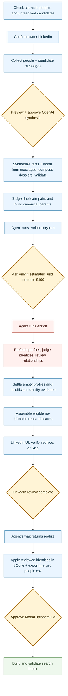

# Deep-context pipeline

Created: 2026-07-13

Changelog:
- 2026-10-01: the agent previews and runs resumable `enrich` before opening
  Check LinkedIn; estimates at most $100 run without asking.
- 2026-10-01: enrichment follows synthesis without a worth-review stop; local
  settlement detaches empty lookup profiles and marks insufficient identity
  evidence worth No before synthetic assembly.
- 2026-10-01: the review page is the React app's page at `/` (`web/src/pages/review`); the
  Jinja page is deleted. The browser-observer notes describe it.
- 2026-09-28: the post-review block is stop → realize. Realize writes the
  final roster into SQLite and exports merged/people.csv from it; no
  directory.csv, retarget-people.csv, fan-in, or provider call. Cold start,
  one-time legacy seed and incremental refresh are documented under State.
- 2026-09-25: the seed upgrade path, the deletion of the old migration and the
  store scale fixes ship together as 3.1.0; 3.0.0 was the breaking cut.
- 2026-09-25: a notable imported LinkedIn headline is worth Yes (code rule after
  the JEV answers); label badges show titles without percentages.
- 2026-09-25: `ensure-parents` creates the store; `seed` carries a legacy install's
  merges, raw bundles, facts, human decisions and Parallel results onto the cold
  parents by identifier; migrate-sqlite is no longer routed.
- 2026-10-01: a pair the merge judge calls one person is also asked whether its two names can be one contact's.
- 2026-09-25: the merge pair judge is JEV, not OpenAI; the merge cutoff is p(yes) ≥ 0.5.
- 2026-09-25: the page listens to the event stream, it does not poll; the
  unwritten review/manifest.json is no longer advertised.
- 2026-09-25: the post-review block is stop → apply-retargets → realize,
  as the skill runs it; realize already persists review identities.
- 2026-09-25: SQLite is the state record (the review manifest is gone); small
  iMessage groups run under standing authorization; the app runs enrichment.

`$deep-context` is the single processing workflow after `$setup`,
`$import-gmail`, or `$import-messages`. It turns local conversation history into
per-person dossiers, resolves duplicate identities, decides which imported
contacts belong in the network, researches the approved people, verifies their
LinkedIns, and rebuilds the canonical network and search index.

The durable product flow is:

```text
messages -> dossiers -> enrich -> check LinkedIn -> realize -> people.csv -> index
```

This guide explains the product, review experience, file-state contract, and
privacy boundaries. The executable agent contract is the
[`deep-context` skill](../skills/deep-context/SKILL.md); primitives remain the
authority for schemas and CLI behavior.

The former `$deep-setup` surface is retired. Its candidate resolution,
enrichment, review, realization, and indexing behavior now lives in
`$deep-context`.

## At a glance

- **Inputs:** the canonical merged network, unresolved Gmail/iMessage/WhatsApp
  candidate pools, local msgvault Gmail, macOS Messages, and an optional local
  wacli store.
- **Core context output:** one synthesized Markdown dossier per person, with
  lookup indexes for name, email, and phone.
- **People decision:** the model assigns Yes/Maybe/No. Worth review is optional;
  Yes and No remain editable. Maybe never blocks enrichment.
- **Enrichment:** Parallel research runs for effective-Yes parents without a
  LinkedIn or completed research. Completed research, including no-match, is
  reused. Every mapped real LinkedIn without a human or machine verdict is judged.
- **LinkedIn decision:** a found LinkedIn can be verified, replaced with a known
  URL, or skipped. A no-LinkedIn research result can only be given a real
  LinkedIn URL or skipped; synthetic records are not directly indexed.
- **State:** every stage overwrites fixed outputs plus one `manifest.json`.
  There are no run IDs, job ledgers, or browser-owned background jobs.
- **Privacy exception:** this skill intentionally reads message bodies: direct
  messages plus small iMessage group bodies under standing owner authorization.
  WhatsApp group bodies are never read.

## End-to-end architecture


```mermaid
flowchart TD
    A["Check sources, people, and unresolved candidates"] --> B["Confirm owner LinkedIn"]
    B --> D["Collect people + candidate messages"]
    D --> E{"Preview + approve OpenAI synthesis"}
    E --> F["Synthesize facts + worth from messages, compose dossiers, validate"]
    F --> G["Judge duplicate pairs and build canonical parents"]
    G --> K1["Agent runs enrich --dry-run"]
    K1 --> M{"Ask only if estimated_usd exceeds $100"}
    M --> M1["Agent runs enrich"]
    M1 --> N["Prefetch profiles, judge identities, review relationships"]
    N --> S["Settle empty profiles and insufficient identity evidence"]
    S --> O["Assemble eligible no-LinkedIn research cards"]
    O --> Q["LinkedIn UI: verify, replace, or Skip"]
    Q --> R{"LinkedIn review complete"}
    R --> R1["Agent's wait returns realize"]
    R1 --> T["Apply reviewed identities in SQLite + export merged people.csv"]
    T --> U{"Approve Modal upload/build"}
    U --> V["Build and validate search index"]

    classDef gate fill:#fff4d6,stroke:#a66b00,color:#3d2a00,stroke-width:2px;
    classDef local fill:#eaf5ff,stroke:#2878a8,color:#14364a;
    classDef cloud fill:#fff0ee,stroke:#b54c3d,color:#4a1f19;
    classDef output fill:#eef8ed,stroke:#4f8a49,color:#233f20;
    class E,M,R,U gate;
    class A,B,D,F,G,K1,S,O,Q,R1,T local;
    class M1,N cloud;
    class V output;
```

Approval nodes are wait points, not failure states. The all-in-one
`bin/deep-context run` command is intentionally disabled because one chained
process cannot safely pause for independent privacy, model-spend, provider, and
upload approvals.

## Who controls what

The review experience is deliberately SQLite-driven. The browser is a control
surface, not a second data model.

| Component | Responsibilities | Must not do |
| --- | --- | --- |
| Review app (server) | Query named SQLite views, commit human decisions, and expose enrichment progress. Its existing enrichment route uses the same chain as the CLI. | Read CSV/JSON artifacts to derive queues, use manifests for control, start unapproved paid work, or rebuild the index. |
| Agent session | Preview and run enrichment under the $100 rule, open LinkedIn review, and run agent actions from `bin/deep-context review-status --wait`. | Infer completion from chat text, reuse an old approval, or invent a parallel state machine. |
| Primitives | Write fixed outputs plus one receipt, project downstream payloads into SQLite, reuse fingerprinted work, and enforce explicit budgets. | Read receipts to decide pending work, create run-scoped directories, or create ledgers. |

The review server may fetch and cache an existing signed LinkedIn CDN avatar
image for presentation. That fetch does not perform identity resolution or
advance the workflow.

The deterministic agent wait command is:

```bash
bin/deep-context review-status --wait --timeout 900
```

It is read-only and blocks on SQLite-derived workflow status until
`next_action` is an agent action, then prints the contract and exits.
Agent actions are `synthesize`, `enrich`, and `realize`; pending enrichment
returns immediately. The agent runs `enrich --dry-run`, then `enrich` without
asking when `estimated_usd` is at most $100, and asks first only above $100.
`review_linkedin` waits for the user's decisions. A timeout returns
`status: waiting`; the agent runs the command again.

The browser has a separate, faster observer:

- Enrich and Done read `/api/status` on load and again on every `/api/events`
  message, because an external job can change SQLite progress. A running
  enrichment's numbers ride in on the event itself and update the bar in place.
- The worth and LinkedIn screens never watch the server. Each save answers with
  the counts the page repaints.
- A LinkedIn decision answers with the next card, read after the write, so a
  decided person is never served back. The worth queue reads its next card ahead.
- A changed `next_action` navigates the current tab to the corresponding stage.
- A changed state token reloads the current stage with fresh counts/content.
- A stage opened from the clickable progress steps stays in preview mode while
  still reloading from changed SQLite state; it does not get bounced immediately
  back to the workflow's current stage.
- Returning to a previously hidden tab triggers an immediate check.
- An actual unsaved replacement-LinkedIn URL on a polled preview suppresses
  reload/navigation so the browser does not destroy typed text.

After LinkedIn Finish, the browser shows Done and keeps polling, but there is no
later browser decision stage. Machine-cleared retargets attempted hydration at
judge time; a direct human retarget may instead project from its SQLite carry
without a cached profile. The agent owns enrichment, realization, Modal
indexing, and validation. Those steps do not wait for another browser button
and cannot be blocked by the Done page.

## Stage walkthrough

| Stage | What it does | Main result |
| --- | --- | --- |
| Readiness and owner | Checks source availability, Full Disk Access, merged people, unresolved candidates, and required keys. `ensure-parents` projects the fan-in export into stable parents (creating the store on a fresh install); on an install with pre-SQLite artifacts, `seed` then carries its merges, raw bundles, facts, human decisions and Parallel results onto those parents by identifier, once. Owner context supplies the operator's school, work, and location history for identity disambiguation. | Readiness JSON, SQLite parents, `owner.json` |
| Collection | Reads Gmail and message bodies into one bounded union bundle per canonical parent. The default depth is `--deep-cap 1600`; small iMessage groups are always included. | `raw/<parent_id>.json`, SQLite projection, receipt |
| Synthesis | Sends bounded parent message samples plus owner context to OpenAI and extracts relationship, work, school, location, identifiers, topics, and worth. Worth uses message context/identifiers only, never LinkedIn, except that a notable imported LinkedIn headline (CEO or any chief officer, founder, president, chair, partner, managing director) is Yes. Unchanged fingerprints cost $0. | `facts/<parent_id>.jsonl`, SQLite facts/worth, receipt |
| Composition | Deterministically renders parent-owned facts into Markdown dossiers and a human catalog. Lookup and membership come from SQLite views. | `dossiers/*.md`, `index.md` |
| Duplicate resolution | Blocks parents without shared observed identifiers, judges plausible same-person pairs with JEV (one request per pair, merge at p(yes) ≥ 0.5 when JEV also answers that the two names can be one contact's), caches verdicts in SQLite, and merges whole parent families in one transaction while preserving the surviving id. | Display-only merge exports, `parents/*.md`, SQLite graph |
| LinkedIn judging | After cache-first profile preparation, enrichment judges mapped attached and researched links lacking a decision. Existing human and valid machine decisions are kept. | SQLite identity verdicts |
| Optional worth review | Shows model-Maybe parents and editable Yes/No. Human worth writes the parent row and remains authoritative. Maybe does not stop enrichment. | SQLite human worth |
| Enrichment plan and run | `enrich --dry-run` reports lookups, Parallel cost, profile fetches, judgment estimates, and one `estimated_usd` total without writes. The agent runs `enrich` automatically when the total is at most $100, asking only above that. | One fixed enrichment progress manifest |
| Identity research | `enrich` runs Parallel research with the plan's Parallel estimate as its budget. Research may find a LinkedIn, reuse a prior result, or produce a researched no-LinkedIn profile for review context. | SQLite research rows, one provider result per handle, and proposed retargets |
| Profile prefetch | `enrich` runs cache-first profile hydration after research (RapidAPI is credits-based, one call per distinct profile cache miss). The UI stays cache-only. | Shared profile cache and SQLite profile artifacts |
| Local settlement | Detaches empty machine-accepted lookup LinkedIns, then marks parents with no real profile and fewer than 25 messages worth No unless human worth exists. Re-evaluation lifts that No when evidence arrives. | SQLite machine identity and parent worth |
| Synthetic assembly | Creates no-LinkedIn research cards for eligible parents; worth No receives none. | SQLite synthetic profiles |
| LinkedIn review | For a found LinkedIn, Yes verifies it. No reveals correction controls but does not save a decision. The user can paste a replacement LinkedIn or Skip. For a no-LinkedIn result, the only outcomes are adding a real LinkedIn URL or Skip. | Verify/detach/retarget decisions |
| Realization | Applies reviewed identities and merges their parents in SQLite, then exports the final roster. Fills profiles from SQLite and makes no provider calls. Synthetic profiles require a reviewed real LinkedIn replacement to be indexed. | SQLite roster, `.powerpacks/network-import/merged/people.csv` |
| Indexing | Uploads the merged CSV to the configured Modal workspace, rebuilds the index, and validates it. | Search index and validation report |

## Commands and approval boundaries

The normal full workflow uses staged commands:

```bash
bin/deep-context check
bin/deep-context ensure-parents
bin/deep-context seed              # legacy installs only, once (free)
bin/deep-context owner --linkedin-url <url> --email <email>
bin/deep-context collect --deep-cap 1600
bin/deep-context dry
bin/deep-context synthesize
bin/deep-context compose
bin/deep-context validate
bin/deep-context cluster --dry-run # free slam-dunk count + ambiguous-pair estimate
bin/deep-context cluster           # settle slam dunks, then JEV-judge the remainder
bin/deep-context parents
bin/deep-context enrich --dry-run
bin/deep-context enrich
bin/deep-context review
```

The agent runs enrichment before opening review, which lands on Check LinkedIn.
The chain is research → profiles → identity → relationships → settle → synthetic.
After the browser opens, `bin/deep-context review-status --wait` waits for human
LinkedIn decisions and returns immediately when an agent action is pending.
The workflow sequence is `synthesize` → `enrich` → `review_linkedin` → `realize`.

After LinkedIn review:

```bash
bin/deep-context stop
bin/deep-context realize

uv run --project . python packs/indexing/modal/linkedin_modal_pipeline.py index-people \
  --people-csv .powerpacks/network-import/merged/people.csv

uv run --project . python \
  packs/indexing/primitives/validate_search_index/validate_search_index.py
```

Approval rules:

| Boundary | Approval |
| --- | --- |
| iMessage group bodies | Standing owner authorization; never asked. |
| Owner profile cache miss | Disclose the RapidAPI call and get approval. |
| OpenAI synthesis | Show `bin/deep-context dry` estimate and get approval. |
| Duplicate judging | Always preview. Run automatically when the estimate is at most $100; ask if it exceeds $100. |
| Enrichment | Always run `enrich --dry-run`. Run `enrich` without asking when `estimated_usd` is at most $100; ask first only above $100. There is no CLI approval flag. |
| Modal indexing | Disclose the merged-CSV upload and expected quiet runtime, then get approval. |

Approvals are never reused from memory, an earlier transcript, or an earlier
review revision.

## People decisions

Worth is intentionally decisive:

- **Gmail or Gmail+phone:** bias toward Yes for clearly human, person-directed
  correspondence, including sparse, old, academic, personal, or plausibly
  important professional contacts. No is for clear automated/broadcast/
  transactional noise or unengaged cold spam; Maybe should be rare.
- **Phone-only:** real two-way or repeated conversation is Yes. Sparse or
  ambiguous exchanges may be Maybe; automated noise is No.
- **Mixed sources:** a genuine relationship in one channel wins over noise in
  another. A recognizable name or plausible area code is weak context only.
- **Notable title:** a person whose imported LinkedIn headline names a notable
  role (CEO or any chief officer, founder, president, chair, partner, managing
  director) is Yes regardless of message evidence. The rule runs in code after
  the JEV answers, so it re-bills nothing; the reason reads `Notable title: …`.

The durable worth authority is the parent row in
`.powerpacks/deep-context/deep-context.sqlite`; legacy `review.csv` is read only
at the one-time seed boundary.

- Synthesis writes machine worth into `facts/<parent_id>.jsonl` and SQLite
  facts. Effective worth reads human worth, then `parents.machine_worth`, then
  the best machine verdict on the parent's facts, otherwise Maybe.
- Each canonical parent has one human-worth override in SQLite. On a parent
  merge, the newest human worth decision wins; re-review is recovery.
- Model Yes starts in the Yes table.
- Model No, human No, and legacy Exclude share the No table.
- Model Maybe is the only main review queue.
- Human Yes/No is sticky and authoritative.
- Worth review is optional (`bin/deep-context review worth`); unresolved Maybes
  do not stop enrichment. Research still selects effective Yes only.
- On a normal repeated full run, only missing/Maybe dossier worth is rescored.
  Machine Yes/No and human Yes/No are reused.
- The enrichment selection is the current effective Yes table: model Yes unless
  a human removed it, plus anyone a human added.

## Local settlement

After relationship review and before synthetic assembly, settlement applies:

1. A machine-accepted lookup LinkedIn whose fetched profile is missing, errored,
   or has neither experience nor education is detached with an empty-profile
   reason. An own `linkedin_csv` connection and a human link decision are kept.
2. Without human worth, effective Yes/Maybe becomes machine No when the parent
   has no real LinkedIn profile and fewer than `REVIEW_MESSAGE_BAR = 25`
   messages. Messages sum `interaction_counts` across non-owner imported people.
   The reason is `not enough to know who this is: no LinkedIn profile and N messages`.

An own imported connection or a LinkedIn a human kept counts as a real LinkedIn
profile. Otherwise the profile must be accepted (verify/retarget, Yes/auto),
present, and contain experience or education. A parent with a real profile or at least 25 messages
keeps its worth. Effective No and human worth remain unchanged.

3. An own LinkedIn connection with no human worth decision is always worth Yes,
   whatever the worth pass said.

Rules 2 and 3 write existing `parents.machine_worth` / `machine_worth_reason` above
facts and below human worth. A later JEV facts pass cannot undo it. Settlement
is idempotent and clears its No when a real profile arrives or the message sum
reaches 25. Worth-No parents leave LinkedIn review and later research and do
not receive synthetic profiles.

## LinkedIn decisions

The LinkedIn stage checks identity for parents still worth Yes/Maybe after
settlement. Worth remains editable in the optional worth view.

For a proposed or existing LinkedIn:

- **Yes** verifies the shown profile.
- **No** only reveals the correction controls and focuses the URL input. It is
  not a saved decision.
- **Use this** saves the replacement LinkedIn as an approved retarget.
- **Skip** detaches/rejects the shown identity and leaves the person out of the
  index for now.

For a researched result with no LinkedIn:

- The card shows the researched identity evidence and original message dossier.
- **Add their LinkedIn** accepts a known LinkedIn URL and creates an approved
  retarget.
- **Skip** marks the no-LinkedIn result as unresolved and keeps it out of the
  index.
- The intermediate synthetic row is review context only in the current guided
  workflow; it is never directly approved for indexing.

## State and repeatability

The store's state picks one of three starts; there is no mode flag:

- **Cold start (new account):** no store yet. `ensure-parents` creates it and
  projects the imported people as the roster.
- **One-time legacy seed:** `check` reports `seed_required` for an install with
  pre-SQLite artifacts. Run `seed` once after `ensure-parents`; a seeded store
  refuses a second run.
- **Incremental refresh:** a store exists. Re-import, fan in, and run
  `ensure-parents`: new contacts and evidence are added, existing contacts and
  every decision are kept, and a contact the refresh omitted is not deleted.
  New unresolved contacts enter the worth and lookup queues like any other.

After `ensure-parents`, every stage reads SQLite only; `realize` is the one
place a CSV is written again.

SQLite is the record; the enrichment manifest is a display-only receipt:

```text
.powerpacks/deep-context/deep-context.sqlite
.powerpacks/deep-context/reconcile/deep-research/manifest.json
```

Selection and reuse come from the current SQLite worth/candidate rows plus
projected artifact fingerprints. Nothing reads the manifest to decide what is
pending, current, or allowed to run. `enrich` recomputes the plan from SQLite and
uses its Parallel estimate as the research budget. The single manifest reports
`running` plus the named `phase` before each step, then `completed` with
non-fatal errors or `failed` with the phase and error.

Re-running `enrich` starts the sequence from research and reuses completed work
in SQLite and on disk. It is safe after any later import: only pending work reaches providers.
There are no separate checkpoints.

The browser state token hashes the stage progress counts, the effective worth
decisions, and whether enrichment is pending or running.

External handoff changes reach the page through the server's `/api/events`
stream on Enrich and Done; the page re-reads `/api/status` on each message and
never polls. Local worth/LinkedIn changes are visible immediately from their
save's response.

This gives repeatability without a ledger:

- Per-person collection, synthesis, and completed research can be reused.
- Current queues and manifests are overwritten in place.
- A repeated review cannot silently skip enrichment because an older lookup
  completed.
- Previously completed research can still reduce the new run's net-new cost.
- Direct progress-step navigation is preview-only; the preview remains visible
  and current with SQLite changes, while SQLite still determines the actual
  workflow stage.
- `$deep-context review` opens the current review stage; `review people` opens
  the People page (your network with its share decisions, populated by the
  share step). Neither erases sticky human decisions.

## What leaves the machine

| Boundary | Data sent | Not sent |
| --- | --- | --- |
| OpenAI synthesis | Sampled message text, necessary message metadata, owner context, and small iMessage group bodies under standing owner authorization. | Unselected messages and raw source databases. |
| JEV duplicate judge (TypeSafe) | The rendered pair evidence: structured facts, identity evidence, and short message samples for each plausible pair. | Unrelated people and full source databases. |
| OpenAI identity judge (research) | Parent facts, owner context, short message samples, and cached LinkedIn profile evidence. | Unrelated people and full source databases. |
| Parallel.ai | Display name, email, phone, source channel, dossier-derived relationship/work/school/location/topics, and rejected LinkedIn evidence for the approved lookup scope. | Raw message bodies. |
| RapidAPI | A LinkedIn URL requiring profile hydration. | Gmail or chat content. |
| Modal | The canonical merged people CSV, including contact and interaction fields. | Raw msgvault, Messages, wacli, and Deep Context raw bundles. |

Raw bundles are gitignored writer artifacts; every downstream payload is
projected into SQLite before the writer returns. Dossiers persist synthesized
facts, not verbatim messages.

## Durable artifacts

```text
.powerpacks/deep-context/
|-- deep-context.sqlite
|-- owner.json
|-- raw/
|   |-- <parent_id>.json
|   `-- manifest.json
|-- facts/
|   |-- <parent_id>.jsonl
|   `-- manifest.json
|-- dossiers/
|   |-- <slug>.md
|   `-- manifest.json
|-- index.md
|-- merge-candidates.csv
|-- parents/
|   |-- <slug>.md
|   `-- manifest.json
|-- review/
|   `-- avatars/
`-- reconcile/
    `-- deep-research/
        |-- manifest.json
        `-- <handle>/
            `-- 00_parallel_result.json

.powerpacks/network-import/merged/
`-- people.csv
```

## Narrow command surfaces

Not every request needs the full workflow:

| Request | Command | Behavior |
| --- | --- | --- |
| Look up one person by name/email/phone | `bin/deep-context lookup ...` | Free, read-only dossier lookup. |
| Check readiness | `bin/deep-context check` | Free, read-only source/config check. |
| Validate dossiers | `bin/deep-context validate` | Free validation only. |
| Open the review | `bin/deep-context review` | Opens the current review stage; `review <stage>` opens that stage, `review people` the People page. Does not restart processing. |

## Implementation map

| Concern | Authority |
| --- | --- |
| Agent workflow and approvals | [`deep-context/SKILL.md`](../skills/deep-context/SKILL.md) |
| Command dispatcher | [`bin/deep-context`](../../../bin/deep-context) |
| Collection and provenance | [`collection/collect_person_context.py`](../primitives/deep_context/collection/collect_person_context.py) |
| Per-source body readers | [`collection/context_sources.py`](../primitives/deep_context/collection/context_sources.py) |
| Gmail selection policy | [`collection/email_context.py`](../primitives/deep_context/collection/email_context.py) |
| Message-context synthesis and worth judge | [`synthesis/synthesize_person_context.py`](../primitives/deep_context/synthesis/synthesize_person_context.py) |
| Dossier composition | [`synthesis/compose_dossier.py`](../primitives/deep_context/synthesis/compose_dossier.py) |
| Duplicate judge | [`merge_candidates/cluster_merge_candidates.py`](../primitives/deep_context/merge_candidates/cluster_merge_candidates.py) |
| Canonical parents | [`merge_candidates/build_parents.py`](../primitives/deep_context/merge_candidates/build_parents.py) |
| Attached-LinkedIn identity judge (research) | [`enrich/identity_reconcile/judge.py`](../primitives/deep_context/enrich/identity_reconcile/judge.py) |
| Review UI and deterministic status | [`review/reconcile_review_web.py`](../primitives/deep_context/review/reconcile_review_web.py) |
| Parallel enrichment | [`enrich/research_reconcile/reconcile_deep_research.py`](../primitives/deep_context/enrich/research_reconcile/reconcile_deep_research.py) |
| Local identity and worth settlement | [`enrich/settle.py`](../primitives/deep_context/enrich/settle.py) |
| No-LinkedIn research cards | [`enrich/synthetic/assemble.py`](../primitives/deep_context/enrich/synthetic/assemble.py) |
| LinkedIn review profile prefetch | [`enrich/profiles/prefetch.py`](../primitives/deep_context/enrich/profiles/prefetch.py) |
| Realization (final roster + people.csv export) | [`realize/export_people.py`](../primitives/deep_context/realize/export_people.py) |
