# Gmail import pipeline

`$import-gmail` turns Gmail relationship metadata into LinkedIn-backed people in
the local Powerpacks search index. Gmail is synced into msgvault, Powerpacks reads
metadata from the local archive, known identities are reused, unresolved people
are looked up, and the merged network is indexed in Modal and downloaded as a
local DuckDB.

This guide describes the product behavior and trust boundaries. The executable
agent contract is [`import-gmail/SKILL.md`](../skills/import-gmail/SKILL.md).

## At a glance

- **Gmail content boundary:** msgvault downloads messages into its local archive
  for the selected window and may also download attachments. Powerpacks then
  queries only participant and interaction metadata; it does not select bodies,
  subjects, snippets, raw MIME, or attachment content.
- **Identity strategy:** local directory first, then Parallel.ai only for
  unresolved people, then profile cache or RapidAPI hydration.
- **Output:** `.powerpacks/network-import/import/gmail/people.csv`, merged into
  the shared network and built into `local-search.duckdb`.
- **Important limitation:** the shipped flow does not verify the selected
  LinkedIn identity with an LLM judge or mandatory human review.
- **Cloud boundary:** the final merged people CSV is uploaded to a workspace-shared
  Modal volume. Inputs and runs use operator-prefixed paths, while caches are shared.

## Architecture

```mermaid
flowchart TD
    A["Choose Gmail accounts<br/>and history window"] --> B["Set up local msgvault<br/>and OAuth desktop app"]
    B --> C["Authorize every selected account"]
    C --> D["msgvault syncs selected window<br/>into its local message archive"]
    D --> E["Powerpacks reads metadata only<br/>names, emails, roles, IDs, dates, labels"]
    E --> F["Filter automation and one-way contacts<br/>plus categories when label tables exist"]
    F --> G["Write per-account artifacts<br/>and stable discovery manifest"]

    G --> H["Reuse local directory mappings<br/>skip cached-negative identities"]
    H --> I{"Unresolved people?"}
    I -->|No| M["Apply accepted identity mappings"]
    I -->|Yes| J{"Parallel lookup approved?"}
    J -->|No| K["Stop before provider calls"]
    J -->|Yes| L["Parallel LinkedIn lookup<br/>name + company guess + email"]
    L --> N["Record found and negative<br/>resolver outcomes"]
    N --> O{"Found URL and normalized<br/>confidence at least 0.75?"}
    O -->|No| P0["Cache unresolved or negative outcome<br/>do not hydrate"]
    O -->|Yes| M

    M --> P{"LinkedIn profile cached?"}
    P -->|Yes| R0["Hydrated LinkedIn profile"]
    P -->|No| Q{"RapidAPI call approved?"}
    Q -->|No| K0["Stop before cache-miss calls"]
    Q -->|Yes| Q0["RapidAPI profile hydration<br/>current child has no internal gate"]
    Q0 --> R0
    R0 --> R["Canonical Gmail people.csv"]

    R --> S["Local fan-in across sources<br/>merged people.csv + provenance CSVs"]
    S --> T{"Modal upload and provider<br/>processing approved?"}
    T -->|No| K1["Stop before cloud indexing"]
    T -->|Yes| U["Upload to workspace-shared volume<br/>under operator-prefixed paths"]
    U --> U0["Classify, embed,<br/>and build search index"]
    U0 --> V["Download DuckDB + manifest"]
    V --> W["Validate local index"]

    R0 -. "planned, not wired" .-> X["Identity judge"]
    X -.-> Y["Human review UI"]
    Y -.-> R

    classDef gate fill:#fff4d6,stroke:#a66b00,color:#3d2a00,stroke-width:2px;
    classDef local fill:#eaf5ff,stroke:#2878a8,color:#14364a;
    classDef cloud fill:#fff0ee,stroke:#b54c3d,color:#4a1f19;
    classDef output fill:#eef8ed,stroke:#4f8a49,color:#233f20;
    class I,J,O,P,Q,T gate;
    class A,B,C,D,E,F,G,H,K,K0,K1,M,N,P0,R0,R,S,V,W local;
    class L,Q0,U,U0 cloud;
    class W output;
```



## Stage walkthrough

| Stage | What happens | Product consequence |
| --- | --- | --- |
| Account choice | The user selects every Gmail address and a history window. Default is three years; a wider window needs confirmation. | Selection is explicit rather than inferred. |
| OAuth and authorization | msgvault's desktop OAuth app is created if missing. Every selected address absent from `status.accounts` is authorized, including the primary account. | Existing OAuth configuration does not imply a new account is authorized. |
| Bounded sync | All selected accounts are passed to one `gmail.py discover` invocation with repeated `--account-email` flags and one `--sync-after`. | Separate per-account calls can rewrite the stable manifest and lose earlier accounts from the following import. |
| Metadata extraction | msgvault first synchronizes messages into its local full-message archive. Powerpacks opens that SQLite database read-only and selects participants, direction, message/conversation IDs, timestamps, labels, counts, and display names. | Powerpacks does not select body, subject, MIME, or attachment content, although msgvault's local store contains message bodies and may contain attachments. |
| Filtering | Automated/service addresses and contacts without bidirectional interaction are removed. Default category labels are also removed when both msgvault label tables exist. | The queue favors actual person-to-person relationships; missing label tables weaken category filtering rather than failing closed. |
| Directory lookup | Gmail observations update the reusable local directory. Exact email, phone, or unambiguous unique-name mappings at confidence `>= 0.75` are reused; cached negative outcomes are not retried. | Known people avoid repeat external lookup. |
| Parallel lookup | Unresolved per-account queues are combined. The resolver sends name, email, email-domain-derived company, and optional context. Normal Gmail discovery leaves context empty. | Provider calls are limited to unresolved identities. |
| Apply and hydrate | Resolver outcomes are recorded first. Found results with normalized confidence `>= 0.75` get stable LinkedIn IDs; missing or zero provider confidence is currently normalized to `0.90`. The profile cache is checked, then RapidAPI fills fields on a miss. Rows without a usable profile do not enter the final Gmail people file. | The numeric threshold is not independent identity verification; false matches can pollute the network. |
| Source fan-in | Duplicate LinkedIn IDs across Gmail accounts and other sources merge; email aliases and interaction fields are unioned. | One canonical person can carry evidence from several imports. |
| Modal indexing | The complete merged CSV is uploaded to the workspace-shared Modal volume. Input and run paths are operator-prefixed; enrichment caches are shared. The result is packaged into DuckDB and downloaded. | The search index is local after the cloud build; the flow does not update a Powerset set or TurboPuffer corpus. Without `POWERPACKS_OPERATOR_ID`, the path falls back to the all-zero ID. |

## Identity lookup details

The lookup order matters:

1. Commit the latest Gmail observations to
   `.powerpacks/network-import/directory.csv`.
2. Reuse a positive directory mapping by exact email/phone or unambiguous name.
3. Keep cached-negative identities out of repeated provider calls.
4. Filter generic/non-person addresses.
5. Combine only unresolved rows across all selected accounts.
6. Ask Parallel for the best LinkedIn identity. Below 25 unresolved contacts the
   current import primitive auto-approves internally; 25 or more blocks. The
   `import-gmail` skill now requires the agent to get provider approval before
   invoking this stage in either case.
7. Record every resolver outcome, then accept found results with normalized
   confidence `>= 0.75`. A missing or zero confidence currently becomes `0.90`,
   so this threshold is a routing rule rather than a verification guarantee.
8. Hydrate each accepted LinkedIn URL from the local cache or RapidAPI.

Parallel's top result is currently trusted without a second identity judge or
human review. [`gmail-contact-llm-review-proposal.md`](gmail-contact-llm-review-proposal.md)
describes a proposed review layer, not shipped behavior. A standalone verifier
exists, but `$import-gmail` does not call it.

## Privacy and provider boundaries

| System | Data it receives or stores | Boundary |
| --- | --- | --- |
| msgvault | Gmail OAuth tokens and a local full-message archive under `~/.msgvault`; the current skill does not request attachment suppression, so supported msgvault builds may download attachments. | Owned by msgvault on the user's machine. Powerpacks does not copy secrets into tracked files or send archive content to identity providers. |
| Powerpacks metadata reader | Emails, names, sender/recipient roles, IDs, dates, labels, and aggregate counts. | Opens msgvault read-only; excludes bodies, subjects, snippets, raw MIME, and attachments. |
| Local directory | Contact observations, identity mappings, confidence, and cached negative outcomes. | Local `.powerpacks` artifact reused across imports. |
| Parallel.ai | Full name, email, an email-domain-derived company guess, and optional context. | No Gmail body or subject content. |
| RapidAPI | Accepted LinkedIn URL/public identifier. | No Gmail content. Cache misses currently have no child-level approval gate. |
| Modal | Full merged `people.csv`, including Gmail addresses and interaction metadata. | Workspace-shared cloud volume with operator-prefixed input/run paths and shared caches; returns DuckDB and manifest. Missing `POWERPACKS_OPERATOR_ID` uses the all-zero path. |

The phrase "local search index" means the finished DuckDB runs locally. It does
not mean every construction stage stays on-device.

## Artifacts and resume

```text
.powerpacks/network-import/
|-- discover/gmail/<account>/
|   |-- accounts.csv
|   |-- gmail_threads.csv
|   |-- gmail_contacts_aggregated.csv
|   |-- targeted_emails.csv
|   |-- linkedin_resolution_queue.csv
|   |-- people.csv
|   `-- manifest.json
|-- discover/gmail/
|   |-- contacts.csv
|   |-- linkedin_resolution_queue.csv
|   `-- manifest.json
|-- directory.csv
|-- import/gmail/
|   |-- people.csv
|   |-- ledger.json
|   `-- manifest.json
`-- merged/people.csv

.powerpacks/search-index/
|-- local-search.duckdb
`-- manifest.json
```

`~/.msgvault/msgvault.db` is durable and must not be deleted. With an explicit
history window, discovery passes `--noresume`, rescans that window, and relies on
msgvault deduplication for already stored messages. Without an explicit window,
the primitive may infer `--after` from the most recent local message. Parallel
resolver output CSV rows and LinkedIn profile caches are reused; completed
resolver/enrichment ledgers are rewritten rather than acting as resume journals.
Modal reruns failed sandboxes against persistent caches.

## Current product gaps

- No mandatory identity verification or human review exists between Parallel's
  match and profile hydration.
- Missing or zero resolver confidence is normalized to `0.90`, so the `0.75`
  routing threshold is not a meaningful verification boundary by itself.
- RapidAPI cache misses occur without a primitive-owned cost preview/approval.
  The skill adds an agent-level approval boundary, but a deterministic child gate
  is still needed.
- `index-people --max-usd 0` is uncapped internal mode. See the
  [LinkedIn and Modal indexing guide](../../indexing/docs/linkedin-modal-pipeline.md).
- Modal storage is workspace-shared and falls back to an all-zero operator path
  unless `POWERPACKS_OPERATOR_ID` is set; automatic per-user isolation is not shipped.
- Discovery can exit `0` while returning `status: failed`; callers must inspect
  JSON status rather than relying only on the process exit code.
- The resolver's older docs mention approval/continue commands its current CLI
  does not expose. An interrupted unresolved task may be resubmitted.
- The repo has three distinct surfaces: the harness skill, current local app v3
  endpoints, and legacy `setup_gmail.py`. They share primitives but should not be
  presented as one command contract.

## Implementation map

| Concern | Authority |
| --- | --- |
| Agent workflow | [`import-gmail/SKILL.md`](../skills/import-gmail/SKILL.md) |
| OAuth and account status | [`msgvault_setup.py`](../primitives/msgvault_setup/msgvault_setup.py) |
| Sync and stable discovery | [`discover_contacts_pipeline/gmail.py`](../primitives/discover_contacts_pipeline/gmail.py) |
| Metadata aggregation | [`gmail_network_import.py`](../primitives/gmail_network_import/gmail_network_import.py) |
| Import orchestration | [`import_contacts_pipeline/gmail.py`](../primitives/import_contacts_pipeline/gmail.py) |
| Directory reuse | [`discover_contacts_pipeline/directory.py`](../primitives/discover_contacts_pipeline/directory.py) |
| Parallel resolver | [`resolve_linkedin_queue.py`](../primitives/resolve_linkedin_queue/resolve_linkedin_queue.py) |
| Profile hydration | [`enrich_people.py`](../primitives/enrich_people/enrich_people.py) |
| Fan-in | [`index_contacts_pipeline.py`](../../indexing/primitives/index_contacts_pipeline/index_contacts_pipeline.py) |
| Modal build | [`linkedin_modal_pipeline.py`](../../indexing/modal/linkedin_modal_pipeline.py) |
