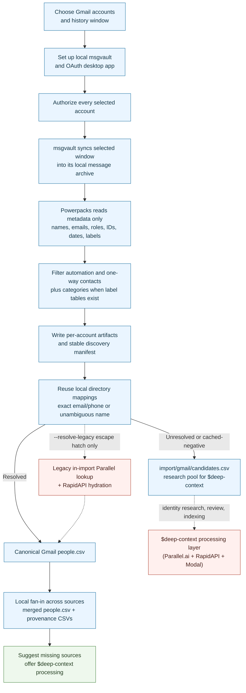

<!--
Changelog:
- 2026-07-16: Refocused on contact sync only. The import stage is now
  directory-reuse only (free, local): unresolved contacts land in
  import/gmail/candidates.csv, Parallel.ai resolution + RapidAPI hydration
  move to the $deep-context processing layer (--resolve-legacy is the legacy
  escape hatch), and Modal indexing is no longer part of $import-gmail (it
  stays in $setup and in $deep-context's finale).
-->

# Gmail import pipeline

`$import-gmail` adds Gmail relationship metadata to the local Powerpacks
network. Gmail is synced into msgvault, Powerpacks reads metadata from the
local archive, identities already known to the local directory are reused, and
every still-unresolved contact worth researching is staged in a candidates
pool for the `$deep-context` processing layer. The import stage is free and
local: no Parallel.ai, no RapidAPI, and no Modal index build.

This guide describes the product behavior and trust boundaries. The executable
agent contract is [`import-gmail/SKILL.md`](../skills/import-gmail/SKILL.md).

## At a glance

- **Gmail content boundary:** msgvault downloads messages into its local archive
  for the selected window and may also download attachments. Powerpacks then
  queries only participant and interaction metadata; it does not select bodies,
  subjects, snippets, raw MIME, or attachment content.
- **Identity strategy:** local directory only. People resolved by prior imports
  attach immediately; unresolved and cached-negative contacts are written to
  `import/gmail/candidates.csv` for `$deep-context`, which owns Parallel.ai
  resolution and RapidAPI hydration. `--resolve-legacy` restores the old
  in-import behavior.
- **Output:** `.powerpacks/network-import/import/gmail/people.csv` plus
  `import/gmail/candidates.csv`, merged into the shared network by fan-in.
- **Indexing:** no longer part of `$import-gmail`. The Modal index build stays
  in `$setup` and in `$deep-context`'s finale; new Gmail contacts become
  searchable after one of those runs.
- **Cloud boundary:** none in the canonical import. Provider calls and the
  Modal upload happen only in `$deep-context` or behind the `--resolve-legacy`
  escape hatch.

## Architecture



## Stage walkthrough

| Stage | What happens | Product consequence |
| --- | --- | --- |
| Account choice | The user selects every Gmail address and a history window. Default is three years; a wider window needs confirmation. | Selection is explicit rather than inferred. |
| OAuth and authorization | msgvault's desktop OAuth app is created if missing. Every selected address absent from `status.accounts` is authorized, including the primary account. | Existing OAuth configuration does not imply a new account is authorized. |
| Bounded sync | All selected accounts are passed to one `gmail.py discover` invocation with repeated `--account-email` flags and one `--sync-after`. | Separate per-account calls can rewrite the stable manifest and lose earlier accounts from the following import. |
| Metadata extraction | msgvault first synchronizes messages into its local full-message archive. Powerpacks opens that SQLite database read-only and selects participants, direction, message/conversation IDs, timestamps, labels, counts, and display names. | Powerpacks does not select body, subject, MIME, or attachment content, although msgvault's local store contains message bodies and may contain attachments. |
| Filtering | Automated/service addresses and contacts without bidirectional interaction are removed. Default category labels are also removed when both msgvault label tables exist. | The queue favors actual person-to-person relationships; missing label tables weaken category filtering rather than failing closed. |
| Directory lookup | Gmail observations update the reusable local directory. Exact email, phone, or unambiguous unique-name mappings at confidence `>= 0.75` are reused; cached negative outcomes are not retried. | Known people attach immediately with no provider call. |
| Candidates staging | Post-directory unresolved queues and cached-negative queues are unioned by email into `import/gmail/candidates.csv` (cached negatives flagged in `evidence`). | Every contact worth researching waits for `$deep-context`; nothing is looked up in-import and nothing is silently dropped. |
| Source fan-in | Duplicate LinkedIn IDs across Gmail accounts and other sources merge; email aliases and interaction fields are unioned. | One canonical person can carry evidence from several imports. |
| Suggest & process tail | A read-only status check reports which sources are imported and how many candidates wait per source, then offers `$deep-context`. | Indexing is not part of this skill; the Modal build stays in `$setup` and in `$deep-context`'s finale. |

## Identity lookup details

The canonical import (contract `gmail-directory-only-v2`) is directory-reuse
only:

1. Commit the latest Gmail observations to
   `.powerpacks/network-import/directory.csv`.
2. Reuse a positive directory mapping by exact email/phone or unambiguous name.
3. Keep cached-negative identities out of repeated provider calls.
4. Filter generic/non-person addresses.
5. Write every still-unresolved contact — including the cached negatives,
   flagged with `cached_negative` evidence — to `import/gmail/candidates.csv`
   (`candidate_key` is `email:<addr>`). `$deep-context` researches each
   candidate once, with cross-channel context, in a judged and user-reviewable
   flow.

### Legacy escape hatch: `--resolve-legacy`

`import_contacts_pipeline/gmail.py run --resolve-legacy` restores the old
in-import behavior: combine unresolved rows across accounts, ask Parallel for
the best LinkedIn identity (auto-approved below 25 unresolved contacts),
accept found results with normalized confidence `>= 0.75` (missing or zero
provider confidence is normalized to `0.90`), and hydrate accepted URLs from
the local cache or RapidAPI. Parallel's top result is trusted without a second
identity judge or human review — a key reason resolution moved to
`$deep-context`. Do not use this flag in the canonical `$import-gmail` flow.

## Privacy and provider boundaries

| System | Data it receives or stores | Boundary |
| --- | --- | --- |
| msgvault | Gmail OAuth tokens and a local full-message archive under `~/.msgvault`; the current skill does not request attachment suppression, so supported msgvault builds may download attachments. | Owned by msgvault on the user's machine. Powerpacks does not copy secrets into tracked files or send archive content to identity providers. |
| Powerpacks metadata reader | Emails, names, sender/recipient roles, IDs, dates, labels, and aggregate counts. | Opens msgvault read-only; excludes bodies, subjects, snippets, raw MIME, and attachments. |
| Local directory | Contact observations, identity mappings, confidence, and cached negative outcomes. | Local `.powerpacks` artifact reused across imports. |
| Parallel.ai | Full name, email, an email-domain-derived company guess, and optional context. | Not called by the canonical import — `$deep-context` (or `--resolve-legacy`) owns this boundary. No Gmail body or subject content. |
| RapidAPI | Accepted LinkedIn URL/public identifier. | Not called by the canonical import — `$deep-context` (or `--resolve-legacy`) owns this boundary. No Gmail content. |
| Modal | Full merged `people.csv`, including Gmail addresses and interaction metadata. | Not part of `$import-gmail`; the index build happens in `$setup` and in `$deep-context`'s finale. |

After OAuth, the canonical `$import-gmail` run stays on-device: msgvault talks
to Gmail, and everything else is local file processing.

Before any mailbox sync, the workflow runs one zero-download OAuth health probe
for every selected account (`msgvault_setup.py auth-check`). Stored account
presence is not treated as proof that Google still accepts the refresh token.
The probe aggregates every missing/expired account, the agent asks once before
opening those browser grants sequentially, and the full selected set is checked
again before the bounded sync starts. Network/DNS/Google 5xx failures remain
transient errors and never trigger forced reauthorization.

## Artifacts and resume

```text
.powerpacks/network-import/
|-- discover/gmail/<account>/
|   |-- accounts.csv
|   |-- gmail_threads.csv
|   |-- gmail_contacts_aggregated.csv
|   |-- targeted_emails.csv
|   |-- linkedin_resolution_queue.csv
|   |-- people.csv
|   `-- manifest.json
|-- discover/gmail/
|   |-- contacts.csv
|   |-- linkedin_resolution_queue.csv
|   `-- manifest.json
|-- directory.csv
|-- import/gmail/
|   |-- people.csv
|   |-- candidates.csv
|   |-- ledger.json
|   `-- manifest.json
`-- merged/people.csv
```

`~/.msgvault/msgvault.db` is durable and must not be deleted. With an explicit
history window, discovery passes `--noresume`, rescans that window, and relies on
msgvault deduplication for already stored messages. Without an explicit window,
the primitive may infer `--after` from the most recent local message. The
import manifest records the `gmail-directory-only-v2` contract; an unchanged
input is a fingerprinted no-op (`--force` reruns anyway). Parallel resolver
output CSV rows and LinkedIn profile caches are reused only on the
`--resolve-legacy` path.

## Current product gaps

- The `$deep-context` processing layer (candidate research, review, indexing)
  lands in a companion PR; until then candidates wait in
  `import/gmail/candidates.csv`, and directory-resolved contacts become
  searchable only after the next index rebuild.
- The `--resolve-legacy` path trusts Parallel's top match without an identity
  judge or human review, normalizes missing/zero resolver confidence to
  `0.90`, and hits RapidAPI cache misses without a primitive-owned approval —
  the main reasons resolution moved to `$deep-context`.
- The repo has three distinct surfaces: the harness skill, current local app v3
  endpoints, and legacy `setup_gmail.py`. They share primitives but should not be
  presented as one command contract.

## Implementation map

| Concern | Authority |
| --- | --- |
| Agent workflow | [`import-gmail/SKILL.md`](../skills/import-gmail/SKILL.md) |
| OAuth and account status | [`msgvault_setup.py`](../primitives/msgvault_setup/msgvault_setup.py) |
| Sync and stable discovery | [`discover_contacts_pipeline/gmail.py`](../primitives/discover_contacts_pipeline/gmail.py) |
| Metadata aggregation | [`gmail_network_import.py`](../primitives/gmail_network_import/gmail_network_import.py) |
| Import orchestration | [`import_contacts_pipeline/gmail.py`](../primitives/import_contacts_pipeline/gmail.py) |
| Directory reuse | [`discover_contacts_pipeline/directory.py`](../primitives/discover_contacts_pipeline/directory.py) |
| Candidates schema | [`candidates_schema.py`](../schemas/candidates_schema.py) |
| Per-source status | [`status.py`](../primitives/import_contacts_pipeline/status.py) |
| Parallel resolver (`--resolve-legacy` only) | [`resolve_linkedin_queue.py`](../primitives/resolve_linkedin_queue/resolve_linkedin_queue.py) |
| Profile hydration (`--resolve-legacy` only) | [`enrich_people.py`](../primitives/enrich_people/enrich_people.py) |
| Fan-in | [`index_contacts_pipeline.py`](../../indexing/primitives/index_contacts_pipeline/index_contacts_pipeline.py) |
