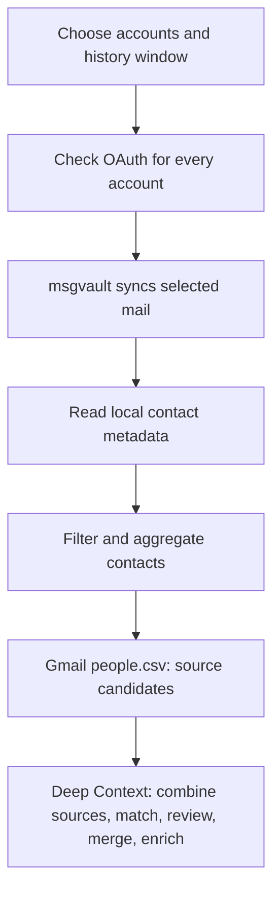

# Gmail import pipeline

`$import-gmail` syncs selected Gmail accounts into msgvault, reads contact
metadata from the local archive, and writes the Gmail source's `people.csv`.
It retains every discovered contact as a candidate for Deep Context. It performs no identity research, profile enrichment, or indexing.
The executable workflow is [import-gmail/SKILL.md](../skills/import-gmail/SKILL.md).

## Flow

```mermaid
flowchart TD
    A[Choose accounts and history window] --> B[Check OAuth for every account]
    B --> C[msgvault syncs selected mail]
    C --> D[Read local contact metadata]
    D --> E[Filter and aggregate contacts]
    E --> G[Gmail people.csv: source candidates]
    G --> I[Deep Context: combine sources, match, review, merge, enrich]
```

## Source access and privacy

Powerset login and runtime keys are not prerequisites for this local import.
Gmail access requires a configured msgvault OAuth app and authorization for each
selected account. A stored account row alone does not prove its token is valid:
`msgvault_setup.py auth-check` checks all selected accounts before syncing any.
Expired credentials require explicit reauthorization. Transient network errors
must not cause tokens to be replaced.

msgvault owns `~/.msgvault/msgvault.db`, including locally archived message
bodies and any downloaded attachments. Never delete that database. Powerpacks
opens it read-only and selects names, addresses, participant roles, message and
conversation IDs, labels, dates, and counts. Import does not select bodies,
subjects, snippets, MIME, or attachment contents.

Sync talks to Gmail. Metadata extraction and importing use local files; they do
not call an LLM, identity provider, Modal, or Powerset upload endpoint.

## Accounts, filtering, and identity

Pass every selected account in one discovery invocation using repeated
`--account-email` flags. Separate invocations replace the shared discovery
manifest, so the next import would see only the last selection.

The skill defaults to a three-year download window. An explicit `--sync-after`
rescans that window with msgvault deduplication; without an explicit window,
the primitive uses the archive's sync state. Contact counts are recomputed from
stored metadata, so the download window is not a second filter on archived
contact counts.

Extraction filters automated addresses, one-way contacts, and configured Gmail
categories. Category filtering depends on the label tables available in the
msgvault archive. Import adds no name, worth, or message-count floor. It combines
metadata for the same email across selected accounts without consulting the
identity directory.

All source candidates use the canonical people schema in
`.powerpacks/network-import/import/gmail/people.csv`. Candidates have a
`candidate:` ID and no `public_identifier`. `stats.people` counts all rows;
`stats.candidates` also counts all source rows. There is no separate
`candidates.csv`. Import does not create enrichment provider/date stamps.

Deep Context handles candidate identity decisions and merging with existing
people. Its legacy migration can still inspect old rows already stamped
`parallel_linkedin_resolution`; new imports do not need to produce that label.

## Files and reruns

| File | Purpose |
| --- | --- |
| `discover/gmail/<account>/people.csv` | Per-account contact metadata |
| `discover/gmail/<account>/linkedin_resolution_queue.csv` | Discovery contact metadata export |
| Per-account `accounts.csv`, `gmail_threads.csv`, `gmail_contacts_aggregated.csv`, `targeted_emails.csv` | Metadata exports retained by the current artifact contract |
| `discover/gmail/manifest.json` and `linkedin_resolution_queue.csv` | Selected accounts and aggregate discovery output |
| `import/gmail/people.csv` and `manifest.json` | Gmail import rows, counts, input/output fingerprints, and status |
| `merged/people.csv` | Local fan-in output across imported sources |

Paths in the table are relative to `.powerpacks/network-import/`.
Stages use fixed paths. Unchanged import inputs return the existing manifest
with `noop: true`; `--force` reruns the local import. Import does not read or write the shared directory. Deep Context combines source
files using the existing local fan-in before collecting context.

## Code map

| File | Role / reads / writes |
| --- | --- |
| [msgvault_setup.py](../primitives/setup/msgvault_setup.py) | Local setup, account status, OAuth health and authorization |
| [gmail/discover.py](../primitives/discover/gmail/discover.py) | Coordinates selected accounts and writes discovery output |
| [gmail/msgvault/sync.py](../primitives/discover/gmail/msgvault/sync.py) | Invokes msgvault for bounded archive sync |
| [gmail/msgvault/store.py](../primitives/discover/gmail/msgvault/store.py) | Read-only SQLite access |
| [gmail/extract_gmail.py](../primitives/discover/gmail/extract_gmail.py) | Writes metadata exports |
| [gmail/importer.py](../primitives/imports/gmail/importer.py) | Materializes the Gmail source and import manifest |
| [imports/status.py](../primitives/imports/status.py) | Reports imported rows and candidate counts |
