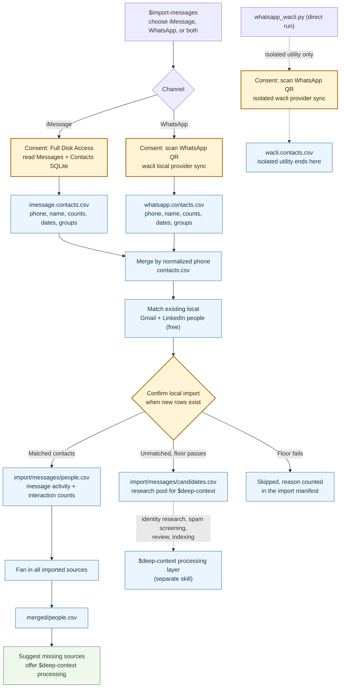

<!--
Changelog:
- 2026-07-23: Retired the isolated WhatsApp wrapper skill. The isolated
  WhatsApp sync/export surface is now the whatsapp_wacli.py primitive run
  directly; $import-messages remains the product flow.
- 2026-07-23: Added the explicit-full WhatsApp depth stage: current-year DMs
  with at most 20 rows receive sequential, paced, target-specific history
  requests with bounded retry/backoff and fixed resumable outputs.
- 2026-07-23: Made WhatsApp sync and depth automatic: empty stores receive an
  account full sync plus a three-year shallow-DM bootstrap; populated stores
  receive an incremental sync plus targeted backfill only for changed shallow
  DMs and unfinished prior targets. One native connection runs paced batches of
  ten and caches whether each chat responds through its phone-number or LID
  identity.
- 2026-07-16: Refocused on contact sync only. Removed the OpenRouter triage,
  research queue, Parallel deep research, LLM-scored review UI, RapidAPI
  enrichment, and Modal index stages from the canonical flow; import is now
  contacts-direct (matched people + a research-candidates pool). Identity
  research, spam screening, and indexing move to the $deep-context processing
  layer.
-->

# iMessage and WhatsApp import pipeline

`$import-messages` adds relationship contacts from iMessage and WhatsApp to the
local network. It extracts metadata, matches contacts against already imported
Gmail/LinkedIn identities for free, imports matched people directly, stages
unmatched contacts that pass a deterministic floor as research candidates,
merges all imported sources, and ends by suggesting missing sources and
offering `$deep-context` processing. It calls no providers and builds no index.

The canonical executable contract is
[`import-messages/SKILL.md`](../skills/import-messages/SKILL.md). For an
isolated wacli sync/export test that stops before identity resolution or
indexing, run the
[`whatsapp_wacli.py`](../primitives/discover/messages/whatsapp_wacli.py)
primitive directly.

## At a glance

- **No body reads:** Powerpacks selects phone/name, message counts, dates, and
  group metadata. It does not select or send message bodies in this workflow;
  wacli necessarily decrypts and persists history returned locally by WhatsApp.
- **Two source paths:** iMessage uses read-only macOS SQLite access; WhatsApp uses
  a local wacli provider store and QR authorization.
- **Identity path:** local Gmail/LinkedIn match only. Matched contacts attach
  their message activity to existing people; unmatched contacts that pass a
  deterministic "worth researching" floor become candidates for `$deep-context`.
  No LLM triage, no paid research, no enrichment.
- **Human control:** one local import confirmation (`--confirm-import`) when
  the run would add new rows. There is no review UI in this flow; spam
  screening and identity decisions happen later in `$deep-context`'s judged,
  user-reviewable flow.
- **Cloud boundary:** none. The canonical flow is entirely local; nothing is
  sent to OpenRouter, OpenAI, Parallel, RapidAPI, or Modal, and index building
  is no longer part of this skill.

## Architecture



"No Powerset upload" means this flow never writes contacts into a Powerset set
and never calls `sync_powerset_candidates`. In the contacts-direct flow all
processing also stays on-device: no OpenRouter, direct OpenAI, Parallel,
RapidAPI, or Modal calls happen during import. Those provider boundaries now
live in the `$deep-context` processing layer.

## Source extraction

### iMessage

The extractor opens `~/Library/Messages/chat.db` and the macOS Contacts database
read-only. Full Disk Access is a user-action gate. It queries:

- phone handles and resolved contact names;
- aggregate message count and most recent date;
- group membership and names;
- Contacts.app phone entries, including rows with no message history under the
  current default.

It does not select body columns. If a product wants strictly messaged handles,
the lower-level extractor supports `--message-handles-only`, but the canonical
orchestrator does not currently expose that choice.

### WhatsApp

wacli is the only supported provider in the harness flow. Canonical discovery
runs the child with `--no-install`; if wacli or the QR renderer is missing, the
skill surfaces the child's exact Homebrew command and waits for approval before
running it and retrying discovery. It opens a QR flow when authentication is
missing, syncs all history by default (`--max-messages 0`), and keeps provider
state under `.powerpacks/messages/wacli/`. An isolated direct `whatsapp_wacli.py`
run can install wacli itself because that invocation is explicit consent.

There is one automatic strategy, with no `sync` or `full` user mode. An empty
wacli store receives an unbounded account sync; a populated store receives an
incremental sync. Every run follows with targeted depth. The first depth pass
selects all DMs with at most 20 stored rows whose actual `MAX(messages.ts)` is
within the last three years. Later runs compare each DM's
`(COUNT(*), MAX(messages.ts))` immediately before and after account sync and
target only recent shallow chats that changed, plus unfinished targets from
the previous pass. The before/after snapshot is more exact than a wall-clock
watermark because newly downloaded messages can carry older timestamps.

One native command keeps a single WhatsApp connection open, excluding the
account owner's self-chat. It sends at most ten conversation requests at once,
waits ten seconds for each response wave, and pauses ten seconds between batches
of ten. If a whole batch receives no protocol responses after identity fallback,
it pauses for one minute before continuing. A conversation can issue up to ten
500-row requests, continuing only while local rows grow and the phone reports
that more history remains. Each DM uses its last successful request identity
(`pn` or `lid`). An unknown chat starts with PN and may fall back to its mapped
LID after a timeout or empty/no-growth response; the winner is saved in the
private wacli database for future incremental syncs. A clean protocol response
with zero older rows completes the chat unless its end marker explicitly says
more history remains. Timeouts and chats that grow but remain shallow stay
pending for the next `$import-messages` run. SQLite counts keep target recovery
separate from unrelated catch-up traffic.

The depth stage is resumable from one current `results.csv`; it does not use a
ledger, run ID, or per-attempt directory. Persisted identifiers are stable
hashes. Names, phones, JIDs, message IDs, commands, and raw output remain out of
the stage artifacts. Its manifest stores one SHA-256 digest of the direct-chat
`(hashed chat, visible count, latest timestamp)` state. If a sync is interrupted
before targets are seeded, or a targeted request also returns rows for another
chat, the next invocation detects the changed digest/count and performs one
catch-up bootstrap.

Powerpacks opens the resulting SQLite database read-only, rejects body-column
identifiers, and selects contact plus aggregate count/date fields. It includes
direct chats and current participants of groups up to the configured size (30 by
default), skipping left or larger groups. Powerpacks never copies body values
into its artifacts, but wacli owns its local provider database, so Powerpacks
cannot claim that provider store contains no bodies.

## Matching and import

1. Per-channel rows merge by normalized phone. Names, channel flags, counts,
   dates, and group metadata are combined.
2. Deterministic phone/email/name matching checks the already imported Gmail
   and LinkedIn people. Matched contacts are written to the Messages source
   `people.csv` and attach their per-channel `interaction_counts` and
   last-interaction dates to the existing person at fan-in.
3. `suggested` matches are never auto-attached. The contact is floor-tested
   like any unmatched row, and the suggestion (person id, name, LinkedIn URL,
   confidence) is recorded in the candidate's `evidence` for the `$deep-context`
   judge.
4. Unmatched contacts must pass a deterministic, pre-LLM "worth researching"
   floor before entering `candidates.csv`:
   - a real 10–15 digit phone number (email handles and short codes are out);
   - a plausibly-real saved name: at least two tokens, enough letters, not the
     phone number itself, and no blocked dating-app tokens (`hinge`, `raya`,
     `tinder`, `bumble`) as a last name;
   - at least `--min-message-count` total DM messages (default 1);
   - group-only contacts below 10 messages are excluded unless
     `--include-group-only` is passed.
5. When the run would add new rows, the importer blocks with an
   `import_confirmation` approval (exit 20) reporting the matched-people and
   new-candidate counts; rerun with `--confirm-import` to proceed.
   `--allow-unmatched` permits a first run with no match manifest (no other
   sources imported yet).
6. No review stop happens here and no research runs: candidates are a research
   pool, never directly searchable. Spam screening and identity decisions
   happen in `$deep-context`'s judged, user-reviewable flow before anything
   becomes searchable.

## Provider and cloud boundaries

The canonical messages import uses **no providers**: no OpenRouter, no OpenAI,
no Parallel, no RapidAPI, no Modal. The only boundaries are local-access
consents plus the import confirmation:

| Boundary | Data sent | Approval state |
| --- | --- | --- |
| Full Disk Access | Grants the terminal read access to local Messages and Contacts SQLite files. | Explicit user action. |
| WhatsApp helper install | Installs wacli or its QR renderer with the exact Homebrew command returned by the child. | Canonical discovery uses `--no-install`; the skill asks before running the command. |
| WhatsApp QR | Links wacli to the user's WhatsApp account and local provider store. | Explicit user action. |
| Local import | Writes matched people and floor-passing candidates to the fixed import stage. | `--confirm-import` after the importer reports the diff counts. |

Identity research (Parallel.ai), spam screening, LLM judging, review, and the
index build belong to the `$deep-context` processing layer and carry their own
approval gates there.

## Artifacts and resume

```text
.powerpacks/messages/
|-- imessage.contacts.csv
|-- whatsapp.contacts.csv
|-- contacts.csv
|-- contacts.csv.match.manifest.json
|-- history-depth/
|   |-- results.csv
|   |-- progress.jsonl
|   `-- manifest.json
`-- wacli/

.powerpacks/network-import/
|-- discover/messages/
|   |-- contacts.csv
|   `-- manifest.json
|-- import/messages/
|   |-- people.csv
|   |-- candidates.csv
|   `-- manifest.json
|-- directory.csv
`-- merged/people.csv
```

Message discovery has one fixed stage directory:
`.powerpacks/network-import/discover/messages/`. Its durable state is only
`contacts.csv` plus `manifest.json`; there is no discovery run ID or step ledger.
Permission and QR failures are recorded as structured user-action status in the
manifest, and rerunning the same command continues at the fixed paths. Each
explicit discovery run refreshes every selected channel export before merging.

Message import is also stateless (contract `messages-contacts-direct-v6`). It
reads the fixed match-annotated `contacts.csv`, splits it into `people.csv`
(matched) and `candidates.csv` (floor-passing unmatched), and writes one
`manifest.json` with the diff, per-reason skip counts, and stats. Unchanged
inputs and flags are a fingerprinted no-op. Reruns delete the retired
review-era artifacts (`people.input.csv`, `enrichment/`) if present; there is
no `research_queue.csv`, `research_review.csv`, or `reconcile-empty` step
anymore. The shared `directory.csv` is updated by replacing only
Messages-owned rows and is deliberately not part of the source manifest's
fingerprints.

Older installs may still contain `.powerpacks/messages/import-run*.json`. Those
files belong to the retired all-in-one orchestrator; the current split discovery
stage neither depends on nor extends them and they can be removed.

## Isolated WhatsApp sync (`whatsapp_wacli.py` direct run)

For a narrow provider readiness/sync test, run the primitive directly:

```bash
uv run --project . python packs/ingestion/primitives/discover/messages/whatsapp_wacli.py status
```

A direct run:

1. checks or installs wacli after consent;
2. opens QR authentication when needed;
3. performs one metadata sync;
4. exports `.powerpacks/messages/wacli.contacts.csv` and a manifest.

It does not run local matching, the contacts-direct import, or source fan-in.
Use `$import-messages` for the full product flow.

## Current product gaps

- The canonical iMessage path includes all Contacts.app phone rows, not only
  people with message history.
- Matching concatenates Gmail and LinkedIn source files directly; duplicated
  people can make a name-only bucket ambiguous.
- The `$deep-context` processing layer (identity research, spam screening,
  review, indexing) lands in a companion PR; until then candidates wait in
  `import/messages/candidates.csv`, and newly matched contacts become
  searchable only after the next index rebuild.

## Workflow split and future seam

PR #114 introduced a combined `$setup` checklist with this same extraction,
matching, research, review, fan-in, Modal indexing, and validation sequence. Its
match-through-materialization chain was sandbox smoke-tested; the PR did not
claim a live end-to-end extraction-through-Modal validation. PR #120
intentionally split the checklist into `$setup` for LinkedIn,
`$import-gmail` for Gmail, and `$import-messages` for iMessage/WhatsApp so users
can opt into each data source independently.

The 2026-07 contact-sync refocus completed that "import now, index later" seam:
`$import-messages` and `$import-gmail` now stop at import + candidates +
fan-in, and identity research, spam screening, review, and index building move
to the `$deep-context` processing layer (companion PR). Each source writes the
shared `.powerpacks/network-import/import/<source>/people.csv` and
`candidates.csv` contracts.

## Implementation map

| Concern | Authority |
| --- | --- |
| Full agent workflow | [`import-messages/SKILL.md`](../skills/import-messages/SKILL.md) |
| Isolated WhatsApp utility | [`messages/whatsapp_wacli.py`](../primitives/discover/messages/whatsapp_wacli.py) (direct run) |
| Message discovery | [`messages.py`](../primitives/discover/messages/discover.py) |
| iMessage extraction | [`messages/extract_imessage.py`](../primitives/discover/messages/extract_imessage.py) |
| wacli extraction | [`messages/whatsapp_wacli.py`](../primitives/discover/messages/whatsapp_wacli.py) |
| Local matching | [`match_local_candidates.py`](../primitives/imports/messages/match_local_candidates.py) |
| Contacts-direct import | [`messages.py`](../primitives/imports/messages/importer.py) |
| Candidates schema | [`candidates_schema.py`](../schemas/candidates_schema.py) |
| Per-source status | [`status.py`](../primitives/imports/status.py) |
| Fan-in | [`index_contacts_pipeline.py`](../../indexing/primitives/index_contacts_pipeline/index_contacts_pipeline.py) |
