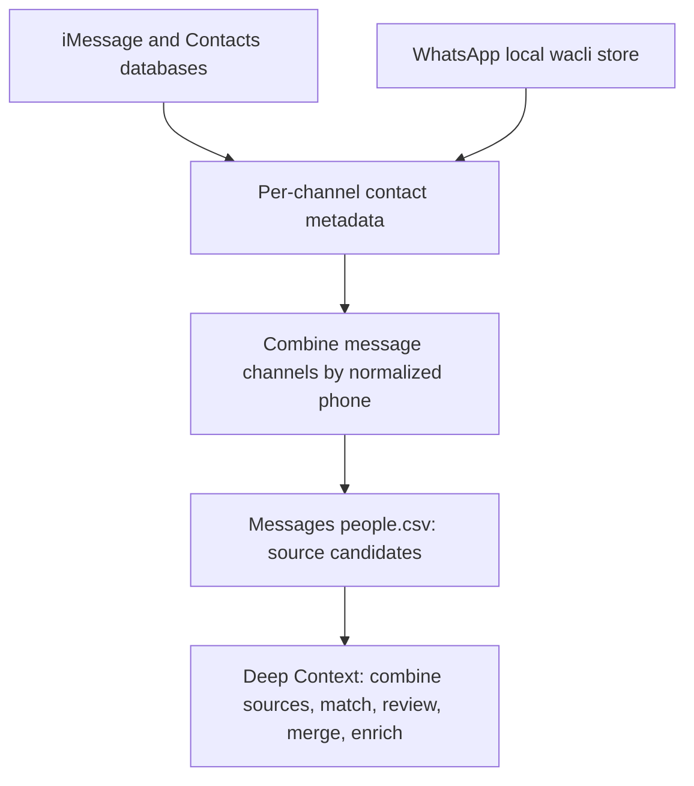

# iMessage and WhatsApp import pipeline

`$import-messages` extracts local contact metadata and writes source candidates
to one `people.csv`. Deep Context owns matching, worth review, person merging,
enrichment, and indexing.
The executable workflow is
[import-messages/SKILL.md](../skills/import-messages/SKILL.md).

## Flow

```mermaid
flowchart TD
    A[iMessage and Contacts databases] --> C[Per-channel contact metadata]
    B[WhatsApp local wacli store] --> C
    C --> D[Combine message channels by normalized phone]
    D --> G[Messages people.csv: source candidates]
    G --> I[Deep Context: combine sources, match, review, merge, enrich]
```

## Source extraction

Powerset login and runtime keys are not prerequisites. Source access is local
Messages/Contacts permission for iMessage and WhatsApp account linking for wacli.
Neither channel sends contact data to an identity provider.

**iMessage:** the extractor opens `~/Library/Messages/chat.db` and the macOS
Contacts databases read-only. It reads contact names, phone handles, message
counts, latest dates, and group metadata. The default includes Contacts.app
phone entries even without message history. The direct extractor's
`--message-handles-only` flag narrows that selection. No message bodies are read.
If extraction fails, it writes a failure manifest and retains the previous
successful contact exports.

**WhatsApp:** the pinned wacli helper installs automatically when a supported
prebuilt binary is needed. A missing or expired link requires a QR scan.
wacli owns its local provider store, including message bodies returned by
WhatsApp; Powerpacks reads contact metadata and aggregate counts/dates only.
The SQL reader rejects body-column queries.

The canonical WhatsApp channel reads its own store. It does not read iMessage
or the previously merged contacts file for names. The following local contact
merge combines names and metadata from the selected message channels by phone.

## WhatsApp history

An empty store gets an account history sync. A populated store gets an
incremental sync. Targeted history then deepens recent direct chats with at
most 20 stored messages: the first pass considers all eligible chats from the
last three years; later passes use changed chats plus unfinished targets.

Counts and latest message timestamps are compared before and after sync because
newly downloaded messages can carry old timestamps. One native connection
requests paced batches of ten chats. Each chat can request up to ten 500-row
chunks while rows grow and the provider reports more history. The account
owner's self-chat is excluded.

WhatsApp can identify a chat by a phone-number identity or a mapped LID. The
helper remembers which worked and tries the alternate when needed. This is
provider protocol handling. Clean responses with no older history finish the
chat; timeouts and unfinished shallow chats remain resumable.

Fixed history-depth outputs contain hashed chat references and aggregate
counters. The existing count/timestamp digest supports recovery after an
interrupted sync. No additional state store is needed.

## Importing

Every contact with a usable phone or email becomes a canonical candidate row.
Unnamed, contact-only, and group-only entries are retained. The importer makes
no identity or worth decisions and needs no people catalog, review file, or
import confirmation.

`.powerpacks/network-import/import/messages/people.csv` uses the canonical
people schema, with `candidate:phone:` or `candidate:email:` IDs and no LinkedIn
identity or enrichment provenance. Source names, identifiers, channels, counts,
and latest dates are retained. Group details remain in the discovery contacts.
Both `stats.people` and `stats.candidates` count the source candidates.

Deep Context runs the existing local fan-in before collection. Confirmed
directory matches attach there; unresolved candidates continue to the existing
person review and merging flow. There is no second import-time matcher.

## Files and reruns

| File | Purpose |
| --- | --- |
| `.powerpacks/messages/imessage.contacts.csv` | iMessage/Contacts metadata export |
| `.powerpacks/messages/whatsapp.contacts.csv` | WhatsApp metadata export |
| `.powerpacks/messages/contacts.csv` | Combined message contact metadata |
| `.powerpacks/messages/wacli/` | Private provider store |
| `.powerpacks/messages/history-depth/` | Resumable results, progress, and manifest |
| `.powerpacks/network-import/discover/messages/manifest.json` | Discovery status and source outputs |
| `.powerpacks/network-import/import/messages/people.csv` and `manifest.json` | Imported source rows, counts, and fingerprints |

Discovery refreshes selected channel exports, then combines them. The importer
uses fixed paths and writes only its own source people and manifest. Unchanged
inputs are a fingerprinted no-op. Import never reads or writes the directory.
Keep the provider databases and paid artifacts intact.

For a local WhatsApp export without syncing, use `extract_whatsapp.py export`.
`extract_whatsapp.py run` performs linking/sync/history work and exports contacts;
it does not run matching, source importing, or fan-in.

## Code map

| File | Role / reads / writes |
| --- | --- |
| [messages/discover.py](../primitives/discover/messages/discover.py) | Coordinates selected channels and writes discovery status |
| [extract_imessage.py](../primitives/discover/messages/extract_imessage.py) | Reads local Apple databases; writes contact metadata |
| [extract_whatsapp.py](../primitives/discover/messages/extract_whatsapp.py) | Coordinates wacli and exports local metadata |
| [whatsapp_wacli.py](../primitives/discover/messages/whatsapp_wacli.py) | Thin client CLI for status/auth/sync commands |
| [wacli/](../primitives/discover/messages/wacli/) | Binary, auth, read-only store, sync and history operations |
| [merge_contacts.py](../primitives/discover/messages/merge_contacts.py) | Combines selected channel metadata |
| [messages/importer.py](../primitives/imports/messages/importer.py) | Selects/imports rows and writes the manifest |
| [message_contacts.py](../schemas/message_contacts.py) | Contact CSV schema and parsed contact values |
