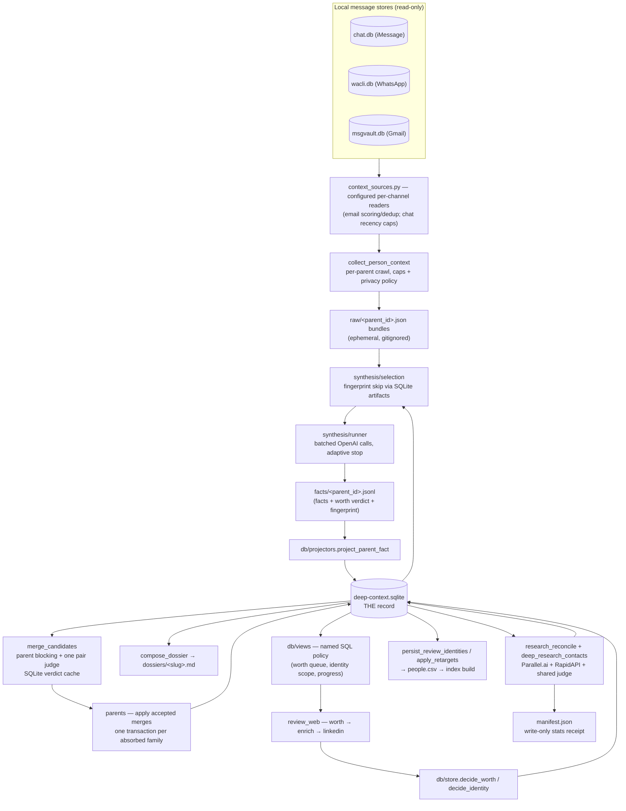
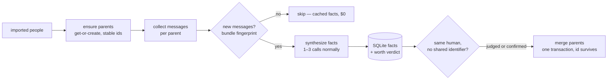
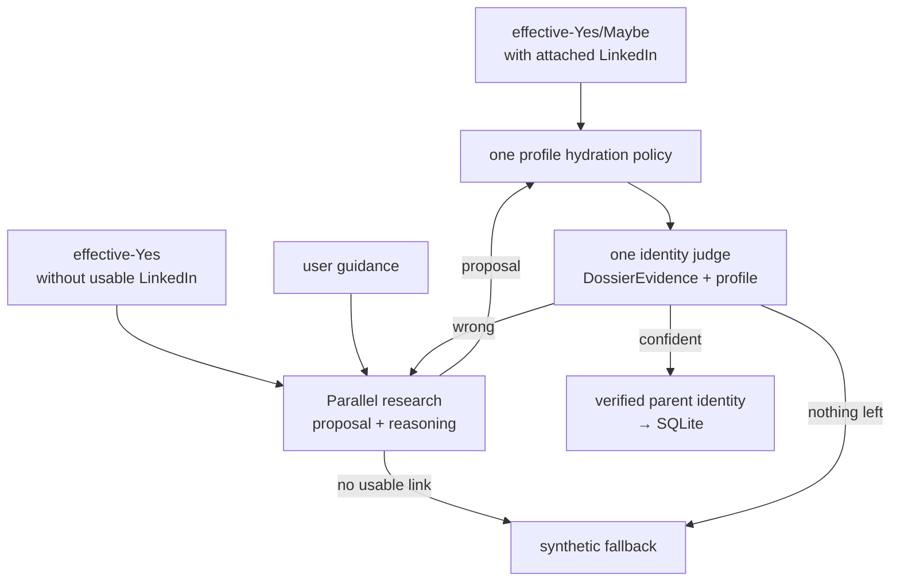

# Deep Context — technical spec

Created: 2026-08-06

Change log:
- 2026-08-06: initial spec (post-SQLite-rewrite architecture; parents
  get-or-create contract landing on `parents-get-or-create`).
- 2026-08-06: contract 3 landed — `parents/assignment.py` owns stable
  get-or-create-or-absorb parent identity; `tools/parent_identity_proof.py`
  replays it against a copied real install.
- 2026-08-06: parent maintenance became incremental; accepted verdicts call
  one `Db.merge_parents` transaction and only changed dossiers are rendered.

This is the engineering spec for the `deep_context` package: the data flow, the
contracts every stage obeys, and a per-file map. The product/UX guide is
[`docs/deep-context-pipeline.md`](../../docs/deep-context-pipeline.md); the
agent contract is the [`deep-context` skill](../../skills/deep-context/SKILL.md).

## Data flow

## Contracts

1. **SQLite is the record.** `deep-context.sqlite` (schema in `db/schema.py`)
   holds canonical people, parents, identifiers, facts, identity candidates,
   decisions, research state, and artifact registry. Every file under
   `.powerpacks/deep-context/` is a cache, receipt, or re-derivable export.
   No stage reads a CSV/JSON baton to make a decision. The one live import
   boundary is `imported_people.py`; old Deep Context artifacts cross only
   `db/legacy.py`, and proof tooling reads only throwaway copies.
2. **`manifest.json` is a write-only receipt** — counts, timing, error text
   for humans and agents to read after a run. Nothing derives control flow
   from it; pending-ness is always computed from named SQLite reads under
   `db/*_views.py`.
3. **Parent identity** (`parents/assignment.py`):
   `parent_id` is opaque and immutable once minted; it is never re-derived
   from membership. Assignment is get-or-create-or-absorb — a cluster whose
   members have 0 existing parents mints one (sha1 of the *founding* child
   set, stored forever); exactly 1 existing parent absorbs the cluster; >1
   merges into a deterministic survivor (newest human decision, otherwise
   most members then lexicographic) by repointing every `parent_id` column in one
   SQLite transaction. No alias tables. Clustering strategy (blocking, pair
   judging) is a separate concern and does not change ids. When parents merge,
   the newest human worth decision is the only worth row carried forward.
4. **Paid work is fingerprint-keyed, never name-keyed.** Synthesis caches on
   `input_evidence_fingerprint` (PINNED serialization: sha256 over the exact
   rendered prompts + system prompt — see `synthesis/prompting.py`); merge
   verdicts cache per unordered parent pair plus evidence fingerprint;
   research results key on their canonical dossier plus optional guidance;
   profile fetches cache per public identifier. A rename or
   re-cluster must never re-bill work whose evidence didn't change.
5. **Spend gates are explicit flags** (`--approve-spend`, `needs_approval` +
   exit 20 before any paid call), not state machines. Every paid stage has a
   free `--dry-run`/estimate path.
6. **Human decisions are machine-untouchable.** Machine writers use
   `project_identity`/machine columns only; `decision_*` and `human_worth*`
   columns are written solely through `db/store.decide_identity` /
   `decide_worth`. Re-runs may overwrite any machine column, never a human one.
7. **Privacy.** Message bodies are read for synthesis (DMs + small iMessage
   groups by standing authorization; WhatsApp groups never). Raw bundles are
   ephemeral and gitignored; dossiers/facts store synthesized claims, not
   verbatim text. Anything committed (tests, fixtures, docs) uses synthetic
   identities only.

## Synthesis, in detail

**Unit of work:** one canonical parent and the union of all child identifiers.

1. **Collect** (`collect_person_context.py` + `context_sources.py` +
   `email_context.py`): construct one source set per run. Gmail uses the shared
   msgvault store with signal scoring, near-duplicate removal, and
   breadth-before-depth thread windowing; iMessage/WhatsApp deliberately use
   recency caps only. Each parent receives the union of its children's
   identifiers and one bounded bundle. True totals are recorded so capping is
   honest. Output: `raw/<parent_id>.json` bundle (messages + identity + policy).
2. **Select** (`synthesis/selection.py`): a parent is pending iff its cached
   facts artifact in SQLite has a different `input_evidence_fingerprint` or an
   older `SYNTHESIS_VERSION` (a hash of the prompt/schema/policy constants —
   bumping any of those re-opens everyone deliberately). Unchanged parents are
   skipped: no tokens spent.
3. **Run** (`synthesis/runner.py`): messages are chunked into batches of
   `--chunk-chars` (default 9,000 chars); each batch is one OpenAI Responses
   call (default model `gpt-5.2`, strict JSON schema
   `synthesis/fact_schema.json`, system prompt carries the owner identity
   block). Batches feed the model newest-first with the prior profile as
   context, and stop adaptively: **confidence ≥ 0.85** (`--target-confidence`),
   **2 saturation rounds** (no new fact keys), or **max 20 batches** — so most
   parents cost 1–3 calls, not 20. Retries: exponential backoff, 6 attempts on
   retryable errors.
4. **Output:** one `facts/<parent_id>.jsonl` record — merged facts (employers,
   title, school, topics, identifiers, relationship_category, `is_owner`),
   the `network_worth` verdict (yes/maybe/no + reason) that seeds the worth
   review, `final_confidence`, usage tokens, stop reason, and the fingerprint.
   `db/projectors.project_parent_fact` projects it into parent-owned `facts` + `artifacts` rows;
   downstream reads SQLite, not the JSONL.
5. **Estimate** (`--dry-run`): tiktoken-counted floor (1 batch/person) and
   ceiling (all batches) cost in USD, no spend.

## Per-file map

| File / package | Role | Reads | Writes |
|---|---|---|---|
| `context_sources.py` | configured per-channel collection over shared store clients | msgvault, chat.db, wacli | — |
| `email_context.py` | Gmail scoring, deduplication, and thread-window policy | msgvault rows | — |
| `collect_person_context.py` | crawl + union bundle per parent | stores via `ContextSources` | `raw/*.json`, receipt |
| `synthesis/` (`selection`, `prompting`, `runner`, `fact_schema.json`) | pending selection, prompt/batching policy, OpenAI runner | SQLite artifacts, `raw/` | `facts/*.jsonl` |
| `synthesize_person_context.py` | thin CLI + estimate for synthesis | — | receipt |
| `cluster_merge_candidates.py`, `merge_candidates/` | same-person blocking + pair judge | facts, SQLite | merge proposals, cached verdicts |
| `build_parents.py`, `parents/` (`assignment`, `rendering`) | apply accepted merges; render only changed parent dossiers | merge decisions, SQLite | SQLite parents/people, `parents/*.md` |
| `tools/parent_identity_proof.py`, `parents/graph.py` | dated migration gate + legacy planning proof | a copied real install | counts-only JSON |
| `compose_dossier.py` | render per-parent dossier markdown | SQLite, facts | `dossiers/*.md` |
| `build_owner.py` | owner profile context | RapidAPI (cached) | `owner.json` |
| `db/` | THE record; `db/legacy.py` + `db/graph.py` are the dated whole-graph migration path | — | `deep-context.sqlite` |
| `deep_research_contacts.py`, `research_reconcile/` | Parallel.ai research + judge + receipts | SQLite queue | research artifacts, receipts, SQLite |
| `reconcile_linkedin.py`, `identity_evidence.py`, `dossier_evidence.py`, `research_result.py` | shared evidence packets, LinkedIn judge, single Parallel-result loader | SQLite, profile cache | SQLite machine verdicts |
| `assemble_synthetic_profile.py` | synthetic identity for no-LinkedIn research | SQLite, research results | synthetic rows, export |
| `prefetch_profiles.py`, `heal_review.py` | profile cache warm and worth-gated stale-link heal | SQLite, RapidAPI cache | SQLite |
| `apply_retargets.py` | paid-free projection of recorded identity decisions | SQLite decisions, cached profile when present | exports |
| `persist_review_identities.py` | approved identities → directory export | SQLite | `directory.csv` |
| `review_web/` | review UI: worth → enrich → linkedin | `db/views` | decisions via `db/store` |
| `common.py` | shared paths, Person model, owner helpers | — | — |
| `check_readiness.py`, `lookup_person.py`, `restart_review.py`, `migrate_sqlite.py`, `validate_dossiers.py` | probes, dossier lookup, human-decision reset, legacy import CLI, completeness scoring | varies | varies |

## Enrichment, in detail

Attached and heal queues exclude effective-No parents in SQL before paid work;
research keeps its stricter effective-Yes gate. Attached, batch-research, heal,
and guided entry points share the same evidence packet, prompt, thresholds,
async judge pool, and strict SQLite settlement. Cleared machine decisions are
recorded and hydrated at judge time; a settlement without the exact judge-input
fingerprint is rejected.

## Paid surfaces

| Surface | Provider | Cache key | Gate |
|---|---|---|---|
| Fact synthesis | OpenAI (`gpt-5.2`) | `input_evidence_fingerprint` + `SYNTHESIS_VERSION` | estimate → run |
| Merge pair judge | OpenAI | judged pair + evidence | deterministic-only mode available |
| Deep research | Parallel.ai | selection fingerprint, per-parent result reuse | `needs_approval` + explicit approve |
| Profile hydration | RapidAPI | public identifier | cache-first everywhere |
| LinkedIn evidence judge | OpenAI | `judgment_fingerprint` | sticky verdicts, re-judge only on new evidence |

## Workflow state

`next_action` is derived only from queue predicates. There is no
`stage_state` or durable spend approval: approval is the budget flag passed to
the launched job, `jobs` is the one async progress/error receipt, and manifests
remain display-only stage statistics.

## Conventions

- Internal records are frozen dataclasses. Dictionaries exist only at true
  provider-input and JSON/HTML-output edges.
- Annotate non-obvious locals, including every optional local.
- Each stage package has one `models.py`; persisted SQLite row types remain in
  `db/models.py`.
- Names describe current behavior, never the mechanism's history.
- Missing values are `None`, never empty-string sentinels.
- Values above a row boundary use `bool`, not `0`/`1` integers.
- ISO timestamp strings use the `IsoTimestamp` alias. SQLite stores them as
  `TEXT` deliberately: their normalized lexicographic and chronological order
  are the same.
