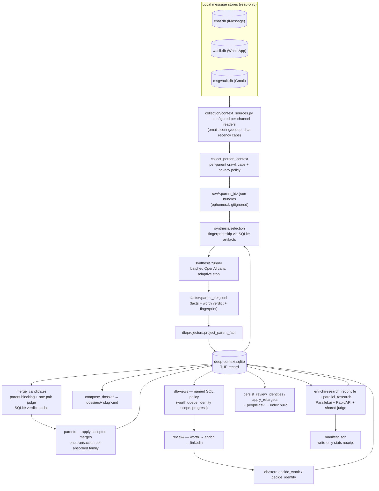
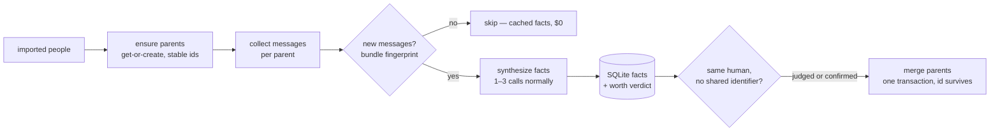
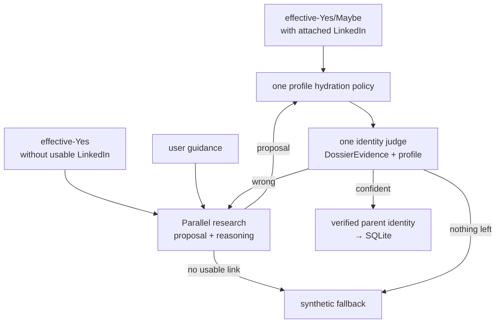

# Deep Context — technical spec

Created: 2026-08-06

Change log:
- 2026-08-06: initial spec (post-SQLite-rewrite architecture; parents
  get-or-create contract landing on `parents-get-or-create`).
- 2026-08-06: contract 3 landed — `ensure_parents/assignment.py` owns stable
  get-or-create-or-absorb parent identity; `tools/parent_identity_proof.py`
  replays it against a copied real install.
- 2026-08-06: parent maintenance became incremental; accepted verdicts call
  one `Db.merge_parents` transaction and only changed dossiers are rendered.
- 2026-08-07: every stage moved under its owning package; public stage receipts
  moved to `manifests/`, and the dated pre-SQLite path moved to `migration/`.

This is the engineering spec for the `deep_context` package: the data flow, the
contracts every stage obeys, and a per-file map. The product/UX guide is
[`docs/deep-context-pipeline.md`](../../docs/deep-context-pipeline.md); the
agent contract is the [`deep-context` skill](../../skills/deep-context/SKILL.md).

## Data flow

## Contracts

1. **SQLite is the record.** `deep-context.sqlite` (schema in `db/schema.py`)
   holds canonical people, parents, identifiers, facts, identity candidates,
   decisions, research state, and artifact registry. Every file under
   `.powerpacks/deep-context/` is a cache, receipt, or re-derivable export.
   No stage reads a CSV/JSON baton to make a decision. The one live import
   boundary is `ensure_parents/imported_people.py`; old Deep Context artifacts
   cross only `migration/legacy.py`, and proof tooling reads only throwaway copies.
2. **`manifest.json` is a write-only receipt** — counts, timing, error text
   for humans and agents to read after a run. Nothing derives control flow
   from it; pending-ness is always computed from named SQLite reads under
   `db/*_views.py`.
3. **Parent identity** (`ensure_parents/assignment.py`):
   `parent_id` is opaque and immutable once minted; it is never re-derived
   from membership. Assignment is get-or-create-or-absorb — a cluster whose
   members have 0 existing parents mints one (sha1 of the *founding* child
   set, stored forever); exactly 1 existing parent absorbs the cluster; >1
   merges into a deterministic survivor (newest human decision, otherwise
   most members then lexicographic) by repointing every `parent_id` column in one
   SQLite transaction. No alias tables. Clustering strategy (blocking, pair
   judging) is a separate concern and does not change ids. When parents merge,
   the newest human worth decision is the only worth row carried forward.
4. **Paid work is fingerprint-keyed, never name-keyed.** Synthesis caches on
   `input_evidence_fingerprint` (PINNED serialization: sha256 over the exact
   rendered prompts + system prompt — see `synthesis/prompting.py`); merge
   verdicts cache per unordered parent pair plus evidence fingerprint;
   research results key on their canonical dossier plus optional guidance;
   profile fetches cache per public identifier. A rename or
   re-cluster must never re-bill work whose evidence didn't change.
5. **Spend gates are explicit flags** (`--approve-spend`, `needs_approval` +
   exit 20 before any paid call), not state machines. Every paid stage has a
   free `--dry-run`/estimate path.
6. **Human decisions are machine-untouchable.** Machine writers use
   `project_identity`/machine columns only; `decision_*` and `human_worth*`
   columns are written solely through `db/store.decide_identity` /
   `decide_worth`. Re-runs may overwrite any machine column, never a human one.
7. **Privacy.** Message bodies are read for synthesis (DMs + small iMessage
   groups by standing authorization; WhatsApp groups never). Raw bundles are
   ephemeral and gitignored; dossiers/facts store synthesized claims, not
   verbatim text. Anything committed (tests, fixtures, docs) uses synthetic
   identities only.

## Synthesis, in detail

**Unit of work:** one canonical parent and the union of all child identifiers.

1. **Collect** (`collection/collect_person_context.py` +
   `collection/context_sources.py` + `collection/email_context.py`): construct
   one source set per run. Gmail uses the shared
   msgvault store with signal scoring, near-duplicate removal, and
   breadth-before-depth thread windowing; iMessage/WhatsApp deliberately use
   recency caps only. Each parent receives the union of its children's
   identifiers and one bounded bundle. True totals are recorded so capping is
   honest. Output: `raw/<parent_id>.json` bundle (messages + identity).
2. **Select** (`synthesis/selection.py`): a parent is pending iff its cached
   facts artifact in SQLite has a different `input_evidence_fingerprint` or an
   older `SYNTHESIS_VERSION` (a hash of the prompt/schema/policy constants —
   bumping any of those re-opens everyone deliberately). Unchanged parents are
   skipped: no tokens spent.
3. **Run** (`synthesis/runner.py`): messages are chunked into batches of
   `--chunk-chars` (default 9,000 chars, capped at `--max-batches` = 20 per
   person). Every batch renders independently (no prior-profile context) and
   runs concurrently — one OpenAI Responses call each (default model
   `gpt-5.2`, strict JSON schema `synthesis/fact_schema.json`, system prompt
   carries the owner identity block); on the real install 86.5% of people have
   exactly one batch, so most parents cost 1 call. A person with more than one
   batch merges their independent results deterministically
   (`synthesis/facts.py:merge_fact_records`) — no extra LLM call. Retries:
   exponential backoff, 6 attempts on retryable errors. A person whose every
   batch errors or comes back empty is not persisted, so it retries on the
   next run instead of caching as done.
4. **Output:** one `facts/<parent_id>.jsonl` record — merged facts (employers,
   title, school, topics, identifiers, relationship_category, `is_owner`),
   the `network_worth` verdict (yes/maybe/no + reason) that seeds the worth
   review, `final_confidence`, usage tokens, stop reason, and the fingerprint.
   `db/projectors.project_parent_fact` projects it into parent-owned `facts` + `artifacts` rows;
   downstream reads SQLite, not the JSONL.
5. **Estimate** (`--dry-run`): tiktoken-counted cost in USD, no spend — every
   person's batches all run (no adaptive stop), so there's one real number,
   not a floor/ceiling range.

## Per-file map

| File / package | Role | Reads | Writes |
|---|---|---|---|
| `ensure_parents/` | stage-1 imported-person projection and stable parent assignment | merged `people.csv`, SQLite | SQLite parents/people |
| `collection/` | source readiness, per-channel reads, collection planning, bundle assembly | msgvault, chat.db, wacli, SQLite | `raw/*.json`, receipt |
| `synthesis/` | synthesis selection/runner plus dossier composition and validation | SQLite artifacts, `raw/` | `facts/*.jsonl`, dossiers, receipts |
| `merge_candidates/` | same-person blocking/judging, accepted merge application, parent rendering | facts, SQLite | merge proposals, cached verdicts, `parents/*.md` |
| `enrich/` | Parallel research, profile hydration, identity judging, synthetic fallback | SQLite queue, provider caches | research artifacts, SQLite verdicts |
| `review/` | worth and identity web review, guided retarget, heal and restart | named SQLite views | human decisions via `db/store` |
| `realize/` | paid-free projection of approved identity decisions | SQLite, cached profiles | network exports |
| `migration/` | dated pre-SQLite import and whole-graph proof path | legacy artifacts | canonical SQLite bootstrap |
| `shared/` | common paths, readiness, owner, lookup, and dossier evidence | varies | owner cache where applicable |
| `manifests/` | one public receipt model per stage contract | — | serialized stage receipts |
| `db/` | THE record, typed reads, policy views, and transactional writes | — | `deep-context.sqlite` |
| `prompts/`, `tools/` | pinned prompt assets and migration proof tooling | varies | counts-only proof JSON |

## Enrichment, in detail

Attached and heal queues exclude effective-No parents in SQL before paid work;
research keeps its stricter effective-Yes gate. Attached, batch-research, heal,
and guided entry points share the same evidence packet, prompt, thresholds,
async judge pool, and strict SQLite settlement. Cleared machine decisions are
recorded and hydrated at judge time; a settlement without the exact judge-input
fingerprint is rejected.

## Paid surfaces

| Surface | Provider | Cache key | Gate |
|---|---|---|---|
| Fact synthesis | OpenAI (`gpt-5.2`) | `input_evidence_fingerprint` + `SYNTHESIS_VERSION` | estimate → run |
| Merge pair judge | OpenAI | judged pair + evidence | dry-run estimate before cluster |
| Deep research | Parallel.ai | selection fingerprint, per-parent result reuse | `needs_approval` + explicit approve |
| Profile hydration | RapidAPI | public identifier | cache-first everywhere |
| LinkedIn evidence judge | OpenAI | `judgment_fingerprint` | sticky verdicts, re-judge only on new evidence |

## Workflow state

`next_action` is derived only from queue predicates. There is no
`stage_state` or durable spend approval: approval is the budget flag passed to
the launched job, `jobs` is the one async progress/error receipt, and manifests
remain display-only stage statistics.

## Conventions

- Internal records are frozen dataclasses. Dictionaries exist only at true
  provider-input and JSON/HTML-output edges.
- Annotate non-obvious locals, including every optional local.
- Each stage package has one `models.py`; persisted SQLite row types remain in
  `db/models.py`.
- Names describe current behavior, never the mechanism's history.
- Missing values are `None`, never empty-string sentinels.
- Values above a row boundary use `bool`, not `0`/`1` integers.
- ISO timestamp strings use the `IsoTimestamp` alias. SQLite stores them as
  `TEXT` deliberately: their normalized lexicographic and chronological order
  are the same.
