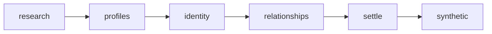

# Enrichment

Created: 2026-10-01

Change log:
- 2026-10-01: the agent CLI previews and runs the shared resumable chain.
- 2026-10-01: created with the settlement step.

`bin/deep-context enrich --dry-run` reports net-new lookups, Parallel cost,
profile fetches, judgment estimates, and one `estimated_usd` total without
writes. The agent runs `enrich` without asking when the total is at most $100,
and asks first only above $100. The research budget is the Parallel estimate.
Human worth and link decisions remain unchanged.

The CLI and review server use the same ordered sequence. Each step reuses
completed SQLite and provider artifacts. Re-running after a failure starts the
sequence again; running after a later import processes pending work. There are no separate checkpoints.

One enrichment `manifest.json` reports `status: running` and the step's `phase`
before each step, `completed` with non-fatal errors at the end, or `failed`
with the phase and error when a step raises.

Settlement detaches machine-accepted lookup LinkedIns whose profiles are
missing, errored, or have neither experience nor education. Own `linkedin_csv`
connections and human link decisions are kept.

Without human worth, effective Yes/Maybe becomes machine No when there is no
real LinkedIn profile and fewer than `REVIEW_MESSAGE_BAR = 25` messages across
non-owner imported people. Own connections and LinkedIns a human kept count as
real; other profiles must be accepted, present, and have experience or education. The reason is
`not enough to know who this is: no LinkedIn profile and N messages`.

An own LinkedIn connection with no human worth decision is always worth Yes
(`own LinkedIn connection`), whatever the worth pass said.

This decision uses existing parent machine-worth columns, below human worth
and above facts. JEV owns fact worth and cannot overwrite the parent decision.
Reruns lift this No when a real profile arrives or messages reach 25. Worth-No
parents leave LinkedIn review and later research and receive no synthetic
profile.

| File / package | Role | Reads | Writes |
| --- | --- | --- | --- |
| `cli.py` | Thin argparse entry for plan or run | SQLite, enrichment plan | JSON stdout, progress stderr |
| `estimate.py` | Shared CLI/review cost calculation | SQLite queues and provider reuse | Read-only plan |
| `enrichment_pipeline.py` | Runs named steps directly or through the server wrapper | SQLite queues and projected work | One enrichment receipt |
| `settle_policy.py` | Typed empty-profile and worth decisions | Accepted profile, worth, message count | Decisions only |
| `settle.py` | Applies local settlement | SQLite people, identities, profiles, worth | Machine identity settlement and parent machine worth |
| `research_reconcile/` | Research selection and identity judging | SQLite queues, dossier evidence | Research and identity results |
| `parallel_research/` | Approved provider submissions and result projection | Research requests and saved results | Research artifacts and SQLite results |
| `profiles/` | Cache-first profile fetching and projection | Identity URLs and profile cache | SQLite profile artifacts |
| `identity_reconcile/` | Identity and relationship review | Dossiers and profile evidence | Machine identity decisions |
| `synthetic/` | Assembles eligible no-LinkedIn research profiles | SQLite worth and research | SQLite synthetic profiles |
