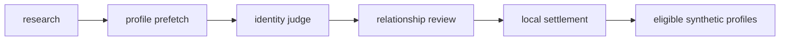

# Enrichment

Created: 2026-10-01

Change log:
- 2026-10-01: created with the settlement step.

The approved chain reuses completed provider work, then settles identity and
worth before synthetic assembly. Human worth and link decisions remain
unchanged.

Settlement detaches machine-accepted lookup LinkedIns whose profiles are
missing, errored, or have neither experience nor education. Own `linkedin_csv`
connections and human link decisions are kept.

Without human worth, effective Yes/Maybe becomes machine No when there is no
real LinkedIn profile and fewer than `REVIEW_MESSAGE_BAR = 25` messages across
non-owner imported people. Own connections and LinkedIns a human kept count as
real; other profiles must be accepted, present, and have experience or education. The reason is
`not enough to know who this is: no LinkedIn profile and N messages`.

This decision uses existing parent machine-worth columns, below human worth
and above facts. JEV owns fact worth and cannot overwrite the parent decision.
Reruns lift this No when a real profile arrives or messages reach 25. Worth-No
parents leave LinkedIn review and later research and receive no synthetic
profile.

| File / package | Role | Reads | Writes |
| --- | --- | --- | --- |
| `enrichment_pipeline.py` | Runs the approved chain and exposes progress | SQLite queues and projected work | Display receipt |
| `settle_policy.py` | Typed empty-profile and worth decisions | Accepted profile, worth, message count | Decisions only |
| `settle.py` | Applies local settlement | SQLite people, identities, profiles, worth | Machine identity settlement and parent machine worth |
| `research_reconcile/` | Research selection and identity judging | SQLite queues, dossier evidence | Research and identity results |
| `parallel_research/` | Approved provider submissions and result projection | Research requests and saved results | Research artifacts and SQLite results |
| `profiles/` | Cache-first profile fetching and projection | Identity URLs and profile cache | SQLite profile artifacts |
| `identity_reconcile/` | Identity and relationship review | Dossiers and profile evidence | Machine identity decisions |
| `synthetic/` | Assembles eligible no-LinkedIn research profiles | SQLite worth and research | SQLite synthetic profiles |
