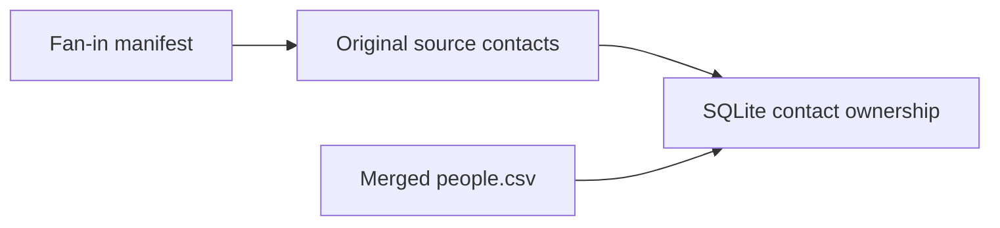

# deep_context/ensure_parents — `deep_ensure_parents`

`deep_ensure_parents` (`EnsureParents`) get-or-creates stable parents for every
row in the current fan-in export and preserves its original source contacts.
It is the one declared node in this package.

Pipeline-wide context: [deep-context-pipeline.md](../../../docs/deep-context-pipeline.md)
and the [deep-context skill](../../../skills/deep-context/SKILL.md).

| node | reads | writes | manifest |
|---|---|---|---|
| `deep_ensure_parents` | `merged/people.csv`, its fan-in manifest, recorded source CSVs, `deep-context/deep-context.sqlite` | SQLite parents, people, identifiers, sources | none of its own (`manifest = ""`) |

The declared inputs are `external`: the graph does not model the SQLite projection, and
`merged/people.csv` is the fan-in import's output.

| file | role | reads | writes |
|---|---|---|---|
| `ensure_parents.py` | stage entry | imported and source people | SQLite projections |
| `imported_people.py` | source roster projection | imported people | SQLite roster and existing families |
| `source_people.py` | original contact ownership | actual source paths in fan-in manifest | SQLite people, identifiers, sources |
| `assignment.py` | stable parent election | existing parents and people | none |
| `models.py` | parent election values | typed arguments | none |

The fan-in manifest records which source CSVs were actually read. A recorded
source that has disappeared fails visibly. Legacy/custom exports without that
manifest retain the aggregate-only projection; original source ownership cannot
be recovered from superseded IDs alone. Source files are never rewritten.
Recovered source identifiers and channels replace copied aggregate metadata.
Known derived aggregate rows lose source ownership; their paid artifacts remain.
Realization keeps individual contacts in SQLite and unions only the exported
parent row. Reading that export reuses SQLite source rows rather than importing
the union as a contact.

Shared mailboxes do not enter: a row whose every email is a role address
(`is_shared_mailbox`: `ir@`, `billing@`, `customer.service@`), with no phone and
no LinkedIn connection, is dropped by `read_imported_people`. People already in
the store are carried forward, so this does not remove earlier imports; the
merge survey leaves those out on its own.

## Manifest / status

No `manifest.json`; `EnsureParentsManifest` (`source`, `people_projected`) is
returned to the caller with status `completed`. The Node template's `not_ready`
/ `failed` apply to its declared inputs.

## Control

Free.

## Invariant

Parent identity is get-or-create-or-absorb: `parent_id` is opaque and immutable
once minted and is never re-derived from membership — clustering strategy does
not change ids.
