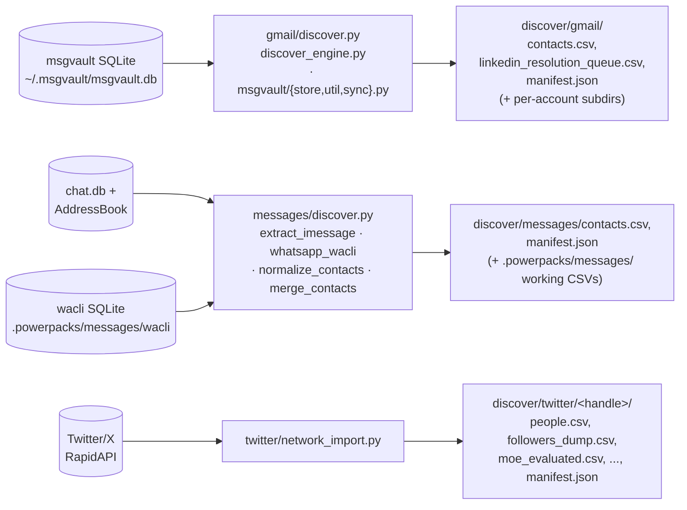

# discover

Created: 2026-07-23
Changelog:
- 2026-07-23 (audit): `twitter/network_import.py` migrated from the resumable
  ledger step-machine (`run/approve/continue/status` + `network_import.ledger.json`)
  to a manifest-only single-`run` orchestrator (`TwitterDiscovery`): resume is by
  artifact freshness, spend consent is the single `--approve-spend` flag, and the
  stage records one typed `manifest.json`. Step logic unchanged.
- 2026-07-23 (oop): `gmail/discover.py`'s monolithic 4-phase `discover()` became a
  `GmailAccountChannel` per selected account (owns its fixed per-account output
  dir, msgvault sync, and `discover_engine` child spawn) plus a `GmailDiscovery`
  store (owns the output dir, channel loop, merge plan, and manifest) — the #320
  `messages/discover.py` channel+store pattern. `discover()` is now a thin
  wrapper; behavior, fixed output paths, and typed manifest payloads unchanged.
- 2026-07-23 (audit): `gmail/msgvault_store.py` split into the `gmail/msgvault/`
  package (`store.py` = `MsgvaultStore` + SQL, `util.py` = pure helpers) and
  `gmail/sync.py` moved to `gmail/msgvault/sync.py`; the person-vs-role
  classifiers moved to `common/contact_fields.py`. Table/diagram updated.
- 2026-07-23 (audit batch 23): rewrote as a gist-style functionality map —
  mermaid data-flow + a per-file role/reads/writes table.
- 2026-07-23 (audit batch 21): `directory.py` moved out to the import stage at
  `imports/directory.py` — it managed the cross-source `directory.csv` aggregate
  and had zero discover-stage consumers (only import-stage modules and tests use
  it).
- 2026-07-23 (audit batch 20A): package renamed `discover_contacts_pipeline` →
  `discover`. The LinkedIn convert+enrich engine (`network_import.py`) moved out
  to the import stage at `imports/linkedin/`, so `linkedin/` is no longer part of
  this package.
- 2026-07-23 (audit batch 17): gmail/network_import.py retired — split into
  gmail/msgvault_store.py (msgvault reader/aggregation) and
  gmail/discover_engine.py (per-account artifact-emission CLI); the one-person
  seed cluster and its gmail-one ledger died with it.
- 2026-07-23 (audit batch 16): deleted the legacy monolithic orchestrator
  (`discover.py`) and the `$discover-contacts` skill; the LinkedIn discovery CLI
  (`linkedin/discover.py`) and its models went with them.

Per-source discovery primitives for local network ingestion. There is no
generic orchestrator: each import skill invokes its source's primitives directly
by file path. Every source reads a **local raw store** (or a source API) and
writes stable, overwrite-in-place artifacts under
`.powerpacks/network-import/discover/<source>/`.

## Data flow

## Files

| File | Role | Reads | Writes |
| --- | --- | --- | --- |
| [`gmail/discover.py`](gmail/discover.py) | CLI entry: `discover()` resolves config then runs `GmailDiscovery` (store) over one `GmailAccountChannel` per account — per-account msgvault sync → spawn engine → read fixed queue → merge plan → typed manifest | `accounts.json`, `discovery.config.json`, prior `discover/gmail/manifest.json` | `discover/gmail/contacts.csv`, `linkedin_resolution_queue.csv`, `manifest.json` |
| [`gmail/util.py`](gmail/util.py) | Tolerant parsers, row merge (`_merge_rows`), incremental merge plan (`gmail_discovery_merge_plan`), column/const defs | prior `manifest.json` (applied-inputs state) | — (pure helpers) |
| [`gmail/models.py`](gmail/models.py) | Typed stage-manifest dataclasses — the only payload shapes `discover.py` may emit | — | — |
| [`gmail/msgvault/store.py`](gmail/msgvault/store.py) | Canonical read-only access layer over the msgvault archive (`MsgvaultStore` + its SQL): metadata aggregation for discovery, plus body reads reserved for deep-context/logbook | msgvault SQLite (read-only) | — |
| [`gmail/msgvault/util.py`](gmail/msgvault/util.py) | Pure msgvault/email helpers (no connection): address parsing, name/domain classification, label normalization, canonical-message identity, `DEFAULT_MSGVAULT_DB` | — | — (pure helpers) |
| [`gmail/msgvault/sync.py`](gmail/msgvault/sync.py) | msgvault sync + incremental resume: `infer_msgvault_sync_after` (last-sync marker) and `sync_msgvault_account` (`msgvault sync-full --after ...`) | msgvault SQLite (read-only, for the resume marker) | msgvault DB (via `msgvault` subprocess); progress → stderr |
| [`gmail/discover_engine.py`](gmail/discover_engine.py) | Per-account CLI child spawned by `discover.py`: msgvault metadata aggregation → local artifacts; also `apply-resolutions` for the import chain | msgvault SQLite (via `msgvault/store`) | `discover/gmail/<account>/`: `accounts.csv`, `gmail_threads.csv`, `gmail_contacts_aggregated.csv`, `targeted_emails.csv`, `linkedin_resolution_queue.csv`, `people.csv`, `manifest.json` |
| [`messages/discover.py`](messages/discover.py) | CLI entry: iMessage/WhatsApp extract → normalize → merge → typed manifest; stops at the first blocked/failed child | `accounts.json` (linked channels) | `discover/messages/contacts.csv`, `manifest.json` (orchestrates children that write `.powerpacks/messages/`) |
| [`messages/extract_imessage.py`](messages/extract_imessage.py) | Stdlib iMessage extractor (Full Disk Access gated); metadata only, never selects body columns | `~/Library/Messages/chat.db` + AddressBook SQLite (read-only) | `.powerpacks/messages/imessage.contacts.csv`, `.raw.jsonl`, `.manifest.json` |
| [`messages/whatsapp_wacli.py`](messages/whatsapp_wacli.py) | Isolated WhatsApp metadata via `openclaw/wacli` (download pinned binary, auth, sync, export); metadata only | wacli SQLite under `.powerpacks/messages/wacli` (read-only) | `.powerpacks/messages/whatsapp.contacts.csv`, `.raw.jsonl`, manifest, progress jsonl, QR page |
| [`messages/normalize_contacts.py`](messages/normalize_contacts.py) | Normalize a per-channel contacts CSV → canonical messages JSONL | per-channel `*.contacts.csv` | `*.contacts.normalized.jsonl` + manifest |
| [`messages/merge_contacts.py`](messages/merge_contacts.py) | Union N per-channel CSVs by canonical phone → one `contacts.csv` | `imessage.contacts.csv`, `whatsapp.contacts.csv` | `.powerpacks/messages/contacts.csv` + manifest |
| [`messages/models.py`](messages/models.py) | Typed messages-discovery manifest dataclasses | — | — |
| [`twitter/network_import.py`](twitter/network_import.py) | Manifest-only Twitter/X orchestrator (`TwitterDiscovery`): one idempotent `run` — crawl → score → MOE triage → free LinkedIn pre-resolve → RapidAPI validate → format people; spend steps gated by `--approve-spend`, resume by artifact freshness | Twitter/X + LinkedIn RapidAPI, OpenAI | `discover/twitter/<handle>/`: `followers_dump.csv`, `candidates.csv`, `moe_evaluated.csv`, `linkedin_*.csv`, `people.csv`, `raw_*` dirs, `manifest.json` |
| [`common.py`](common.py) | Discover-stage helpers: LF CSV IO, accounts/channel state, `source_slug`. The typed stage-manifest contract (`StagePayload`/`write_stage_manifest`) now lives in `primitives/common/manifests.py` and is re-exported here; the spend-gate contract lives in `primitives/common/gates.py` | — | — (used by callers) |
| [`discovery_config.py`](discovery_config.py) + [`discovery.config.json`](discovery.config.json) | Static discovery input/output contract; resolves per-source output paths and the accounts path | `discovery.config.json` | — |

## Stage contract

**Free, metadata-only, no enrichment.** Discovery reads local raw stores (or a
source API for Twitter) and emits contact metadata plus a fingerprinted
`manifest.json` per source. No message bodies are read on the discovery path
(`msgvault/store` body reads exist only for the deep-context/logbook stages, not
here). Each source overwrites a fixed output directory, so reruns are idempotent
by path — no run ids, no ledgers. Fan-in merge, LinkedIn resolution, and the
local search index are downstream (`imports/`, `deep_context/`, `indexing/`),
not this package.
