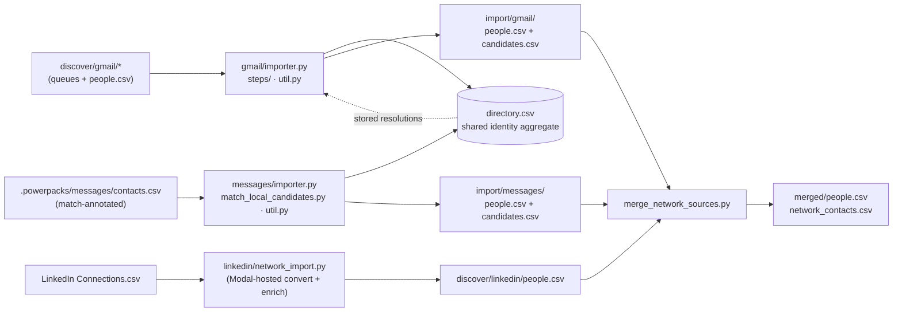

# imports

Created: 2026-07-23
Changelog:
- 2026-07-24 (fan-in subtraction): the fan-in stopped pretending to do identity
  work. `possible_duplicates_review.csv` and the similar-name reviewer behind it
  are deleted (nothing read the file; `deep_context/cluster_merge_candidates.py`
  does the job properly), along with `--name-threshold` and the `review_pairs`
  manifest key. `merge_network_sources.py`'s row is rewritten to say what it
  actually is: the fan-in **and** the deep-context `realize` step.
- 2026-07-23 (steps split): the file-loaded `gmail/import_steps.py` and its
  `imports/common.py` loader are gone. `GmailImport` now lives in
  `gmail/importer.py` (THE entry) and its two step functions in `gmail/steps/`
  (`directory.py` = directory apply + commit transforms; `enrich.py` = apply
  STORED resolutions + materialize); `importer.py` imports and runs them via a
  normal package import. Contracts/output paths unchanged.
- 2026-07-24: Gmail import step state is transient; its durable contract is
  output files plus `manifest.json` only.
- 2026-07-23 (oop): gmail + messages importers went OO — a `GmailImport`
  orchestrator (owning the import dir + step chain + manifest) and
  a `MessagesImport` orchestrator (owning the gate sequence + manifest; pure
  helpers stay module-level). Contracts/output paths unchanged.
- 2026-07-23 (audit batch 23): created — gist-style functionality map (mermaid
  data-flow + a per-file role/reads/writes table) for the import stage.

Per-source import primitives. Each source's importer consumes the discover-stage
artifacts, applies the shared identity `directory.csv` (and any STORED
resolutions), and materializes a stable per-source `people.csv` plus a
`candidates.csv` research lane. `merge_network_sources.py` fans the per-source
`people.csv` files into one canonical `merged/people.csv`. Skills invoke each
importer directly by file path; there is no orchestrator.

## Data flow

## Files

| File | Role | Reads | Writes |
| --- | --- | --- | --- |
| [`gmail/importer.py`](gmail/importer.py) | THE gmail import entry (directory-only): the `GmailImport` orchestrator — transient state, the two-step chain, the matched-people/candidates split, the quality gate, the manifest — plus the CLI surface (`run` / `--force`) + `GMAIL_IMPORT_CONTRACT`; imports and runs the `steps/` functions | `discover/gmail/*` queues, `directory.csv`, per-account `people.csv` | `import/gmail/people.csv`, `candidates.csv`, `manifest.json`, per-account resolved CSVs, `directory.csv`, merged Gmail `people.gmail.csv` |
| [`gmail/steps/directory.py`](gmail/steps/directory.py) | Directory-apply step (`run_gmail_directory`) + the pure directory-commit/queue transforms it and the enrich step call (split resolved/unresolved/cached-negative, `commit_*_to_directory`, `combine_gmail_resolution_records`, record normalizers) | `discover/gmail/*` queues, `directory.csv` | per-account split CSVs, `directory.csv` |
| [`gmail/steps/enrich.py`](gmail/steps/enrich.py) | Apply-and-enrich step (`run_gmail_apply_and_enrich`): apply STORED resolutions per account via an in-process `GmailExtractor().apply_resolutions(...)` (gmail/extract_gmail.py), then materialize the merged Gmail people.csv (no Parallel/RapidAPI) | per-account `people.csv`, combined resolutions | per-account resolved CSVs, merged Gmail `people.gmail.csv` |
| [`gmail/util.py`](gmail/util.py) | Discovery-artifact collection (`gmail_artifacts_from_discovery`) + candidate writing (`write_gmail_candidates`) + shared `emit_progress` / `artifact_dir_from_state` | `discover/gmail/manifest.json` + per-account artifacts | `import/gmail/candidates.csv` |
| [`messages/importer.py`](messages/importer.py) | Import entry (contacts-direct): the `MessagesImport` orchestrator routes `matched`→people, `unmatched`/`suggested`→candidates (floor-tested), replaces the directory messages slice, `--confirm-import` approval gate; the pure row/floor/diff helpers stay module-level | `.powerpacks/messages/contacts.csv` (match-annotated), match manifest | `import/messages/people.csv`, `candidates.csv`, `directory.csv`, `manifest.json` |
| [`messages/util.py`](messages/util.py) | Messages-vertical tolerant field parsers + the deterministic "worth researching" candidate floor + interaction/last-message readers | — | — (pure helpers) |
| [`messages/match_local_candidates.py`](messages/match_local_candidates.py) | Tiered local matcher (phone/email exact → exact name → same-last-name prefix/fuzzy tiers); annotates `contacts.csv` in place with `match_status`; tier-0 gated by `research_review.csv` approvals (no live producer — see importer Known gap) | `contacts.csv`, `merged/people.csv` (+ optional `--candidates`), `research_review.csv` | `contacts.csv` (in place), `*.match.manifest.json` |
| [`linkedin/network_import.py`](linkedin/network_import.py) | LinkedIn `Connections.csv` import — the Modal-hosted convert+enrich exception; parses to the people schema, delegates enrichment to `enrich/enrich_people.py` (RapidAPI) | `Connections.csv`, profile cache, RapidAPI | `discover/linkedin/people.csv` + enrichment artifacts + ledger |
| [`directory.py`](directory.py) | Cross-source `directory.csv` contract: `DIRECTORY_COLUMNS`, email/phone/name identity keys, row merge, `people.csv → directory` commit | `directory.csv`, per-source `people.csv` | `directory.csv` (via callers) |
| [`merge_network_sources.py`](merge_network_sources.py) | Fan-in **and** the deep-context `realize` step: merge/dedupe explicit per-source `people.csv` by LinkedIn public id, then re-apply the durable override decisions (`apply_overrides`: worth drops, detach/retarget, verification). No person identity resolution — that is `deep_context/cluster_merge_candidates.py` | `--input` per-source `people.csv` files, `overrides/{review,retarget-people,consolidate-people,synthetic-people}.csv` | `merged/people.csv`, `network_contacts.csv`, `network_contact_sources.csv`, `network_companies.csv`, `merge_manifest.json` |
| [`common.py`](common.py) | Shared import helpers: import-manifest read/write (`write_manifest`, `import_manifest_current`), `copy_people_csv`, directory source-account quality checks | import manifests | `import/<source>/manifest.json` |
| [`status.py`](status.py) | Read-only per-source import status: discovery ran? import completed/current? row counts + merged summary — the presence check skills use to suggest missing sources | discover + import manifests, `merged/people.csv` | — (always exits 0) |

## Stage contract

**Free and deterministic.** Imports apply the already-computed identity
`directory.csv` and any STORED resolutions; they do **no** new LinkedIn
resolution, LLM, or paid enrichment — all of that lives in `deep_context/`. The
one exception is `linkedin/network_import.py`, which runs Connections.csv
convert+enrich inside the Modal sandbox for `$setup`. Each importer overwrites a
fixed `import/<source>/` directory (idempotent by path, no run ids or ledgers),
and `directory.csv` is the reusable
cross-source checkpoint — never fingerprinted as a per-source output.
