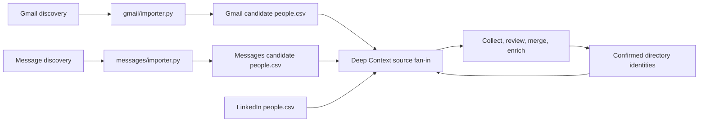

# Source imports

Gmail and Messages import source metadata into candidate `people.csv` files and
write one `manifest.json` each. They make no identity or worth decisions and call
no enrichment providers. LinkedIn setup has its separate Modal workflow.

Deep Context combines source files with `merge_people.py` before collection.
That existing fan-in reuses confirmed directory identities; Deep Context owns
uncertain identity decisions, worth review, person merging, and enrichment.

```mermaid
flowchart LR
    GD[Gmail discovery] --> GI[gmail/importer.py]
    MD[Message discovery] --> MI[messages/importer.py]
    GI --> GP[Gmail candidate people.csv]
    MI --> MP[Messages candidate people.csv]
    GP --> F[Deep Context source fan-in]
    MP --> F
    LI[LinkedIn people.csv] --> F
    D[Confirmed directory identities] --> F
    F --> DC[Collect, review, merge, enrich]
    DC --> D
```

| File | Role | Reads | Writes |
| --- | --- | --- | --- |
| [gmail/importer.py](gmail/importer.py) | Combine metadata by email | Selected account people files and discovery manifest | Gmail candidates and manifest |
| [messages/importer.py](messages/importer.py) | Import source candidates | Discovery contacts | Messages candidates and manifest |
| [messages/util.py](messages/util.py) | Map typed contacts to people | Parsed source values | Returned people rows |
| [linkedin/network_import.py](linkedin/network_import.py) | LinkedIn setup import | Connections/profile files | LinkedIn metadata and manifest |
| [directory.py](directory.py) | Shared directory schema and persistence | Confirmed identities | Directory rows through callers |
| [merge_people.py](merge_people.py) | Combine source people | Source files and confirmed directory | Merged people and manifest |
| [common.py](common.py) | Import manifests and fingerprints | Inputs and outputs | Import manifest |
| [status.py](status.py) | Read-only source status | Discovery/import artifacts | CLI JSON |

All source candidates use canonical `candidate:` IDs and the people schema.
Import manifests record counts, status, and fingerprints; unchanged inputs return
the existing manifest. Gmail and Messages never read or modify `directory.csv`.
There is no separate candidates file or import-time review file.
