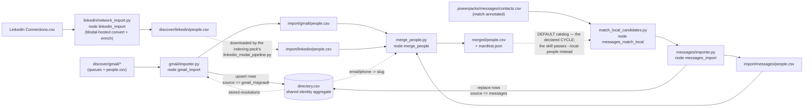

# imports

Created: 2026-07-23
Changelog:
- 2026-07-26 (per-node IO stats): `status.py`'s DISCOVER half reads the stage
  manifest only — presence from `status`, the contact count from the declared
  output's `fingerprints.output_artifacts[...].rows` — so the two staged
  `contacts.csv` files it used to open are deleted. Its IMPORT half still counts
  `import/<source>/people.csv` and `candidates.csv`, deliberately: the LinkedIn one
  is `external=True` (the Modal indexing pipeline writes it, which is also why
  `merge_people` declares it external) and `candidates.csv` has had no writer since
  #339, so no node could record a count for either. `match_local_candidates.py`'s
  `--local-people` lost its `merged/people.csv` default (the graph's 18-of-23
  cycle) and is a caller argument now, like `--candidates`; `--no-local-people`
  went with it. `gmail_artifacts_from_discovery` takes the discovery paths from
  gmail discovery's declarations instead of asking the manifest where they are.
- 2026-07-25 (declared contract, import stage): the other four import primitives
  became `pipeline/contract.py:Node`s — `gmail_import`, `messages_import`,
  `messages_match_local`, and `linkedin_import`. Each DECLARES its inputs and
  outputs as `Artifact`s instead of only opening paths, and `run()` is the
  inherited template. Three things the declarations forced into the open:
  - `directory.csv` has two writers that own ROW SLICES, not columns (gmail
    upserts `source == 'gmail_msgvault'`, messages deletes and rewrites
    `source == 'messages'`). `owns_columns` cannot express that, so `Artifact`
    gained a declaration-only `owns_rows_where`.
  - `contacts.csv` has two writers that own disjoint COLUMNS: discovery's 11
    metadata values, the matcher's 7 `match_*` values, and `skip` owned by
    neither (it is a user mark — see `messages/util.py:USER_OWNED_COLUMNS`).
  - `match_local_candidates.py`'s default catalog was `merged/people.csv`, i.e.
    the merge's own output, so the declared graph had a CYCLE. Declared honestly
    rather than hidden; the default is gone now (see the entry above), which is
    what the canonical `$import-messages` flow already did by passing
    `--local-people`.
  DELETED with this pass: `linkedin/network_import.py`'s
  `connections_for_enrichment.csv` (one writer, zero readers repo-wide).
  `import/<source>/candidates.csv` was already gone in #339 — both importers only
  unlink leftovers now.
- 2026-07-25 (declared contract): `merge_people.py`'s `PeopleMerge` is a
  `pipeline/contract.py:Node` — it declares its four inputs and its one output as
  `Artifact`s (row model `PeopleRow`), `execute()` does the merge, and the
  inherited `run()` template validates the declarations and writes the now-typed
  `MergePeopleManifest` (the raw manifest dict is gone). `merged/people.csv` is
  byte-identical and every stat keeps its name and value.
- 2026-07-24 (merge rewrite): `merge_network_sources.py` is DELETED and replaced
  by `merge_people.py`, written from the contract instead of inherited. The merge
  now does exactly one thing — combine the per-source `people.csv`, stamp
  LinkedIn from `directory.csv`, group by identity, write one output. Gone with
  the old file: override application (`overrides/*.csv` are no longer read by any
  merge), the `merged/people.csv` self-feed, the reader-less bookkeeping columns
  (`merge_key`, `merge_confidence`, `merge_sources`, `merged_row_count`,
  `needs_review`, `linkedin_verified*`), and the reader-less side outputs
  (`network_contacts.csv`, `network_contact_sources.csv`,
  `network_companies.csv`, `people_harmonic_all.merged.csv`). The index fan-in
  calls the class in-process instead of shelling a child python.
- 2026-07-24 (fan-in subtraction): the fan-in stopped pretending to do identity
  work. `possible_duplicates_review.csv` and the similar-name reviewer behind it
  are deleted (nothing read the file; `deep_context/cluster_merge_candidates.py`
  does the job properly), along with `--name-threshold` and the `review_pairs`
  manifest key.
- 2026-07-23 (steps split): the file-loaded `gmail/import_steps.py` and its
  `imports/common.py` loader are gone. `GmailImport` now lives in
  `gmail/importer.py` (THE entry) and its two step functions in `gmail/steps/`
  (`directory.py` = directory apply + commit transforms; `enrich.py` = apply
  STORED resolutions + materialize); `importer.py` imports and runs them via a
  normal package import. Contracts/output paths unchanged.
- 2026-07-24: Gmail import step state is transient; its durable contract is
  output files plus `manifest.json` only.
- 2026-07-23 (oop): gmail + messages importers went OO — a `GmailImport`
  orchestrator (owning the import dir + step chain + manifest) and
  a `MessagesImport` orchestrator (owning the gate sequence + manifest; pure
  helpers stay module-level). Contracts/output paths unchanged.
- 2026-07-23 (audit batch 23): created — gist-style functionality map (mermaid
  data-flow + a per-file role/reads/writes table) for the import stage.

Per-source import primitives. Each source's importer consumes the discover-stage
artifacts, applies the shared identity `directory.csv` (and any STORED
resolutions), and materializes a stable per-source `people.csv` plus a
`candidates.csv` research lane. `merge_people.py` fans the per-source
`people.csv` files into one canonical `merged/people.csv` — that file plus its
`manifest.json` is the merge's entire output. Skills invoke each importer
directly by file path; there is no orchestrator.

## Data flow

```mermaid
flowchart LR
  GDISC["discover/gmail/*<br/>(queues + people.csv)"]
  MDISC[".powerpacks/messages/contacts.csv<br/>(match-annotated)"]
  LCSV["LinkedIn Connections.csv"]

  GDISC --> GIMP["gmail/importer.py<br/>node gmail_import"]
  MDISC --> MATCH["match_local_candidates.py<br/>node messages_match_local"]
  MATCH --> MIMP["messages/importer.py<br/>node messages_import"]
  LCSV --> LIMP["linkedin/network_import.py<br/>node linkedin_import<br/>(Modal-hosted convert + enrich)"]

  DIR[("directory.csv<br/>shared identity aggregate")]
  GIMP -- "upsert rows<br/>source == gmail_msgvault" --> DIR
  MIMP -- "replace rows<br/>source == messages" --> DIR
  DIR -. stored resolutions .-> GIMP

  GIMP --> GP["import/gmail/people.csv"]
  MIMP --> MP["import/messages/people.csv"]
  LIMP --> LP["discover/linkedin/people.csv"]
  LP -. "downloaded by the indexing pack's<br/>linkedin_modal_pipeline.py" .-> LI["import/linkedin/people.csv"]

  GP --> FANIN["merge_people.py<br/>node merge_people"]
  MP --> FANIN
  LI --> FANIN
  DIR -. email/phone -> slug .-> FANIN
  FANIN --> MERGED["merged/people.csv<br/>+ manifest.json"]
  MERGED -. "DEFAULT catalog — the declared CYCLE;<br/>the skill passes --local-people instead" .-> MATCH
```

The two files that leave this stage are `merged/people.csv` and `directory.csv`.
Everything else above is an intermediate that exists only because a downstream
node reads it.

## Files

| File | Role | Reads | Writes |
| --- | --- | --- | --- |
| [`gmail/importer.py`](gmail/importer.py) | THE gmail import entry (directory-only) and the `gmail_import` **node**: the `GmailImport` orchestrator — declarations, transient state, the two-step chain, the matched-people/candidates split, the quality gate, the manifest — plus the CLI surface (`run` / `--force`) + `GMAIL_IMPORT_CONTRACT`; imports and runs the `steps/` functions | `discover/gmail/*` queues, `discover/gmail/manifest.json`, `directory.csv`, per-account `people.csv` | **declared:** `import/gmail/people.csv`, `directory.csv` (gmail row slice). **intermediate:** `manifest.json`, per-account split/resolved CSVs, merged Gmail `people.gmail.csv` |
| [`gmail/steps/directory.py`](gmail/steps/directory.py) | Directory-apply step (`run_gmail_directory`) + the pure directory-commit/queue transforms it and the enrich step call (split resolved/unresolved/cached-negative, `commit_*_to_directory`, `combine_gmail_resolution_records`, record normalizers) | `discover/gmail/*` queues, `directory.csv` | per-account split CSVs, `directory.csv` |
| [`gmail/steps/enrich.py`](gmail/steps/enrich.py) | Apply-and-enrich step (`run_gmail_apply_and_enrich`): apply STORED resolutions per account via an in-process `GmailExtractor().apply_resolutions(...)` (gmail/extract_gmail.py), then materialize the merged Gmail people.csv (no Parallel/RapidAPI) | per-account `people.csv`, combined resolutions | per-account resolved CSVs, merged Gmail `people.gmail.csv` |
| [`gmail/util.py`](gmail/util.py) | Discovery-artifact collection (`gmail_artifacts_from_discovery`), unresolved-contact materialization (`gmail_candidate_people`), the two named readers for the artifact keys that differ by one letter (`gmail_account_queue_records` / `gmail_stage_queue_csv`), plus shared `GMAIL_IMPORT_PREFIX` / `artifact_dir_from_state` | `discover/gmail/manifest.json` + per-account artifacts | — (pure helpers) |
| [`messages/importer.py`](messages/importer.py) | Import entry (contacts-direct) and the `messages_import` **node**: the `MessagesImport` orchestrator routes `matched`→people, floor-passing `unmatched`/`suggested`→the candidate pool inside people.csv, replaces the directory messages slice, `--confirm-import` approval gate; the pure row/floor/diff helpers stay module-level | `.powerpacks/messages/contacts.csv` (match-annotated), match manifest | **declared:** `import/messages/people.csv`, `directory.csv` (messages row slice). **intermediate:** `manifest.json` |
| [`messages/util.py`](messages/util.py) | The `contacts.csv` row model + column ownership (`MessageContactRow`, `MATCH_ANNOTATION_COLUMNS`, `USER_OWNED_COLUMNS`), messages-vertical tolerant field parsers, the deterministic "worth researching" candidate floor, interaction/last-message readers | — | — (pure helpers) |
| [`messages/match_local_candidates.py`](messages/match_local_candidates.py) | The `messages_match_local` **node**: tiered local matcher (phone/email exact → exact name → same-last-name prefix/fuzzy tiers) that annotates `contacts.csv` in place, owning only the 7 `match_*` columns; tier-0 gated by `research_review.csv` approvals (no live producer — see importer Known gap) | `contacts.csv`, `research_review.csv` (+ the caller-named `--local-people` / `--candidates` catalogs, which have no default path and are not declared) | **declared:** `contacts.csv` (annotate, 7 columns), `*.match.manifest.json` |
| [`linkedin/network_import.py`](linkedin/network_import.py) | The `linkedin_import` **node**: LinkedIn `Connections.csv` import, the Modal-hosted convert+enrich exception; parses to the people schema, delegates enrichment to `enrich/enrich_people.py` (RapidAPI) | `Connections.csv`, profile cache, RapidAPI | **declared:** `discover/linkedin/people.csv`, `manifest.json`. **intermediate:** `source_people.csv` + enrichment artifacts |
| [`directory.py`](directory.py) | Cross-source `directory.csv` contract: `DIRECTORY_COLUMNS`, `DirectoryRow`, the `GMAIL_/MESSAGES_DIRECTORY_ROWS` slice predicates, email/phone/name identity keys, row merge, `people.csv → directory` commit | `directory.csv`, per-source `people.csv` | `directory.csv` (via callers) |
| [`merge_people.py`](merge_people.py) | Fan-in **and** the deep-context `realize` step: `PeopleMerge` stamps LinkedIn from `directory.csv`, keys each row `linkedin:<slug>` or `candidate:<contact key>`, groups by that key and unions the fields. Applies NO human decisions and drops nobody with a keyable identity. No person identity resolution — that is `deep_context/cluster_merge_candidates.py` | `--input` per-source `people.csv` files (default: linkedin, gmail, messages — in precedence order), `directory.csv` | `merged/people.csv`, `merged/manifest.json` |
| [`common.py`](common.py) | Shared import helpers: import-manifest read/write (`write_manifest`, `import_manifest_current`), `copy_people_csv`, directory source-account quality checks | import manifests | `import/<source>/manifest.json` |
| [`status.py`](status.py) | Read-only per-source import status: discovery ran? import completed/current? row counts + merged summary — the presence check skills use to suggest missing sources | discover + import manifests, `merged/people.csv` | — (always exits 0) |

## Stage contract

**Free and deterministic.** Imports apply the already-computed identity
`directory.csv` and any STORED resolutions; they do **no** new LinkedIn
resolution, LLM, or paid enrichment — all of that lives in `deep_context/`. The
one exception is `linkedin/network_import.py`, which runs Connections.csv
convert+enrich inside the Modal sandbox for `$setup`. Each importer overwrites a
fixed `import/<source>/` directory (idempotent by path, no run ids or ledgers),
and `directory.csv` is the reusable
cross-source checkpoint — never fingerprinted as a per-source output.

**The merge decides identity, not membership.** A merged person either carries a
`public_identifier` or does not; that column is the only distinction, and the
`candidate:<contact key>` id namespace is stable so paid per-person artifacts
keep addressing the same human while no slug exists. Human decisions
(`overrides/review.csv` worth marks and exclusions, `retarget-people.csv`,
`consolidate-people.csv`, `synthetic-people.csv`) are NOT applied here — as of
2026-07-24 no consumer applies them to `merged/people.csv`.
