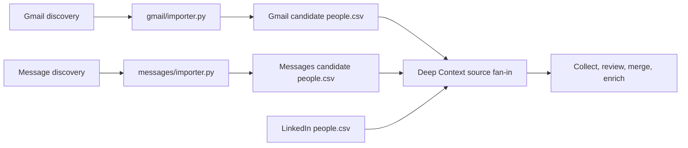

# Source imports

Gmail and Messages import source metadata into candidate `people.csv` files and
write one `manifest.json` each. They make no identity or worth decisions and call
no enrichment providers. LinkedIn setup has its separate Modal workflow.

Deep Context combines source files with `merge_people.py` before collection.
The fan-in retains source IDs and combines repeated IDs. Deep Context owns
identity decisions, worth review, person merging, and enrichment.

```mermaid
flowchart LR
    GD[Gmail discovery] --> GI[gmail/importer.py]
    MD[Message discovery] --> MI[messages/importer.py]
    GI --> GP[Gmail candidate people.csv]
    MI --> MP[Messages candidate people.csv]
    GP --> F[Deep Context source fan-in]
    MP --> F
    LI[LinkedIn people.csv] --> F
    F --> DC[Collect, review, merge, enrich]
```

| File | Role | Reads | Writes |
| --- | --- | --- | --- |
| [gmail/importer.py](gmail/importer.py) | Combine metadata by email | Selected account people files and discovery manifest | Gmail candidates and manifest |
| [messages/importer.py](messages/importer.py) | Import source candidates | Discovery contacts | Messages candidates and manifest |
| [messages/util.py](messages/util.py) | Map typed contacts to people | Parsed source values | Returned people rows |
| [linkedin/network_import.py](linkedin/network_import.py) | LinkedIn setup import | Connections/profile files | LinkedIn metadata and manifest |
| [directory.py](directory.py) | Metadata unions | Source metadata | Returned values |
| [merge_people.py](merge_people.py) | Combine source people | Source people files | Merged people and manifest |
| [common.py](common.py) | Import manifests and fingerprints | Inputs and outputs | Import manifest |
| [status.py](status.py) | Read-only source status | Discovery/import artifacts | CLI JSON |

All source candidates use canonical `candidate:` IDs and the people schema.
Import manifests record counts, status, and fingerprints; unchanged inputs return
the existing manifest. Gmail and Messages never read or modify `directory.csv`.
There is no separate candidates file or import-time review file.

## Declared nodes

`pipeline/graph.py` declares four import nodes: `gmail_import`
([gmail/README.md](gmail/README.md)), `messages_import`
([messages/README.md](messages/README.md)), `linkedin_import`
([linkedin/README.md](linkedin/README.md)), and `merge_people` (this directory).

| node | reads | writes | manifest |
|---|---|---|---|
| `merge_people` | `import/linkedin/people.csv` (external, optional), `import/gmail/people.csv` (optional), `import/messages/people.csv` (optional) | `merged/people.csv` (full_rewrite) | `merged/manifest.json` (`MergePeopleManifest`) |

`merge_people` (`PeopleMerge`, `merge_people.py`) is free and applies no human
decisions. Status: `completed`, or `not_ready`
(`reason: missing_import_people_csvs`, when no source file was readable), plus
the template `failed`. Existing source IDs are retained; rows without an ID use
a primary email/phone candidate key. Rows without either are counted unkeyable.
Directory matches and cached profiles are not inputs.
