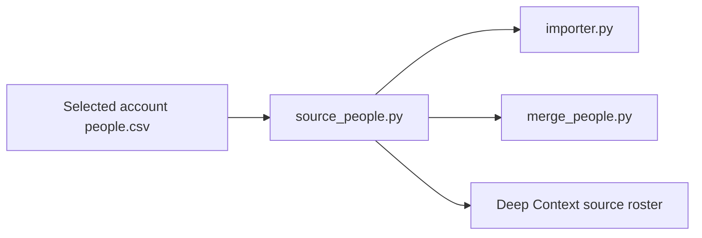

# imports/gmail — `gmail_import`

`gmail_import` (`GmailImport`, `importer.py`) combines the discovered Gmail
accounts' metadata into candidate `people.csv` rows by email. It is the one
declared node in this package.

Declared in `packs/ingestion/primitives/pipeline/graph.py`; contract in
`packs/ingestion/primitives/pipeline/contract.py`. Stage overview:
[imports/README.md](../README.md).

| node | reads | writes | manifest |
|---|---|---|---|
| `gmail_import` | `discover/gmail/{account_slug}/people.csv` (optional), `discover/gmail/manifest.json` (optional) | `import/gmail/people.csv` (full_rewrite, optional) | none of its own (`manifest = ""`); the imports writer writes `import/gmail/manifest.json` |

Paths are under `.powerpacks/network-import/`.

`source_people.py` reads the source-owned account fields for the importer,
fan-in and Deep Context. The import manifest retains the selected account paths;
the readers use those rows and the account manifests' conflicting original names
so another account or channel cannot replace a withheld name. Observation counts
include those original names; contact and email counts remain separate.

| file | role | reads | writes |
|---|---|---|---|
| `importer.py` | Import selected contacts | Discovery manifest and account rows | Import people and manifest |
| `source_people.py` | Read original source observations | Account CSVs, account manifests and current import manifest | None |

## Manifest / status

`GmailImportManifest` status `completed` when accounts were read, `skipped`
(`reason: no Gmail discovery accounts`) when the discovery manifest lists none.
Unchanged inputs return the existing manifest (`noop`), unless `--force`.
The Node template's `not_ready` / `failed` apply to its optional inputs.

## Control

Free.

## Invariant

It writes source candidates only — it never reads or modifies `directory.csv`
or any identity decision. The manifest is owned by the imports writer
(`imports/common.write_manifest`), not by the Node template; the declared
`manifest = ""` is what keeps the template from overwriting it.
