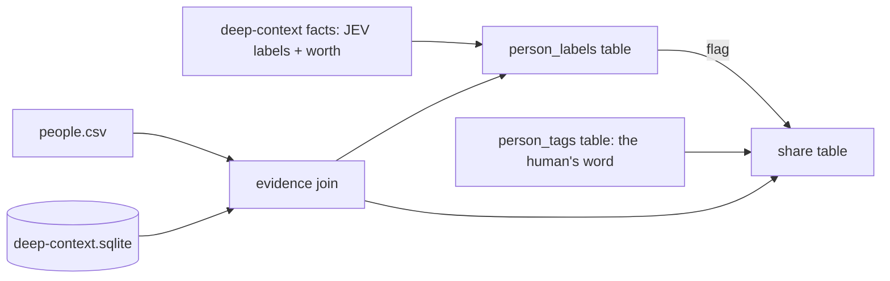

# Share

Worth produces machine labels during deep-context synthesis. Share projects those
saved labels, applies human tags, and builds the upload list. It makes no paid
calls and writes no file state: the labels, the share list, and the human tags
are tables in the canonical store.



```bash
bin/deep-context share
```

`share` is the stage's one node (`share_list.ShareList`, declared in
`pipeline/graph.py`): one pass writes `person_labels` and `share` for every merged
person, so the list can never be partial. A context-bearing person without saved
JEV labels must complete deep-context synthesis first. LinkedIn-only people get
deterministic labels. Human tags are never changed by machine labeling.

Its `manifest.json` (`ShareManifest`) is `completed` when both tables are
rewritten, or `failed` when a context-bearing person has no saved labels (the
write is skipped).

| declared reads | declared writes | manifest |
|---|---|---|
| `merged/people.csv` (external), `deep-context/deep-context.sqlite` (external) | — (tables `person_labels` + `share`; no file outputs) | `share/manifest.json` (`ShareManifest`) |

| File | Role | Reads | Writes |
|---|---|---|---|
| `questions.py` | 34 label questions JEV answers during synthesis | — | — |
| `models.py` | Typed evidence, label cells, the manifest path | — | — |
| `evidence.py` | Join the roster to parents, facts, dossiers, bundles | people.csv, `deep-context.sqlite` | — |
| `labels.py` | Label reduction, confirm flags, sharing policy | saved labels | — |
| `store.py` | `TagStore`: the human's tags | `person_tags` | `person_tags` |
| `share_list.py` | The `share` node: labels + share list in one pass | evidence, `person_tags` | `person_labels`, `share`, manifest.json |
| `share.py` | CLI | command arguments | command results |

## Tables

One row per person in each; the node rewrites both in one transaction.

- `person_labels` — `person_id, public_identifier, full_name, worth, flag,
  labels_json, updated_at`. `labels_json` is the flat export (`label_payload`),
  deterministic cells alone for a LinkedIn-only person.
- `share` — `person_id, public_identifier, share, reason, labels, source,
  updated_at`. `labels` is the active labels joined with `|`; `source` is `human`
  when a human's tag decided the row, `machine` otherwise.
- `person_tags` — the human's table. No node writes it; `TagStore` does, from
  the review UI.

## The share decision

Share follows worth. `share.share` is `yes | no | confirm`; the first rule
that fires names the row's `reason`:

| # | Rule | share | reason |
|---|---|---|---|
| 1 | the owner | no | `owner` |
| 2 | human tag `private` | no | `human_private` |
| 3 | human tag `share` | yes | `human_share` |
| 4 | worth `no` | no | `worth_no` |
| 5 | worth not `yes` (maybe / unjudged) | no | `worth_maybe` |
| 6 | a confirm flag fired | confirm | the flag name |
| 7 | otherwise | yes | `worth_yes` |

The JEV labels decide nothing. `labels.confirm_flag` raises at most one flag —
`family`, `romantic_partner`, `minor`, `sensitive_context`, `sensitive_provider`,
`automated_sender`, `stranger`, in that order — and a flag on a worth-yes person
only asks a human. A `confirm` row leaves the laptop no more than a `no` does
until the human answers; the UI records that answer as a tag through `TagStore`,
and the manifest's `confirm` count is what it surfaces. Tags follow merged
identities through `superseded_person_ids`.
