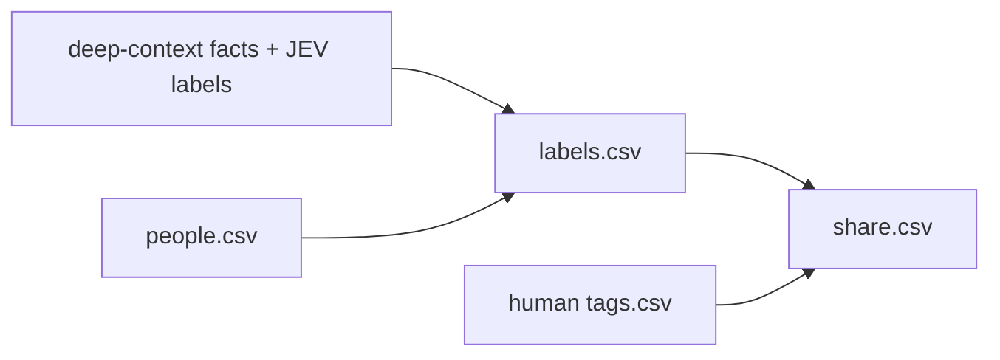

# Share

Worth produces machine labels during deep-context synthesis. Share exports those
saved labels, applies human tags, and builds the upload list. It makes no paid calls.



```bash
bin/deep-context share
bin/deep-context tag --name "Jordan Bravo" +private
```

`share` is the stage's one node (`share_list.ShareList`, declared in
`pipeline/graph.py`): one pass writes labels.csv and share.csv for every merged
person, so the list can never be partial. A context-bearing person without saved
JEV labels must complete deep-context synthesis first. LinkedIn-only people get
deterministic labels. Human tags are never changed by machine labeling.

| File | Role | Reads | Writes |
|---|---|---|---|
| `questions.py` | 34 label questions used by JEV worth | — | — |
| `models.py` | Typed evidence and CSV layout | — | — |
| `evidence.py` | Join people to facts and context | people, facts, index, raw metadata | — |
| `labels.py` | Label reduction and sharing policy | saved labels | — |
| `tags.py` | Human overrides | tags.csv | tags.csv |
| `share_list.py` | The `share` node: labels + share list in one pass | evidence, tags.csv | labels.csv, share.csv, manifest.json |
| `share.py` | CLI | command arguments | command results |
| `csv_cells.py` | CSV boundary coercion | cells | — |

The share list covers every merged person. Owner, private suggestions, automated
senders and strangers are excluded unless an allowed human override applies.
Tags follow merged identities through `superseded_person_ids`.
