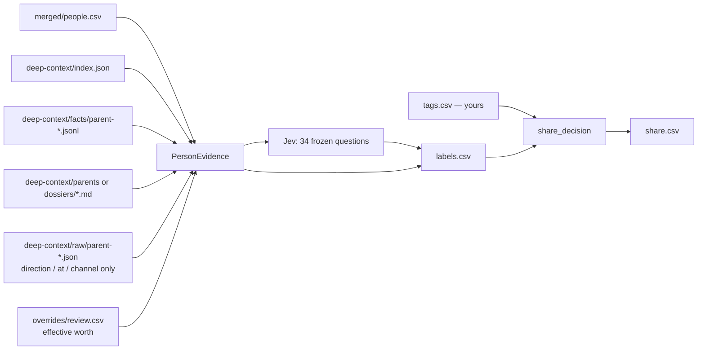

# share — who leaves the laptop

Created: 2026-09-24

Change log:
- 2026-09-24: created with the stage (labels, tags, share list).

Per-person share decisions for the merged network. `label` asks a frozen Jev
question set about each person's synthesized context and writes ~40 machine
labels; `tag` records your override; `share` derives the list the upload half
reads. Message bodies are never read — only synthesized dossiers, facts, and
body-free channel counts.



## Commands

```bash
bin/deep-context label --estimate            # count + $ , writes nothing
bin/deep-context label --approve-spend       # writes labels.csv (~$0.08 for 766 people)
bin/deep-context tag --name "Jordan Bravo" +private -is_family --note "family"
bin/deep-context share                       # rebuild share.csv
bin/deep-context share status               # manifest counts
```

`label` without `--approve-spend` emits the `needs_approval` payload and exits
20. The Jev cache is keyed by the sha256 of the whole request, so re-running
after a change re-asks only what changed and costs nothing for the rest.

## Files

| file | role | reads | writes |
| --- | --- | --- | --- |
| `models.py` | stage paths, the frozen dataclasses, the three CSV column tuples | `questions.py` label names | — |
| `questions.py` | the frozen question set (6 choice, 1 score, 27 noul) + the request envelope | — | — |
| `labels.py` | all policy: cadence/direction bands, answer reduction, the private table, `share_decision` | — | — |
| `tags.py` | `tags.csv` read/upsert, the tag vocabulary, name/phone/email lookup | `tags.csv`, `deep-context/index.json` | `tags.csv` |
| `share.py` | evidence join + the three CLI runs | `merged/people.csv`, `deep-context/{index.json,facts,parents,dossiers,raw,owner.json}`, `overrides/review.csv`, `labels.csv`, `tags.csv` | `labels.csv`, `share.csv`, `manifest.json`, `jev/<sha>.json` |

## Contracts worth knowing

- **Facts, raw bundles and parent dossiers are keyed by PARENT id**, not by the
  `people.csv` id. `review_store.parent_ids_by_person(index.json)` is the one map
  between them; `effective_network_worth` is therefore asked with
  `parent_worth_key(parent_id)`, which is where the human worth mark lives.
- **A person with no facts AND no dossier is `linkedin_only`**: deterministic
  labels only, no Jev call, every Jev column empty (absent, not zero).
- **`private` is the only blocking label.** A machine `private_suggested` blocks
  upload until a human tags `share`; the owner's own row is never shared.
- **Tags follow a merge.** A tag keyed by a member of `superseded_person_ids`
  applies to the surviving row.
- `manifest.json` has one writer per key: `label` owns `labels`, `share` owns
  `share`.
