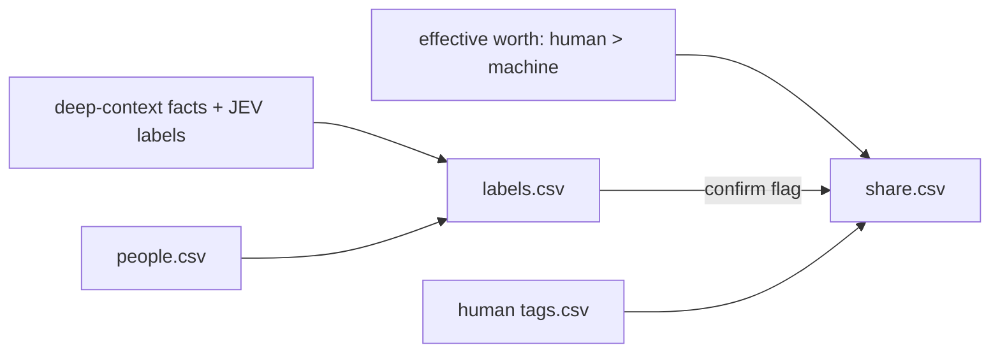

# Share

Worth produces machine labels during deep-context synthesis. Share exports those
saved labels, applies human tags, and builds the upload list. It makes no paid calls.



```bash
bin/deep-context share
```

`share` is the stage's one node (`share_list.ShareList`, declared in
`pipeline/graph.py`): one pass writes labels.csv and share.csv for every merged
person, so the list can never be partial. A context-bearing person without saved
JEV labels must complete deep-context synthesis first. LinkedIn-only people get
deterministic labels. Human tags are never changed by machine labeling.

| File | Role | Reads | Writes |
|---|---|---|---|
| `questions.py` | 34 label questions used by JEV worth | — | — |
| `models.py` | Typed evidence and CSV layout | — | — |
| `evidence.py` | Join people to facts and context | people, facts, index, raw metadata | — |
| `labels.py` | Label reduction, confirm flags, sharing policy | saved labels | — |
| `tags.py` | Human overrides | tags.csv | tags.csv |
| `share_list.py` | The `share` node: labels + share list in one pass | evidence, tags.csv | labels.csv, share.csv, manifest.json |
| `share.py` | CLI | command arguments | command results |
| `csv_cells.py` | CSV boundary coercion | cells | — |

## The share decision

Share follows worth. `share.csv.share` is `yes | no | confirm`; the first rule
that fires names the row's `reason`:

| # | Rule | share | reason |
|---|---|---|---|
| 1 | the owner | no | `owner` |
| 2 | human tag `private` | no | `human_private` |
| 3 | human tag `share` | yes | `human_share` |
| 4 | worth `no` | no | `worth_no` |
| 5 | worth not `yes` (maybe / unjudged) | no | `worth_maybe` |
| 6 | a confirm flag fired | confirm | the flag name |
| 7 | otherwise | yes | `worth_yes` |

The JEV labels decide nothing. `labels.confirm_flag` raises at most one flag —
`family`, `romantic_partner`, `minor`, `sensitive_context`, `sensitive_provider`,
`automated_sender`, `stranger`, in that order — and a flag on a worth-yes person
only asks a human. A `confirm` row leaves the laptop no more than a `no` does
until the human answers; the UI records that answer as a tag through `TagStore`,
and the manifest's `confirm` count is what it surfaces. Tags follow merged
identities through `superseded_person_ids`.
