# iMessage and WhatsApp import pipeline

`$import-messages` adds relationship contacts from iMessage and WhatsApp to the
local search index. It extracts metadata, reuses already imported Gmail/LinkedIn
identities, researches eligible unresolved people, requires browser review when
rows can be materialized, merges rows that were not explicitly excluded, and
rebuilds the local DuckDB through Modal.

The canonical executable contract is
[`import-messages/SKILL.md`](../skills/import-messages/SKILL.md). The smaller
[`$import-whatsapp`](../skills/import-whatsapp/SKILL.md) skill is an isolated
wacli sync/export utility and stops before identity resolution or indexing.

## At a glance

- **No body reads:** Powerpacks selects phone/name, message counts, dates, and
  group metadata. It does not select or send message bodies in this workflow.
- **Two source paths:** iMessage uses read-only macOS SQLite access; WhatsApp uses
  a local wacli provider store and QR authorization.
- **Identity path:** local Gmail/LinkedIn match first, OpenRouter name triage,
  approved Parallel public-web research, then OpenRouter scoring with a direct
  OpenAI fallback when only `OPENAI_API_KEY` is available.
- **Human control:** browser review is mandatory when eligible unresolved rows
  exist, followed by a separate local import confirmation when rows materialize.
- **Cloud boundary:** reviewed, not-explicitly-excluded contact/profile fields are
  included in the merged CSV uploaded to a workspace-shared Modal volume. Inputs
  and runs are operator-prefixed; caches are shared.

## Architecture

```mermaid
flowchart TD
    A["$import-messages<br/>choose iMessage, WhatsApp, or both"] --> B{"Channel"}
    B -->|iMessage| C["Consent: Full Disk Access<br/>read Messages + Contacts SQLite"]
    B -->|WhatsApp| D["Consent: scan WhatsApp QR<br/>wacli local provider sync"]
    C --> E["imessage.contacts.csv<br/>phone, name, counts, dates, groups"]
    D --> F["whatsapp.contacts.csv<br/>phone, name, counts, dates, groups"]
    E --> G["Merge by normalized phone<br/>contacts.csv"]
    F --> G

    G --> H["Match existing local<br/>Gmail + LinkedIn people"]
    H -->|Matched| I["Already searchable<br/>skip identity research"]
    H -->|Unresolved| J{"Approve OpenRouter A<br/>name-only triage"}
    J -->|No| STOP["Stop before provider calls"]
    J -->|Yes| J0["OpenRouter name-only triage"]
    J0 -->|Eligible| K["Build local research queue"]
    J0 -->|Skip or unsearchable| I0["No Messages import row<br/>report triage outcome"]
    K --> L{"Approve Parallel estimate"}
    L --> M["Parallel public-web research<br/>name + phone + area code"]
    M --> N{"Approve scoring provider<br/>OpenRouter or direct OpenAI fallback"}
    N --> O["Mandatory local browser review<br/>explicitly exclude unwanted rows"]
    O --> P{"Confirm local import<br/>when new rows exist"}
    P --> P0{"Approve potential RapidAPI<br/>profile cache misses?"}
    P0 -->|No| STOP
    P0 -->|Yes| P1["Hydrate eligible LinkedIn profiles<br/>current child has no internal gate"]
    P1 --> Q["import/messages/people.csv<br/>profile + phone + interaction counts"]

    I --> R["Fan in all imported sources"]
    I0 --> R
    Q --> R
    R --> S["merged/people.csv"]
    S --> T0{"Approve Modal upload and<br/>provider processing?"}
    T0 -->|No| STOP
    T0 -->|Yes| T["Modal cloud indexing<br/>workspace-shared volume"]
    T --> U["Download local-search.duckdb"]
    U --> V["Validate index"]

    W["$import-whatsapp"] -. "isolated utility only" .-> D
    F -. "isolated skill ends here" .-> X["wacli.contacts.csv"]
    Y["Legacy fallback: Docker + WAHA"] -.-> F

    classDef gate fill:#fff4d6,stroke:#a66b00,color:#3d2a00,stroke-width:2px;
    classDef local fill:#eaf5ff,stroke:#2878a8,color:#14364a;
    classDef cloud fill:#fff0ee,stroke:#b54c3d,color:#4a1f19;
    classDef output fill:#eef8ed,stroke:#4f8a49,color:#233f20;
    class C,D,J,L,N,O,P,P0,T0 gate;
    class E,F,G,H,I,I0,K,Q,R,S,U,V,X,STOP local;
    class J0,M,P1,T cloud;
    class V output;
```



"No Powerset upload" means this flow never writes contacts into a Powerset set
and never calls `sync_powerset_candidates`. It does not mean all processing stays
on-device: reviewed metadata crosses the explicit OpenRouter/direct OpenAI,
Parallel, RapidAPI, and Modal boundaries shown above.

## Source extraction

### iMessage

The extractor opens `~/Library/Messages/chat.db` and the macOS Contacts database
read-only. Full Disk Access is a user-action gate. It queries:

- phone handles and resolved contact names;
- aggregate message count and most recent date;
- group membership and names;
- Contacts.app phone entries, including rows with no message history under the
  current default.

It does not select body columns. If a product wants strictly messaged handles,
the lower-level extractor supports `--message-handles-only`, but the canonical
orchestrator does not currently expose that choice.

### WhatsApp

wacli is the default provider. The skill can install it through Homebrew after
consent, opens a QR flow when authentication is missing, runs one contact/group
sync, and keeps provider state under `.powerpacks/messages/wacli/`.

Powerpacks opens the resulting SQLite database read-only, rejects body-column
identifiers, and selects contact plus aggregate count/date fields. It includes
direct chats and current participants of groups up to the configured size (30 by
default), skipping left or larger groups. Powerpacks never copies body values
into its artifacts, but wacli owns its local provider database, so Powerpacks
cannot claim that provider store contains no bodies.

Docker/WAHA remains a legacy fallback/testing path. It is not the current default
and should not appear as the primary product architecture.

## Matching, research, and review

1. Per-channel rows merge by normalized phone. Names, channel flags, counts,
   dates, and group metadata are combined.
2. Deterministic phone/email/name matching checks the already imported Gmail and
   LinkedIn people. Matched people remain represented by their existing source
   row and skip paid identity research.
3. OpenRouter A sees contact names only and marks low-value identities to skip.
   The skill now calls its `estimate` command and gets explicit approval first.
4. The local queue retains identity and relationship metadata, but Parallel
   receives only `handle`, display name, bio/known information, phone, and area
   code. It does not receive message content, counts, dates, source, or group
   fields.
5. OpenRouter B scores the public research result with phone, area code,
   total/per-channel counts, source, last-message dates, group names, and any
   retarget hint. If OpenRouter is unavailable and `OPENAI_API_KEY` exists, the
   builder sends the same payload directly to OpenAI instead. It currently has no
   estimate command or primitive-owned approval gate, so the skill adds an
   explicit disclosure and approval before the call.
6. The browser review shows identity and career evidence alongside relationship
   aggregates. The user must explicitly exclude every unwanted row.
7. Materialization may require a second confirmation when new directory rows are
   created, then hydrates eligible LinkedIn profiles and writes the source
   `people.csv`.

### Current review semantics

The UI and materializer do not yet share one definition of "selected." A
researched row with a LinkedIn URL and blank `exclude` can be materialized even
when its card initially looks unselected. Until that is fixed, review instructions
must say "explicitly exclude every unwanted row," not "only clicked rows import."

Already-in-network rows do not need to be re-added to the Messages source file;
they should already be searchable through Gmail or LinkedIn.

## Provider and cloud boundaries

| Boundary | Data sent | Approval state |
| --- | --- | --- |
| Full Disk Access | Grants the terminal read access to local Messages and Contacts SQLite files. | Explicit user action. |
| WhatsApp QR | Links wacli to the user's WhatsApp account and local provider store. | Explicit user action. |
| OpenRouter A | Contact names only. | Skill runs an estimate and requires approval. |
| Parallel.ai | Name/handle, bio or known information, phone, and area code. | Estimate plus explicit approval. |
| OpenRouter B or direct OpenAI fallback | Researched public profile plus phone and relationship metadata listed above. | OpenRouter is preferred; direct OpenAI is used when only `OPENAI_API_KEY` exists. Skill requires disclosure and approval; primitive lacks a pre-call estimate. |
| RapidAPI profile hydration | LinkedIn URLs on reviewed rows that were not explicitly excluded, when the profile cache misses. | Primitive has no active approval gate; the skill requires disclosure and approval before materialization. |
| Modal | Entire merged `people.csv`, including reviewed phone and interaction fields. | Workspace-shared volume with operator-prefixed input/run paths and shared caches. Skill requires disclosure and approval; current `--max-usd 0` is uncapped internal mode. Missing `POWERPACKS_OPERATOR_ID` uses the all-zero path. |

## Artifacts and resume

```text
.powerpacks/messages/
|-- import-run.json
|-- imessage.contacts.csv
|-- whatsapp.contacts.csv
|-- contacts.csv
|-- wacli/
|-- research_queue.csv
|-- research/<handle>/01_research_parallel.json
`-- research_review.csv

.powerpacks/network-import/
|-- import/messages/people.csv
|-- directory.csv
`-- merged/people.csv

.powerpacks/search-index/
|-- local-search.duckdb
`-- manifest.json
```

The discovery orchestrator records steps, approvals, warnings, and artifacts in
`import-run.json`. Permission and QR failures become structured user-action
blocks. Parallel skips handles with completed research artifacts. Fixed-path
reruns are resumable, but they are not guaranteed to refresh every source:
iMessage output and completed wacli steps may be reused unless explicitly forced.

The generic Modal driver reports progress under
`.powerpacks/runs/setup-gmail-modal/`. That Gmail-named path is a legacy
implementation label shared by `index-people`; it does not mean this flow is
Gmail-specific.

## Isolated `$import-whatsapp`

Use `$import-whatsapp` for a narrow provider readiness/sync test. It:

1. checks or installs wacli after consent;
2. opens QR authentication when needed;
3. performs one metadata sync;
4. exports `.powerpacks/messages/wacli.contacts.csv` and a manifest.

It does not run local matching, Parallel research, human review, source fan-in,
Modal indexing, or DuckDB validation. Use `$import-messages` for the full product
flow.

## Current product gaps

- OpenRouter B/direct OpenAI scoring has no primitive-level cost preview or approval control.
- RapidAPI cache misses during materialization have no active primitive-level
  preview or approval control.
- The review UI and materializer disagree on blank-selection semantics.
- The canonical iMessage path includes all Contacts.app phone rows, not only
  people with message history.
- `index-people --max-usd 0` is uncapped internal mode. See the
  [LinkedIn and Modal indexing guide](../../indexing/docs/linkedin-modal-pipeline.md).
- Modal storage is workspace-shared and falls back to an all-zero operator path
  unless `POWERPACKS_OPERATOR_ID` is set; automatic per-user isolation is not shipped.
- The normal path can reuse completed extraction artifacts, so "always reruns
  end to end" does not guarantee a fresh source read.
- Matching concatenates Gmail and LinkedIn source files directly; duplicated
  people can make a name-only bucket ambiguous.

## Implementation map

| Concern | Authority |
| --- | --- |
| Full agent workflow | [`import-messages/SKILL.md`](../skills/import-messages/SKILL.md) |
| Isolated WhatsApp utility | [`import-whatsapp/SKILL.md`](../skills/import-whatsapp/SKILL.md) |
| Discovery orchestration | [`import_contacts_pipeline.py`](../primitives/import_contacts_pipeline/import_contacts_pipeline.py) |
| iMessage extraction | [`extract_imessage_contacts.py`](../primitives/extract_imessage_contacts/extract_imessage_contacts.py) |
| wacli extraction | [`import_whatsapp_wacli.py`](../primitives/import_whatsapp_wacli/import_whatsapp_wacli.py) |
| Local matching | [`match_local_candidates.py`](../primitives/match_local_candidates/match_local_candidates.py) |
| Name-only triage | [`llm_review_contacts.py`](../primitives/llm_review_contacts/llm_review_contacts.py) |
| Parallel research | [`deep_research_contacts.py`](../primitives/deep_research_contacts/deep_research_contacts.py) |
| Review scoring and CSV | [`build_research_review_csv.py`](../primitives/build_research_review_csv/build_research_review_csv.py) |
| Browser review | [`review_research_web.py`](../primitives/review_research_web/review_research_web.py) |
| Source materialization | [`messages.py`](../../ingestion/primitives/import_contacts_pipeline/messages.py) |
| Modal index build | [`linkedin_modal_pipeline.py`](../../indexing/modal/linkedin_modal_pipeline.py) |
