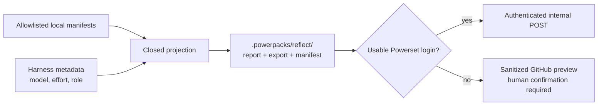

# Observability

`observability` owns privacy-safe product feedback. Its first surface,
`$reflect`, reviews the current fixed artifacts for `$setup`, `$import-gmail`,
`$import-messages`, or `$deep-context`.

## Transport contract

Authenticated reports use `POST` with a bearer token and JSON body. The target
is `POWERPACKS_REFLECT_URL` when set; otherwise it is
`{POWERPACKS_API_BASE}/v1/reflections`, using the same API-base precedence as
runtime-key provisioning. A successful receiver may return
`{"receipt": "<opaque-id>"}`. The client neither stores nor displays arbitrary
response text.

The receiver is an API deployment concern and is not implemented in this
repository. Until that route is deployed, the client fails privately with
`upload_failed` and retains the sanitized local report. It never turns an
internal delivery failure into a public GitHub issue.

## Files

| Path | Role |
| --- | --- |
| `skills/reflect/SKILL.md` | Reporting-only harness behavior and delivery gates |
| `primitives/reflect/contracts.py` | Closed enums, buckets, model normalization, and fail-closed export validation |
| `primitives/reflect/manifests.py` | Fixed workflow manifest allowlists and per-stage projection |
| `primitives/reflect/metadata.py` | Controlled product, model/effort, usage, and OS metadata |
| `primitives/reflect/projection.py` | Composition of the exact outbound document |
| `primitives/reflect/validation.py` | Exact nested export schema and sensitive-text fail-closed gate |
| `primitives/reflect/reflect.py` | Fixed local outputs, authenticated transport, and CLI |
| `evals/reflect/cases.json` | Harness-level privacy and routing behavior cases |
