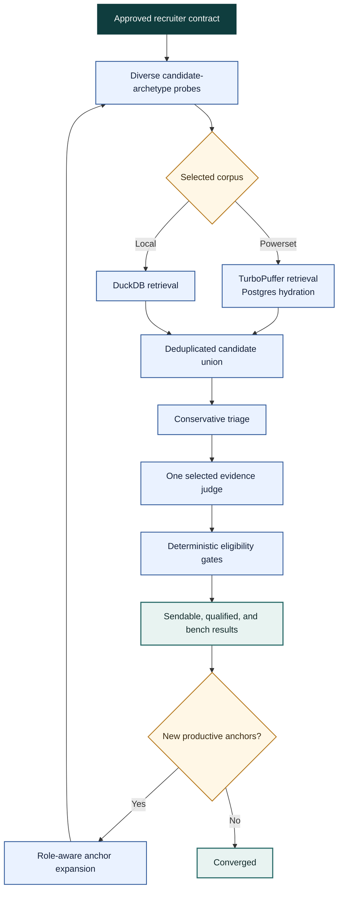

# Agentic search method

> **Conceptual reference, not an execution runbook.** The canonical product and
> runtime contract is the [`$search` architecture](search-architecture.md).
> This filename is retained because benchmark tooling and source comments link
> to it.

Agentic search is the recruiter-style method used by `$search` deep mode. It is
not a separate provider, database, or public search surface. The agent runs
several bounded retrieval hypotheses against the selected corpus, evaluates the
combined candidates against one frozen recruiter contract, and searches again
from productive candidate neighborhoods.

## Current method

## Recall and precision

The method deliberately separates two jobs:

- **Sourcing protects recall.** Diverse probes represent different plausible
  backgrounds for the same role. Retrieval constraints preserve the approved
  location and corpus scope, but ranking precision is not forced into every
  probe.
- **Judging protects precision.** Candidate evidence is evaluated against the
  approved requirements, level, track, and recruiter policy. Deterministic code
  then enforces location and eligibility gates.
- **Expansion explores productive neighborhoods.** Strong, diverse candidates
  seed follow-up searches using role-relevant titles and judged evidence, not
  employer-description text.

This is why deep mode does not use the retired slice-planning lifecycle. A
slice divided one prepared query by filter dimensions; a probe is an explicit
hypothesis about a candidate archetype. Probes are generated and evaluated as
part of one autonomous loop after Review.

## Retrieval implementation

Powerset probes use the existing hybrid retrieval pipeline: semantic vector
search plus BM25-style token search, followed by Postgres hydration. Local
probes use the downloaded DuckDB index. Per-probe artifacts preserve the
payload, backend, and candidate provenance so results from another run cannot
be silently reused.

The automatic loop currently uses one selected judge (`codex` or `gpt`). The
consensus primitive can combine independently produced judge files, but an
automated panel is planned rather than shipped.

See the [dated benchmark findings](deep-search-ground-truth-status.md) for the
experiments that established the wide-probe and judge-after-retrieval design.
