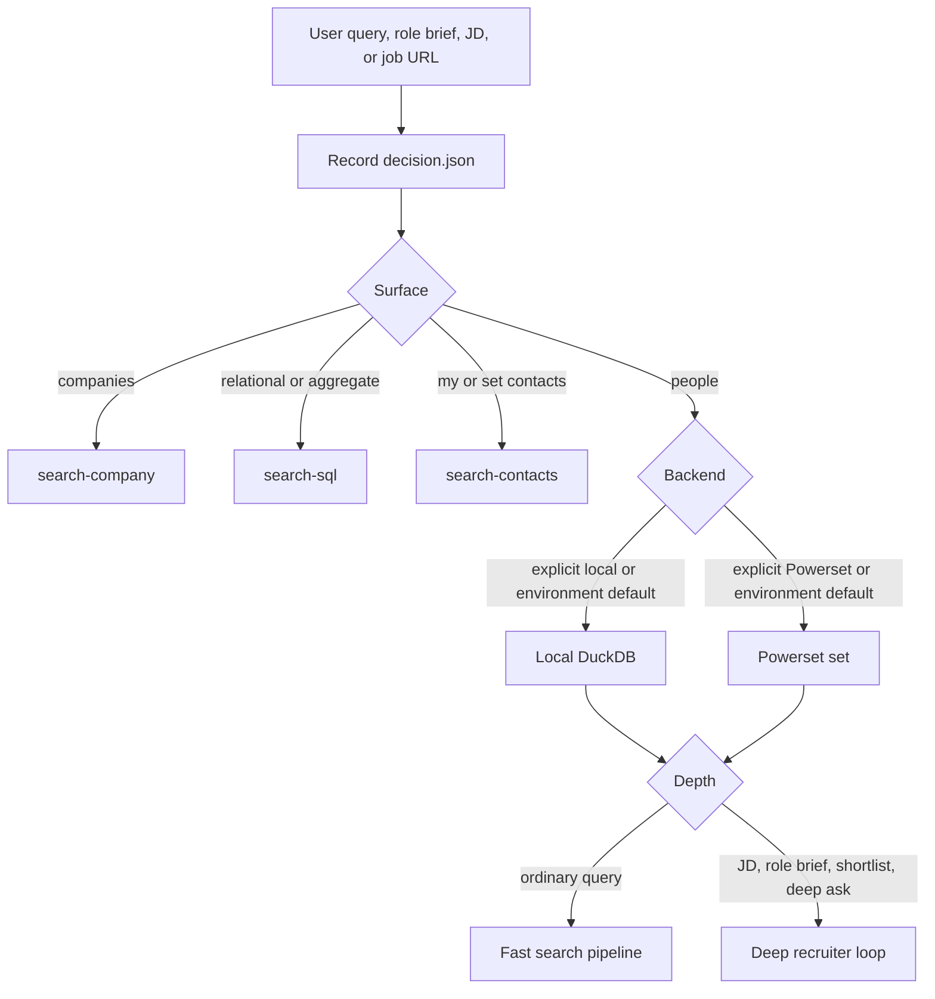
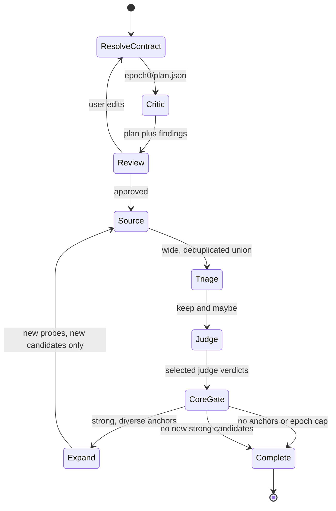
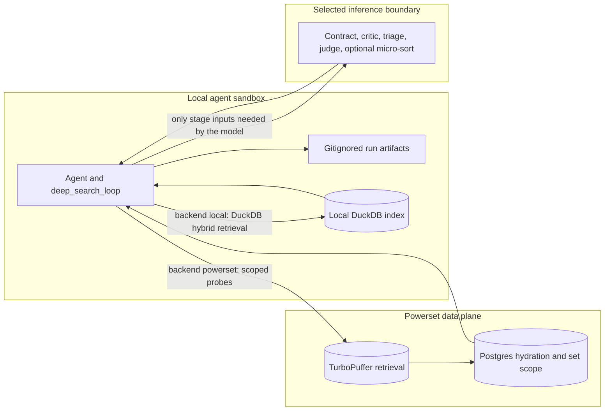

# `$search` architecture

> **Canonical architecture document.** This page is the source of truth for the
> search family's routing, recruiter contract, execution boundaries, review
> points, deep-search lifecycle, and shipped-versus-planned status. The
> executable contracts remain
> [`packs/search/skills/search/SKILL.md`](../skills/search/SKILL.md),
> [`packs/search/skills/search/deep-mode.md`](../skills/search/deep-mode.md), and
> the CLIs under [`packs/search/primitives/`](../primitives/). If prose and a CLI
> disagree, the CLI is current behavior and this page should be corrected.
>
> The older `deep-search-plan.md`, `deep-search-v2-plan.md`,
> `agentic-search.md`, and `deep-search-ground-truth-status.md` files are retained
> as historical design and benchmark notes. They are not current product
> contracts.

## Product contract

`$search` is one door with three decisions:

1. **Surface:** people, company, SQL, or contacts.
2. **Backend:** the Powerset set or the local DuckDB index.
3. **Depth:** fast retrieval or the deep recruiter loop.

The agent records those choices in `decision.json` before dispatch. Deep mode is
not a separate database or a magic monolithic prompt. It is local orchestration
over small primitives: resolve a recruiter contract, review it once, issue many
bounded searches, judge the union, and use the best judged candidates as new
search anchors.

### Routing rules

| Decision | Current rule | Execution |
| --- | --- | --- |
| `surface: people` | Default for a request whose output is people. | Fast or deep `$search`. |
| `surface: company` | The requested output is companies, funding, investors, sectors, or company IDs. | `$search-company`. |
| `surface: sql` | The predicate requires joins, ordering, or per-person aggregates. | `$search-sql`, always local. |
| `surface: contacts` | The user asks for their contacts or set-contact fields. | `$search-contacts`, currently Powerset-backed. |
| `backend: powerset` | Explicit `Powerset`, set, team, or shared-network wording wins. Otherwise it is the default when cloud credentials are configured. | TurboPuffer retrieval plus Postgres hydration, scoped to the selected set. |
| `backend: local` | Explicit `local`, `offline`, or imported-network wording wins. It is also the fallback environment default when only the local index exists. | DuckDB at `--db`; no set resolution, TurboPuffer, or Postgres retrieval. |
| `depth: fast` | Ordinary people lookup or search. | One prepare/Review/run cycle through `search_network_pipeline.py`. |
| `depth: deep` | JD or posting URL, detailed role brief, shortlist/source/recruit ask, explicit deep search, or more-like-this ask. | `deep_search_loop.py`. |

Explicit user wording binds the route. The agent does not silently switch
between local and Powerset search, nor between the people, SQL, company, and
contacts surfaces as a recovery tactic.

## Recruiter contract

Deep mode must act like a recruiter before it acts like a search engine. It
resolves the role into `epoch0/plan.json`, the current versioned recruiter
contract consumed by sourcing, triage, the judge, and the core gate. The plan records the
role, level and track, location, hire stage, usable cutoff, core and table-stakes
must-haves, nice-to-haves, core groups, and the recruiter policy used to rank
otherwise eligible candidates.

`search_scope.location` has intentionally simple semantics: a non-null reviewed
location is mandatory, while `null` means global. There is no hidden
required/preferred mode. `search_scope.filters` is the execution contract and
contains one or more non-empty specificity families (`cities`, `states`,
`countries`, `metro_areas`, or `macro_regions`); multiple values within a
family are OR alternatives and multiple families are AND requirements. City
and state filters require a country qualifier. Every epoch-zero and anchor seed carries both the
display label and filters; `run_wide_search` rejects bypassing `hard_filters`,
clears model-inferred person/company geo, and writes the reviewed filters into
each payload. Consensus independently verifies current location and fails closed
on a mismatch or missing location. The plan uses the shared backend macro
vocabulary; broad Africa/Oceania scopes normalize to explicit country OR filters
because neither corpus has a lossless macro value for those continents.

Generated core groups default to one singleton eligibility alternative per core
trait. That broad eligibility rule does not remove the other must-haves from
default scoring: satisfying one approved group prevents sibling alternatives
from forcing `OUT`, while all must-haves still contribute to the ranking score
and score cutoffs. Only a deliberate alternative
or conjunctive path approved at Review changes path scoring. Every conjunction
must be surfaced at Review, and a group with more than three traits is rejected
rather than allowed to collapse the pool silently. A reviewed scoring path is
marked `source: user`, or `source: jd` when it directly reflects an explicit JD
alternative; the canonical singleton eligibility set remains `source: default`.

Plans from the pre-policy schema are not auto-migrated because they do not say
which must-haves are shared table stakes versus alternative core paths. Start a
new run and perform the one Review again; do not reuse retrieval or verdicts
whose contract cannot be proven.

### Precedence

For every constraint or preference, resolve provenance in this order:

1. **Explicit user preference or correction.** This always wins and remains in
   force for the run. If it conflicts with the JD, expose the conflict at Review
   rather than choosing silently. Before extraction, write the preference object
   conforming to `recruiter-preferences.schema.json` and pass `--preferences`;
   Review edits remain authoritative too.
2. **Explicit JD or role-brief evidence.** The role's actual scope, track,
   location, and requirements beat generic recruiting assumptions.
3. **Versioned recruiter defaults.** Fill only what the user and JD leave
   unspecified from
   [`packs/search/policies/recruiter-defaults.json`](../policies/recruiter-defaults.json),
   then embed the resolved policy under `recruiter_policy` in `plan.json`.

The approved plan is immutable across sourcing epochs. `plan_binding.json`
content-hashes the approved plan and JD source and binds them to the exact Powerset set ID or local
DuckDB path/size/mtime identity before
any derived artifact can be reused. A changed contract or backend requires a
new run directory. Expansion may discover a new candidate archetype, but it
does not rewrite what the role means.

### Default ranking prior

The default answer to "find the strongest people" is an explicit, versioned
ranking prior, not an implicit brand-name prompt:

| Signal | Default weight | Interpretation |
| --- | ---: | --- |
| Trajectory | `0.40` | Increasing rate of responsibility, complexity, or trust at a level appropriate for the target role. |
| Demonstrated impact | `0.40` | Concrete evidence of relevant work and outcomes, favoring current or recent direct evidence over claims and adjacency. |
| Pedigree | `0.20` | A capped positive prior from relevant, job-related background signals. It is never a requirement or gate. Missing pedigree evidence is floor-neutral, not a penalty. |

These weights rank candidates only after the role's core fit and seniority/track
rules are applied. User-specified preferences can replace them. Protected or
demographic attributes and non-job-related proxies are never ranking inputs.

### Provisional calibration thresholds

The current `0.40` qualified-shortlist floor, `0.55` sendable cut, and `0.70`
top-tier excellence gate are provisional defaults calibrated on the AgentMail
benchmark. They are not universal hiring bars. The shortlist and sendable cuts
are configurable per execution; all three need cross-JD re-benchmarking before
being treated as stable policy.

An explicit `seniority_fit: unknown` preserves recall: it may remain in the
qualified pool and seed anchor expansion, but it is never sendable and remains
visible on the bench. Missing or invalid seniority is not equivalent to an
explicit unknown judgment and is not in-band.

Other recruiter defaults remain visible in the plan and editable at Review:

- Prefer recent, direct evidence of the core work over keyword overlap.
- Treat repeated relevant scope and high trajectory as stronger than a single
  ambiguous title.
- Exclude current founders and C-suite leaders for an ordinary hire unless the
  role or user asks for them; do not silently exclude directors, VPs, heads, or
  managers who may be hands-on and in band.
- Treat missing profile evidence conservatively. Triage retains uncertainty;
  the judge may lower confidence but must not invent evidence.
- Use nice-to-haves and ranking priors to order eligible candidates, never to
  compensate for missing core role evidence.

## One human Review

The canonical deep order is:

**contract -> automated critic -> Review -> source -> triage -> judge -> core
gate -> expand -> converge**

There is exactly one human checkpoint. Contract extraction produces
`epoch0/plan.json`; `plan_critic.py` reviews it; then the agent presents both at
**Review**. The user can correct requirements, ranking preferences, level,
location, or exclusions. Approval freezes the contract and releases all
sourcing and judging. No candidate retrieval should happen before that Review,
and the autonomous loop must not introduce a second confirmation gate.

### Review matrix

"Review" with a capital R below means the one human checkpoint. All other
reviews are automated quality controls and do not pause execution.

| Stage | Reviewer | What it checks | Artifact or enforcement |
| --- | --- | --- | --- |
| Route | Agent rules; offline decision eval | Correct surface, backend, and depth. | `decision.json`; `packs/search/evals/run_decision_eval.py`. |
| Contract normalization | Schema-shaped extraction plus hard schema and cross-field validation | Required role fields, valid enums, singleton default eligibility groups, core versus table-stakes traits, provenance, normalized weights, recruiter-policy snapshot, and canonical structured location filters for any non-null location; groups larger than three are rejected. | `epoch0/plan.json`; malformed generated or user-edited plans fail before sourcing. |
| Plan critic | Automated advisory critic plus deterministic enum checks | Missing core pillars, every proposed conjunction, and contradictions between target level, cutoff, track, and JD. | `epoch0/plan_critic.json`. A critic failure is surfaced but does not replace Review. |
| **Review** | **Human, once** | Whether the resolved role and default/user preferences describe the intended hire. | Edit or approve `epoch0/plan.json`; resume with `--plan-approved`; `plan_binding.json` prevents stale artifact reuse. |
| Probe construction | Automated diversity and bounded-round checks | Diverse archetypes and token leads rather than many near-duplicate queries; another independent round when the union is still growing. Every seed carries the approved required location, or an explicit empty scope for a reviewed global search. | `round*/seeds.json`, probe payloads, `rounds.json`. |
| Retrieval | Primitive validation | Every probe uses the selected backend, bounded limits, and the exact approved structured location filter; model-inferred geo is overwritten. Successful lanes contribute to a deduplicated union without corruption from isolated probe failures. | Probe artifacts and `epoch*/union.jsonl`. |
| Triage | Conservative cheap model | Drops only clear misses; missing data and uncertainty survive to the canonical judge. | `candidate_frontier.full.jsonl`, filtered `candidate_frontier.jsonl`, `triage.json`. |
| Candidate judge | One selected judge in the automatic loop | Per-trait evidence, level/track fit, rationale, and canonical score. | `candidate_evaluations.raw.jsonl`, accumulated in `judges/loop.jsonl`. |
| Consensus and core gate | Deterministic code | Required current-location match, non-OUT and in-band votes, configurable score floor, and demonstrated evidence for every trait in at least one approved core group. Default singleton groups govern eligibility while all must-haves score; reviewed paths may use path scoring. Explicit unknown seniority may qualify but cannot be sendable. | `shortlist/consensus.json`, `shortlist/shortlist_ranked.json`, `shortlist/sendable_ranked.json`, `shortlist/bench_ranked.json`. |
| Expansion | Deterministic anchor selection plus retrieval | Uses judged-strong candidates, diversifies anchors by company, and builds role-aware seeds from titles plus judged core evidence rather than employer descriptions. Every anchor seed inherits the approved location; only new people are judged. | `epochN/anchors.json`, `anchor_seeds.json`, `loop.json`. |
| Final ordering | Score order; optional automated micro-sort | Preserves judge scores and optionally reorders saturated score bands using existing evidence. | Optional `shortlist/ranked_final.json`. A production finalizer is planned. |

### Judge count, precisely

The autonomous loop currently runs **one selected judge**: `codex` or `gpt`.
`judge_consensus.py` can combine multiple independently produced `*.jsonl`
judge files, so an operator can assemble a panel manually. That manual
capability does not make the default loop a mixture-of-judges or cross-vendor
panel. Automated independent panel execution, dissent handling, and calibrated
vote thresholds are planned.

## Execution and trust boundaries

The sandbox is the local agent host. Python orchestration, subprocess control,
decisions, and run artifacts stay there for both backends. The selected backend
changes where retrieval and hydration execute; it does not change the recruiter
contract or judge rubric.

| Backend | Retrieval boundary | Deep mode today | Important caveat |
| --- | --- | --- | --- |
| Powerset | TurboPuffer hybrid retrieval and Postgres hydration in the Powerset data plane, scoped by set ID. | Shipped. The local agent launches many small `search_network_pipeline.py` probes. | The orchestration is local, but retrieval is cloud-backed. |
| Local | DuckDB file in `.powerpacks/search-index/` or `--db`. | **Shipped for deep mode.** `--backend local --db <path>` threads through wide and anchor searches. | Local retrieval does not mean offline execution: contract extraction, critic, triage, and judging still use the configured model boundary. |

The current `$search-sql` surface is a separate, read-only local capability. An
agentic SQL lane *inside* the deep loop, for career-shape or relational sourcing
hypotheses, is planned and must not be described as shipped.

## Deep artifacts

Deep runs live under `.powerpacks/deep-search/<jd-slug>/` and are gitignored.
The current names below are the contract; older docs that mention `BRIEF.md`,
`candidates_union.jsonl`, or `candidates.json` are stale.

| Path | Meaning |
| --- | --- |
| `decision.json` | Agent's surface/backend/depth decision, written before dispatch. |
| `jd.txt` | Fetched posting text when intake used `--jd-url`. |
| `epoch0/plan.json` | Reviewed recruiter contract. Reused unchanged in later epochs. |
| `plan_binding.json` | SHA-256 binding from the approved plan and JD source to the exact Powerset set ID or local DuckDB identity. |
| `epoch0/plan_critic.json` | Automated pre-Review findings. |
| `epoch0/round*/seeds.json` | Independently decomposed wide-search probes. |
| `epoch0/round*/probes/<key>/` | Per-probe payload and `search_network_pipeline` artifacts. |
| `epoch0/rounds.json` | Robust-source round growth and saturation history. |
| `epochN/union.jsonl` | Deduplicated candidates found in that epoch. |
| `epochN/probe_summaries.json` | Hydrated-profile artifact locations consumed by triage and judge stages. |
| `epochN/candidate_frontier.json` and `.jsonl` | Canonical bridge from the union to the judge contract. |
| `epochN/candidate_frontier.full.jsonl` | Pre-triage frontier backup. |
| `epochN/triage.json` | Conservative triage counts and model metadata. |
| `epochN/candidate_frontier.to_judge.jsonl` | New, not-previously-judged candidates for the epoch. |
| `epochN/candidate_evaluations.raw.jsonl` | Selected judge's raw verdicts for that epoch. |
| `epochN/anchors.json`, `anchor_seeds.json` | Diverse strong anchors and their follow-up probes for epochs after zero. |
| `master_union.jsonl` | Deduplicated union accumulated across all epochs. |
| `judges/loop.jsonl` | Successful selected-judge verdicts accumulated across epochs. |
| `shortlist/consensus.json` | All normalized judged rows, evidence, vote/score metadata, and deterministic `required_location`/`required_location_filters`/`location_fit` fields. |
| `shortlist/shortlist_ranked.json` | Approved-location, non-OUT, in-band, score-qualified candidates that satisfy one complete approved core group; explicit unknown seniority may remain here for recall and anchors. |
| `shortlist/sendable_ranked.json` | High-confidence approved-location subset of the core-gated shortlist at the configurable sendable threshold; explicit unknown seniority is excluded. |
| `shortlist/bench_ranked.json` | Lower-confidence approved-location candidates plus explicit unknown-seniority rows retained for review. Off-location and missing-location rows remain only in `consensus.json`. |
| `shortlist/ground_truth_ranked.json` | Compatibility alias for `shortlist_ranked.json`. The filename is legacy; a normal run does not make its own output ground truth. |
| `shortlist/ranked_final.json` | Optional micro-sorted order, present only with `--micro-sort`. |
| `loop.json` | Epoch history, convergence, counts, and terminal status. |

## Shipped versus planned

| Capability | Status | Notes |
| --- | --- | --- |
| One `$search` decision door | Shipped | Agent records surface/backend/depth and dispatches to distinct surfaces. |
| Fast Powerset and local retrieval | Shipped | Same `search_network_pipeline.py` contract with backend-specific execution. |
| Deep Powerset sourcing | Shipped | Set-scoped TurboPuffer retrieval plus Postgres hydration. |
| Deep local DuckDB sourcing | **Shipped** | Wide probes and anchor expansion accept `--backend local --db`. |
| Recruiter defaults as a versioned policy snapshot | Shipped on this architecture branch | Defaults resolve after user and JD inputs and are embedded in `plan.json`. |
| Contract -> critic -> Review -> source order | Shipped on this architecture branch | One human Review occurs before candidate retrieval; post-approval execution is autonomous. |
| Wide sourcing, conservative triage, core gate, anchor expansion, convergence | Shipped | The loop judges only new candidates across epochs. |
| One selected automatic judge | Shipped | `codex` or `gpt`; this is not an automatic panel. |
| Optional manually assembled judge panel | Shipped primitive capability | Add independent judge files and run `judge_consensus.py`; orchestration is manual. |
| Optional micro-sort | Shipped, opt-in | Reorders equal-score bands without changing scores; not the production finalizer. |
| Deep agentic SQL sourcing lane | **Planned** | Read-only DuckDB hypotheses inside deep search, separate from the existing `$search-sql` surface. |
| Automated multi-judge panel | **Planned** | Independent passes, calibrated voting, and explicit dissent artifacts. |
| Sendable/bench shortlist split | Shipped on this architecture branch | Deterministic shortlist outputs distinguish high-confidence sends from useful bench candidates. |
| Production shortlist finalizer/export | **Planned** | Stable presentation/export, provenance, concise evidence, and no second human gate. |
| End-to-end recruiter and parity evals | **Planned** | Decision eval exists; broader cross-JD quality, policy, local/cloud, cost, and ordering coverage does not. |

## Roadmap

### Phase 1: deep SQL lane

- Let deep mode ask bounded, read-only relational questions of the local DuckDB
  after contract approval: career transitions, repeated startup stints, company
  overlap, and other predicates vector retrieval cannot express cleanly.
- Treat SQL as another sourcing lane with its query, row count, and contribution
  recorded alongside other probes. It may add candidates to the union; it may
  not bypass triage, the selected judge, or the core gate.
- Keep Powerset-only runs unchanged. Do not imply cloud SQL access or silently
  switch the run's backend.

### Phase 2: automated panel

- Run independent recruiter/manager or vendor/model passes from the same frozen
  contract and candidate evidence.
- Persist each pass separately, distinguish agreement from dissent, and calibrate
  thresholds by actual panel size rather than using single-judge defaults.
- Preserve one human Review. Panel disagreement becomes an output signal, not a
  new execution gate.

### Phase 3: finalizer

- Convert the core-gated shortlist into a stable, human-facing sendable artifact
  with rank, concise evidence, uncertainty, source provenance, and contract
  version.
- Decide explicitly whether optional micro-sort feeds the finalizer or remains a
  diagnostic. Never mutate canonical judge scores to manufacture ordering.
- Retire misleading legacy output names only through a compatible migration.

### Phase 4: evals

- Extend the existing decision eval with recruiter-contract fixtures covering
  user-over-JD-over-default precedence and policy snapshotting.
- Maintain within-corpus, independently judged benchmark sets across several job
  families and levels. Never call an off-corpus candidate a missed in-set result.
- Measure recall by stage, precision at shortlist cutoffs, core and seniority
  violations, unique contribution by lane, judge dissent, ordering quality,
  latency, and cost.
- Recalibrate the provisional `0.40` qualified, `0.55` sendable, and `0.70`
  top-tier bars across multiple job families and levels.
- Compare Powerset and local backends on equivalent corpora where possible, and
  add a dedicated benchmark for the planned SQL lane and finalizer.
