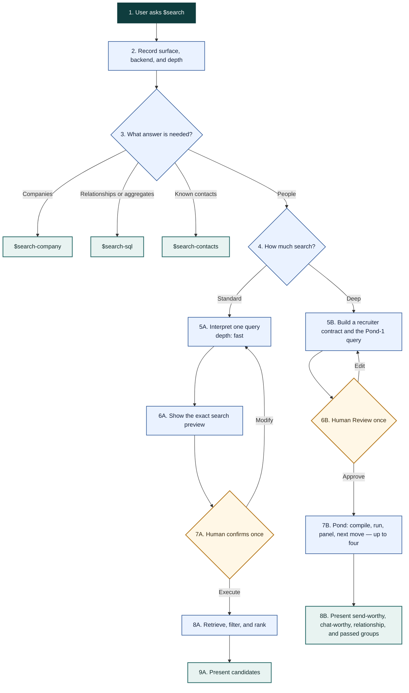
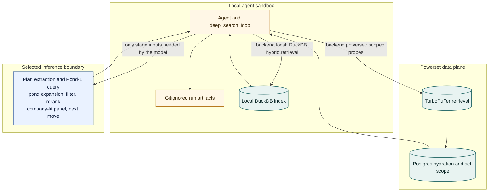

# `$search` architecture

> **Canonical architecture document.** This page is the source of truth for the
> search family's routing, recruiter contract, execution boundaries, review
> points, deep-search lifecycle, and shipped-versus-planned status. The
> executable contracts remain
> [`packs/search/skills/search/SKILL.md`](../skills/search/SKILL.md),
> [`packs/search/skills/search/deep-mode.md`](../skills/search/deep-mode.md), and
> the CLIs under [`packs/search/primitives/`](../primitives/). If prose and a CLI
> disagree, the CLI is current behavior and this page should be corrected.
>
> See the [search documentation index](README.md) for maintained technical
> references, method notes, and dated benchmark evidence.
>
> **Deep mode is one engine (2026-09-02).** The pond harness: one broad
> candidate population at a time, reranked, company-fit panel over the top
> rows, model proposes the next pond, at most four ponds. The older
> probe/triage/judge/core-gate/anchor loop was deleted. The per-file and
> per-stage reference is
> [`primitives/deep_search/README.md`](../primitives/deep_search/README.md);
> the re-layering plan is [`pond-trait-layering.md`](pond-trait-layering.md).

## Product contract

### Thirty-second version

`$search` is the single query-time entry point for finding people. It does not
crawl LinkedIn or the public web. It searches one already available corpus:
either a selected Powerset set or the local DuckDB built during setup.

Before execution, the agent records three choices in `decision.json`:

1. **Surface:** what kind of answer is needed.
2. **Backend:** which candidate corpus is authoritative.
3. **Depth:** whether this is standard one-pass search or recruiter-style deep
   search.

Standard search (`depth: fast`) interprets one query, previews it, retrieves
candidates, and ranks them. Deep mode first writes down what the intended hire
means, lets a human edit or approve that contract once, then searches one
broad candidate population at a time, annotates the strongest rows with a
company-fit panel, and proposes the next population until the model or the
user stops, at most four ponds.

```mermaid
flowchart TD
    ASK[1. User asks $search] --> DECIDE[2. Record surface, backend, and depth]
    DECIDE --> SURFACE{3. What answer is needed?}

    SURFACE -->|Companies| COMPANY[$search-company]
    SURFACE -->|Relationships or aggregates| SQL[$search-sql]
    SURFACE -->|Known contacts| CONTACTS[$search-contacts]
    SURFACE -->|People| DEPTH{4. How much search?}

    DEPTH -->|Standard| INTERPRET[5A. Interpret one query<br/>depth: fast]
    INTERPRET --> PREVIEW[6A. Show the exact search preview]
    PREVIEW --> FASTREVIEW{7A. Human confirms once}
    FASTREVIEW -->|Modify| INTERPRET
    FASTREVIEW -->|Execute| FASTRUN[8A. Retrieve, filter, and rank]
    FASTRUN --> FASTRESULT[9A. Present candidates]

    DEPTH -->|Deep| PLAN[5B. Build a recruiter contract and the Pond-1 query]
    PLAN --> DEEPREVIEW{6B. Human Review once}
    DEEPREVIEW -->|Edit| PLAN
    DEEPREVIEW -->|Approve| DEEPRUN[7B. Pond: compile, run, panel, next move — up to four]
    DEEPRUN --> DEEPRESULT[8B. Present send-worthy, chat-worthy, relationship, and passed groups]

    classDef start fill:#0f3d3e,color:#ffffff,stroke:#0f3d3e,stroke-width:2px;
    classDef decision fill:#eaf2ff,color:#14213d,stroke:#315a9b,stroke-width:1.5px;
    classDef review fill:#fff7e6,color:#3d2b0f,stroke:#b7791f,stroke-width:2px;
    classDef result fill:#e8f3f1,color:#102a2a,stroke:#2f6f6d,stroke-width:2px;
    class ASK start;
    class DECIDE,SURFACE,DEPTH,INTERPRET,PREVIEW,FASTRUN,PLAN,DEEPRUN decision;
    class FASTREVIEW,DEEPREVIEW review;
    class COMPANY,SQL,CONTACTS,FASTRESULT,DEEPRESULT result;
```

The numbered steps are also described in prose below so the architecture does
not depend on the diagram alone.

### The three route decisions

| Decision | Plain-language question | Values |
| --- | --- | --- |
| Surface | What kind of result does the user want? | People, companies, relational SQL, or known contacts. |
| Backend | Which candidate collection should be searched? | A Powerset set, or a local DuckDB index. |
| Depth | Is one retrieval pass enough, or does the request need recruiter judgment and iterative sourcing? | Fast or deep. |

### Standard versus deep

| | Standard search (`depth: fast`) | Deep search |
| --- | --- | --- |
| Best for | Ordinary lookups and bounded people queries. | JDs, role briefs, shortlists, and requests for the strongest candidates for a stated role or domain. |
| Human checkpoint | Confirm the prepared query once. | Review the recruiter contract once. |
| Sourcing | One prepared hybrid retrieval pipeline. | One broad population (pond) at a time through the same pipeline, up to four ponds. |
| Evaluation | LLM filter/rerank unless `--search-only` is selected. | The same filter/rerank, then a company-fit panel (role fit, craft, company taste, move feasibility) over rows scoring ≥ 0.70. |
| Output | Ranked candidates and run artifacts. | `results.json` with send-worthy / chat-worthy / wrong-timing / passed groups, `shortlist.csv`, a local viewer. |

Deep mode is not a separate database or one giant prompt. It is local
orchestration over small, auditable primitives. The same reviewed contract and
panel rubric apply to both backends.

`fast` is the persisted routing value for the original one-pass
`$search-network` pipeline. It means standard search, not a different provider,
a rushed implementation, or a lower-quality corpus. Both depths use the same
selected Powerset or local backend; deep mode adds recruiter planning,
sequential ponds, and the company-fit panel.

### Routing rules

| Decision | Current rule | Execution |
| --- | --- | --- |
| `surface: people` | Default for a request whose output is people. | Fast or deep `$search`. |
| `surface: company` | The requested output is companies, funding, investors, sectors, or company IDs. | `$search-company`. |
| `surface: sql` | The predicate requires joins, ordering, or per-person aggregates. | `$search-sql`, always local. |
| `surface: contacts` | The user asks for their contacts or set-contact fields. | `$search-contacts`, currently Powerset-backed. |
| `backend: powerset` | Explicit `Powerset`, set, team, or shared-network wording wins. Otherwise it is the default when cloud credentials are configured. | TurboPuffer retrieval plus Postgres hydration, scoped to the selected set. |
| `backend: local` | Explicit `local`, `offline`, or imported-network wording wins. It is also the fallback environment default when only the local index exists. | DuckDB at `--db`; no set resolution, TurboPuffer, or Postgres retrieval. |
| `depth: fast` | Ordinary people lookup or search. | One prepare/Review/run cycle through `search_network_pipeline.py`. |
| `depth: deep` | JD or posting URL, detailed role brief, shortlist/source/recruit ask, explicit deep search, or strongest-candidate ask with a stated role or domain. | `deep_search_loop.py`. |

Explicit user wording binds the route. The agent does not silently switch
between local and Powerset search, nor between the people, SQL, company, and
contacts surfaces as a recovery tactic.

## Recruiter contract

Deep mode must act like a recruiter before it acts like a search engine. It
resolves the role into `epoch0/plan.json`, the current versioned recruiter
contract consumed by query generation, the pond harness, and the company-fit panel. Before Review, the
plan records the role, level and track, location, hire stage, usable cutoff,
JD-quoted candidate populations, any posted compensation band, and the
recruiter policy used to rank otherwise eligible candidates. JD traits are
added only after Pond compilation.

`search_scope.location` has intentionally simple semantics: a non-null reviewed
location is mandatory, while `null` means global. There is no hidden
required/preferred mode. `search_scope.filters` is the execution contract and
contains one or more non-empty specificity families (`cities`, `states`,
`countries`, `metro_areas`, or `macro_regions`); multiple values within a
family are OR alternatives. The accepted shapes are city+country, state+country,
metro-only, country-only, or macro-region-only; the two-family shapes are AND
requirements. This avoids ambiguous cross-products, and the reviewed label may
not be broader or conflict with its execution filters. Every pond payload
carries the reviewed filters: `apply_shared_plan_scope` re-imposes the plan
location and filter contract on the compiled payload before it runs, and
query-side locations win back only when the pond query itself names a place
or says worldwide. The plan uses the shared backend macro vocabulary; broad
Africa/Oceania/Latin America scopes normalize to deterministic country OR filters
because neither corpus has a lossless macro value for those regions.

`traits` is a flat ordered list, most defining first, of
`{trait, kind, evidence_quote, selection_reason?}` — `kind` is `capability` (the work itself),
`background` (a track or qualification the JD names for the candidate), or
`tool` (only when producing that artifact is the job); every trait quotes the
JD verbatim or is dropped. After `compile-pond` has produced the Pond traits,
`run-pond` gives those complete traits to the family prompt and asks Sol-high
only for additional ranking evidence. That one call runs beside the candidate
pipeline and is checkpointed in `epoch0/traits.raw.json`; zero additional
traits is valid when the Pond traits already cover the role. Traits never narrow
retrieval. Every trait must be provable from a work-history profile
(a title, company, dated role, or credential line). Design and eval:
[`trait-extraction-redesign.md`](trait-extraction-redesign.md).

Plans from the earlier `must_have` / `nice_to_have` / `core_groups` schema are
not auto-migrated. Start a new run and perform the one Review again; do not
reuse retrieval or verdicts whose contract cannot be proven.

### Precedence

For every constraint or preference, resolve provenance in this order:

1. **Explicit user preference or correction.** This always wins and remains in
   force for the run. If it conflicts with the JD, expose the conflict at Review
   rather than choosing silently. Before extraction, write the preference object
   conforming to `recruiter-preferences.schema.json` and pass `--preferences`;
   Review edits remain authoritative too.
2. **Explicit JD or role-brief evidence.** The role's actual scope, track,
   location, and requirements beat generic recruiting assumptions.
3. **Versioned recruiter defaults.** Fill only what the user and JD leave
   unspecified from
   [`packs/search/policies/recruiter-defaults.json`](../policies/recruiter-defaults.json),
   then embed the resolved policy under `recruiter_policy` in `plan.json`.

The approved plan is immutable across sourcing epochs. `plan_binding.json`
content-hashes the approved plan and JD source and binds them to the exact Powerset set ID or local
DuckDB path/size/mtime identity before
any derived artifact can be reused. A changed contract or backend requires a
new run directory. Expansion may discover a new candidate archetype, but it
does not rewrite what the role means.

### Default ranking prior

The default answer to "find the strongest people" is an explicit, versioned
ranking prior, not an implicit brand-name prompt:

| Signal | Default weight | Interpretation |
| --- | ---: | --- |
| Trajectory | `0.40` | Increasing rate of responsibility, complexity, or trust at a level appropriate for the target role. |
| Demonstrated impact | `0.40` | Concrete evidence of relevant work and outcomes, favoring current or recent direct evidence over claims and adjacency. |
| Pedigree | `0.20` | A capped positive prior from relevant, job-related background signals. It is never a requirement or gate. Missing pedigree evidence is floor-neutral, not a penalty. |

These weights rank candidates only after the role's core fit and seniority/track
rules are applied. User-specified preferences can replace them. Protected or
demographic attributes and non-job-related proxies are never ranking inputs.

### Provisional calibration thresholds

The current `0.40` qualified-shortlist floor, `0.55` sendable cut, and `0.70`
top-tier excellence gate are provisional defaults informed by the dated
[AgentMail benchmark](deep-search-ground-truth-status.md). They are not
universal hiring bars. The shortlist and sendable cuts are configurable per
execution; all three need cross-JD re-benchmarking before being treated as
stable policy.

An explicit `seniority_fit: unknown` preserves recall: it may remain in the
qualified pool and seed anchor expansion, but it is never sendable and remains
visible on the bench. Missing or invalid seniority is not equivalent to an
explicit unknown judgment and is not in-band.

Other recruiter defaults remain visible in the plan and editable at Review:

- Prefer recent, direct evidence of the core work over keyword overlap.
- Treat repeated relevant scope and high trajectory as stronger than a single
  ambiguous title.
- Exclude current founders and C-suite leaders for an ordinary hire unless the
  role or user asks for them; do not silently exclude directors, VPs, heads, or
  managers who may be hands-on and in band.
- Treat missing profile evidence conservatively. The panel may return
  `unclear` but must not invent evidence.
- Use nice-to-haves and ranking priors to order eligible candidates, never to
  compensate for missing core role evidence.

## Deep mode, default: the pond harness

The default order is:

**contract -> floors -> Pond-1 query -> Review -> [compile -> run -> panel ->
decide] × ≤4 ponds -> summary**

Contract extraction (`build_eval_inputs`) writes
`epoch0/plan.json`; `network_floors` counts each JD-quoted candidate
population in the corpus; `decompose_jd` writes exactly one
Pond-1 query. The agent presents the query line and the filters line at
**Review** — the single spend confirmation. After `--plan-approved` the plan,
JD, and queries are bound (`plan_binding.json`) and the harness runs ponds:
each pond compiles through the ordinary `search_network_pipeline` (eight
extractors, hybrid retrieval capped at 1000, filter, rerank), then the
company-fit panel annotates rows with rerank ≥ 0.70 and assigns a group, then
`decide` proposes the next move (`stop`, `ranking_fix`,
`refine_current_pond`, `add_adjacent_pond`, `widen_geography`,
`corpus_sparse`). No critic and no schema validation run before Review in
this mode; validation happens at approval. Per-stage inputs, model calls,
and artifacts are in the
[engine README](../primitives/deep_search/README.md).

## Execution and trust boundaries

The sandbox is the local agent host. Python orchestration, subprocess control,
decisions, and run artifacts stay there for both backends. The selected backend
changes where retrieval and hydration execute; it does not change the recruiter
contract or the panel rubric.

### Where the searchable data comes from

Query-time search and index construction are separate systems:

- `$search powerset` queries an existing Powerset set through TurboPuffer and
  Postgres.
- `$search local` queries
  `.powerpacks/search-index/local-search.duckdb`. The standard `$setup` path
  builds that database from LinkedIn `Connections.csv` in Modal and downloads
  it to the local machine. See the canonical
  [LinkedIn and Modal indexing pipeline](../../indexing/docs/linkedin-modal-pipeline.md).

Calling the query backend `local` means retrieval reads the downloaded DuckDB.
It does not mean the index was built without cloud processing, and it does not
mean the default query workflow makes no model calls.

```mermaid
flowchart TD
    subgraph Host[Local agent sandbox]
        direction TD
        A[Agent and deep_search_loop]
        F[Gitignored run artifacts]
        D[(Local DuckDB index)]
        A --> F
    end

    subgraph Cloud[Powerset data plane]
        direction TD
        T[(TurboPuffer retrieval)]
        G[(Postgres hydration and set scope)]
    end

    subgraph Models[Selected inference boundary]
        direction TD
        M[Plan extraction and Pond-1 query<br/>pond expansion, filter, rerank<br/>company-fit panel, next move]
    end

    A -->|backend local: DuckDB hybrid retrieval| D
    A -->|backend powerset: scoped probes| T
    T --> G
    D --> A
    G --> A
    A -->|only stage inputs needed by the model| M
    M --> A

    classDef host fill:#fff7e6,color:#3d2b0f,stroke:#b7791f,stroke-width:1.5px;
    classDef data fill:#e8f3f1,color:#102a2a,stroke:#2f6f6d,stroke-width:1.5px;
    classDef model fill:#eaf2ff,color:#14213d,stroke:#315a9b,stroke-width:1.5px;
    class A,F host;
    class D,T,G data;
    class M model;
```

| Backend | Retrieval boundary | Deep mode today | Important caveat |
| --- | --- | --- | --- |
| Powerset | TurboPuffer hybrid retrieval and Postgres hydration in the Powerset data plane, scoped by set ID. | Shipped. The local agent runs one `search_network_pipeline.py` pass per pond. | The orchestration is local, but retrieval is cloud-backed. |
| Local | DuckDB file in `.powerpacks/search-index/` or `--db`. | Shipped. `--backend local --db <path>` threads through every pond. | Local retrieval does not mean offline execution: contract extraction, query generation, filter/rerank, and the panel still use the configured model boundary. |

The current `$search-sql` surface is a separate, read-only local capability. An
agentic SQL lane *inside* the deep loop, for career-shape or relational sourcing
hypotheses, is planned and must not be described as shipped.

## Deep artifacts

Deep runs live under `.powerpacks/deep-search/<jd-slug>/` and are gitignored.

| Path | Meaning |
| --- | --- |
| `decision.json` | Agent's surface/backend/depth decision, written before dispatch. |
| `jd.txt`, `source.json` | Fetched posting text and source metadata when intake used `--jd-url`. |
| `epoch0/plan.raw.json`, `epoch0/plan.json` | Verbatim model response and the normalized, reviewed recruiter contract. |
| `network_floors.json` | Exact-token population counts for each JD-quoted candidate population in the corpus. |
| `queries.raw.json`, `queries.json` | Model response plus the injected precedent card; the reviewed Pond-1 query. |
| `plan_binding.json` | SHA-256 binding of the approved plan, JD, and reviewed queries to the exact Powerset set ID or local DuckDB identity. |
| `results.json`, `manifest.json` | The search-harness state: every pond iteration (query, payload, edits, pool stats, panel grades, diagnosis, next move) and the merged summary groups. |
| `ponds/pond-NN/` | Per-pond compile artifacts, payload, pattern-default proposal, run logs, and the company-fit panel checkpoints. |
| `usage.jsonl` | One priced row per model call. |
| `user-edits.jsonl`, `feedback-sent.jsonl` | Captured user edits and the feedback rows sent from them. |
| `shortlist.csv`, `relationship.csv` | Exported summary groups on completion. |

## Glossary

| Term | Product-language meaning |
| --- | --- |
| Surface | The kind of question being answered: people, companies, relational SQL, or known contacts. |
| Backend | The selected candidate corpus: a Powerset set or a local DuckDB index. |
| Corpus | The collection of people and profile evidence that can be searched. |
| Hybrid retrieval | Combining exact/keyword matching with semantic similarity. |
| TurboPuffer | The cloud retrieval engine used by the Powerset backend. |
| Postgres hydration | Loading the fuller candidate profile after retrieval identifies a person. |
| DuckDB | The single-file database used by the local backend. |
| Recruiter contract | The reviewed, structured definition of the intended hire (`epoch0/plan.json`). |
| Pond | One broad candidate population searched through the ordinary pipeline; a run has at most four. |
| Payload | The compiled retrieval request for a pond (filters, role keywords, traits), editable before it runs. |
| Rerank score | The pipeline's per-candidate score against the pond query's traits; orders rows inside a pond. |
| Company-fit panel | Four expert judgments (role fit, craft and potential, company taste, move feasibility) plus a decision over the pond's top rows. |
| Group | A row's review bucket: send-worthy, chat-worthy, wrong-timing relationship, or passed. |
| Next move | The model's proposal after a pond: stop, ranking fix, refine, adjacent pond, widen geography, or corpus sparse. |
| Precedent card | A reviewed prior decision (move, payload edit, or fit judgment) retrieved as guidance. |
| Artifact | A saved plan, payload, candidate pool, panel record, or result produced by a run. |
| Plan binding | A hash that prevents artifacts from another JD, plan, set, or DuckDB from being reused. |

## Shipped versus planned

| Capability | Status | Notes |
| --- | --- | --- |
| One `$search` decision door | Shipped | Agent records surface/backend/depth and dispatches to distinct surfaces. |
| Fast Powerset and local retrieval | Shipped | Same `search_network_pipeline.py` contract with backend-specific execution. |
| Deep Powerset and local sourcing | Shipped | Each pond runs the ordinary pipeline against the selected set or DuckDB. |
| Recruiter defaults as a versioned policy snapshot | Shipped | Defaults resolve after user and JD inputs and are embedded in `plan.json`. |
| Contract -> floors -> Pond-1 query -> one Review -> ponds | Shipped | One human Review before retrieval; post-approval ponds run on `continue or done`. |
| Company-fit panel and review groups | Shipped | Four experts plus a decision over each pond's top rows; labels and whys only — no expert output gates or demotes a row; the role-fit expert scores the JD's traits (`jd_fit` on every row). |
| Shortlist export | Shipped | `shortlist.csv` / `relationship.csv` from `results.json.summary` on completion. |
| Local results viewer with per-candidate feedback | Shipped | `results_web` renders every pond; feedback posts to Powerset. |
| Flat person-trait contract at the panel | Shipped | Per-family trait extraction (`prompts/traits.txt`, `prompts/families/<family>/traits.txt`); the role-fit expert scores each trait; `jd_fit` on every row; "Fit (Beta)" ordering in the viewer. See `trait-extraction-redesign.md`. |
| Start a deep run from a raw profile URL | **Planned** | There is no profile-to-role intake bridge. |
| Deep agentic SQL sourcing lane | **Planned** | Read-only DuckDB hypotheses inside deep search, separate from the existing `$search-sql` surface. |
| End-to-end recruiter and parity evals | **Planned** | Decision eval exists; cross-JD quality, cost, and ordering coverage does not. |

## Roadmap

The active plan is [`pond-trait-layering.md`](pond-trait-layering.md): ponds
define the population, one flat trait set per search ranks at the panel, and
the JD-to-traits extraction is being redesigned
([`trait-extraction-redesign.md`](trait-extraction-redesign.md)). A read-only
agentic SQL lane inside deep search and broader cross-JD evals remain future
work.
