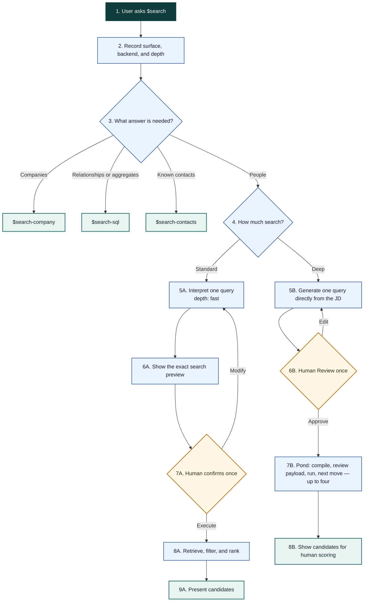
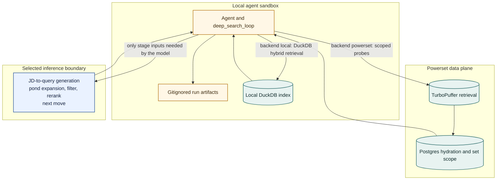

# `$search` architecture

> **Canonical architecture document.** This page is the source of truth for the
> search family's routing, query review, execution boundaries, review
> points, deep-search lifecycle, and shipped-versus-planned status. The
> executable contracts remain
> [`packs/search/skills/search/SKILL.md`](../skills/search/SKILL.md),
> [`packs/search/skills/search/deep-mode.md`](../skills/search/deep-mode.md), and
> the CLIs under [`packs/search/primitives/`](../primitives/). If prose and a CLI
> disagree, the CLI is current behavior and this page should be corrected.
>
> See the [search documentation index](README.md) for maintained technical
> references, method notes, and dated benchmark evidence.
>
> **Deep mode uses the pond harness.** One query generated directly from the JD,
> followed by ordinary query extraction, retrieval, filtering, and reranking.
> Candidates appear in the viewer for human scoring. The per-file reference is
> [`primitives/deep_search/README.md`](../primitives/deep_search/README.md).

## Product contract

### Thirty-second version

`$search` is the single query-time entry point for finding people. It does not
crawl LinkedIn or the public web. It searches one already available corpus:
either a selected Powerset set or the local DuckDB built during setup.

Before execution, the agent records three choices in `decision.json`:

1. **Surface:** what kind of answer is needed.
2. **Backend:** which candidate corpus is authoritative.
3. **Depth:** whether this is standard one-pass search or recruiter-style deep
   search.

Standard search (`depth: fast`) interprets one query, previews it, retrieves
candidates, and ranks them. Deep mode generates one initial query from the JD,
lets the user edit or approve the query and filters, then searches one broad
candidate population at a time. A model proposes the next population until the
user or model stops, normally after at most four ponds.

```mermaid
flowchart TD
    ASK[1. User asks $search] --> DECIDE[2. Record surface, backend, and depth]
    DECIDE --> SURFACE{3. What answer is needed?}

    SURFACE -->|Companies| COMPANY[$search-company]
    SURFACE -->|Relationships or aggregates| SQL[$search-sql]
    SURFACE -->|Known contacts| CONTACTS[$search-contacts]
    SURFACE -->|People| DEPTH{4. How much search?}

    DEPTH -->|Standard| INTERPRET[5A. Interpret one query<br/>depth: fast]
    INTERPRET --> PREVIEW[6A. Show the exact search preview]
    PREVIEW --> FASTREVIEW{7A. Human confirms once}
    FASTREVIEW -->|Modify| INTERPRET
    FASTREVIEW -->|Execute| FASTRUN[8A. Retrieve, filter, and rank]
    FASTRUN --> FASTRESULT[9A. Present candidates]

    DEPTH -->|Deep| QUERY[5B. Generate one query directly from the JD]
    QUERY --> DEEPREVIEW{6B. Human Review once}
    DEEPREVIEW -->|Edit| QUERY
    DEEPREVIEW -->|Approve| DEEPRUN[7B. Pond: compile, review payload, run, next move — up to four]
    DEEPRUN --> DEEPRESULT[8B. Show candidates for human scoring]

    classDef start fill:#0f3d3e,color:#ffffff,stroke:#0f3d3e,stroke-width:2px;
    classDef decision fill:#eaf2ff,color:#14213d,stroke:#315a9b,stroke-width:1.5px;
    classDef review fill:#fff7e6,color:#3d2b0f,stroke:#b7791f,stroke-width:2px;
    classDef result fill:#e8f3f1,color:#102a2a,stroke:#2f6f6d,stroke-width:2px;
    class ASK start;
    class DECIDE,SURFACE,DEPTH,INTERPRET,PREVIEW,FASTRUN,QUERY,DEEPRUN decision;
    class FASTREVIEW,DEEPREVIEW review;
    class COMPANY,SQL,CONTACTS,FASTRESULT,DEEPRESULT result;
```

The numbered steps are also described in prose below so the architecture does
not depend on the diagram alone.

### The three route decisions

| Decision | Plain-language question | Values |
| --- | --- | --- |
| Surface | What kind of result does the user want? | People, companies, relational SQL, or known contacts. |
| Backend | Which candidate collection should be searched? | A Powerset set, or a local DuckDB index. |
| Depth | Is one retrieval pass enough, or does the request need recruiter judgment and iterative sourcing? | Fast or deep. |

### Standard versus deep

| | Standard search (`depth: fast`) | Deep search |
| --- | --- | --- |
| Best for | Ordinary lookups and bounded people queries. | JDs, role briefs, shortlists, and requests for the strongest candidates for a stated role or domain. |
| Human checkpoint | Confirm the prepared query once. | Review the initial query and filters once. |
| Sourcing | One prepared hybrid retrieval pipeline. | One broad population (pond) at a time through the same pipeline, up to four ponds. |
| Evaluation | LLM filter/rerank unless `--search-only` is selected. | The same filter/rerank; optional JD traits and company-fit judging are disabled by default. |
| Output | Ranked candidates and run artifacts. | `results.json`, `shortlist.csv`, and a local viewer with scores and notes. |

Deep mode is not a separate database or one giant prompt. It is local
orchestration over small, auditable primitives. The same query and payload review
apply to both backends.

`fast` is the persisted routing value for the original one-pass
`$search-network` pipeline. It means standard search, not a different provider,
a rushed implementation, or a lower-quality corpus. Both depths use the same
selected Powerset or local backend; deep mode adds JD-to-query generation,
sequential ponds, and human scoring.

### Routing rules

| Decision | Current rule | Execution |
| --- | --- | --- |
| `surface: people` | Default for a request whose output is people. | Fast or deep `$search`. |
| `surface: company` | The requested output is companies, funding, investors, sectors, or company IDs. | `$search-company`. |
| `surface: sql` | The predicate requires joins, ordering, or per-person aggregates. | `$search-sql`, always local. |
| `surface: contacts` | The user asks for their contacts or set-contact fields. | `$search-contacts`, currently Powerset-backed. |
| `backend: powerset` | Explicit `Powerset`, set, team, or shared-network wording wins. Otherwise it is the default when cloud credentials are configured. | TurboPuffer retrieval plus Postgres hydration, scoped to the selected set. |
| `backend: local` | Explicit `local`, `offline`, or imported-network wording wins. It is also the fallback environment default when only the local index exists. | DuckDB at `--db`; no set resolution, TurboPuffer, or Postgres retrieval. |
| `depth: fast` | Ordinary people lookup or search. | One prepare/Review/run cycle through `search_network_pipeline.py`. |
| `depth: deep` | JD or posting URL, detailed role brief, shortlist/source/recruit ask, explicit deep search, or strongest-candidate ask with a stated role or domain. | `deep_search_loop.py`. |

Explicit user wording binds the route. The agent does not silently switch
between local and Powerset search, nor between the people, SQL, company, and
contacts surfaces as a recovery tactic.

## Query and geography review

The JD goes directly to `decompose_jd`: one model call with the general pond
prompt and at most one retrieved move card. It writes `queries.json` and returns
`awaiting_query_review`. URL intake preserves the original posting metadata in
`source.json` alongside `jd.txt`.

Before presenting the query, the agent compares every allowed posting location
with the query. Allowed locations stay OR alternatives. Explicit user changes
win over the posting and are written into the query. No in-person, hybrid, or
remote restriction is added by default.

After the user approves, `--query-approved` initializes `results.json` with the
JD hash, frozen queries, and exact Powerset set or DuckDB identity. It does not
retrieve candidates. The pending query can be changed with `set-query` before
compilation.

The ordinary parallel extractors compile the query into filters and traits.
Before execution, the agent compares the query with the compiled geography and
checks extraction errors. Missing or narrowed filters must be repaired before
retrieval; an empty location extraction does not authorize a worldwide search.
The agent then calls `review-payload` within the existing query approval.

## Deep mode: the pond harness

**JD -> initial query -> query Review -> [compile -> payload review -> run ->
decide] × ≤4 ponds -> summary**

Each pond uses the ordinary `search_network_pipeline`: parallel extractors,
hybrid retrieval capped at 1,000 by default, filter, and rerank. The current
`ENABLE_FIT_JUDGING = False` setting disables additional JD trait extraction and
the company-fit panel. Rerank scores, candidate artifacts, company-context
lookups, CSV exports, and human feedback remain active.

`decide` proposes `stop`, `ranking_fix`, `refine_current_pond`,
`add_adjacent_pond`, `widen_geography`, or `corpus_sparse`. Interactive mode asks
continue-or-done after each pond; auto mode makes the decision without that
pause. An explicit user request can reopen a completed run. The
[engine README](../primitives/deep_search/README.md) lists stage inputs and artifacts.

## Execution and trust boundaries

The sandbox is the local agent host. Python orchestration, subprocess control,
decisions, and run artifacts stay there for both backends. The selected backend
changes where retrieval and hydration execute; it does not change query and payload review.

### Where the searchable data comes from

Query-time search and index construction are separate systems:

- `$search powerset` queries an existing Powerset set through TurboPuffer and
  Postgres.
- `$search local` queries
  `.powerpacks/search-index/local-search.duckdb`. The standard `$setup` path
  builds that database from LinkedIn `Connections.csv` in Modal and downloads
  it to the local machine. See the canonical
  [LinkedIn and Modal indexing pipeline](../../indexing/docs/linkedin-modal-pipeline.md).

Calling the query backend `local` means retrieval reads the downloaded DuckDB.
It does not mean the index was built without cloud processing, and it does not
mean the default query workflow makes no model calls.

```mermaid
flowchart TD
    subgraph Host[Local agent sandbox]
        direction TD
        A[Agent and deep_search_loop]
        F[Gitignored run artifacts]
        D[(Local DuckDB index)]
        A --> F
    end

    subgraph Cloud[Powerset data plane]
        direction TD
        T[(TurboPuffer retrieval)]
        G[(Postgres hydration and set scope)]
    end

    subgraph Models[Selected inference boundary]
        direction TD
        M[JD-to-query generation<br/>pond expansion, filter, rerank<br/>next move]
    end

    A -->|backend local: DuckDB hybrid retrieval| D
    A -->|backend powerset: scoped probes| T
    T --> G
    D --> A
    G --> A
    A -->|only stage inputs needed by the model| M
    M --> A

    classDef host fill:#fff7e6,color:#3d2b0f,stroke:#b7791f,stroke-width:1.5px;
    classDef data fill:#e8f3f1,color:#102a2a,stroke:#2f6f6d,stroke-width:1.5px;
    classDef model fill:#eaf2ff,color:#14213d,stroke:#315a9b,stroke-width:1.5px;
    class A,F host;
    class D,T,G data;
    class M model;
```

| Backend | Retrieval boundary | Deep mode today | Important caveat |
| --- | --- | --- | --- |
| Powerset | TurboPuffer hybrid retrieval and Postgres hydration in the Powerset data plane, scoped by set ID. | Shipped. The local agent runs one `search_network_pipeline.py` pass per pond. | The orchestration is local, but retrieval is cloud-backed. |
| Local | DuckDB file in `.powerpacks/search-index/` or `--db`. | Shipped. `--backend local --db <path>` threads through every pond. | Local retrieval does not mean offline execution: query generation, expansion, filter/rerank, and next moves still use the configured model boundary. |

The current `$search-sql` surface is a separate, read-only local capability. An
agentic SQL lane *inside* the deep loop, for career-shape or relational sourcing
hypotheses, is planned and must not be described as shipped.

## Deep artifacts

Deep runs live under `.powerpacks/deep-search/<jd-slug>/` and are gitignored.

| Path | Meaning |
| --- | --- |
| `decision.json` | Agent's surface/backend/depth decision, written before dispatch. |
| `jd.txt`, `source.json` | Fetched posting text and source metadata when intake used `--jd-url`. |
| `queries.raw.json`, `queries.json` | Model response plus the injected precedent card; the reviewed Pond-1 query. |
| `results.json`, `manifest.json` | JD hash, reviewed queries, corpus identity, every pond iteration, and the deduplicated summary. |
| `ponds/pond-NN/` | Per-pond compile artifacts, payload, pattern-default proposal, run logs, and optional judgment checkpoints. |
| `usage.jsonl` | One priced row per model call. |
| `user-edits.jsonl`, `feedback-sent.jsonl` | Captured user edits and the feedback rows sent from them. |
| `shortlist.csv`, `relationship.csv` | Candidate exports on completion; unjudged candidates remain in the shortlist. |
| `fit-labels.jsonl` | Human scores and notes, saved locally before feedback API submission. |

## Glossary

| Term | Product-language meaning |
| --- | --- |
| Surface | The kind of question being answered: people, companies, relational SQL, or known contacts. |
| Backend | The selected candidate corpus: a Powerset set or a local DuckDB index. |
| Corpus | The collection of people and profile evidence that can be searched. |
| Hybrid retrieval | Combining exact/keyword matching with semantic similarity. |
| TurboPuffer | The cloud retrieval engine used by the Powerset backend. |
| Postgres hydration | Loading the fuller candidate profile after retrieval identifies a person. |
| DuckDB | The single-file database used by the local backend. |
| Pond | One broad candidate population searched through the ordinary pipeline; the normal loop has at most four. |
| Payload | The compiled retrieval request for a pond (filters, role keywords, traits), editable before it runs. |
| Rerank score | The pipeline's per-candidate score against the pond query's traits; orders rows inside a pond. |
| Company-fit panel | Disabled by default; four expert judgments (role fit, craft and potential, company taste, move feasibility) plus a decision over the pond's top rows. |
| Group | A row's review bucket: send-worthy, chat-worthy, wrong-timing relationship, or passed. |
| Next move | The model's proposal after a pond: stop, ranking fix, refine, adjacent pond, widen geography, or corpus sparse. |
| Precedent card | A reviewed prior decision (move, payload edit, or fit judgment) retrieved as guidance. |
| Artifact | A saved query, payload, candidate list, label, or result produced by a run. |

## Shipped versus planned

| Capability | Status | Notes |
| --- | --- | --- |
| One `$search` decision door | Shipped | Agent records surface/backend/depth and dispatches to distinct surfaces. |
| Fast Powerset and local retrieval | Shipped | Same `search_network_pipeline.py` contract with backend-specific execution. |
| Deep Powerset and local sourcing | Shipped | Each pond runs the ordinary pipeline against the selected set or DuckDB. |
| JD -> initial query -> one Review -> ponds | Shipped | One user query Review; the agent checks compiled geography before retrieval. |
| Company-fit panel | Disabled by default | Retained optional expert judgments; empty sections are hidden in the viewer. |
| Shortlist export | Shipped | `shortlist.csv` / `relationship.csv` from `results.json.summary` on completion. |
| Local results viewer with per-candidate feedback | Shipped | Scores 1–10 excluding 5 and 6, plus notes; saved locally and submitted to Powerset. |
| Additional JD trait extraction | Disabled by default | Retained in `extract_jd_traits.py`; ordinary query traits still drive reranking. |
| Start a deep run from a raw profile URL | **Planned** | There is no profile-to-role intake bridge. |
| Deep agentic SQL sourcing lane | **Planned** | Read-only DuckDB hypotheses inside deep search, separate from the existing `$search-sql` surface. |
| End-to-end recruiter and parity evals | **Planned** | Decision eval exists; cross-JD quality, cost, and ordering coverage does not. |

## Roadmap

A read-only agentic SQL lane inside deep search and broader cross-JD evals remain
future work. Dated trait and pond design notes are historical references, not the
current execution contract.
