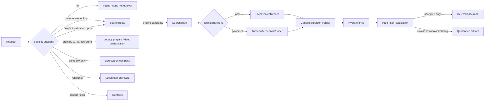

# Layered search candidate architecture and pre-cutover boundary

## Current profile boundary

Bare-person lookup executes through the typed composition root. The live
product still uses legacy `search_network_pipeline.py` for ordinary
people search and legacy `deep_search_loop.py` for recruiting. Their task state,
ledgers, artifacts, and helper owners remain canonical until atomic cutover.

For explicit validation, `$search` can record a strict `SearchRoute`; only
`target=engine` creates a strict `SearchSpec`. The typed
`packs/search/pipeline/search.py` composition root is additive and opt-in for
deterministic tests and approved read-only real-environment comparison only.

```mermaid
flowchart LR
  Q[Request] --> A{Specific enough?}
  A -->|no| N[needs_input; no retrieval]
  A -->|bare-person lookup| R[SearchRoute]
  A -->|ordinary GTM / recruiting| LEG[Legacy prepare / deep orchestration]
  A -->|explicit validation opt-in| R[SearchRoute]
  R -->|engine candidate| S[SearchSpec]
  S --> C{Explicit backend}
  C -->|local| L[LocalSearchRunner]
  C -->|powerset| P[TurboPufferSearchRunner]
  L --> F[Canonical person frontier]
  P --> F
  F --> H[Hydrate once]
  H --> V[Hard-filter revalidation]
  V -->|accepted only| K[Deterministic rank]
  V -->|violation/unknown/missing| X[Quarantine artifact]
  A -->|company-only| CO[Live search-company]
  A -->|relational| SQL[Local read-only SQL]
  A -->|contact fields| CT[Contacts]
```

## Contracts and invariants

- Within the additive typed candidate path, the sole runner-selection point is
  `pipeline/search.py`; shared pipeline modules import neither backend.
- Local and Powerset runners import their own storage layers directly. There is
  no registry, ambient backend mode, fallback, or compatibility wrapper.
- Explicit company and education names have one disposition per input. Any
  unresolved required name returns `needs_input` before retrieval.
- Capabilities come from selected DuckDB columns or checked-in TurboPuffer
  namespace contracts. Missing required fields return `unsupported_capability`.
- Hard constraints apply before retrieval bounds and are revalidated after
  hydration. Violations, unknown evidence, and missing hydration never rank.
- Role, summary, company-signal, adjacency, SQL, and company-union lanes are
  advertised only when the selected runner implements them. Provenance merges
  at person grain.
- SQL candidates must belong to the eligible person pool and join the same
  frontier before one hydration/rank pass.
- Remote lookup candidates must belong to a completely enumerated selected
  operator scope before hydration or return. Powerset supports `person_id`,
  `name`, `handle`, and `profile_url`; it does not advertise email or phone.
- Soft criteria are rejected until an approved production semantic adapter
  exists. There is no callback-only production capability.
- Local corpus identity is derived from the selected read-only DuckDB. Supplied
  hashes must match it. Powerset set/operator/membership/schema observations are
  derived; incomplete searchable-content identity is honestly non-comparable.
- Private JSON/JSONL and validation evidence live under repository
  `.powerpacks/`. The CSV is redacted and contains no person identifiers or
  hydrated identity fields.

## Current boundary

The typed candidate is the deterministic bare-person lookup owner. Its GTM and
recruiting implementations do not imply cutover; those canonical live paths
remain the legacy fast/deep owners. `$search-company` remains live for company-only
lookup/resolution; `$search-sql` and `$search-contacts` remain separate.
`$search-network` and NanoClaw `/search-network` remain live compatibility
surfaces while their task/result consumers exist.

Ambiguous requests stop as `needs_input` before retrieval. Typed
`plan_approved` and `judge_approved` select reviewed adapters only; together
with credentials they still do not authorize a paid quality run. Such a run
requires separate explicit approval of cases, model, caps, private output path,
and maximum spend immediately before execution.
