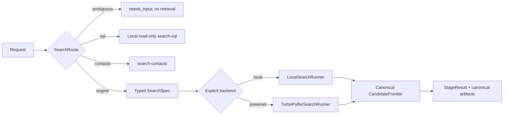

# Layered `$search` architecture

## Public routing boundary

`$search` is the single router for person lookup, GTM people search, and
recruiting. A specific request is first represented as a strict `SearchRoute`:

```text
SearchRoute
  target: engine | sql | contacts
  profile: lookup | gtm | recruiting | null
  backend: local | powerset | null
  reason
```

Only `target=engine` creates a `SearchSpec`. Local relational or aggregate
questions, including company-only local directory questions, route to
`$search-sql`. Contact-field and set-contact questions route to
`$search-contacts`. People-at-company requests are GTM searches with company
constraints. There is no separate public company-search command.


```mermaid
flowchart LR
  Q[Request] --> R{SearchRoute}
  R -->|ambiguous| N[needs_input; no retrieval]
  R -->|sql| SQL[Local read-only search-sql]
  R -->|contacts| CT[search-contacts]
  R -->|engine| S[Typed SearchSpec]
  S --> C{Explicit backend}
  C -->|local| L[LocalSearchRunner]
  C -->|powerset| P[TurboPufferSearchRunner]
  L --> F[Canonical CandidateFrontier]
  P --> F
  F --> SR[StageResult + canonical artifacts]
```

## Canonical typed execution

Every engine request persists one schema-valid `search.spec.v1` document and
runs it through `packs/search/pipeline/search.py`. The composition root is the
only backend-selection point. Local and Powerset runners import their own
storage implementations directly; there is no ambient backend mode, registry,
fallback, or compatibility wrapper.

The three profiles select behavior within this one engine:

- `lookup`: deterministic person identifier lookup with no semantic retrieval
  or model call;
- `gtm`: structured filters, bounded retrieval, hydration, hard-filter
  revalidation, and deterministic or one bounded semantic rank pass;
- `recruiting`: reviewed recruiter plan, differentiated probes, conditional
  triage, one evidence judge, deterministic gates, and bounded expansion.

`fast` and `deep` are not public pipeline modes. Explicit profile and bounds
determine which typed stages execute. Recruiting uses the same persisted
`SearchSpec` and command as lookup and GTM, with an `awaiting_review` first pass
and a binding-checked resume described in
[`deep-mode.md`](../skills/search/deep-mode.md).

## Contracts and invariants

- `SearchSpec` is the sole engine input. It binds the raw request, profile,
  backend, corpus, lookup/role/filter intent, skills, optional soft criteria,
  bounds, and recruiting input.
- `CandidateFrontier` is person-grain. Merges deduplicate by canonical person ID
  while unioning matched positions, lanes, probes, evidence, and provenance.
- Every layer returns a `StageResult` with status, frontier, counts, reason
  histogram, capabilities, resolved sources, warnings/errors, and artifact
  paths. A failed stage is never reinterpreted as zero results or convergence.
- Hard constraints apply before retrieval bounds and are revalidated after
  hydration. Violations, unknown evidence, and missing hydration never rank.
- Explicit company and education inputs receive one visible resolution
  disposition. Unresolved required inputs stop before retrieval.
- SQL candidates are local-only and join the same eligible frontier before one
  hydration/rank pass.
- Lookup and retrieval remain scoped to the selected corpus. There is no
  cross-backend fallback.
- Ambiguous requests return `needs_input` before retrieval or persistence of a
  guessed engine request.
- Private artifacts live under `.powerpacks/search-runs/`.

## Approval boundary

Credentials and typed approval fields authorize only their named execution
adapter after explicit approval. They do not authorize a paid quality-validation
run. Paid validation separately requires explicit approval of cases, model,
candidate/call caps, private output path, and maximum spend immediately before
execution.
