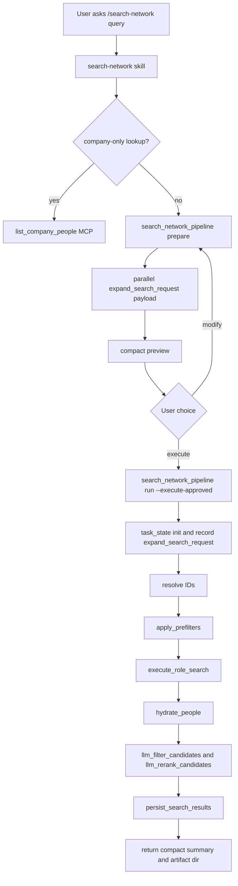
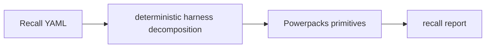
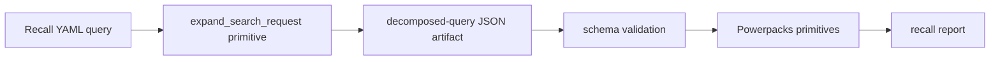
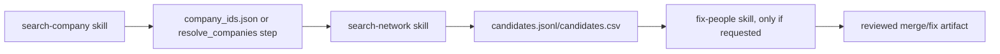
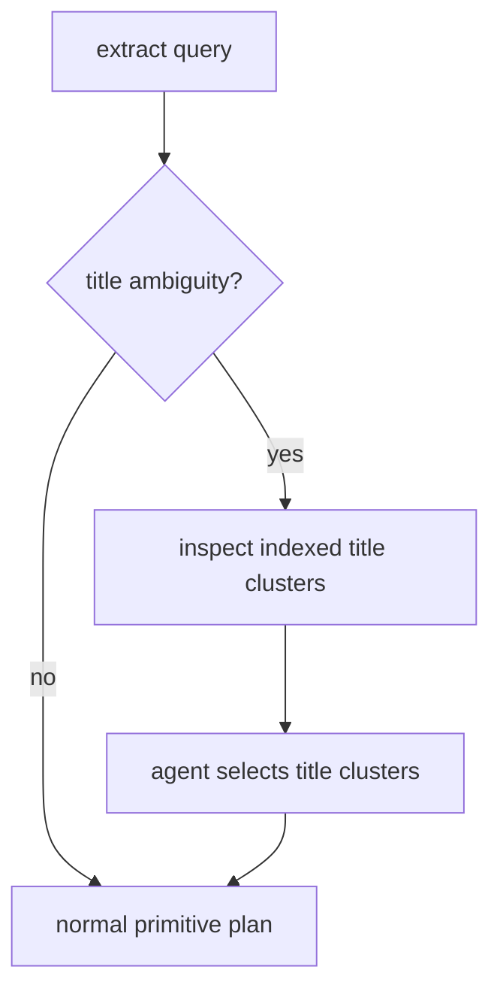

# Powerpacks Task Flow

> **Legacy V1 design reference.** This is not the current task lifecycle. See
> the canonical [`$search` architecture](search-architecture.md) and executable
> [`$search` skill](../skills/search/SKILL.md).

Powerpacks separates agent reasoning from deterministic execution.

## Current Flow



## Responsibilities

`search-network` is the high-level orchestrator. It owns the conversation,
approval gate, task state, and final response.

`expand_search_request` is the only normal query-expansion step. It runs the
parallel extractor prompts and turns user intent into a schema-valid
`role_search_filters` payload. Harnesses should not compose extraction by
reading docs, schemas, or helper skills.

Primitives are executable steps. They should not guess user intent:

- `resolve_education`
- `resolve_investors`
- `resolve_companies`
- `apply_prefilters`
- `count_candidates`
- `execute_role_search`
- `execute_search_slice`
- `hydrate_people`
- `persist_search_results`
- `agentic_candidate_review`

## State Contract

Each run has one JSON state file:

```text
.powerpacks/runs/search-network-<uuid>-<query-slug>.json
```

Every meaningful step is appended to `steps[]`:

```json
{
  "id": "expand_search_request",
  "status": "completed",
  "output": {
    "role_search_filters": {}
  }
}
```

Every write also appends an audit event:

```text
.powerpacks/runs/search-network-<uuid>-<query-slug>.json.events.jsonl
```

Downstream primitives read prior step outputs from state. For example,
`execute_role_search` reads:

- `expand_search_request.output.role_search_filters`
- resolved IDs from `resolve_education`, `resolve_companies`, and
  `resolve_investors`
- `base_candidate_ids` from `apply_prefilters`

## Expansion Harness

The primitive parity harness is intentionally lower level:



That proves: if the payload is right, do the primitives retrieve representative
data? Query-expansion quality is now evaluated through the same parallel
`expand_search_request` primitive used by `search-network prepare`:



This is the harness that should evaluate query decomposition quality. It should
store the extracted JSON per case so misses can be debugged as either:

- extraction miss
- resolver/prefilter miss
- retrieval ranking/window miss
- hydration/artifact miss

The scaffold for this is `packs/search/evals/run_pipeline_eval.py`. It calls
`expand_search_request`, saves `<case>.extracted.json`, validates the minimum
extraction contract, then feeds the JSON into `search_network_pipeline`.

## Skill Composition

Skills are not shell subroutines. Codex and Claude Code load skill
instructions, then the host agent orchestrates the sequence.

The intended composition is:

1. `search-network` decides this is a people search.
2. It invokes `search_network_pipeline prepare`, which calls the parallel
   `expand_search_request` primitive and writes the payload artifact.
3. It records that JSON in task state.
4. It runs deterministic primitives from state.
5. It runs packaged LLM filtering/reranking and persistence after execute.

This keeps extraction auditable while preserving the agentic UX.

## Handoff Artifacts

High-level workflows should chain skills through written artifacts, not memory.
For `search-network`, the canonical handoff is the task state file plus any
exported CSV/JSONL artifacts.



`search-network` can orchestrate `search-company` when company criteria need
resolution before people retrieval. It should only invoke cleanup or
reconciliation skills such as `fix-people` when the user explicitly asks for
that post-search work.

## Title Inspection Gap

Some recall cases need more than static role aliases. Examples include:

- `ai engineers`
- `data science leaders`
- `people with gtm experience`
- domain-adjacent company searches

For those, extraction should plan a title-inspection step:



That title-inspection step should become a first-class primitive/skill pair,
not hidden in recall eval code.
