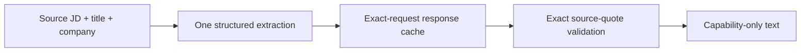

# Structured job-description cleaner

This primitive turns one source JD into a capability-only text input with a
single `gpt-5.6-sol` high-reasoning Flex request. It renders the job title, one
hiring-company line, and Responsibilities, Experience, and Nice to have. Missing
company facts or sections remain `Not stated`; they are not inferred.

Fresh `main` had no deletion cleaner to replace; the reviewed deletion helper
lives only on an unrelated feature branch. This cleaner runs only at capability
scoring. The original `jd.txt` remains unchanged for query generation, location
review, retrieval, and the results view. Existing scores produced from older JD
representations do not validate this new structured input.

Call `clean_job_description.clean_job_description(...)` with an artifact
directory. The full request determines the JSON response and rendered text
filenames. A live response is written before parsing, so malformed output is inspectable and does not trigger
another paid call on retry. Delete that one cache artifact to request a new
response deliberately. The shared OpenAI client records live-call usage in the
normal local usage log; cache hits make no API call.

The renderer never falls back to the raw JD after a refusal, truncated response,
malformed JSON, unexpected field, or source-quote mismatch. Exact quotes remain
in the cache for provenance and are omitted from the model-visible cleaned text.

| File | Role | Reads | Writes |
| --- | --- | --- | --- |
| `clean_job_description.py` | Request, validation, cache and rendering | Source JD, prompt, response cache | Response cache and rendered text |
| `../../prompts/jd-cleaning.txt` | Structured extraction rules | Source JD supplied by the caller | Model JSON |
