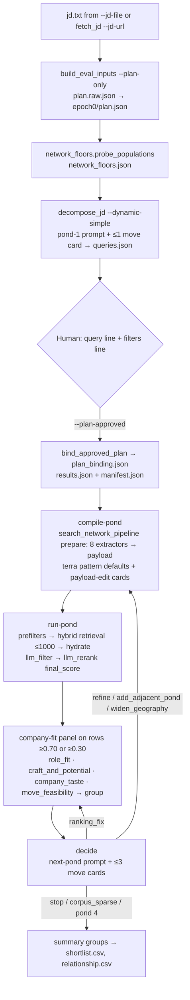
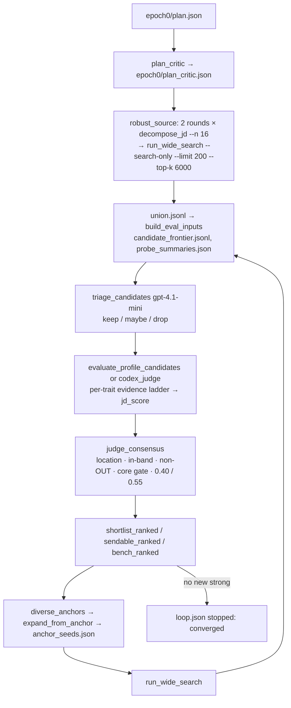

# deep_search — the `$search` deep-mode engine

Created: 2026-09-02

Change log:
- 2026-09-02: First version. Written from a full read of the package at
  powerpacks 1.25.1 (`511a5796`) so the next session can start here instead
  of rescanning the code. Function names are the anchors; line numbers rot.

This directory is one engine with two modes. **Default (`--mode simple`)** is
the pond harness: one broad candidate population at a time, reranked, then a
company-fit panel over the top rows, then a model proposes the next pond, up
to four ponds. **Opt-in (`--mode exhaustive`)** is the older loop: many small
probes → union → triage → per-trait evidence judge → consensus + core gate →
anchor expansion until convergence. The two modes share plan extraction,
plan validation/binding, and the retrieval substrate
(`../search_network_pipeline/`); they share nothing after retrieval.

## Default mode: the pond harness

### Stage by stage

| Stage | Code | Model call | Inputs | Output |
| --- | --- | --- | --- | --- |
| Intake | `deep_search_loop.main` → `fetch_jd.py` (subprocess when `--jd-url`) | none | URL (Ashby posting API special-cased) | `jd.txt`, `source.json`; JD under 400 chars is rejected |
| Plan | `search_harness.prepare_review` → `build_eval_inputs.py --plan-only` | gpt-5.6-luna, medium; system = `expand_search_request/prompts/trait_generation.txt` + `DEEP_PLAN_ADAPTER_PROMPT` | full JD | `epoch0/plan.raw.json` verbatim; `plan_from_obj` normalizes into `epoch0/plan.json` (fields below) |
| Floors | `network_floors.probe_populations` | none (TurboPuffer `multi_query` grouped by `base_id`, or DuckDB count) | every `candidate_populations[]` except `ranking-boost` / `comp-band-anchor`, plus plan location | `network_floors.json`; counts feed the review text and the next-pond prompt, never the Pond-1 prompt |
| Pond-1 query | `decompose_jd.py --query-only --dynamic-simple` | gpt-5.6-luna, medium; system = `pond_prompts.load_pond_prompt(plan, "pond-1")` | full JD + `job_title`, `location`, `candidate_populations` + at most one move card from `precedents.retrieve_next_moves` (chain cut to its first link). **`must_have` / `nice_to_have` are not in this prompt**; core traits are only used to *retrieve* the card. | `queries.raw.json`, `queries.json` — exactly one seed, location label appended |
| Review | `deep_search_loop` returns `awaiting_plan_approval` | none | human edits `epoch0/plan.json` / `queries.json` | — |
| Bind | `validate_approved_plan` → `resolve_retrieval_identity` → `bind_approved_plan` → `initialize_run` | none | plan, JD, queries, corpus identity | `plan_binding.json` (sha of plan + JD + queries, set id or DuckDB identity), `results.json` (`search-harness.v1`, `pending_query`), `manifest.json` |
| Compile pond | `search_harness.compile_pond` → `search_network_pipeline.py prepare` (subprocess) → `expand_search_request.py` | 8 parallel extractors, all gpt-5.6-luna (role, company, location, education, temporal, seniority, social, trait_generation); then `_llm_pattern_defaults` gpt-5.6-terra, medium | the pond query only; terra gets `{title, brief, target_level}`, the compiled payload, prior pool stats, ≤3 payload-edit cards — no JD | `ponds/pond-NN/prepare/expand_search_request.json`, `payload.json`, `pattern-defaults.raw.json`; plan location and filter contract are re-imposed by `apply_shared_plan_scope` |
| Review payload | `search_harness.review_payload` | none | edited `payload.json`, `--rerank-exclusion` | `human_edit_delta` in the iteration |
| Run pond | `search_harness.run_pond` → `search_network_pipeline.py run --execute-approved --limit 1000` | filter gpt-5.6-luna/none (batch 2); rerank gpt-5.6-luna/medium (one call per candidate, ≤400 concurrent) | payload; `--evaluation-query` = pond query + rerank exclusions | pipeline artifacts under `.powerpacks/runs/artifacts/<task>/`; rows sorted by `final_score` |
| Company-fit panel | `search_harness._annotate_company_fit` with prompts in `company_context.py` | gpt-5.6-luna, medium; 4 expert calls + 1 decision call per reviewed row; ≤400 concurrent; `FIT_ANNOTATION_LIMIT` 500 | `_fit_input`: full JD, `target_level`, `brief{occupation, defining_capability, geography}`, `comp_band`, hiring-company context (RapidAPI, cache-first), fit precedents, candidate (current role, ≤3 recent roles, education, `rerank_score`, `pond_trait_scores`). **`must_have`, `core_groups`, `nice_to_have` are not passed**; `defining_capability` is the core trait strings joined. | `ponds/pond-NN/company-fit/NNN-<expert>.json`, `NNN.json`; `shortlist_grades[]` in the iteration |
| Decide | `search_harness.decide` → `propose_next_move` | gpt-5.6-luna, medium; system = `load_pond_prompt(plan, "next-pond")` | title, hiring company, current query, frozen brief, pond chain, `candidate_populations`, floor labels, comp band, relaxation order, human diagnosis, ≤3 move cards, pool stats, ≤20 anonymized title/company pairs — no JD | `next_move{diagnosis, action, next_query, source, rationale}`, `proposal_delta`, `human_override`; then `pending_query`, a rerank-only `pending_payload`, or `completed` |
| Summary | `search_harness._save` → `export_search_summary` | none | every iteration, plus other runs of the same JD in the parent dir | `results.json.summary`, `manifest.json`; on completion `shortlist.csv`, `relationship.csv` |

### What ranks and what buckets

- **Rank inside a pond** = `final_score` from `llm_rerank_candidates` — the
  per-trait rubric over the pond query's `traits[]` (the ones
  `expand_search_request`'s `trait_generation` extractor produced). Those
  traits do not touch retrieval ordering; their only retrieval effect is the
  `is_current` filter via `apply_trait_currentness`.
- **Rows that get the panel** = `final_score ≥ 0.70`, else `≥ 0.30` when
  nothing clears 0.70 (`REVIEW_SCORE_THRESHOLD`, `FALLBACK_REVIEW_SCORE_THRESHOLD`).
- **Group** = the decision call's pick, overridden first-rule-wins in
  `company_context.apply_company_fit_response`: `too-senior`/`wrong-role` →
  passed; `comp-mismatch` → passed; craft `weak` → passed; send-worthy with
  taste `weak` → chat-worthy; send-worthy or wrong-timing with craft `unclear`
  → chat-worthy; send-worthy without `strong-fit`/`adjacent-fit` → chat-worthy;
  **send-worthy with move ≠ `plausible` → chat-worthy**. A human
  `fit_override` wins outright.
- **Order inside a group** = `rerank_score` desc. The panel never reorders.
- Labels are the enums in `fit_contract.py`: role fit
  `strong-fit | adjacent-fit | promising-step-up | junior-could-grow | too-senior | wrong-role | unclear`;
  move `plausible | comp-stretch | comp-mismatch | wrong-timing | destination-pull | founder-lock-in | unclear`;
  taste and craft `strong | neutral | weak | unclear`.

### `epoch0/plan.json`

Produced by `build_eval_inputs.plan_from_obj` from the model's raw JSON.

| Field | Source |
| --- | --- |
| `job_title`, `normalized_archetype`, `pond_prompt_family`, `hire_stage`, `target_level` (default `senior_ic`), `usable_cutoff` | model; family off the enum → `general` |
| `hiring_company{name, website_url}` | model name, else `source.json` |
| `candidate_populations[{population, hint_kind, evidence_quote}]` | model; ten hint kinds; quote must be a verbatim JD substring; max 12 |
| `comp_band` | model; verbatim quote or `null` |
| `search_scope{location, filters}` | model location → `location_scope.canonicalize_generated_location_filters`; `null` = global |
| `traits.must_have[{trait, tier: core, source}]` | model; capped at `MAX_CORE_TRAITS` = 4; non-core traits are demoted to `filters` or `nice_to_have` |
| `traits.nice_to_have[]` | model |
| `core_groups[]` | `plan_filters.compile_core_groups`: every two-thirds combination of the core traits |
| `filters[]`, `retrieval_filters` | model filters + `"Based in <location>"`; years-of-experience compiled by `bind_plan_filters` |
| `recruiter_policy` | `recruiter_policy.resolve_recruiter_preferences(user > jd > policies/recruiter-defaults.json)`; the model's own `recruiter_preferences` output is ignored |

### Precedent cards (`precedents.py`)

Three card kinds, all ranked by TF-IDF overlap of `{title, occupation}` and
`defining_capability` against the card's `job/family` and
`defining_capability`, with score floors and an `excludes` veto:

- **move cards** — 50 seeds in `packs/search/policies/search-harness-precedents.json`
  plus any results.json iteration with `proposal_delta.reviewed: true`.
  Consumed by Pond-1 generation (top 1) and `decide` (top 3, recorded as
  `next_move_precedents`).
- **payload-edit cards** — iterations with `human_edit_delta` or
  `payload_reviewed`. Consumed by the terra pattern-defaults call.
- **fit cards** — seed `fit_cards` (currently empty) plus
  `shortlist_grades[].fit_override.reviewed`. Consumed by the panel.

Nothing in this repo writes `proposal_delta.reviewed` or `fit_override`; a
stock install retrieves seed move cards only. The card injected into the
Pond-1 prompt is not persisted anywhere. `user-edits.jsonl` (from
`search_feedback.py log`) is never read by precedents.

### Cost accounting

The shared OpenAI client appends one row per call to
`POWERPACKS_USAGE_LOG` (= `<run>/usage.jsonl`) with `stage`; `_price_usage_log`
fills `cost_usd` from `packs/search/data/model-prices.json`.
`iteration.cost_usd` sums rows tagged `pond_NN`, which excludes the
expansion/filter/rerank subprocess rows (they carry the pipeline's own stage
tags); `manifest.cost_usd` and `summary.total_cost_usd` sum everything.
RapidAPI company lookups are tracked separately in `results.json.rapidapi`.

## Opt-in mode: exhaustive

`deep_search_loop.py --mode exhaustive`. Same plan and binding, then:

This is the only place the plan's traits score candidates: the judge prompt
lists `must_have` by tier, `core_groups`, `nice_to_have`, `usable_cutoff`,
and the rendered recruiter policy; the judge returns a status per trait
(`doing_now | experienced | capable | foundational | thin | missing | unknown`),
a seniority fit, and excellence sub-scores; code computes
`jd_score = 0.55·trait + 0.45·excellence − caveats` and the verdict.
`judge_consensus` then gates: a core trait counts as met only at
`experienced`/`doing_now`, every trait in at least one core group, location
match, in-band seniority, score ≥ 0.40 (shortlist) / ≥ 0.55 (sendable).
None of `run_wide_search`, `robust_source`, `diversify_probe_bm25`,
`triage_candidates`, `judge_consensus`, `codex_judge`, `expand_from_anchor`,
or `evaluate_profile_candidates` is imported by the default mode.

## Files

| File | Role | Reads | Writes |
| --- | --- | --- | --- |
| `deep_search_loop.py` | CLI door for both modes; plan validation, corpus identity, plan binding; exhaustive orchestration | `decision.json`, `jd.txt`/URL, `epoch0/plan.json`, `queries.json`, `--preferences` | `jd.txt`, `source.json`, canonical `epoch0/plan.json`, `plan_binding.json`; exhaustive: `epoch*/…`, `judges/loop.jsonl`, `master_union.jsonl`, `shortlist/*`, `loop.json` |
| `search_harness.py` | Default engine: `set-query`, `compile-pond`, `review-payload`, `run-pond`, `decide`, `reannotate-saved`; results/manifest/summary/CSV export | run dir artifacts, `usage.jsonl`, `PATTERN_DEFAULT_PROMPT`, family `next-pond` prompt, move/payload-edit/fit cards | `results.json`, `manifest.json`, `ponds/pond-NN/*`, `shortlist.csv`, `relationship.csv`, `network_floors.json` |
| `company_context.py` | Hiring-company and candidate-company context (TurboPuffer lookup, RapidAPI cache-first); the five panel prompts; deterministic group override | RapidAPI cache dir, `RAPIDAPI` key | cache files |
| `fit_contract.py` | Enums for panel dimensions/labels/groups; `FitCard` parser | — | — |
| `precedents.py` | Card retrieval (move, payload-edit, fit) from the seed policy file and reviewed `results.json` history | `policies/search-harness-precedents.json`, `.powerpacks/deep-search/*/results.json`, `$POWERPACKS_SEARCH_HARNESS_LAB_ROOT` | — |
| `build_eval_inputs.py` | `--plan-only`: JD → plan; exhaustive: union → judge frontier | JD, `source.json`, `trait_generation.txt`, recruiter defaults | `epoch0/plan.raw.json`, `epoch0/plan.json`; exhaustive: `candidate_frontier.*`, `probe_summaries.json` |
| `decompose_jd.py` | JD → seed queries; `--dynamic-simple` is the Pond-1 query | JD, plan, family `pond-1` prompt, one move card | `queries.raw.json`, `queries.json` |
| `pond_prompts.py` | Resolve `pond-1` / `next-pond` prompt by `pond_prompt_family` | `packs/search/prompts/**` | — |
| `network_floors.py` | Exact-token population counts per candidate population × plan location | plan, corpus identity | (harness writes `network_floors.json`) |
| `fetch_jd.py` | URL → JD text + source metadata; stdlib HTTP | URL | `jd.txt`, `source.json` |
| `plan_filters.py` | English filter normalization, YOE retrieval filters, two-thirds core groups, payload filter enforcement | plan | — |
| `location_scope.py` | Location vocabulary, plan scope validation, payload geo enforcement, `location_fit` | `packs/indexing/lib/location_normalization` data | — |
| `recruiter_policy.py` | Load/validate/resolve recruiter defaults with provenance; render the policy prompt block | `policies/recruiter-defaults.json` | — |
| `plan_critic.py` | Advisory plan critique (exhaustive only) | plan, JD | `epoch0/plan_critic.json` |
| `results_web/` | Stdlib HTTP viewer over `results.json`; per-candidate feedback POSTs to Powerset | `results.json`, pond artifacts, `jd.txt` | none locally |
| `run_wide_search.py` | Exhaustive: one `search_network_pipeline` probe per seed → deduped union | seeds, plan | `probes/<key>/*`, `union.jsonl` |
| `robust_source.py` | Exhaustive: rotated-emphasis decompose → wide-search rounds until saturation | JD, plan | `round*/seeds.json`, `union.jsonl`, `rounds.json` |
| `diversify_probe_bm25.py` | Exhaustive: drop BM25 terms shared by most probes | probe payloads | payloads in place |
| `triage_candidates.py` | Exhaustive: cheap keep/maybe/drop screen | plan, frontier, profiles | `candidate_frontier.full.jsonl`, `candidate_frontier.jsonl`, `triage.json` |
| `judge_consensus.py` | Exhaustive: aggregate judge files; location/vote/score/core-group gates | `judges/*.jsonl`, union, plan | `shortlist/{consensus, shortlist_ranked, sendable_ranked, bench_ranked, ground_truth_ranked}.json` |
| `codex_judge.py` | Exhaustive: free judge via `codex exec`, same rubric as `evaluate_profile_candidates` | plan, frontier | `candidate_evaluations.raw.jsonl` |
| `expand_from_anchor.py` | Exhaustive: seeds from judged-strong anchors (titles + judged core evidence; no LLM) | anchors, plan | `seeds.json` |
| `micro_sort_shortlist.py` | Exhaustive, opt-in: LLM ordering inside 0.1 score bands | `shortlist/ground_truth_ranked.json`, judges | `shortlist/ranked_final.json` |
| `score_funnel.py`, `score_ground_truth_gaps.py` | Reflect bench only: GT survival funnel; recall/precision/NDCG + `convergence.csv` | exhaustive artifacts, GT | `shortlist/funnel.json`, `gaps.json`, `convergence.csv` |
| `subprocess_utils.py` | Checked child execution with artifact verification | — | — |

## Run-dir artifacts (default mode)

`decision.json`, `jd.txt`, `source.json`, `epoch0/plan.raw.json`,
`epoch0/plan.json`, `network_floors.json`, `queries.raw.json`, `queries.json`,
`plan_binding.json`, `results.json`, `manifest.json`, `usage.jsonl`,
`ponds/pond-NN/{prepare/, payload.json, pattern-defaults.raw.json, compile.log, run.log, company-fit/}`,
`user-edits.jsonl`, `feedback-sent.jsonl`, `shortlist.csv`, `relationship.csv`.
Pipeline-side artifacts live under `.powerpacks/runs/artifacts/<task_id>/`.

## Known drift between docs and code (2026-09-02)

- `packs/search/docs/search-architecture.md` still calls the exhaustive
  order canonical, lists only exhaustive artifacts, and marks the critic as
  part of the default flow. The default runs no critic and no schema
  validation before Review; validation happens at `--plan-approved`.
- `deep-mode.md` names labels `in-band`, `flag-relationship`, `unhireable`
  and a "pedigree prior" — the code labels are the `fit_contract.py` enums
  above; taste is `company_taste`. It also says `mode: auto` in
  `decision.json` runs unattended — nothing reads that key; auto is
  `decide --autonomous`. The viewer renders every retrieved row; 0.70/0.30
  only gate the panel.
- Docstrings in `decompose_jd.py` and `deep-mode.md` say "one or two
  queries"; `decompose_jd` rejects anything but exactly one.
- `judge_consensus.py` and `evaluate_profile_candidates.py` carry different
  numeric ladders for `foundational`/`thin`; harmless for the gate (met ≥ 0.80).
