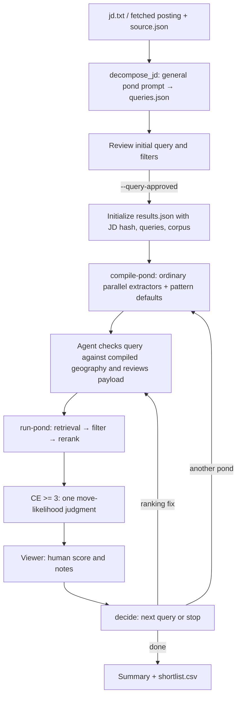

# deep_search — the `$search` pond harness

Deep mode generates one query directly from the JD, then runs one broad candidate
population at a time through the ordinary search pipeline. The user reviews the
initial query and filters once. Each pond compiles, retrieves, filters, and reranks;
the viewer shows candidates for human scoring. A model proposes the next pond.

After reranking, one move-likelihood judge annotates each candidate with a successful
CE score displayed at least 3/5. It does not judge qualifications or change scores,
ordering, or human feedback. No additional JD-trait extraction or expert panel runs.

## Flow

The normal loop completes after at most four ponds. Interactive mode asks
continue-or-done after each pond; auto mode makes that decision without pausing.
An explicit request for another round can reopen a completed run.

## Stages

| Stage | Code | Inputs | Outputs |
| --- | --- | --- | --- |
| Intake | `deep_search_loop.py`, `fetch_jd.py` | `--jd-file` or `--jd-url` | `jd.txt`; URL intake also preserves posting metadata in `source.json` |
| Initial query | `decompose_jd.generate_queries` | Full JD, general `pond-1.txt`, at most one retrieved move card | `queries.raw.json`, `queries.json`; `awaiting_query_review` |
| Initialize | `search_harness.initialize_run` | Reviewed queries, JD, source metadata, Powerset set or DuckDB identity | `results.json`, `manifest.json`; `ready_to_compile` |
| Compile | `search_harness.compile_pond` | Pending query, ordinary pipeline's parallel extractors, payload-edit precedents | `ponds/pond-NN/payload.json`, pattern-default proposal, `awaiting_payload_review` |
| Payload review | `search_harness.review_payload` | Agent-checked payload, optional rerank exclusions | `ready_to_run` or `ready_to_rerank`; edit delta |
| Run | `search_harness.run_pond` | Reviewed payload, retrieval corpus | Pipeline candidate/profile artifacts; iteration with scores and pool statistics |
| Move likelihood | `search_harness._annotate_move_likelihood` | Successful CE scores, full original profiles, JD, pond query, company context | `move_likelihood` label and reason; per-candidate checkpoints |
| Decide | `search_harness.decide` | JD, current query, previous ponds, pool statistics, reviewed move cards | One pending query, a rerank-only payload, or `completed` |
| Export | `search_harness._save` | Saved iterations, related same-JD results | Deduplicated summary; `shortlist.csv`, `relationship.csv` on completion |
| Label | `results_web` | Saved candidates, human score and notes | Local `fit-labels.jsonl` and submission through the existing feedback API |

`deep_search_loop.py --query-approved` initializes artifacts without retrieving
candidates. The executable sequence is in [deep-mode.md](../../skills/search/deep-mode.md).

## Geography and review

Before presenting the initial query, compare all allowed posting locations in
`jd.txt` and `source.json` with the query. Keep them as OR alternatives unless the
user explicitly changes the scope. Put user overrides in the query. Do not add
an in-person, hybrid, or remote restriction by default.

Before retrieval, compare that query with the ordinary extractors' compiled
geography. Check extractor errors and missing or narrowed filters. Repair them
before calling `review-payload` and `run-pond`; an empty extraction is not evidence
that the user requested worldwide search. This is agent verification within the
existing approval, not another user confirmation.

The harness preserves the selected retrieval corpus. It does not impose a
separately generated geographic scope over the query's compiled filters.

## Ranking, labels, and persistence

The ordinary reranker owns `final_score` and candidate order. Retrieval defaults
to 1,000 candidates; `compile-pond --limit N` carries the same cap into execution.
The summary retains every retrieved row, without a normal-rerank floor or an
additional annotation cap. The CE tab orders candidates by raw CE score separately.

Move likelihood runs only when `cross_encoder_status` is `ok` and the finite raw
`cross_encoder_score` is at least zero, equivalent to displayed CE >= 3/5.
Missing, failed, non-finite, or lower CE scores receive no call and
`move_likelihood: null`. Eligible candidates receive one Luna/medium request:
`plausible`, `unlikely`, or `unclear`, with a short reason. A failed judgment is
`unclear`, never a qualification penalty or rejection. Normal rerank scores and
human ratings do not affect eligibility. Checkpoints in `ponds/pond-NN/move-likelihood/`
reuse matching inputs; the judgment date is frozen to the run's creation date.

Human scores are integers 1–5, with optional notes.
Feedback is saved locally before API submission. A submission failure leaves the
local label intact, and the viewer reloads the latest score and note. Historical
feedback remains unchanged. The standalone JD-fit evaluator reads older trait
reviews; it ignores numeric score labels and search notes.

`results.json` stores the JD hash, frozen initial queries, and `retrieval` identity.
Reinitializing with a different JD, initial query, or corpus requires a new run
directory. `set-query` edits the current pending query before compilation.
URL intake verifies the saved source URL and reuses the fetched JD.

## Precedents and standalone trait tools

`precedents.py` retrieves local cards without model calls. Pond, trait, and taste
collections remain separate. Initial query generation uses at most one pond card;
next-move generation uses reviewed move cards and saved pool observations. Human
feedback does not automatically become a precedent.

The standalone `extract_jd_traits.py` API extracts grounded additional traits and
checkpoints raw responses before parsing. The search harness does not call it.
Move likelihood does not retrieve taste cards or call a combining judge.

## Files and artifacts

| File | Role | Reads | Writes |
| --- | --- | --- | --- |
| `deep_search_loop.py` | JD intake and CLI handoff | Decision, JD/URL, reviewed queries, corpus options | Fetched JD and source metadata |
| `decompose_jd.py` | One initial query | JD, general pond prompt, move card | Raw response and queries |
| `search_harness.py` | Compile, review, run, decide, export | JD, queries, pipeline artifacts, precedents | Results, manifest, pond artifacts, CSV exports |
| `extract_jd_traits.py` | Standalone additional JD traits | JD, role brief, compiled traits, trait cards | Raw response checkpoint |
| `company_context.py` | Cache-first company context and one move-likelihood prompt | Company references, RapidAPI cache, original profile evidence | Company cache; judgment messages |
| `fit_contract.py` | Historical review and standalone trait-status types | Saved judgment values | — |
| `precedents.py` | Reviewed card retrieval | Seed policy and reviewed history | — |
| `pond_prompts.py` | Prompt loading | Shared and family prompt files | — |
| `legacy.py` | Dated result-shape cleanup | Saved results | In-memory cleanup |
| `results_web/` | Local viewer and human feedback | Results, profiles, local labels | `fit-labels.jsonl`, feedback API request |

Run artifacts live under `.powerpacks/deep-search/<slug>/`: `decision.json`,
`jd.txt`, optional `source.json`, `queries.raw.json`, `queries.json`, `results.json`,
`manifest.json`, `ponds/pond-NN/`, `usage.jsonl`, `fit-labels.jsonl`,
`user-edits.jsonl`, `feedback-sent.jsonl`, and completion CSVs.
The optional trait checkpoint is `traits.raw.json`. Candidate/profile artifacts
live under the ordinary pipeline's `.powerpacks/runs/artifacts/` directories.

The shared OpenAI client records model usage in `usage.jsonl`; `_price_usage_log`
adds prices. The manifest and summary report total recorded model cost. RapidAPI
company lookups are tracked separately in `results.json.rapidapi`.
