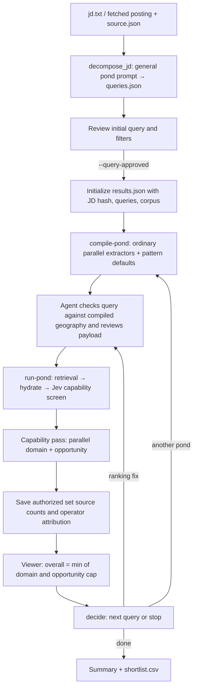

# deep_search — the `$search` pond harness

Deep mode generates one query directly from the JD, then runs one broad candidate
population at a time through the ordinary search pipeline. The user reviews the
initial query and filters once. Each pond compiles, retrieves, hydrates, and screens;
the viewer shows candidates for human scoring. A model proposes the next pond.

Jev screens every hydrated row; there is no Luna filter ahead of it. Candidates that
pass then receive independent Terra domain and opportunity judgments in parallel.
Overall is `min(domain, opportunity cap)`; human feedback is never changed.
`--capability-judge terra` keeps the Luna filter followed by the Luna rating screen
(pass = rated at least 3/5). Ordinary non-JD reranking is unchanged.

## Flow



The normal loop completes after at most four ponds. Interactive mode asks
continue-or-done after each pond; auto mode makes that decision without pausing.
An explicit request for another round can reopen a completed run.

## Stages

| Stage | Code | Inputs | Outputs |
| --- | --- | --- | --- |
| Intake | `deep_search_loop.py`, `fetch_jd.py` | `--jd-file` or `--jd-url` | `jd.txt`; URL intake also preserves posting metadata in `source.json` |
| Initial query | `decompose_jd.generate_queries` | Full JD, general `pond-1.txt`, at most one retrieved move card | `queries.raw.json`, `queries.json`; `awaiting_query_review` |
| Initialize | `search_harness.initialize_run` | Reviewed queries, JD, source metadata, Powerset set or DuckDB identity | `results.json`, `manifest.json`; `ready_to_compile` |
| Compile | `search_harness.compile_pond` | Pending query, ordinary pipeline's parallel extractors, payload-edit precedents | `ponds/pond-NN/payload.json`, pattern-default proposal, `awaiting_payload_review` |
| Payload review | `search_harness.review_payload` | Agent-checked payload, optional rerank exclusions | `ready_to_run` or `ready_to_rerank`; edit delta |
| Run | `search_harness.run_pond` | Reviewed payload, retrieval corpus | Pipeline candidate/profile artifacts; iteration with scores and pool statistics |
| Candidate judgments | `search_harness._annotate_candidate_judgments` | Capability ratings >=3, full profiles, JD, pond query, company context | Domain score, opportunity cap, overall score; per-candidate checkpoints |
| Pin confidence | `search_harness._annotate_pin_confidence`, `pin_confidence.py` | Judged candidates, full profiles, JD, company context | `taste_score` for every judged candidate; `pin_confidence` and `pin_judgment` for overall 4/5; per-candidate checkpoints |
| Network attribution | `person_attribution.HydratePersonAttribution` | Saved candidate IDs and exact searched set; direct Postgres credentials | Source counts and operator names/channels in `results.json.person_attribution`; no account addresses or identifiers |
| Decide | `search_harness.decide` | JD, current query, previous ponds, pool statistics, reviewed move cards | One pending query, a rerank-only payload, or `completed` |
| Export | `search_harness._save` | Saved iterations, related same-JD results | Deduplicated summary; `shortlist.csv`, `relationship.csv` on completion |
| Label | `results_web` | Saved candidates, human score and notes | Local `fit-labels.jsonl` and submission through the existing feedback API |

`deep_search_loop.py --query-approved` initializes artifacts without retrieving
candidates. The executable sequence is in [deep-mode.md](../../skills/search/deep-mode.md).

## Geography and review

Before presenting the initial query, compare all allowed posting locations in
`jd.txt` and `source.json` with the query. Keep them as OR alternatives unless the
user explicitly changes the scope. Put user overrides in the query. Do not add
an in-person, hybrid, or remote restriction by default.

Before retrieval, compare that query with the ordinary extractors' compiled
geography. Check extractor errors and missing or narrowed filters. Repair them
before calling `review-payload` and `run-pond`; an empty extraction is not evidence
that the user requested worldwide search. This is agent verification within the
existing approval, not another user confirmation.

The harness preserves the selected retrieval corpus. It does not impose a
separately generated geographic scope over the query's compiled filters.

## Ranking, labels, and persistence

Retrieval defaults to 1,000 candidates; `compile-pond --limit N` carries the same
cap into execution. The summary retains every retrieved row. The viewer sorts by
overall score, then capability rating, and shows one explanation. Ratings 1–2
show "Did not pass screen".

`llm_rerank_candidates.py --jd-file` judges with Jev by default (seven profile
questions and a trained tree; see the [Jev README](../llm_rerank_candidates/jev/README.md)).
`--capability-judge terra` uses the exact
[Terra v5 rubric](../../prompts/terra-capability-v5.txt): high reasoning, Flex,
one full original profile per request, integer 1–5 output. The shared rubric and
JD precede candidate evidence with an explicit prompt-cache breakpoint. Both
downstream judges use the same prefix-first caching arrangement, with medium
reasoning. Gemma warmup/scoring is skipped even if its beta environment flag is on.

For compatibility with saved results, capability ratings occupy the existing
`cross_encoder` envelope, marked `model: gpt-5.6-terra` and
`score_type: ordinal_rating_1_to_5`. No sigmoid is applied. `final_score` is
rating / 5 for legacy ordering; no synthetic trait percentages are generated.
The v5 request hash includes the prompt, JD, full profile, date, and settings.
Successful responses are reused from `terra-capability/terra/`; API failures
stop ranking without fabricating rejections. Domain/opportunity checkpoints live
in `ponds/pond-NN/candidate-judgments/`, keyed by exact request rather than rank.
Explicit user-reviewed evaluation criteria reach the capability judge (and the Luna
filter on the Terra path).
A failed downstream judgment leaves
overall unknown, not a negative score.

Human scores are integers 1–5, with optional notes.
Feedback is saved locally before API submission. A submission failure leaves the
local label intact, and the viewer reloads the latest score and note. Historical
feedback remains unchanged. The standalone JD-fit evaluator reads older trait
reviews; it ignores numeric score labels and search notes.

Network badges and their popover read saved attribution, never a live viewer API.
Powerset ponds fetch it after scoring using the search's Postgres credentials and
set operator scope, not Auth0 or MCP. Local/offline searches do not query Postgres.
Failed database reads leave attribution unavailable, not zero. Existing runs
can hydrate without repeating search or ranking:

```sh
uv run --project . python -m packs.search.primitives.deep_search.person_attribution \
  --run-dir <run> --env-file .env
```

The pin button toggles the ordinary `Pinned` tag in `tags.json`, alongside other
tags, without reordering results or changing ratings. Exported snapshots contain
the same attribution and tags. Signed-in hosted reviewers save their own tags and
pins through the existing feedback bridge; anonymous readers remain read-only.
The API's renderer package must be updated before accepting the attribution field.

`results.json` stores the JD hash, frozen initial queries, and `retrieval` identity.
Reinitializing with a different JD, initial query, or corpus requires a new run
directory. `set-query` edits the current pending query before compilation.
URL intake verifies the saved source URL and reuses the fetched JD.

## Pin confidence and taste

Runs after the candidate judges in every pond and in `reannotate-saved`, with the three
sources concurrent. Taste is a free read of Reporting's stored talent-index score
(`GET /api/taste/scores`, 100 URLs per call) for every judged candidate. The pin judge,
gpt-6-sol at low reasoning on `prompts/pin-confidence.txt`, and the four Jev evidence
questions run only for overall 4/5 candidates. A source that is unreachable, unconfigured
or returns an invalid answer leaves its fields null and records the error in
`raw_model_responses`; the pond never fails on it.

To add the stage to a search that already has judgments, without searching or re-judging:

```sh
uv run --project . python packs/search/primitives/deep_search/search_harness.py pin-saved \
  --run-dir <run> --env-file .env
```

The viewer puts two badges under the overall reasoning: **Taste X.X** for every judged
candidate (`Taste N/A` when Reporting has no score) and **Suggested Pin** when the judge's
decision is `introduce`. The details panel shows the confidence and reason.

Each judged candidate row, in `shortlist_grades` and in the summary, carries:

```json
{"taste_score": 7.58,
 "pin_confidence": 88,
 "pin_judgment": {"model": "gpt-6-sol", "decision": "introduce",
                  "reason": "Two short sentences about the work.",
                  "status": "ok"}}
```

`taste_score` is null when Reporting has no score for the person. `pin_confidence` is the
judge's priority, null below overall 4 or on failure. Keys: `POWERSET_API_KEY` (taste),
`OPENAI_API_KEY` (judge). The prompt is the one
measured in the lab pin audit on 300 Sail matches: the prompt ranks pinned above unpinned
at AUC 0.71 on gpt-6-sol/low, 0.73 on GLM-5.3, 0.65–0.70 on other OpenAI models and
efforts; taste alone 0.63. No rating, pin or feedback is ever sent to either model.

## Precedents and standalone trait tools

`precedents.py` retrieves local cards without model calls. Pond, trait, and taste
collections remain separate. Initial query generation uses at most one pond card;
next-move generation uses reviewed move cards and saved pool observations. Human
feedback does not automatically become a precedent.

The standalone `extract_jd_traits.py` API extracts grounded additional traits and
checkpoints raw responses before parsing. The search harness does not call it.
The two candidate judges do not retrieve taste cards or call a combining judge.

## Files and artifacts

| File | Role | Reads | Writes |
| --- | --- | --- | --- |
| `deep_search_loop.py` | JD intake and CLI handoff | Decision, JD/URL, reviewed queries, corpus options | Fetched JD and source metadata |
| `decompose_jd.py` | One initial query | JD, general pond prompt, move card | Raw response and queries |
| `search_harness.py` | Compile, review, run, decide, export | JD, queries, pipeline artifacts, precedents | Results, manifest, pond artifacts, CSV exports |
| `extract_jd_traits.py` | Standalone additional JD traits | JD, role brief, compiled traits, trait cards | Raw response checkpoint |
| `company_context.py` | Cache-first company context | Company references, RapidAPI cache | Company context |
| `candidate_judges.py` | Domain and opportunity prompts and parsing | JD, full profile, company context | Independent integer ratings and reasoning |
| `fit_contract.py` | Historical review and standalone trait-status types | Saved judgment values | — |
| `precedents.py` | Reviewed card retrieval | Seed policy and reviewed history | — |
| `pond_prompts.py` | Prompt loading | Shared and family prompt files | — |
| `legacy.py` | Dated result-shape cleanup | Saved results | In-memory cleanup |
| `results_web/` | Local viewer and human feedback | Results, profiles, local labels | `fit-labels.jsonl`, feedback API request |

Run artifacts live under `.powerpacks/deep-search/<slug>/`: `decision.json`,
`jd.txt`, optional `source.json`, `queries.raw.json`, `queries.json`, `results.json`,
`manifest.json`, `ponds/pond-NN/`, `usage.jsonl`, `fit-labels.jsonl`,
`user-edits.jsonl`, `feedback-sent.jsonl`, and completion CSVs.
The optional trait checkpoint is `traits.raw.json`. Candidate/profile artifacts
live under the ordinary pipeline's `.powerpacks/runs/artifacts/` directories.

The shared OpenAI client records model usage in `usage.jsonl`; `_price_usage_log`
adds prices. The manifest and summary report total recorded model cost. RapidAPI
company lookups are tracked separately in `results.json.rapidapi`.
