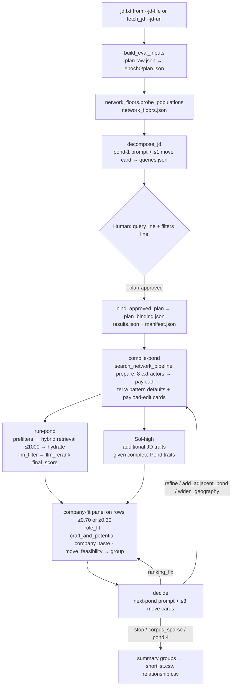

# deep_search — the `$search` deep-mode engine

Created: 2026-09-02

Change log:
- 2026-09-04 (trait timing): the pre-Review plan no longer spends a second
  call on JD traits. Pond 1 compiles first; then Sol-high generates only
  additional JD traits beside the candidate pipeline, and the panel consumes
  them after reranking selects its rows.
- 2026-09-02 (panel traits): the panel scores the plan's flat `traits[]`;
  rows carry `jd_fit`, the deterministic group override and move gate are
  gone, and `summary.jd_fit_order` feeds the viewer's "Fit (Beta)" panel.
- 2026-09-02 (later): the opt-in exhaustive engine (robust-source, triage,
  per-trait judge, consensus core gate, anchor expansion, micro-sort, plan
  critic) and the Reflect bench were deleted. The pond harness is the only
  engine; `--mode` is gone.
- 2026-09-02: First version. Written from a full read of the package at
  powerpacks 1.25.1 (`511a5796`) so the next session can start here instead
  of rescanning the code. Function names are the anchors; line numbers rot.

One engine: **the pond harness**. One reviewed plan, then one broad candidate
population at a time, reranked, a company-fit panel over the top rows, a model
proposes the next pond, up to four ponds, merged into review groups. Retrieval
is the ordinary `../search_network_pipeline/` run.

## In English

A deep search is one reviewed plan, then up to four *ponds*. A pond is one
broad population of people pulled through the ordinary search pipeline and
then judged. Where each kind of model work happens:

1. **Extraction (LLM, cents).** One call writes the plan (title, prompt family,
   level, location, JD-quoted candidate populations, comp band). A second call
   writes the Pond-1 query: one occupation plus at most one
   "with X experience"; X never comes from the company's own industry and
   is never a title people hold (founder, manager).
2. **Review (human, the only approval).** The agent shows the query line and
   the filters line. Everything after this is spend the user already agreed to.
3. **Retrieval (no model ranking).** `compile-pond` turns the query into a
   payload through the eight extractors; `run-pond` runs hybrid BM25 + kNN on
   TurboPuffer or DuckDB, capped at 1,000 people.
4. **Filter + JD traits (LLM).** `llm_filter_candidates` drops people who plainly
   are not the population. Beside that pipeline, one Sol-high call receives the
   complete Pond traits and extracts only additional JD traits.
5. **Rerank (LLM).** `llm_rerank_candidates` scores each survivor against the
   pond query's traits into `final_score`. That order is the main panel in
   the viewer and nothing after it changes it.
6. **Company-fit panel (LLM, labels only).** Every row at or above 0.70 gets
   four expert calls and one decision call: role fit (which also scores the
   plan's traits on the ladder and yields `jd_fit`), craft and potential,
   company taste, move feasibility. The panel labels and groups; it never
   reorders.
7. **Decide (LLM).** One call proposes the next pond or stops. Interactive
   mode asks the user "another round or done" after each pond.
8. **Summary.** Rows from every pond merge into send-worthy / chat-worthy /
   wrong-timing / passed groups in rerank order, plus the separate
   "Fit (Beta)" order by trait coverage.

A session is plan + query before Review, then `compile-pond`. `run-pond`
generates the JD traits beside retrieval/filter/rerank, waits for both, and
starts the panel only for the rerank-selected rows.

Evals: the original 11-JD judgeability eval and the 119-JD engineering blind
regression are recorded in `../../docs/trait-extraction-redesign.md`; both used
one-off scripts, not a committed harness. Committed evals live in `../../evals/`: the agent
decision eval (`run_decision_eval.py`), the rerank eval
(`run_llm_rerank_candidates_eval.py`), the extractor eval, and the
pipeline / recall parity runs.

## Stage by stage

| Stage | Code | Model call | Inputs | Output |
| --- | --- | --- | --- | --- |
| Intake | `deep_search_loop.main` → `fetch_jd.py` (subprocess when `--jd-url`) | none | URL (Ashby posting API special-cased) | `jd.txt`, `source.json`; JD under 400 chars is rejected |
| Plan | `search_harness.prepare_review` → `build_eval_inputs.py` | one gpt-5.6-luna, medium call; system = `build_eval_inputs.PLAN_SYSTEM` | full JD (+ `source.json` department hint) | `epoch0/plan.raw.json`; `plan_from_obj` writes `epoch0/plan.json` with empty `traits[]` before Review |
| Floors | `network_floors.probe_populations` | none (TurboPuffer `multi_query` grouped by `base_id`, or DuckDB count) | every `candidate_populations[]`, plus plan location | `network_floors.json`; counts feed the review text and the next-pond prompt, never the Pond-1 prompt |
| Pond-1 query | `decompose_jd.py` | gpt-5.6-luna, medium; system = `pond_prompts.load_pond_prompt(plan, "pond-1")` | full JD + `job_title`, `location`, `candidate_populations` + at most one move card from `precedents.retrieve_next_moves` (chain cut to its first link). JD traits do not exist yet; card retrieval uses the title and occupation. | `queries.raw.json` (parsed response + the injected cards), `queries.json` — exactly one seed, location label appended |
| Review | `deep_search_loop` returns `awaiting_plan_approval` | none | human edits `epoch0/plan.json` / `queries.json` | — |
| Bind | `validate_approved_plan` → `resolve_retrieval_identity` → `bind_approved_plan` → `initialize_run` | none | plan, JD, queries, corpus identity | `plan_binding.json` (sha of plan + JD + queries, set id or DuckDB identity), `results.json` (`search-harness.v1`, `pending_query`), `manifest.json` |
| Compile pond | `search_harness.compile_pond` → `search_network_pipeline.py prepare` (subprocess) → `expand_search_request.py` | 8 parallel extractors, all gpt-5.6-luna (role, company, location, education, temporal, seniority, social, trait_generation); then `_llm_pattern_defaults` gpt-5.6-terra, medium | the pond query only; terra gets `{title, brief, target_level}`, the compiled payload, prior pool stats, ≤3 payload-edit cards — no JD | `ponds/pond-NN/prepare/expand_search_request.json`, `payload.json`, `pattern-defaults.raw.json`; plan location and filter contract are re-imposed by `apply_shared_plan_scope` |
| Review payload | `search_harness.review_payload` | none | edited `payload.json`, `--rerank-exclusion` | `human_edit_delta` in the iteration |
| Run pond | `search_harness.run_pond` → `search_network_pipeline.py run --execute-approved --limit <pending_payload.limit>` (1000 unless `compile-pond --limit N`) beside `build_eval_inputs.extract_traits` | filter gpt-5.6-luna/none (batch 2); rerank gpt-5.6-luna/medium (one call per candidate, ≤400 concurrent); once per search, JD traits gpt-5.6-sol/high | pipeline gets the reviewed payload; JD traits get the full JD, role brief, and complete compiled Pond traits | pipeline artifacts under `.powerpacks/runs/artifacts/<task>/`; `epoch0/traits.raw.json`; normalized additional traits update `epoch0/plan.json`; rows sorted by `final_score` |
| Company-fit panel | `search_harness._annotate_company_fit` with prompts in `company_context.py` | gpt-5.6-luna, medium; 4 expert calls + 1 decision call per reviewed row; ≤400 concurrent; `FIT_ANNOTATION_LIMIT` 500 | `_fit_input`: full JD, `target_level`, `brief{occupation, defining_capability, geography}`, `comp_band`, hiring-company context (RapidAPI, cache-first), fit precedents, the plan's flat `traits[{trait, kind}]` (the role-fit expert scores each one), candidate (current role, ≤3 recent roles, education, `rerank_score`, `pond_trait_scores`). `defining_capability` is the `capability` traits joined. | `ponds/pond-NN/company-fit/NNN-<expert>.json`, `NNN.json`; `shortlist_grades[]` in the iteration, each row with `jd_fit{coverage, traits[{trait, status, evidence}]}` |
| Decide | `search_harness.decide` → `propose_next_move` | gpt-5.6-luna, medium; system = `load_pond_prompt(plan, "next-pond")` | title, hiring company, current query, frozen brief, pond chain, `candidate_populations`, floor labels, comp band, relaxation order, human diagnosis, ≤3 move cards, pool stats, ≤20 anonymized title/company pairs — no JD | `next_move{diagnosis, action, next_query, source, rationale}`, `proposal_delta`, `human_override`; then `pending_query`, a rerank-only `pending_payload`, or `completed` |
| Summary | `search_harness._save` → `export_search_summary` | none | every iteration, plus other runs of the same JD in the parent dir | `results.json.summary`, `manifest.json`; on completion `shortlist.csv`, `relationship.csv` |

## What ranks and what buckets

- **Rank inside a pond** = `final_score` from `llm_rerank_candidates` — the
  per-trait rubric over the pond query's `traits[]` (the ones
  `expand_search_request`'s `trait_generation` extractor produced). Those
  traits do not touch retrieval ordering; their only retrieval effect is the
  `is_current` filter via `apply_trait_currentness`.
- **Rows that get the panel** = `final_score ≥ 0.70`, else `≥ 0.30` when
  nothing clears 0.70 (`REVIEW_SCORE_THRESHOLD`, `FALLBACK_REVIEW_SCORE_THRESHOLD`).
- **Group** = the decision call's pick, as is: no deterministic override, no
  move gate. A panel failure (any expert or decision response that does not
  parse) stamps `passed` with empty `jd_fit`. A human `fit_override` wins
  outright on both paths.
- **`jd_fit`** on every annotated row = `{coverage, traits[{trait, status,
  evidence}]}`: the role-fit expert scores each plan trait exactly once, in
  plan order (a response that renames, drops, or repeats a trait is rejected
  and the row falls back), on the
  `fit_contract.TraitStatus` ladder (`doing_now | experienced | capable |
  foundational | thin | missing | unknown`); `coverage` is
  `fit_contract.role_fit_coverage` (a missing-tolerant aggregate of the ladder). Rows the panel
  could not annotate carry `{coverage: 0.0, traits: []}`.
- **Order inside a group** = `rerank_score` desc. The panel never reorders.
  `summary.jd_fit_order` is a separate list (`coverage` desc, then
  `rerank_score` desc, over every grouped row) that the viewer shows as
  "Fit (Beta)" next to the unchanged main panel.
- Labels are the enums in `fit_contract.py`: role fit
  `strong-fit | adjacent-fit | promising-step-up | junior-could-grow | too-senior | wrong-role | unclear`;
  move `plausible | comp-stretch | comp-mismatch | wrong-timing | destination-pull | founder-lock-in | unclear`;
  taste and craft `strong | neutral | weak | unclear`.

## `epoch0/plan.json`

Produced by `build_eval_inputs.plan_from_obj` from the plan response. `traits`
starts empty and is filled during the first `run-pond` from `traits.raw.json`.

| Field | Source |
| --- | --- |
| `job_title`, `normalized_archetype`, `pond_prompt_family`, `hire_stage`, `target_level` (default `senior_ic`), `usable_cutoff` | plan call; family off the enum → `general` (`role_brief`) |
| `hiring_company{name, website_url}` | plan call name, else `source.json` |
| `candidate_populations[{population, hint_kind, evidence_quote}]` | plan call; seven hint kinds (`stated-background`, `dual-craft-sentence`, `portfolio-signal`, `department-title-tension`, `feeder-career-language`, `situational-population`, `capability-adjacent`); quote must be a verbatim JD substring; max 12 |
| `comp_band` | plan call; verbatim quote or `null` |
| `search_scope{location, filters}` | plan call location → `location_scope.canonicalize_generated_location_filters`; `null` = global |
| `traits[{trait, kind, evidence_quote, selection_reason?}]` | empty at Review; during the first `run-pond`, Sol-high receives the full JD, role brief, and compiled Pond traits, then returns only additional evidence through the family's `traits.txt`; ordered most-defining first, deduped, and capped at 6; zero is valid. The panel scores these traits after rerank selects its rows. |
| `filters[]`, `retrieval_filters` | plan call filters + `"Based in <location>"`; years-of-experience compiled by `bind_plan_filters` |
| `recruiter_policy` | `recruiter_policy.resolve_recruiter_preferences(user > jd > policies/recruiter-defaults.json)`; the plan call's own `recruiter_preferences` output is ignored |

## Precedent cards (`precedents.py`)

Three card kinds, all ranked by TF-IDF overlap of `{title, occupation}` and
`defining_capability` against the card's `job/family` and
`defining_capability`, with score floors and an `excludes` veto:

- **move cards** — 50 seeds in `packs/search/policies/search-harness-precedents.json`
  plus any results.json iteration with `proposal_delta.reviewed: true`.
  Consumed by Pond-1 generation (top 1, recorded in `queries.raw.json`) and
  `decide` (top 3, recorded as `next_move_precedents`).
- **payload-edit cards** — iterations with `human_edit_delta` or
  `payload_reviewed`. Consumed by the terra pattern-defaults call.
- **fit cards** — curated seed `fit_cards` (currently empty). Consumed by the panel.

Candidate feedback remains in `fit-labels.jsonl` or the run's `fit_override`;
neither is retrieval memory. Recurring feedback must first be distilled into a
reviewed prompt rule or curated seed card. `user-edits.jsonl` (from
`search_feedback.py log`) is also never read by precedents.

## Cost accounting

The shared OpenAI client appends one row per call to
`POWERPACKS_USAGE_LOG` (= `<run>/usage.jsonl`) with `stage`; `_price_usage_log`
fills `cost_usd` from `packs/search/data/model-prices.json`.
`iteration.cost_usd` sums rows tagged `pond_NN`, which excludes the
expansion/filter/rerank subprocess rows (they carry the pipeline's own stage
tags); `manifest.cost_usd` and `summary.total_cost_usd` sum everything.
RapidAPI company lookups are tracked separately in `results.json.rapidapi`.

## Files

| File | Role | Reads | Writes |
| --- | --- | --- | --- |
| `deep_search_loop.py` | CLI door: JD intake, plan validation, corpus identity, plan binding, hand-off to the harness | `decision.json`, `jd.txt`/URL, `epoch0/plan.json`, `queries.json`, `--preferences` | `jd.txt`, `source.json`, canonical `epoch0/plan.json`, `plan_binding.json` |
| `search_harness.py` | The engine: `set-query`, `compile-pond`, `review-payload`, `run-pond`, `decide`, `reannotate-saved`; results/manifest/summary/CSV export | run dir artifacts, `usage.jsonl`, `PATTERN_DEFAULT_PROMPT`, family `next-pond` prompt, move/payload-edit/fit cards | `results.json`, `manifest.json`, `ponds/pond-NN/*`, `shortlist.csv`, `relationship.csv`, `network_floors.json` |
| `company_context.py` | Hiring-company and candidate-company context (TurboPuffer lookup, RapidAPI cache-first); the five panel prompts; role-fit trait scoring and `jd_fit` on every annotated row | RapidAPI cache dir, `RAPIDAPI` key | cache files |
| `fit_contract.py` | Enums for panel dimensions/labels/groups and the trait-status ladder; `role_fit_coverage`; `FitCard` parser | — | — |
| `legacy.py` | Dated cope-with-old-run-dirs scrubs, called first when `run-pond` / `decide` load `results.json`; each entry names its removal condition | `results.json` (in memory) | — |
| `precedents.py` | Card retrieval (move, payload-edit, fit) from the seed policy file and reviewed `results.json` history | `policies/search-harness-precedents.json`, `.powerpacks/deep-search/*/results.json`, `$POWERPACKS_SEARCH_HARNESS_LAB_ROOT` | — |
| `build_eval_inputs.py` | JD → reviewed plan; after Pond compilation, JD + Pond traits → additional traits | JD, `source.json`, `PLAN_SYSTEM`, family `traits` prompt, compiled Pond traits, recruiter defaults | `epoch0/plan.raw.json`, `epoch0/traits.raw.json`, `epoch0/plan.json` |
| `decompose_jd.py` | JD + plan → the Pond-1 query | JD, plan, family `pond-1` prompt, one move card | `queries.raw.json`, `queries.json` |
| `pond_prompts.py` | Resolve `pond-1` / `next-pond` prompt by `pond_prompt_family` | `packs/search/prompts/**` | — |
| `network_floors.py` | Exact-token population counts per candidate population × plan location | plan, corpus identity | (harness writes `network_floors.json`) |
| `fetch_jd.py` | URL → JD text + source metadata; stdlib HTTP | URL | `jd.txt`, `source.json` |
| `plan_filters.py` | English filter normalization, YOE retrieval filters, payload filter enforcement | plan | — |
| `location_scope.py` | Location vocabulary, plan scope validation, payload geo enforcement | `packs/indexing/lib/location_normalization` data | — |
| `recruiter_policy.py` | Load/validate/resolve recruiter defaults with provenance; render the policy prompt block | `policies/recruiter-defaults.json` | — |
| `results_web/` | Stdlib HTTP viewer over `results.json`; per-candidate feedback POSTs to Powerset | `results.json`, pond artifacts, `jd.txt` | structured fit reviews append to `fit-labels.jsonl` |
| `subprocess_utils.py` | Checked child execution with artifact verification | — | — |

## Run-dir artifacts

`decision.json`, `jd.txt`, `source.json`, `epoch0/plan.raw.json`,
`epoch0/traits.raw.json`, `epoch0/plan.json`, `network_floors.json`,
`queries.raw.json`, `queries.json`,
`plan_binding.json`, `results.json`, `manifest.json`, `usage.jsonl`,
`ponds/pond-NN/{prepare/, payload.json, pattern-defaults.raw.json, compile.log, run.log, company-fit/}`,
`user-edits.jsonl`, `feedback-sent.jsonl`, `shortlist.csv`, `relationship.csv`.
Human reviews of the beta JD-fit order append to `fit-labels.jsonl`; compare it
to the original rerank with `packs/search/evals/evaluate_jd_fit.py --root <deep-search-root>`.
Pipeline-side artifacts live under `.powerpacks/runs/artifacts/<task_id>/`.
