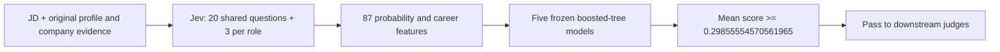

# Jev capability judge

Predict whether a person meets the rating-3-or-above capability bar for a JD.
Jev stays frozen; a small trained tree ensemble combines its answers. This is a
qualification screen. Location, willingness to join, and compensation remain
separate judgments.



## Selection

Set `TYPESAFE_API_KEY` in the environment. Keys never go in requests saved to disk.
Terra remains the existing default until the caller explicitly selects Jev:

```bash
uv run python packs/search/primitives/llm_rerank_candidates/llm_rerank_candidates.py \
  --state /path/to/state.json --write-state \
  --jd-file /path/to/jd.txt --job-title 'Backend Engineer' \
  --job-company 'Example Systems' --capability-judge jev
```

`--capability-judge terra` selects Terra v5 using `OPENAI_API_KEY`.
The same selector is accepted by pipeline `prepare`/`run` and
`search_harness.py run-pond`. Changing the judge reruns scoring and export while
retaining completed retrieval/filter work. Use `--force-llm` to repeat the same
judge after changing the JD. Use `--dry-run` on the
reranker to inspect the actual request without spending.

## Evaluated operating point

Frozen pilot models and cutoffs, evaluated on 26,424 pairs across 27 jobs after
excluding pilot people. Reference labels are Luna ratings >=3, not an independent
human assessment of recruiting correctness.

| Readout | Precision | Recall | F1 |
|---|---:|---:|---:|
| **Shipped Jev tree ensemble** | **73.2%** | **93.2%** | **82.0%** |
| Experimental logistic combiner | 83.8% | 83.8% | 83.8% |
| Direct Jev rating probabilities | 77.6% | 87.6% | 82.3% |

The tree operating point intentionally favors recall: about 27% of passed
candidates disagree with Luna, and about 7% of Luna-positive candidates are missed.
Results vary by job. The logistic alternative remains an experimental artifact;
this package ships the selected tree model only.

The broad run scored 26,990 of 27,000 pairs; ten failed requests remain unscored.
The quoted aggregate metrics use the older cleaned JD view. A newly structured JD
changes the input distribution and needs its own evaluation; these metrics are
not a measured claim about that new view.

## Contract and reproducibility

- Pinned API model: `jev-1.13.0`. One request per candidate, with shared context
  and independent questions; four requests may run concurrently.
- Features include function/execution evidence, recency and repeated experience,
  domain, company quality, stage/size, and funding. School reputation and the
  direct overall rating are excluded from the learned features.
- Five person-fold boosted-tree estimators, each with 100 depth-2 trees. The
  shipped JSON contains weights and feature names, no training identities.
- Native output is `qualification_score` in [0,1], plus `threshold` and `passed`.
  It is not a 1–5 rating or a verified probability of qualification. Persistence,
  the results viewer, and downstream judgment eligibility retain this distinction.
- Request caching binds evidence, date, rubric, questions, and API model.
  Feature/model metadata bind the classifier to its expected question schema.
  The assessment date is part of the key, so a new date triggers new scoring.
  Paid HTTP 200 responses checkpoint before validation; malformed output remains
  unscored and is never silently repaid. Failed or oversized requests never
  become rejections.
- Uncached calls append local token usage and explicit TypeSafe cost to the
  shared `POWERPACKS_USAGE_LOG`; cached reads do not add spend. The current
  published rate is $0.042 per million input tokens and output tokens are free.
- CPU prediction matches the experimental ensemble on all 26,424 saved feature
  rows to floating-point precision (maximum absolute error below 4e-16).

## Company evidence

The existing company-taste system predicts investment/company preferences; its
separate résumé-tier score is a founder prior. Neither is a validated JD-specific
talent rating. Monitoring's round radar estimates fundraising activity, not
candidate quality. Those scores are not silently injected into this model.

A future company enrichment should identify the relevant employer and period,
record domain, scale, funding dates and source provenance, then assess talent
strength for the job's function. An unfamiliar employer remains unknown. Founded
date alone is not a talent score. Adding such fields or questions requires a new
feature/model version and evaluation on the same separated people and jobs.

## Files

| File | Responsibility |
|---|---|
| `client.py` | API requests, validation, caching, and candidate scores |
| `questions.py` | Frozen question definitions and role evidence |
| `features.py` | Exact ordered 87-feature construction |
| `model.py` | Validated, dependency-free tree inference |
| `model.json` | Frozen model parameters and provenance |
| `__init__.py` | Public scoring interface |
