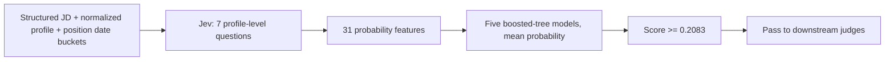

# Jev capability judge

Predict whether a person meets the rating-3-or-above capability bar for a JD, the same
decision the Luna capability screen makes, from seven Jev questions about the profile.
Jev stays frozen; a small trained tree ensemble combines its answers. This is a
qualification screen. Location, willingness to join, and compensation remain separate
judgments.



## Selection

Jev is the default capability judge. Set `TYPESAFE_API_KEY` for Jev and
`OPENAI_API_KEY` for the one-time Sol JD structuring call. The cleaner is shared by both
judges and cached across ponds; the raw JD remains available to retrieval and later
logistics review. Keys never go in requests saved to disk.

```bash
uv run python packs/search/primitives/llm_rerank_candidates/llm_rerank_candidates.py \
  --state /path/to/state.json --write-state \
  --jd-file /path/to/jd.txt --job-title 'Backend Engineer' \
  --job-company 'Example Systems'
```

`--capability-judge terra` selects the Luna rating path using `OPENAI_API_KEY` (the CLI
name is retained). The same selector is accepted by pipeline `prepare`/`run` and
`search_harness.py run-pond`. Changing the judge, JD, job metadata, evaluation criteria,
or cleaner/scorer contract reruns scoring and export while retaining completed
retrieval/filter work. Use `--force-llm` to repeat unchanged scoring. Use `--dry-run` on
the reranker to inspect the structuring request without spending.

## The request

One request per candidate: the structured JD, the normalized profile (positions, summary,
supplied company facts), one date bucket per position (`current`, ended within five years,
ended five or more years ago, unknown) for the continuity question, the reference date,
and the evidence policy. Seven questions:

| Question | Type | What it asks |
|---|---|---|
| `transfer` | score 0–3 | credibility of transfer from the described work to the JD's central work |
| `continuity` | choice | current / recent / senior-adjacent / stale switch / unknown / none |
| `independent_execution_quality` | yes-no | substantial relevant execution without employer or school prestige |
| `evidence_basis` | choice | description / summary / repeated roles / isolated title / none |
| `company_quality` | choice | strong / ordinary / weak / unknown, for the relevant employers |
| `specialty` | choice | essential specialty direct / transferable / missing / unknown / not required |
| `historical_match` | score 0–3 | best historical role against the JD as if current |

A typical request is about 5,000 input tokens, roughly half the previous 18-plus-3-per-position
request, at $0.042 per million: about $0.20 per 1,000 candidates.

## Evaluated operating point

Trained and evaluated on the 2026-09-17 teacher set: 40 JDs x 1,000 retrieved candidates,
Luna ratings at high reasoning with 248 Terra adjudications, 10 JDs each in engineering,
ops/support, finance and science. Jev answered the slim request for all 10,000 engineering
pairs and 1,000 pairs per other family (12,997 scored). Five JD-disjoint folds; the test
fold's people are removed from training. Positive = Luna rating >= 3. Cutoff set from
out-of-fold scores at 93% recall.

| Slice | Pairs | AUC | Recall | Precision | Pass rate |
|---|---:|---:|---:|---:|---:|
| All | 12,997 | 0.959 | 93.0% | 69.4% | 37% |
| Engineering | 9,997 | 0.958 | 92.1% | 69.1% | 35% |
| Finance | 1,000 | 0.947 | 95.8% | 68.7% | 56% |
| Ops/support | 1,000 | 0.936 | 96.1% | 75.3% | 59% |
| Science | 1,000 | 0.979 | 88.3% | 49.5% | 11% |

Reference labels are Luna ratings, not an independent human assessment. Hardware test
roles are where Jev and Luna disagree most: the Icarus flight test JD has 62% out-of-fold
recall with this model.

Why seven questions: on the same engineering pairs, the previous 87-feature design (18
profile questions plus three per position) and an 18-question profile-only design both
scored 0.960 AUC; backward elimination over the 18 held 0.962 down to these seven and
eroded below. The per-position block was paying for tokens, not signal.

## Contract and reproducibility

- Pinned API model: `jev-1.13.0`. One request per candidate, with shared context and
  independent questions; four requests may run concurrently.
- Five JD-fold `GradientBoostingClassifier` estimators (scikit-learn 1.9.1), each with 100
  depth-2 trees, combined as the mean of their probabilities. The bundled model JSON
  contains weights and feature names, no training identities. The loader compares
  features to thresholds in float64 where scikit-learn compares in float32; on 500
  training rows the largest resulting score difference was 7e-4.
- Native output is `qualification_score` in [0,1], plus `threshold` and `passed`. It is
  not a 1–5 rating or a verified probability of qualification. Persistence, the results
  viewer, and downstream judgment eligibility retain this distinction.
- Request caching binds evidence, date, questions, and API model; the request version
  identifies the question set and the model's question version its training provenance.
  Feature/model metadata bind the classifier to its 31-feature schema. A new date triggers
  new scoring. Paid HTTP 200 responses checkpoint before validation; malformed output
  remains unscored and is never silently repaid. Failed or oversized requests never become
  rejections.
- Uncached calls append local token usage and explicit TypeSafe cost to the shared
  `POWERPACKS_USAGE_LOG`; cached reads do not add spend.

The training and evaluation code lives in the lab repo under `experiments/jev_distill/`.

## Files

| File | Responsibility |
|---|---|
| `questions.py` | Frozen question schema, profile normalization, request construction |
| `features.py` | Exact ordered 31-feature construction |
| `model.py` | Bundle loading, validation, dependency-free prediction |
| `model.json` | The trained ensemble, cutoff, and provenance |
| `client.py` | TypeSafe requests, caching, usage accounting, scoring |
