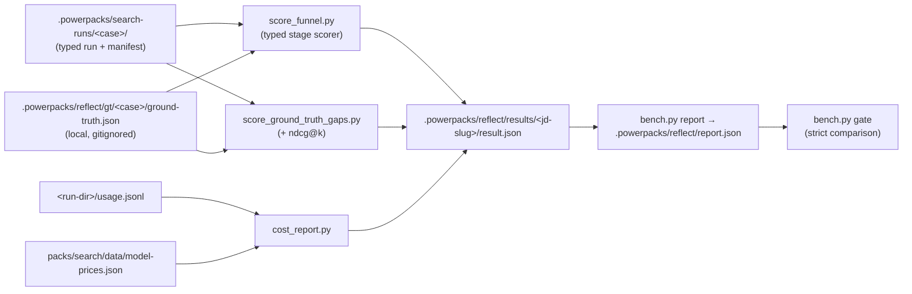

# Reflect bench

**Created:** 2026-07-30

**Changelog:**
- 2026-07-30 — initial objective + acceptance contract (committed before any code, per
  the Phase 0 plan; full context in `packs/search/docs/reflect-and-search-v2-proposal.md`).

The maintainer-side measurement harness for the typed `$search` recruiting engine. It scores
canonical `.powerpacks/search-runs/<case>/` outputs against ground truth and turns "the search felt better"
into per-stage numbers. It is the acceptance mechanism for every future engine change.

(Naming note: the user-side `$reflect` telemetry skill — draft PR #356,
`packs/observability/` — is the other half of the Reflect family. This bench consumes
its timing-block contract; it does not replace it.)

## Objective

**Make search quality, cost, and latency measurable per stage against ground truth, so
every engine change is accepted or rejected by data instead of vibes.**

Four questions this bench answers that nothing in the repo answers today:

1. **Which stage lost which ground-truth candidate?** (previously: one recall number,
   no attribution)
2. **What did each stage cost** in tokens, USD, and wall-clock? (previously: `cost_usd`
   was a manually passed flag, `0.0` in every run on disk; the deep loop recorded no
   timing)
3. **How good is the final ordering?** (previously: recall@k only, which is
   rank-insensitive)
4. **Did a proposed change regress any JD in the suite?** (previously: single-JD,
   single-run artifacts; nothing aggregated or gated)

Explicit non-goal: changing engine behavior. The bench reads run artifacts; the only
engine touches in its Phase 0 are additive instrumentation (usage rows, timing blocks).

## Canonical local workflow

Reflect has one CLI, `bench.py`, and one local artifact root: `.powerpacks/reflect/`.
There is no second validation runner or artifact tree. Candidate identities, profile
evidence, JD text, reviewer notes, labels, ground truth, snapshots, and reports stay in
that gitignored root. Committed suite files contain public job metadata or synthetic
contract metadata only.

For each case:

1. Freeze a strict local `reflect.case.v1` artifact containing `case_id`, a public-source
   reference/hash, and the exact reviewed SearchSpec/query contract plus its canonical
   hash. `bench score --case` hashes the exact case bytes and requires the suite metadata
   and finalized GT bindings to match. Private JD text and role briefs stay local.
   Freeze a corpus snapshot. A comparable snapshot requires the
   set ID, operator-scope hash, complete membership hash, namespace/schema hashes, a
   native content version or deterministic set-scoped records hash, and canonical
   evidence hashes for every person in the full review pool.
2. Build a broad, independent pool and a structured review packet with role, company,
   location, matched-position, retrieval-provenance, and relevant profile evidence.
3. Resume human review only while case ID/hash, corpus snapshot, full-pool hash,
   `person_id`, and recomputed evidence hash all match.
   Decisions are `eligible_strong`, `eligible_bench`, `ineligible`, or
   `insufficient_evidence`; every decision requires reason codes, reviewer, and
   timezone-aware timestamp. Insufficient evidence remains unresolved and is excluded
   from ranking and denominators, but its finalized human disposition is preserved.
4. Finalize ground truth solely from human rows. Reviewed ineligible people are judged
   zero-gain negatives; eligible strong/bench are positive gains. Candidate IDs outside
   the finalized pool are reported as unreviewed and block strict comparison. The final artifact remains bound to
   evidence hashes for the complete review pool, including labeled people absent from
   a candidate run.
5. Run `bench.py score`, `report`, then strict `gate`. The scorer defaults to k=10,25
   and precision uses the conventional fixed-k denominator.
   Recall@10 and recall@25 cannot regress. NDCG@10/@25 drops above 0.02 fail; drops in
   `(0, 0.02]` require a matching accepted comparison review. Missing or changed corpus,
   case, evidence, or label identity is `non_comparable` and exits nonzero.

`bench.py score` accepts only `reflect.ground_truth.v1` and requires `--case`, `--snapshot`,
and the run's own `--hard-filter-validation <run>/hard-filter-validation.json`. The run
must remain under the repository `.powerpacks/` and contain `search_spec.json`,
`review/plan.json`, `review/source.json`, `review/binding.json`, `review/corpus.json`, `stage-membership.json`,
`review/evidence.json`, `candidate-frontier.json`, and `manifest.json`. The scorer verifies canonical manifest
paths and hashes, exact persisted SearchSpec/case equality, review/corpus identity, and
the complete frozen review-pool evidence map, normalized JD content hash, scoring bounds,
and run-produced hard-filter dispositions before reading candidate quality. Candidate-only
evidence cannot prove a larger reviewed pool. Truncated frontiers are not final scoreable
runs. A legitimate `completed_empty` run persists the same canonical artifacts with an
empty, untruncated frontier and scores GT members as `never_sourced` with zero recall.

`gate --review-template-out .powerpacks/reflect/<case>/comparison-review.json` writes a
deterministic rejected template when joint review is needed. After the reviewer fills
and accepts it, rerun with `--comparison-review` pointing to that file. Baseline and
candidate hashes cover the exact report bytes.

Lifecycle commands are all on the same CLI:

```bash
uv run --project . python packs/search/reflect/bench.py build-review-packet \
  --case .powerpacks/reflect/gt/<case>/case.json \
  --snapshot .powerpacks/reflect/gt/<case>/corpus-snapshot.json \
  --candidates .powerpacks/reflect/gt/<case>/review-pool.json
uv run --project . python packs/search/reflect/bench.py resume-labels \
  --packet .powerpacks/reflect/gt/<case>/review-packet.json
uv run --project . python packs/search/reflect/bench.py finalize-human-labels \
  --packet .powerpacks/reflect/gt/<case>/review-packet.json \
  --labels .powerpacks/reflect/gt/<case>/human-labels.json \
  --snapshot .powerpacks/reflect/gt/<case>/corpus-snapshot.json
```

Default lifecycle outputs are under `.powerpacks/reflect/gt/<case>/`. Explicit output
paths are accepted only when they remain under `.powerpacks/reflect/`.

## Repeatable suite development

Build toward three to five reviewed recruiting JDs rather than treating one role as a
permanent benchmark. AgentMail Backend/Infra is the initial public case. Reserve
structurally different product/design and finance-oriented recruiting slots, and keep
synthetic GTM contracts for both senior-IC and executive/leadership breadth. Each new
case follows the same packet, resumption, finalization, snapshot, score, and comparison
steps; no private identity is committed.

The deterministic lane is offline and PR-safe. Read-only snapshot capture is a separate
manual producer boundary at `capture_snapshot.py` and must be scoped explicitly. Local
runner snapshots are deterministic. A Powerset snapshot is comparable only when the
typed runner proves complete, untruncated scoped membership enumeration and stable native
or set-scoped content identity; otherwise it is explicitly
`unverified_non_comparable`. Synthetic fixtures cannot identify themselves as Powerset.

Any model/judge or other paid quality run requires explicit approval immediately before
execution, including cases, model, caps, estimated maximum spend, and local output path.
Configured credentials are not approval. Machine proposals can assist review but never
become ground truth authority.

## Acceptance contract

### The standing rule for engine changes

A change to the search engine is **accepted** when:

1. `bench.py gate --baseline <committed report>` passes — no per-JD regression beyond
   epsilon and no floor breach (`--min-recall`, `--max-cost`) across the whole suite;
2. the result holds on **two consecutive runs** (one lucky run is not evidence);
3. cost/latency moved in the promised direction, shown by the same report.

The committed baseline `report.json` is the contract and is refreshed in the same PR as
any accepted change — a stale baseline is a bug.

**Gate status: strict for approved quality semantics.** Recall regressions, NDCG drops
above 0.02, rejected/stale/mismatched reviews, and non-comparable evidence exit nonzero.
Generic recall floors and cost ceilings remain optional supplemental checks.

The gate also requires non-regression in source recall, hydration coverage, hard-filter
survival, and triage survival. These are separate canonical `stage-membership.json`
stages: hydration requires `hydration_disposition == "hydrated"`; only then can a person
pass hard filters. Funnel stage rows and probe attribution remain in result/report rows.
The producer and scorer share one first-rule gate disposition policy; shortlist/sendable
flags must agree with prerequisite gates and the persisted score thresholds.
The typed runner's `reflect.hard_filter_validation.v1` binds the persisted SearchSpec,
review corpus, reviewed count, and explicit quarantined IDs. No violation count is
inferred and no external or compatibility artifact can replace it.

### Phase 0 definition of done (per-PR, with proof artifacts)

| # | Criterion | Proof |
|---|---|---|
| 1 | Behavior-neutral — engine outputs unchanged | scorers only read artifacts; engine edits are additive fields; affected suites pass |
| 2 | Funnel trustworthy | reproduces the hand-written AgentMail REPORT.md funnel (31 GT → 30 sourced → 29 triaged → 29 judged; 5/13/5/6/2 dispositions) or every delta explained |
| 3 | Cost capture real and safe | E2E test: capture → `usage.jsonl` → `cost_report.py` vs hand-computed golden; capture is always on and always local (global sink `.powerpacks/usage/usage.jsonl`; runs point `POWERPACKS_USAGE_LOG` into their run dir) |
| 4 | Gate honest | passes against its own report, fails against a doctored regression |
| 5 | No PII escapes | committed fixtures synthetic; committed baselines carry numbers only — GT names/ids stay local under `.powerpacks/reflect/` |

Landing order (one PR per workstream): this README → **A** scorers → **C** bench CLI →
**B** cost/timing plumbing.

## Data flow



## Files

| File | Role | Reads | Writes | Lands in |
|---|---|---|---|---|
| `README.md` | this contract | — | — | PR0 |
| `bench.py` | CLI: review lifecycle, `score`, `report`, `gate` | local case/snapshot/review/run artifacts | `.powerpacks/reflect/` only | C |
| `cost_report.py` | usage → per-stage tokens + USD | `usage.jsonl`, `model-prices.json` | cost summary JSON | C |
| `suite/<jd-slug>/meta.json` | committed suite entry (job_family, expected_size_class, source URL, corpus fingerprint) | — | — | C |
| `../primitives/deep_search/score_funnel.py` | GT survival funnel + per-probe attribution | `stage-membership.json`, `candidate-frontier.json`, Reflect v1 GT | `<run-dir>/reflect/funnel.json` | A |
| `../data/model-prices.json` | per-1M-token price table | — | — | C |

JD text and ground-truth person sets stay **local** under `.powerpacks/reflect/`
(privacy rules: no real-contact data in git). Committed suite entries are metadata only.
