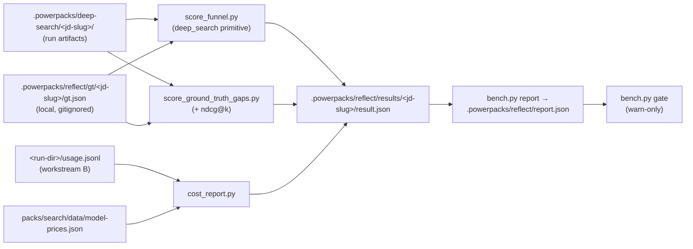

# Reflect bench 🔬

**Created:** 2026-07-30

**Changelog:**
- 2026-07-30 — initial objective + acceptance contract (committed before any code, per
  the Phase 0 plan; full context in `packs/search/docs/reflect-and-search-v2-proposal.md`).

The maintainer-side measurement harness for the `$search` deep engine. It scores
existing deep-search run dirs against ground truth and turns "the search felt better"
into per-stage numbers. It is the acceptance mechanism for every future engine change.

(Naming note: the user-side `$reflect` telemetry skill — draft PR #356,
`packs/observability/` — is the other half of the Reflect family. This bench consumes
its timing-block contract; it does not replace it.)

## Objective 🎯

**Make search quality, cost, and latency measurable per stage against ground truth, so
every engine change is accepted or rejected by data instead of vibes.**

Four questions this bench answers that nothing in the repo answers today:

1. **Which stage lost which ground-truth candidate?** (previously: one recall number,
   no attribution)
2. **What did each stage cost** in tokens, USD, and wall-clock? (previously: `cost_usd`
   was a manually passed flag, `0.0` in every run on disk; the deep loop recorded no
   timing)
3. **How good is the final ordering?** (previously: recall@k only, which is
   rank-insensitive)
4. **Did a proposed change regress any JD in the suite?** (previously: single-JD,
   single-run artifacts; nothing aggregated or gated)

Explicit non-goal: changing engine behavior. The bench reads run artifacts; the only
engine touches in its Phase 0 are additive instrumentation (usage rows, timing blocks).

## Acceptance contract 🤝

### The standing rule for engine changes

A change to the search engine is **accepted** when:

1. `bench.py gate --baseline <committed report>` passes — no per-JD regression beyond
   epsilon and no floor breach (`--min-recall`, `--max-cost`) across the whole suite;
2. the result holds on **two consecutive runs** (one lucky run is not evidence);
3. cost/latency moved in the promised direction, shown by the same report.

The committed baseline `report.json` is the contract and is refreshed in the same PR as
any accepted change — a stale baseline is a bug.

**Gate status: warn-only.** Until run-to-run variance is established on real runs, the
gate prints would-fail verdicts and exits 0. Hard floors get derived from measured
variance and ratified here; only then does the gate start failing builds.

### Phase 0 definition of done (per-PR, with proof artifacts)

| # | Criterion | Proof |
|---|---|---|
| 1 | Behavior-neutral — engine outputs unchanged | scorers only read artifacts; engine edits are additive fields; affected suites pass |
| 2 | Funnel trustworthy | reproduces the hand-written AgentMail REPORT.md funnel (31 GT → 30 sourced → 29 triaged → 29 judged; 5/13/5/6/2 dispositions) or every delta explained |
| 3 | Cost capture real and safe | E2E test: capture → `usage.jsonl` → `cost_report.py` vs hand-computed golden; capture is always on and always local (global sink `.powerpacks/usage/usage.jsonl`; runs point `POWERPACKS_USAGE_LOG` into their run dir) |
| 4 | Gate honest | passes against its own report, fails against a doctored regression |
| 5 | No PII escapes | committed fixtures synthetic; committed baselines carry numbers only — GT names/ids stay local under `.powerpacks/reflect/` |

Landing order (one PR per workstream): this README → **A** scorers → **C** bench CLI →
**B** cost/timing plumbing.

## Data flow

## Files

| File | Role | Reads | Writes | Lands in |
|---|---|---|---|---|
| `README.md` | this contract | — | — | PR0 |
| `bench.py` | CLI: `score` / `report` / `gate` | run dirs, GT, results | `.powerpacks/reflect/results/`, `report.json` | C |
| `cost_report.py` | usage → per-stage tokens + USD | `usage.jsonl`, `model-prices.json` | cost summary JSON | C |
| `suite/<jd-slug>/meta.json` | committed suite entry (job_family, expected_size_class, source URL, corpus fingerprint) | — | — | C |
| `../primitives/deep_search/score_funnel.py` | GT survival funnel + per-probe attribution | run artifacts, GT | `<run-dir>/shortlist/funnel.json` | A |
| `../data/model-prices.json` | per-1M-token price table | — | — | C |

JD text and ground-truth person sets stay **local** under `.powerpacks/reflect/`
(privacy rules: no real-contact data in git). Committed suite entries are metadata only.
