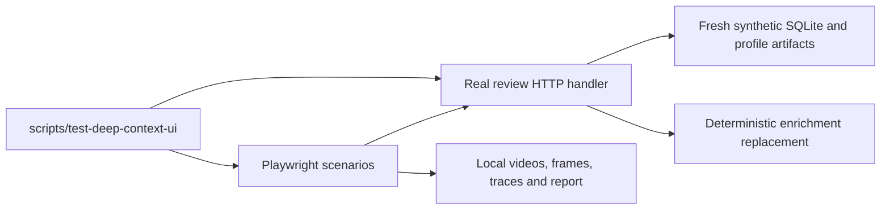

# Deep Context browser regression checks

Run occasionally while changing review behavior or motion:

```sh
scripts/test-deep-context-ui
```

This suite is deliberately outside automatic test discovery and CI. It takes
roughly two minutes and needs the repo's `.venv` (`bin/setup-python`), Node 20+,
npm, and Google Chrome. The wrapper installs the small, locked test-only npm
dependencies. To use Playwright's Chromium instead:

```sh
npx --prefix tests/manual/deep_context playwright install chromium
scripts/test-deep-context-ui --channel chromium
```

Useful options:

```sh
scripts/test-deep-context-ui --case slow --headed
scripts/test-deep-context-ui --output /path/to/new-artifact-directory
```

Default artifacts live in a new directory under `~/.powerpacks/qa/`. The command
prints its `index.html`: videos, screenshots, SQLite, server logs, DOM/frame
observations, JSON results, and Playwright traces remain local. A supplied output
directory must not already exist. Nothing is overwritten or uploaded. Exit 1
means a failed check. Servers and browser contexts are stopped after each case;
artifacts remain for inspection, including failures.

## Coverage

| Case | Conditions |
| --- | --- |
| `normal` | Complete Worth → approve enrichment → LinkedIn → completion |
| `slow` | Same flow with 1.2s destination loads and 450ms save responses |
| `reduced-motion` | Slow flow with reduced motion; no browser crossfade or visible entrance animations |
| `save-failures` | Slow flow with one failed Worth save and one failed LinkedIn save; retry both |

Each flow decides five synthetic people (four Worth Yes, one No), then exercises
LinkedIn Yes, No opening the correction form, Skip, and a pasted-URL Retarget.
No opens correction in the current UI; the test then skips that person. Assertions
read the committed SQLite decisions, including the replacement URL, and require
exactly four LinkedIn reviews and one approved enrichment run.

The browser checks:

- Actual `pagereveal.viewTransition` and computed 350 ms crossfades on each stage
  navigation, visible compositor frames throughout handoffs, card swaps, failed
  saves and idle periods, and retained card elements during person swaps.
- Exactly three completion checks and one “LinkedIn Profiles Checked” handoff;
  no “Decisions Ready” interstitial or loading-card replacement.
- No repeated person, backward navigation, extra reload, browser exception, or
  idle card/copy replacement, content rewrite, opacity flash or animation replay.
  Unchanged server notifications must leave the completed screen stable.
- Failed saves restore the same person, keep controls usable, and leave SQLite
  unchanged before the successful retry.

Every invocation also tests the detectors against intentionally broken screens:
a blank interval, card replacement, repeated completion copy, content rewrite,
whole-stage and copy-only opacity flashes, animation replay, and reload. These
recordings are in `detector-checks/`; those failures are intentional and the run
passes only if they are detected.

The pixel check uses the existing charcoal palette and a fixed 1440×1000 viewport.
It distinguishes a mounted card with fading contents from the bare page canvas.
DOM checks catch replaced frames and repeated content that pixel brightness
alone cannot identify. Compositor frames are sampled on paint, not inferred from
DOM visibility; they do not promise to catch every one-frame artifact on every
machine. Watch the recordings for pacing, spacing, and whether motion feels right.
This is not a general screenshot baseline suite; People/Searches baselines remain
in `tests/test_visual.py`.

## Fixture and boundaries



| File | Responsibility |
| --- | --- |
| `run.cjs` | CLI, processes, browser contexts, local report and cleanup |
| `server.py` | Isolated synthetic data, real review routes/SSE, delayed responses and failed saves |
| `flow.cjs` | User actions and persisted decision/advancement assertions |
| `observe.cjs` | DOM identity, animations, navigation, compositor frame checks |
| `detectors.cjs` | Deliberate regressions proving the observers reject bad behavior |

Enrichment's paid `_run` work is replaced with deterministic profile projection;
the real approval endpoint, job thread, progress events, review rendering, and
SQLite writes run. This verifies UI orchestration, not research, hydration, judge
quality, provider contracts, indexing, or upload. Browser requests are restricted
to the fixture origin; Python DNS/socket calls reject external destinations and
unrelated app routes are disabled. This is test isolation, not an OS sandbox.
No real contact data, `.env` credentials, or copied production databases are needed.

For a manual preview, use a fresh directory and an available port:

```sh
.venv/bin/python tests/manual/deep_context/server.py \
  --data-dir /tmp/deep-context-preview-new --port 8891
```

Open `http://127.0.0.1:8891/?stage=worth`. All displayed prices are fixture UI;
approving runs only the synthetic replacement. Stop with Ctrl-C. To repeat, use a
new directory. Add `--destination-delay-ms 1200` to inspect slow handoffs.

When a new issue is reported, add the smallest reproduction to the relevant flow
or observer, run it against the broken behavior, then verify the fix. Keep fixture
controls in `server.py`, assertions here, and recorded artifacts out of Git.
